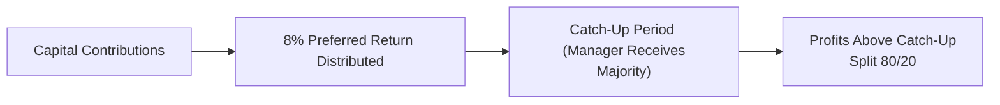

## Introduction
So, let’s talk about one of those topics that can be, well, kind of a rabbit hole in alternative investments: fee structures and carried interest. If you’ve ever had a friend complain about how hedge funds or private equity managers make outsized profits, chances are it was linked to something like “2 and 20.” But the conversation goes way deeper than that. Fees don’t just dictate how much managers get paid; they also shape risk-taking, influence investment horizons, and create incentives—or disincentives—that can align with, or diverge from, investor goals. Let’s peel back the layers and see what’s really going on.

## Why Fee Structures Matter
At their core, alternative investment vehicles (e.g., private equity, hedge funds) rely on fees to pay for the expertise, resources, and overhead that managers bring to the table. But these fees profoundly impact net returns. Even a small tweak—like adding a hurdle rate or introducing a catch-up clause—can shift manager behavior and investor outcomes dramatically. Think of fees as the lever that sets the tone: Will the manager prioritize safer, steady returns or swing for the fences in search of a huge payout? Understanding how these incentives work can help you anticipate how well your fund’s risk profile is likely to match your expectations.

## Common Fee Structures in Alternative Investments
Management fees and performance fees (or incentive fees) are the two main categories. Let’s talk about them:

### The Management Fee
• Typically a fixed percentage (usually 1% to 2.5% per year) of assets under management (AUM).  
• Covers operational costs, salaries, overhead, and maybe the manager’s fancy office space (we’ve all seen those glossy pitch decks, right?).  
• For hedge funds, this is often “2%” in the classic “2 and 20” model. For private equity, it can start off at around 2% of committed capital.

Let’s say you have \$100 million invested in a private equity fund. A 2% management fee means the manager takes \$2 million each year for overhead, which is not insignificant. That fee is paid regardless of performance.

### The Performance Fee (Incentive Fee)
• Usually expressed as a percentage of the profits (20% is common).  
• Often subject to conditions like hurdle rates, catch-up clauses, or high-water marks (in hedge funds).

In a standard hedge fund, the “20” in “2 and 20” means the manager receives 20% of all the profits generated—assuming the fund surpasses any required performance threshold. In private equity, it’s frequently 20% of profits above a hurdle rate (e.g., 8%). The idea is that once limited partners (LPs) get that 8% minimum annual return, the manager becomes entitled to the carried interest.

## Carried Interest: The Engine of Private Equity Incentives
Carried interest (or “carry”) is a fancy way of saying the fund manager’s share of the profits once certain conditions are met. Historically, it’s set at 20%, though some top-tier managers might get a higher slice (25% or 30% in certain niche or in-demand strategies).

### Hurdle Rate (Preferred Return)
A hurdle rate is the return the fund must achieve before the general partner (GP) is entitled to any carry. For example, let’s assume a fund sets an annual hurdle rate of 8%. The profit distribution might look something like:

1. Investors receive all profits up to the 8% “preferred return.”  
2. Once the 8% is reached, a “catch-up” provision may kick in, allowing the GP to quickly “catch up” to a certain share of the total profits (e.g., 20%).  
3. Beyond the catch-up, profits are split 80/20 between investors and the GP—80% to LPs, 20% to the manager as carried interest.

### Catch-Up Clauses
A catch-up clause is designed so that once the hurdle (preferred return) is reached, the manager gets a disproportionately high share of subsequent profits until they’ve caught up to their full 20%. At that point, additional gains are split according to the typical waterfall. If you hear an investor say, “I don’t mind if the manager makes a killing as long as I get my return first,” they’re basically talking about a hurdle-plus-catch-up arrangement.

### High-Water Marks
Primarily used by hedge funds, a high-water mark ensures that investors don’t pay incentive fees on the same performance multiple times if the fund’s value dips and then recovers. For example, if the fund’s net asset value (NAV) falls from \$100 million to \$80 million, the manager has to get the NAV back above \$100 million before charging performance fees again. This practice aligns managers with the long-term health of the portfolio rather than short-term fluctuations.

## Distribution Waterfall: A Visual Snapshot
The distribution waterfall details how each dollar of profit (or distribution from portfolio company exits, in private equity) is split among LPs and the GP. Here’s a simplified mermaid diagram to illustrate a typical waterfall with hurdle and catch-up:

1. The fund returns investor capital plus an 8% annual preferred return.  
2. Manager enters a catch-up period, receiving most of the subsequent profits until they reach 20% of the cumulative gains.  
3. Remaining profits are split 80% to LPs and 20% to the GP.

## The Timing of Carry Payments
In private equity, carry is typically realized at the time of asset sales (the “exit”). That’s because you can’t fully measure the final profits until there’s a cash event. For example, you invest in a buyout fund that holds your capital for seven years. You won’t know your total profit until the underlying companies are sold or recapitalized. Hedge funds, on the other hand, often have monthly or quarterly performance measurements, which means incentive fees might be taken more regularly (subject to high-water marks).

## Clawback Provisions
Ever hear stories about managers who receive massive distributions early on, only for the fund’s later investments to go south, resulting in overall mediocre returns? That’s where clawback provisions come in. They let LPs recoup overpaid carry. If at the end of the fund’s life the total returns fall below the agreed-upon threshold or the manager has received more than their fair share, the GP is required to return a portion of that carry—to “claw it back.”

This is especially crucial in private equity because you might have a fund that sells a big portfolio company in Year 3, generating huge profits (and a big carry check for the GP), but the rest of the investments flop. Without a clawback, the investor ends up losing out after paying the GP big sums in earlier years.

## Alignment (or Misalignment) of Interests
The entire premise of management and performance fees is to align manager incentives with investor outcomes. Yet, sometimes misalignments occur:

• Charging a performance fee on unrealized gains might motivate the manager to mark up valuations aggressively (in structures where carry is paid on interim valuations).  
• Overhang (large unrealized gains) can create pressure on managers to force exits prematurely, just to lock in carry.  
• A GP close to losing high-water mark status might choose riskier strategies to try to jump back above the threshold.  

Investors should watch out for these potential conflicts, ensuring the manager’s upside is tied to actual performance rather than just ephemeral or short-term gains.

## Risk Profiles and Potential Moral Hazards
Let’s be real: when fees are mostly skewed to the upside (performance fees), managers have an incentive to take bigger bets. If it’s a home run, the manager profits mightily. If it’s a strikeout, well, the manager might still be entitled to a management fee. This asymmetry can help if you want an aggressive strategy, but it can be problematic if stable returns are your priority. Indeed, many institutional investors prefer structures that more heavily penalize poor performance to prevent moral hazard.

## Scenario Analysis of Fees
To see how fees can shape outcomes, let’s consider two scenarios for a hypothetical \$100 million investment in a private equity fund with:

• A 2% management fee, charged on committed capital for the first five years, then on net invested capital.  
• A hurdle of 8%, with a 100% catch-up to the GP once the hurdle is met, and a 20% carry.  
• A standard clawback provision.

### Scenario 1: Strong Performance
• Gross IRR: 20% over a seven-year period.  
• The first couple of portfolio company exits deliver excellent returns, so the GP begins to collect carry in Year 4, continuing through Year 7.  
• By the time the fund winds down, the LPs have received their capital back plus the 8% hurdle. The GP collects 20% of the profits above that, maybe netting a tidy sum (imagine \$30 million in carry).  
• Because late-stage deals also do well, no clawback is triggered.

In this scenario, investors are happy: they got the 8% guaranteed first, plus a healthy net IRR, probably around 16-17% after fees. The GP is more than happy.

### Scenario 2: Mixed Results
• Gross IRR: 12% (some hits, some misses).  
• Early exits are strong, and the GP gets some carry. Then subsequent exits disappoint.  
• At final liquidation, the total net return falls short of the initial projected IRR.  
• Clawback calculations show the manager was overpaid by \$2 million in carry. The manager must return that amount to the LPs.

Net result: the investor’s net IRR is maybe 9-10% (depending on the timing of fees and distributions). The GP gets less total carry than initially expected, but the clawback ensures the distribution is fair relative to overall performance.

## Best Practices in Structuring Fees
• Transparent Calculation Methods: Spell out how carried interest is computed, when it’s crystallized, and whether you use realized or unrealized gains.  
• Appropriate Hurdle Rates: Make sure the hurdle rate is neither too low (easy for GPs) nor too high (unreachable).  
• Thoughtful Catch-Up Figures: The catch-up distribution should be equitable and not heavily skewed to the GP.  
• High-Water Marks: Protect investors so they don’t pay multiple times for the same performance.  
• Clawback Mechanisms: Provide recourse for investors if the fund’s performance falls short over the long haul.  
• Benchmark Comparisons: Evaluate how the fee structure stands up relative to market norms and competitor offerings.

## Practical Reflections (Slightly Informal)
I remember a phone call I got from a friend who’d just put money into a hedge fund. He told me (with some excitement) that the fund had soared 15% in the first quarter, and the manager took out a big chunk in incentive fees. Then the next quarter, the fund dipped 10%. My friend was left thinking: “Wait, I’m basically back to square one, but the manager pocketed a nice bonus.” This is why high-water marks matter. Next time you’re reading a fund’s subscription docs and see the mention of “high-water mark,” pay attention to the details. It’s exactly for that scenario.

## Exam Tips and Applications
• In an exam scenario, you’ll often be asked to calculate net returns or net IRRs given management fees, hurdle rates, and carried interest. Make sure you can do these step by step, especially around the commonly tested 2-and-20 structure.  
• Keep an eye out for questions around clawback provisions. You might see “What happens if the final performance is below 8% but carried interest was already paid out earlier?”  
• Some item sets might present a distribution waterfall and ask in what order the proceeds are divided. Understand how catch-up works so you can confidently parse the sequential distribution.  
• Don’t forget moral hazard: Realize that the exam might ask you to identify or comment on incentives that push managers toward riskier bets or short-term gains at the expense of long-term performance.

## References
• ILPA (Institutional Limited Partners Association) Private Equity Principles – Provides a deep dive into best practices for fees and governance in private equity.  
• “Mastering Private Equity” by Claudia Zeisberger, Michael Prahl, and Bowen White – Excellent resource for understanding fund structures and fees.  
• “Private Equity: Fund Types, Risks and Returns, and Regulation” by Douglas Cumming – Great academic approach to the complexities of private equity fees and structures.

---

## Fee Structures, Carried Interest, and Their Impact: Quiz



### A fund has a 2% management fee on committed capital, an 8% hurdle rate, and a 20% carry. What does the term “8% hurdle rate” usually mean in this context?

- [ ] The fund charges an additional 8% performance fee.
- [x] The fund must return at least 8% to investors before the manager earns carry.
- [ ] The fund allows an 8% discount on management fees.
- [ ] The fund invests only in deals expected to exceed 8% IRR.

> **Explanation:** A hurdle rate is the minimum return investors receive before the GP starts earning performance fees (carry).

### Which best describes a high-water mark feature in a hedge fund’s fee structure?

- [ ] It limits the maximum fees that can be charged in any given year.
- [ ] It sets a minimum level of fees to be paid each year.
- [x] It prevents the fund manager from collecting performance fees on the same gains if the fund’s value declines and then recovers.
- [ ] It is an upper limit on investor redemptions.

> **Explanation:** High-water marks ensure that the fund manager cannot charge performance fees twice for the same appreciation if the fund went down first and then rose back to a previous NAV.

### In a typical catch-up clause, how are profits allocated once the hurdle return is met?

- [ ] All future profits are split 50/50 until the GP has recovered its management fees.
- [x] A higher proportion of profits goes to the GP until it has received its full share of carry.
- [ ] No additional profits go to the GP until a clawback is activated.
- [ ] The split immediately changes to 80/20 once the hurdle is surpassed, with no special catch-up distribution.

> **Explanation:** In a catch-up phase, the GP often receives all or most of the profits until they have caught up to the full 20% (or whatever their allocation is) that they would have accrued from the start.

### What is one primary goal of a clawback provision in private equity agreements?

- [ ] To reduce overall taxes for the GP. 
- [ ] To accelerate distributions to LPs early in the fund’s life.
- [ ] To guarantee that GP receives carried interest on unrealized gains.
- [x] To allow LPs to recoup overpaid carry if final performance is lower than anticipated.

> **Explanation:** A clawback helps ensure fairness by requiring the GP to return any excess carry previously taken if the fund underperforms over its total life.

### If a private equity fund uses committed capital as the basis for management fees through the entire fund life, which of the following best describes a potential investor concern?

- [x] Investors may pay higher fees even when the fund is partially or fully invested. 
- [ ] The GP cannot receive any performance fees until after the final liquidation.
- [ ] Clawback provisions become less relevant.
- [ ] The catch-up clause automatically applies after one year.

> **Explanation:** Charging management fees on committed capital rather than invested capital can increase total fees, because the fee base does not shrink as capital is deployed.

### Which scenario best illustrates a moral hazard problem due to the asymmetry in fee structures?

- [x] A hedge fund takes bigger risks because it earns 20% of the profits but does not share the downside beyond losing its time and resources.
- [ ] A mutual fund charges a front-end load of 3% and invests in a balanced portfolio.
- [ ] A private equity fund invests only in government bonds to ensure stable returns.
- [ ] An investor chooses a fund according to a standard 80/20 profit split.

> **Explanation:** When the upside is disproportionately higher for the manager (20% of gains with limited downside), there’s an incentive to take excessive risk, reflecting moral hazard.

### In a standard distribution waterfall with a preferred return and catch-up, which cash flow allocation order is correct?

- [x] Preferred return to LPs → Manager catch-up → 80/20 split of remaining profits.
- [ ] 80/20 split of profits → Manager catch-up → Preferred return to LPs.
- [ ] Manager catch-up → Preferred return to LPs → 80/20 split of remaining profits.
- [ ] All profits split 50/50 until break-even, then 80/20 thereafter.

> **Explanation:** Typically, LPs receive the preferred return first, then the manager catches up, and finally the excess is split 80/20.

### Which statement about a “2 and 20” fee structure is accurate?

- [ ] “2” refers only to the hurdle rate, and “20” is the maximum management fee possible.
- [x] “2” is usually the management fee charged on assets under management, and “20” is the performance fee on profits.
- [ ] It’s a structure exclusive to the private equity industry.
- [ ] The “2” means only 2 partners can collect carried interest, while “20” stands for 20 years of fund life.

> **Explanation:** The “2” is the management fee (2% of AUM), while the “20” is the carried interest portion based on the fund’s profits.

### An investor wants to avoid paying a performance fee if the fund’s NAV rebounds to a previously achieved level after it fell significantly. Which contractual feature should they look for?

- [ ] A hurdle rate of at least 15%.
- [ ] A catch-up clause that applies at all times.
- [x] A high-water mark provision.
- [ ] A clawback provision that resets annually.

> **Explanation:** High-water mark ensures the fund manager only earns performance fees on net new gains above the prior peak.

### True or False: Clawback provisions are irrelevant in hedge funds since performance fees are typically crystallized each quarter.

- [x] True
- [ ] False

> **Explanation:** Clawbacks are generally more critical in closed-end structures like private equity where large gains may be realized or paid early on, and the final performance can reveal overpayment of carry. Hedge funds, with more frequent performance fee crystallizations and high-water marks, typically rely less on clawbacks.


