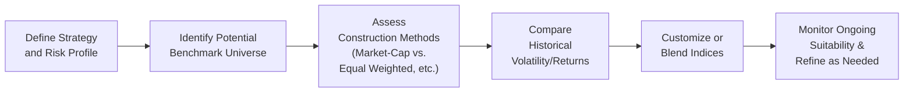

## Introduction

Imagine you’ve painstakingly built a specialized hedge fund strategy focused on distressed debt—a real niche area. Then, at quarter’s end, you stack up your fund’s returns against a broad equity index. The result might spark two reactions: (1) confusion from your investors about why these returns look so different, and (2) awkward explanations from you about why a run-of-the-mill equity index can’t capture what your fund is actually doing.

In such a scenario, the mismatch between your strategy and the chosen index begs a key question: “Why are we using an irrelevant benchmark for this fund?” This is the heart of benchmark selection pitfalls. The process of selecting (and occasionally constructing) a suitable benchmark might look straightforward on paper, but it can be rife with complexities—particularly in alternative investments, where strategies vary widely, data is often proprietary, and market exposures can be tricky to quantify.

Below, we’ll explore the challenges and missteps that can arise when choosing benchmarks. We’ll highlight common pitfalls like “bench-shopping” (where a manager switches benchmarks to make performance look better) and delve into float bias (an index weighting issue). We’ll also walk through some real-world anecdotes, show relevant diagrams, and offer best practices for staying on target. Ultimately, the goal is to help you become more discerning about why your benchmark matters so much and what you can do to keep it aligned with your strategy.

## Why Benchmark Selection Matters

Benchmarking is central to evaluating an investment manager’s skill. If you want to see whether a manager is outperforming, you compare the returns of their portfolio to a reference index or composite return. But in alternative investments—private equity, hedge funds, commodities, or real estate—there’s a twist: broad market indexes often fail to capture the unique characteristics, liquidity profiles, and risk exposures these strategies face. 

In other words, using an off-base index can be worse than using no index at all because it distorts your perception of risk, manager skill, and the strategy’s true merits. For instance, a real estate manager might appear to underperform the S&P 500, even while beating real estate-specific benchmarks (perhaps an index of publicly listed real estate securities or a private real estate composite). The mismatch leads to confusion and possibly poor capital allocation decisions.

## Common Pitfalls in Benchmark Selection

### 1. Apples-to-Oranges Comparisons
One of the most glaring missteps is selecting a benchmark that doesn’t match the core exposures of your strategy. For example, it’s tempting to use a broad index like the MSCI World or S&P 500 for practically any equity strategy—sometimes just because it’s well-known or easily accessible. But a long-short equity hedge fund employing niche momentum screens in emerging markets has little in common with a basket of large-cap U.S. stocks. Using such a mismatch might:

• Mask the manager’s actual performance drivers.  
• Provide flawed insight into the true alpha (if any).  
• Create unrealistic expectations for volatility and drawdowns.

The mismatch is so severe it’s like comparing how well a soccer goalie does against a standard basketball free-throw percentage—it just doesn’t compute.

### 2. Bench-Shopping
Another subtle pitfall is the practice of retroactively selecting or changing a benchmark to flatter historical returns. Maybe a fund manager initially used a certain hedge fund index; after a few tough quarters, they quietly switch to a different index that makes their performance look better. That’s “bench-shopping.”

This practice is considered misleading because it undermines the integrity of performance measurement. It also erodes investors’ trust if they suspect the manager is gaming the comparison. Ensuring managers lock in a benchmark at the start—then document any changes with a transparent rationale—is crucial for honest performance evaluation.

### 3. Float Bias and Weighting Methodology
“Float bias” might sound like someone left a root beer float out too long, but it’s an actual phenomenon where an index over-emphasizes securities with higher levels of tradable shares. Many well-known indexes are market-cap weighted (e.g., S&P 500, Russell 2000), which means large-cap or heavily floated companies can dominate index performance.

In alternatives, it’s common for managers to focus on smaller companies, specialized markets, or illiquid segments. If you then compare them to a float-biased index, you risk:

• Underestimating the volatility or risk (since large-cap stocks in the index could be more stable and overshadow smaller, volatile names).  
• Misjudging the returns due to heavy weighting in just a few mega-cap securities.  

In private equity, for instance, the concept of float is murky because many holdings might not even be publicly listed. Be cautious and always understand how an index is constructed because that weighting formula could shift performance in ways that have nothing to do with your manager’s skill.

### 4. Proprietary Data and Transparency Issues
In the world of alternative investment benchmarking, data is frequently proprietary—controlled by private administrators, index providers, or limited partner agreements. This can make it challenging to:

• Verify the underlying sources and calculation methods.  
• Replicate or validate the performance of “benchmark” returns.  
• Confirm that the index truly reflects the market segment it purports to measure.

You might see a benchmark labeled, say, “Hedge Fund Distressed Debt Index,” but the actual constituents are undisclosed or only partially revealed. Despite these transparency gaps, managers and investors often rely on these benchmarks for important decisions. 

### 5. Expense Drag
Another subtle factor is expense drag. Two otherwise similar benchmarks can have distinct expense ratios and rebalancing costs. If a manager’s performance is being penalized because their selected benchmark has minimal published expenses, it can create an unfair impression. Always do a deep dive into the fine print of a benchmark’s cost assumptions to see if it skews the comparison.

### 6. Multi-Factor and Strategy Evolution
Alternative strategies often draw on multiple factors—value, momentum, carry, volatility arbitrage, or a combination of these. If your benchmark doesn’t reflect this multi-factor exposure, you either understate or overstate the manager’s true skill. 

Moreover, strategies evolve over time. If a hedge fund initially focuses on equity long-short but gradually transitions to more event-driven or global macro trades, you might need a more flexible, blended benchmark or an entirely new index. Keeping the benchmark static as the strategy shifts can produce a mismatch that undermines performance attribution.

### 7. Peer Group Comparison vs. Index-Based Benchmarks
Many alternative strategies rely on peer group comparisons—like comparing a private equity fund’s IRR to the quartile ranking among all private equity funds of a certain vintage. While peer group data can be valuable, it also has pitfalls:

• Survivorship bias: Poorly performing funds often drop out of databases, artificially inflating the average return.  
• Selection bias: The database might include only funds that voluntarily report.  
• Different definitions of “vintage,” “fund stage,” or “strategy.”  

So, you end up with a mismatch again if your peer group is not truly representative. Using an index-based benchmark (if available) or a robust composite might be preferable, provided it accurately captures the relevant opportunity set.

## Verifying Alignment of Objectives, Risks, and Market Exposure

To counter these pitfalls, the fundamental question remains: “Does my benchmark align with what my strategy is supposed to do?” That means:

• Matching risk level: If your strategy is moderate-risk long-short equity, pick an index or composite that mirrors that level of volatility.  
• Matching geography and sector: A U.S. small-cap strategy needs a relevant U.S. small-cap benchmark, not a global large-cap index.  
• Matching liquidity and leverage: If you use leverage or invest in illiquid securities, your benchmark should factor in or approximate that dimension.  

If no single benchmark fits the bill, consider using a blended or custom benchmark.

## Custom or Blended Benchmarks

Constructing a custom or blended benchmark can make a world of difference, especially in multi-factor or multi-asset-class strategies. For instance, you might combine:

• 50% from a global equity index (representing your main long exposure).  
• 30% from a hedge fund index capturing the strategies you implement (distressed, macro, etc.).  
• 20% from a bond index, if you hold significant fixed-income or credit exposure.  

Weights can be fixed or dynamically adjusted as your strategy changes. The key is to ensure transparency about how and why you create this blend. Of course, you’ll need to communicate these details to investors (or if you’re the investor, you’ll need to request them from the manager).

Below is a simple flowchart illustrating how an investment manager might select or construct a suitable benchmark:

In practice, finalizing a blended benchmark might involve a combination of historical regression (to ascertain factor exposures), forward-looking analysis (how the manager’s style might evolve), and ongoing dialogue between the manager and the investor.

## Monitoring Performance Drift and Updating Benchmarks

Just because you picked the perfect benchmark in Year 1 doesn’t mean it stays perfect forever. Fund strategies evolve, markets shift, and factor exposures morph. If you notice performance drifting from the originally stated style—say, your manager starts dabbling in currency trades or invests in a brand-new region—then you should review if the existing benchmark still fits. Maybe you need to re-weight or add a new component to your blended benchmark.

### A Personal Anecdote
I once encountered a hedge fund that started as a long-short equity manager but, over time, discovered an opportunity in distressed credit. Management got so enthralled by the returns from bond restructurings that they re-allocated 40% of their portfolio to it—no big deal, except that their official benchmark remained a pure equity index. Investors got whiplash trying to interpret monthly performance swings that had little correlation with equities. This mismatch hammered home the lesson: if your strategy changes, your benchmark probably needs to change too.

## Putting It into Practice: A Quick Example

Let’s illustrate with a simplified numeric example. Suppose you’re evaluating a multi-strategy hedge fund with partial equity, partial credit, and partial commodity exposures:

• The manager invests 50% in equity long-short (mostly large-cap U.S. equities).  
• 30% in high-yield bonds (looking to capture credit spread opportunities).  
• 20% in commodity futures (to exploit momentum signals).  

A naive benchmark would be the S&P 500. But that fails to account for credit risk and commodity volatility. A more suitable custom benchmark might be:

• 50% S&P 500 Index  
• 30% Bloomberg U.S. Corporate High Yield Index  
• 20% S&P GSCI Commodity Index  

If halfway through the year, the manager transitions some equity exposure to an emerging markets tilt, you might then add or replace a slice of that 50% with an emerging market equity index. That’s the idea behind continuous review and alignment.

## Key Terms at a Glance

• Float Bias: Overrepresentation of securities with higher levels of tradable shares in a market-cap-weighted index.  
• Custom Benchmark: A personalized benchmark that blends different indexes to match a specific strategy’s exposures.  
• Bench-Shopping: The practice of retroactively changing or selecting a benchmark that flatters a fund’s historical performance.  
• Peer Group Comparison: Evaluating performance against a cohort of similar strategies or managers, as opposed to a market index.  
• Multi-Factor Exposure: Having exposure to multiple systematic risk factors (e.g., small cap, value, momentum) within a single strategy.  
• Blended Benchmark: A benchmark composed of multiple indexes in prescribed weights to reflect a strategy’s allocation.  
• Proprietary Data: Data not widely available, frequently used in alternative investment indexes, and often lacking transparency.  
• Expense Drag: Potential distortion of performance comparison due to differing expense ratios among available benchmarks.

## Best Practices for Avoiding Benchmark Pitfalls

• Start With a Clear Strategy Profile: Pin down your strategy’s risk factors, liquidity profile, and sector/geographical focus before you even think about an index.  
• Investigate How Indexes Are Built: Don’t rely on an index name alone—read the methodology. Is it float-adjusted, equal-weighted, or fundamentally weighted?  
• Document Your Benchmark Rationale: In your fund’s offering materials (or if you’re an investor, in your due diligence files), explain precisely why you chose a given index or blend.  
• Stay Alert for Style Drift: Especially in alternative investments, managers may pivot strategies. Regularly confirm that the benchmark remains relevant.  
• Check for Bench-Shopping: Ensure that any change in benchmark is justified, documented, and prospective—not retroactive.  
• Peer Group Comparisons Are Not Enough: Peer data can be helpful, but also incorporate index-based and factor-based approaches if possible.  
• Communicate Changes: If you decide to shift from a single index to a blended index, inform all stakeholders promptly and explain why.  
• Consider Expense Differences: Evaluate how benchmark costs might differ from your strategy’s cost structure.

## Conclusion

Selecting the right benchmark for alternative investments is not a one-time, set-and-forget exercise. It’s an ongoing process of aligning your fund’s (or your target manager’s) objectives, risks, and exposures with the appropriate market standard—or constructing your own. Whether it’s customizing a blend of indexes for a multi-factor hedge fund, or verifying that a single private equity index truly represents your regional buyout strategy, due diligence is paramount.

Neglecting these considerations can mislead your performance analysis and hamper effective asset allocation decisions. By recognizing common pitfalls like bench-shopping, float bias, and transparency issues, you can significantly enhance the credibility and clarity of both manager evaluation and portfolio strategy.

Keep in mind that the deeper your understanding of benchmark selection, the sharper your insights into genuine portfolio performance and alpha generation. After all, if you’re measuring success with the wrong ruler, you’ll never get a truly accurate read on how well (or poorly) you’re doing.

## Further References

• CFA Institute Research Foundation publications on benchmarking:  
  https://www.cfainstitute.org/research/foundation  

• “The Handbook of Traditional and Alternative Asset Classes” by Mark J. P. Anson (particularly sections on Benchmarking)  

• Institutional Limited Partners Association (ILPA) guidelines for private market performance measurement:  
  https://ilpa.org/  

• Refer also to Section 2.1 (Performance Measurement and Benchmarking) and Section 2.9 (Tracking Error and Style Drift) in this volume for additional context.

--------------------------------------------------------------------------------

## Test Your Knowledge: Benchmark Selection Pitfalls and Best Practices



### Which of the following describes “bench-shopping” in performance evaluation?

- [ ] Using a blended benchmark that reflects multiple asset classes.
- [ ] Constructing a customized benchmark to align with multi-factor exposures.
- [x] Changing benchmarks retroactively to make performance look more favorable.
- [ ] Selecting a peer group comparison for portfolio analysis.

> **Explanation:** Bench-shopping is the dubious practice of retroactively altering benchmarks to flatter historical returns, which undermines the integrity of performance measurement.

### What is a primary risk of mismatching your strategy to an overly broad benchmark?

- [ ] Increased regulatory scrutiny.
- [x] Possible misinterpretation of the manager’s true skill or alpha.
- [ ] Higher transaction costs.
- [ ] Elimination of survivorship bias.

> **Explanation:** When a benchmark’s exposures differ substantially from the fund’s strategy, performance statistics can mislead investors regarding the manager’s skill.

### Which statement best captures the reason for a custom or blended benchmark?

- [x] A single index may not fully reflect multi-asset or multi-factor strategies.
- [ ] Blended benchmarks are cheaper than off-the-shelf indexes.
- [ ] They ensure managers can retroactively change performance history.
- [ ] They automatically adjust for float bias without manual intervention.

> **Explanation:** Custom or blended benchmarks are designed when a single index cannot adequately capture multiple asset classes, risk factors, or exposures relevant to the strategy.

### Float bias refers to:

- [ ] The bias introduced by newly launched funds not included in a benchmark universe.
- [x] Overrepresentation of securities with larger tradable stock floats in market-cap-weighted indexes.
- [ ] The negative impact of higher fund fees on net returns.
- [ ] The practice of adjusting benchmarks for inflation.

> **Explanation:** Float bias occurs when market-cap-weighted indexes overly weight companies with larger floating shares, potentially skewing results away from smaller or less liquid stocks.

### Which of the following is a potential advantage of peer group comparisons for hedge funds?

- [x] They can help investors understand how a manager performs relative to peers with similar strategies.
- [ ] They remove expense drag differentials across different indexes.
- [x] They may offer deeper insight into manager skill if the peer set is truly comparable.
- [ ] They eliminate the need for official benchmarks or factor exposures.

> **Explanation:** Peer group comparisons provide a strategy-specific context. However, they should be used carefully due to survivorship and selection biases; they do not entirely replace index-based methods.

### When a fund changes its strategy from equity long-short to distressed debt, what is the best course of action regarding benchmarking?

- [x] Revisit and potentially revise the benchmark to reflect the new exposures.
- [ ] Maintain the original benchmark until the manager reports underperformance.
- [ ] Discontinue using a benchmark temporarily.
- [ ] Switch to a higher-volatility index to match distress volatility.

> **Explanation:** If the fund’s strategy mix changes significantly, the benchmark needs realignment to accurately reflect the new risk-return profile.

### Proprietary data in alternative investment benchmarks can lead to:

- [x] Limited transparency that makes it difficult to verify the index components.
- [ ] Greater liquidity in publicly traded securities.
- [x] Potential overreliance on incomplete or biased performance samples.
- [ ] Elimination of the need for factor-based modeling.

> **Explanation:** Proprietary data often lacks the full transparency of public data, which can introduce uncertainty or bias in the benchmark’s representativeness.

### What method can help eliminate survivorship bias in peer-group-based benchmarks?

- [x] Including both current and defunct fund data in the sample.
- [ ] Using only the top 25% of performing funds for comparison.
- [ ] Regularly dropping underperforming funds from the dataset.
- [ ] Relying solely on manager-provided returns.

> **Explanation:** Survivorship bias arises when poor-performing or closed funds disappear from the dataset. Including defunct funds helps generate a more realistic peer comparison.

### Which scenario below best illustrates expense drag in a benchmark?

- [ ] An index that excludes all technology stocks for ethical reasons.
- [x] A benchmark performance calculation that includes elevated management fees, making comparative returns look lower.
- [ ] A 50/50 blended benchmark using equities and bonds.
- [ ] A daily rebalanced market-cap-weighted index.

> **Explanation:** Expense drag in a benchmark means its returns already reflect additional or hidden costs. It can skew comparisons if your portfolio has a different fee structure.

### The practice of regularly reviewing a fund’s benchmark is most important because:

- [x] Strategies and market conditions evolve, potentially rendering the original benchmark obsolete.
- [ ] It ensures managers can adopt new benchmarks that enhance past performance.
- [ ] Investors can eliminate drawdowns more easily.
- [ ] Regulatory bodies forbid the use of static benchmarks.

> **Explanation:** As a strategy shifts or market conditions change, the benchmark may no longer reflect the portfolio’s exposures. Ongoing reviews keep benchmarks relevant and informative.


