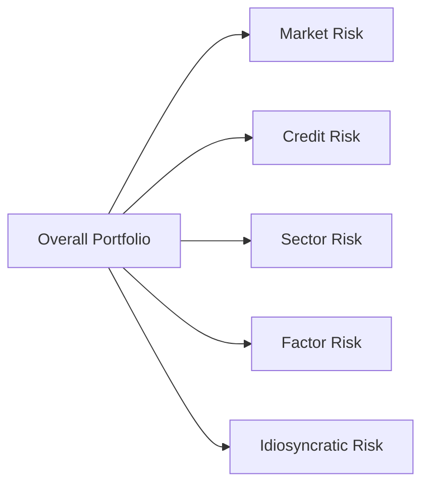

## Introduction

Have you ever looked at a portfolio and thought, “I know there’s risk lurking in here, but where exactly is it coming from?” It’s a question that has bugged me more times than I can count—especially when juggling hedge funds, real estate, private equity, and a bunch of other alternative assets. So let’s talk about risk decomposition and risk-adjusted performance.  

The goal here is twofold:  
• Break down the sources of risk in a portfolio or strategy—from broad market risk to more specific credit, sector, or style exposures.  
• Figure out how to measure performance per unit of risk—using tools like the Sharpe Ratio or the Information Ratio—to see who’s delivering true skill (alpha) and who’s just riding the wave of systematic risk.  

We’ll explore a variety of practical methods, from multi-factor models to scenario analyses, in order to manage the uncertainties of alternative investments. Along the way, we’ll weave in a few personal anecdotes (the times I went down rabbit holes trying to figure out which factor was giving me headaches!) and share insights about best practices.  

## Breaking Down Risk Components in a Portfolio

One of the biggest aha moments I had as a budding analyst was realizing that an investment’s overall risk can be disassembled, like a puzzle, into core pieces:

• Market (Systematic) Risk: The portion of risk that’s driven by broad market moves (e.g., a global equity index or major interest rate changes).  
• Credit Risk: The possibility that counterparties or issuers will default on obligations—critical for private credit or corporate bonds.  
• Sector/Industry Risk: Concentration in specific sectors (like healthcare, tech, or energy) can expose you to unique dynamics and regulatory changes.  
• Factor (Style) Risk: Exposure to styles such as value, growth, momentum, or volatility.  
• Idiosyncratic Risk: Firm- or project-specific uncertainties that are not explained by general market or style factors.

When you analyze a portfolio of alternative investments—say, a mix of private equity funds, hedge fund strategies, and real estate vehicles—each investment might carry its own set of risk characteristics. Piecing together these risk exposures clarifies whether you’re inadvertently loading up on a specific factor (like small-cap equities in private equity) or if you have hidden sector biases in a hedge fund strategy that invests heavily in tech.  

A practical way to visualize this decomposition is through a simple diagram showing how each component flows into the combined portfolio risk:

This rather simplistic view reminds us that each risk bucket can be analyzed separately—and insured or hedged to varying degrees.  

## Performance Attribution

Once you understand the risk building blocks, you can see how each piece contributes to performance. Performance attribution typically looks at:  

• Asset Allocation Decisions: How your choice between equity, debt, real assets, etc. contributed to the final returns.  
• Security Selection: The returns attributable to picking specific securities or fund managers who outperform their benchmarks.  
• Timing or Tactical Adjustments: The alpha (or negative alpha) that arises from changing exposures to different assets or risk factors over time.

In alternative investments, the lines can blur because funds often have lock-up periods, liquidity constraints, or complex fee structures that affect performance. But the principle remains: figure out where returns come from and which risk exposures drive them.  

## Multi-Factor Models and Identifying Alpha

Now let’s say you want to isolate true alpha—the portion of returns not explained by systematic risk factors. That’s where multi-factor models come in. For example:

1. Choose the right factors: Think about the typical exposures relevant to your investments (e.g., equity market factor, size, value, momentum, interest rates, credit spreads, exchange rates).  
2. Regress portfolio returns against these factors: A regression approach helps estimate your exposure (beta) to each one.  
3. Subtract out the explained portion of returns: Whatever is left over (hopefully a positive number) is your alpha—a measure of manager skill or unique insights, if it’s statistically significant.

In practice, many large asset managers or institutional investors rely on software that systematically decomposes returns into factor betas. But watch out: if your data is incomplete or your factor definitions are fuzzy (trust me, I’ve made that mistake with incorrectly labeled data sets), your results may be misleading.  

## Risk-Adjusted Performance Metrics

Risk decomposition is half the story; the other half is how well a manager is being compensated for that risk. Let’s discuss a few standard metrics you’ll see:

• Sharpe Ratio:  
  
  \text{Sharpe Ratio} = \frac{R_p - R_f}{\sigma_p}
    
  The Sharpe Ratio tells you how many units of return you’re earning over the risk-free rate for each unit of total (standard deviation) risk. It’s handy for comparing different strategies, but if your returns have big tail risks or fluctuate in non-normal patterns (like some hedge funds do), the Sharpe Ratio might not reflect the real risk.  

• Information Ratio (IR):  
  
  \text{Information Ratio} = \frac{R_p - R_b}{\text{Tracking Error}}
    
  Here, \\( R_p \\) is the manager’s return and \\( R_b \\) is the benchmark’s return. The denominator is the tracking error, a measure of how volatile the difference between the manager and the benchmark can be. The IR focuses on “active risk” rather than total risk, which is crucial for managers claiming to do something special relative to a given index.  

• Treynor Ratio:  
  
  \text{Treynor Ratio} = \frac{R_p - R_f}{\beta_p}
    
  This metric looks at a manager’s return above the risk-free rate per unit of market (beta) risk. If you’re assessing a strategy primarily exposed to equity market fluctuations—and beta is the key driver—this ratio can help you figure out if the manager delivered enough return for that systematic risk.  

When do you use each?  
• Sharpe Ratio: Great for a single-fund perspective if you don’t have a specific benchmark or if total volatility matters.  
• Information Ratio: Ideal if you want to see how a manager’s active approach performs against a benchmark and how consistent they are.  
• Treynor Ratio: Especially relevant if the main risk is market risk (beta) and you want to see how well you’re paid for that single factor.

## Scenario Analysis

Quantitative metrics are powerful, but they don’t always convey the full story of how different risk factors behave in volatile markets. That’s why scenario analysis is a favorite tool. Essentially, you model how your portfolio might perform under a variety of plausible (and sometimes extreme) market conditions:

• Rising interest rates: Do your alternative funds have significant leverage or long-duration structures that might suffer when borrowing costs climb?  
• Economic downturn: How would your real estate holdings or distressed debt strategies hold up if default rates spike?  
• Commodity price shocks: If you have heavy exposures to farmland or energy, big swings in commodity prices can drastically change performance profiles.

Scenario analysis helps you prepare for potential outcomes and decide whether your portfolio is robust or if you need to hedge or rebalance.  

## Integrating Risk Decomposition into Portfolio Construction

It’s easy to say “don’t take unintended bets,” but how do you avoid them? By building risk decomposition directly into your portfolio management process:

• Use factor analysis or attribution to see exactly which exposures you’re taking.  
• Place position limits on factors that you don’t want to dominate, like if you never intended to hold a huge momentum tilt.  
• Rebalance or hedge if your portfolio drifts from intended targets.  

One time, I discovered a big chunk of my private equity investments was more correlated to small-cap growth stocks than I realized, and that concentration was messing with my overall risk profile. I ended up shifting some capital into less correlated real asset funds and used a small trim of my equivalently sized small-cap public equity exposure. And yes, it felt like a puzzle with pieces that keep shifting shape—but the end result was a more balanced (and, hopefully, more resilient) portfolio.

## Common Pitfalls in Risk Analysis

Of course, risk decomposition is rarely cut-and-dried, especially in alternatives. A few pitfalls to watch:

• Non-Normal Distributions: Hedge funds, especially those with option strategies or illiquid holdings, can have lumpy returns. Ratios assuming normality can mislead.  
• Data Limitations: Particularly with private markets, you might face limited data histories or stale valuations.  
• Overfitting Factor Models: The more factors you add, the more “perfectly” you can explain historical returns—but it may not hold up going forward.  
• Hidden Leverage or Derivatives Exposures: Some managers dabble in complex derivatives, so official allocations might not reflect real exposures unless you dig deeper.  
• Overemphasis on a Single Metric: Sharpe Ratio alone isn’t enough to capture the nuances of manager performance.  

## Putting It All Together

Risk decomposition and risk-adjusted performance metrics give you better insight into what’s driving returns—and help you compare managers or strategies on a level playing field. By carving out each risk factor, you can see whether the result is genuine alpha, a load of systematic risk, or a bit of both.  

Try to adopt a comprehensive approach:  
• Use factor-based attribution for consistent measurement.  
• Apply multiple metrics (Sharpe, Information, Treynor) to assess performance in different contexts.  
• Incorporate scenario analysis to see how your portfolio might behave in extremes.  
• Stay vigilant about data quality and model assumptions.  

I’ll admit, every time I set up a new factor-based attribution on an alternative asset like farmland or infrastructure funds, I realize just how critical a robust data collection framework is. The moment you can confidently say, “Yes, these are the actual risk drivers,” everything else, from manager selection to portfolio optimization, becomes far more straightforward.  

## References for Further Study

• Sharpe, William F. “Fixed Income and Equity Style Analysis.” An essential guide for understanding factor-based analysis and style exposures.  
• Grinold, Richard C., and Ronald N. Kahn. “Active Portfolio Management.” Offers deeper insight into how active risk is measured and managed.  
• CAIA Level I Study Guide on Risk-Adjusted Performance, available at https://caia.org.  

These references expand on the concepts discussed here—especially on factor models, performance measurement, and the complexities of alternative assets.  

## Test Your Knowledge: Risk Decomposition and Performance Measurement



### Which of the following best describes market (systematic) risk?  
- [ ] The portion of a portfolio’s risk that can be diversified away with enough securities.  
- [x] Risk stemming from broad economic or market factors that cannot be diversified away.  
- [ ] Idiosyncratic risk specific to one company or sector.  
- [ ] Risk that arises only in private markets.  

> **Explanation:** Systematic risk affects the entire market (e.g., equity or bond market). It cannot be eliminated through diversification.

### When comparing two managers with significantly different benchmarks, which risk-adjusted performance measure is most appropriate?  
- [ ] Sharpe Ratio, because it uses total volatility.  
- [x] Information Ratio, because it compares returns relative to a benchmark and normalizes by active risk.  
- [ ] Treynor Ratio, because it focuses purely on market beta.  
- [ ] Sortino Ratio, to account for downside risk only.  

> **Explanation:** The Information Ratio is designed to measure how efficiently a manager outperforms (or underperforms) a specific benchmark, adjusting for the active risk taken.

### What is the primary benefit of breaking down a portfolio’s risk into systematic and idiosyncratic components?  
- [ ] It highlights the ways to maximize correlation among assets.  
- [x] It reveals which portion of risk is diversifiable and which portion is driven by broad market factors.  
- [ ] It helps to set performance fees more accurately.  
- [ ] It eliminates all risk from a portfolio.  

> **Explanation:** Systematic risk cannot be diversified away, whereas idiosyncratic risk can often be reduced with broader diversification.

### In a multi-factor model, how do you interpret a portfolio’s alpha?  
- [ ] As the portion of portfolio returns explained by the most important factor.  
- [x] As the unexplained or excess return after accounting for all identified factors.  
- [ ] As a premium for taking on systematic market risk.  
- [ ] As the correlation between multiple random factors in the model.  

> **Explanation:** Alpha is the return that remains after factoring out all systematic exposures. It reflects a manager’s skill in generating returns beyond what the factors alone would justify.

### Which of the following is a limitation of the Sharpe Ratio in evaluating hedge funds with illiquid investments?  
- [ ] It focuses on active return over tracking error.  
- [ ] It relies on beta as the primary measure of risk.  
- [x] It can be misleading if returns are not normally distributed.  
- [ ] It is overly simplified by subtracting a risk-free rate.  

> **Explanation:** Many hedge funds with illiquid or option-based strategies exhibit non-normal return distributions, and the Sharpe Ratio assumes normality.

### Which scenario is best suited for using the Treynor Ratio?  
- [x] When market (beta) risk is the primary driver of returns and the portfolio aligns closely with the market.  
- [ ] When the portfolio’s total risk is dominated by unique, idiosyncratic exposures.  
- [ ] When you need to compare multiple managers with vastly different benchmarks.  
- [ ] When downside deviation matters more than consistent volatility.  

> **Explanation:** Treynor Ratio measures reward per unit of beta (systematic, market-based risk). It’s most relevant if the manager is taking primarily market risk.

### Suppose a portfolio has an alpha estimate of zero, but a high Sharpe Ratio. What might this indicate?  
- [ ] The portfolio has negative skill but positive unique risk.  
- [x] The portfolio’s returns are driven more by systematic factor exposures than by manager skill.  
- [ ] The factor model is incorrectly specified.  
- [ ] The manager has skill, but it’s overshadowed by high transaction costs.  

> **Explanation:** A zero alpha means the portfolio’s performance is fully explained by systematic exposures. A high Sharpe Ratio may reflect that these systematic exposures performed well.

### Why might scenario analysis be especially important for alternative investments?  
- [x] Alternative investments can have complex risk profiles that may behave unpredictably in stressed market conditions.  
- [ ] Scenario analysis mostly benefits investments with daily liquidity.  
- [ ] Alternative investments never require risk decomposition.  
- [ ] Benchmarks are unnecessary for alternative asset classes.  

> **Explanation:** Scenario analysis helps predict how illiquid or complex alternative investments might react in various market environments, something metric-based models alone can’t fully capture.

### Which of the following is a potential pitfall of adding too many factors in a multi-factor model?  
- [ ] It guarantees artificially low alpha estimates.  
- [ ] It ensures consistent performance in all market conditions.  
- [x] It can lead to overfitting, where past returns are explained but future performance is not accurately predicted.  
- [ ] It eliminates the need for scenario analysis.  

> **Explanation:** Overfitting is a risk when you include many factors; you might “perfectly” match historical data but lose predictive power.

### True or False: High tracking error typically indicates a manager excels at controlling deviation from the benchmark.  
- [ ] True  
- [x] False  

> **Explanation:** High tracking error means the portfolio’s returns deviate significantly from the benchmark. This may reflect active bets, which can be good or bad depending on skill and context.


