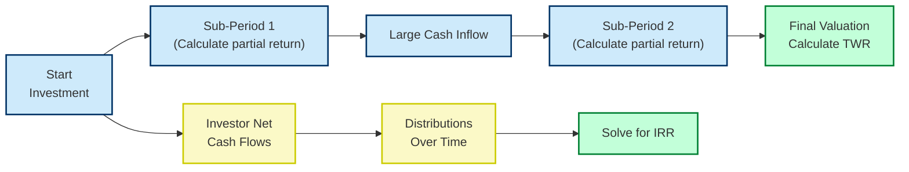

## Introduction and Overview

Maybe you’ve heard folks toss around terms like “time-weighted returns” and “money-weighted returns” as if they were interchangeable. Actually, they’re not. And it’s a subtlety that really matters once we start diving into alternative investments—like private equity, real estate, and hedge funds—where cash flows can show up in irregular, eye-popping ways. 

Here’s the basic story: the time-weighted rate of return (TWR) is all about isolating the manager’s skill by removing the impact of the cash flows (i.e., new capital added, or existing capital withdrawn). Meanwhile, the money-weighted rate of return (MWR)—often referred to as the internal rate of return (IRR)—tells us how your portfolio actually performed in your pocket, factoring in precisely when those cash flows occurred and how large they were.

TWR is like evaluating a coach’s performance, ignoring how the fans came in or went out of the stadium at random times. MWR is more like the actual fan perspective, who gets more (or less) enjoyment depending on when they showed up and how much it cost to attend. Whether you’re an aspiring CFA professional or simply someone wanting to see how your capital is truly performing, it’s best to understand both.

## Why Different Measures Matter

Imagine you invested in a private equity fund that went through large capital calls in the first year, then sat relatively still for a while, and finally had some impressive exits (distributions) in year five. If you only looked at TWR, you’d see one story: how effectively the manger navigated up-and-down market conditions. MWR would tell you something else: how your personal return shaped up after writing those big checks for capital calls, then waiting years to see the payoff.

Today, with alternative assets demanding long lock-up periods, erratic capital-call schedules, and potential “cash drag” from money that’s sitting idle, both measures have their place. 

• TWR: Helps folks compare different managers on a “fair” basis.  
• MWR (IRR): Tells you, the investor, the story of your personal experience, the net effect on your wallet.

## The Time-Weighted Rate of Return (TWR)

Time-weighted rate of return is often the go-to method when you want to see how skillful an investment manager has been, independent of when or how much capital is placed in or taken out. The name “time-weighted” is a hint: each time period (between external cash flows) is given equal weighting in evaluating performance. In other words, TWR is not “polluted” by large inflows or outflows.

### How TWR Works

TWR is computed by essentially “breaking” the total investment horizon into sub-periods, every time a significant external cash flow occurs. For each sub-period, you calculate a return, then chain them all together through compounding. It’s a multi-step process that might look complicated at first, but it’s actually straightforward if you take it slow:

1. Identify the sub-periods. A sub-period runs from one external cash flow to the next.  
2. Calculate the return for each sub-period.  
3. Multiply (compound) each sub-period’s return factor (1 + rᵢ) across the entire timeline.  
4. Subtract 1 from the final product to get the overall TWR.  

A compact formula is:


\text{TWR} = \Big[\prod_{i=1}^{n} (1 + R_i)\Big] - 1


where each Rᵢ is the sub-period return from the end of the previous sub-period to the end of the current sub-period.

### Simple TWR Example

Let’s say you start with $100 in a fund. No external cash flows happen until the end of the first year, and your investment grew to $110—an increase of 10%. Then, you invest an additional $90, bringing the total new value to $200. In the second year, that $200 grows to $210 for a 5% return. We break it into two sub-periods:

• Sub-Period 1: Return = ($110 - $100) / $100 = 10%  
• Sub-Period 2: Return = ($210 - $200) / $200 = 5%  

TWR over the full two-year period is:


(1 + 0.10) \times (1 + 0.05) - 1 = 1.10 \times 1.05 - 1 = 1.155 - 1 = 0.155 = 15.5\%


Notice that TWR does not give extra “weight” to the second period, even though the capital is bigger then. The sub-periods are equally important.

## The Money-Weighted Rate of Return (MWR or IRR)

Now, for the flip side: the money-weighted rate of return (MWR) explicitly includes how much money you plopped into, or pulled out of, your investments at different points in time. In private equity or real estate, we frequently see capital calls and distributions that can be large, and the MWR attempts to capture how these flows actually impact your personal performance.

### The IRR Perspective

Often, MWR is synonymous with IRR (Internal Rate of Return). Technically, IRR is the discount rate that sets the net present value (NPV) of a series of cash flows to zero.


\text{NPV} = \sum_{t=0}^{T} \frac{CF_t}{(1 + \text{IRR})^t} = 0


So if you invest $X$ at time 0, then get back certain distributions from the investment at times t = 1, 2, … T, IRR is that “break-even discount rate” that makes the present value of the outflows equal to the present value of the inflows. 

Once you solve for IRR, you’ve uncovered the MWR. It’s the actual “you, the investor” perspective. Think of it like the interest rate you effectively earned on your collectively timed capital contributions.

### Simple MWR Example

Let’s expand the example from above. Suppose:

• You invest $100 at time 0 (start).  
• After 1 year, the investment grows to $110.  
• You add $90 more, so you have a total of $200.  
• After another year, you end up with $210.  
• Then you withdraw all $210.  

So your cash flows look like:

• Time 0: -$100 (negative indicates outflow from your perspective)  
• Time 1: -$90 (another outflow)  
• Time 2: +$210 (you fully cash out)  

We want the IRR r:


-100 + \frac{-90}{(1 + r)} + \frac{210}{(1 + r)^2} = 0


This can’t be easily rearranged algebraically (you usually solve it via iteration or a financial calculator). Let’s pretend we do a quick approximation or use Python to solve it. The IRR might come out to about 7.2%. As you can see, that’s quite different from the 15.5% TWR from the same data. Why? Because during the time that your returns were highest (sub-period 1), you had less money invested. You only invested more right after the big jump. So, your personal experience is lower.

### Quick Python Example

Below is a small Python snippet you might use to approximate IRR:

```python
import numpy as np
import sympy as sp

cash_flows = [-100, -90, 210]

r = sp.Symbol('r', real=True)
npv_expr = sum([cash_flows[t] / (1 + r)**t for t in range(len(cash_flows))])

irr_solution = sp.nsolve(npv_expr, 0.1)  # initial guess 10%
print("Approx IRR:", float(irr_solution)*100, "%")
```

You’d typically get a solution around 7.2%. Notice how easy it is to slip into the assumption that if your investment “by periodic performance” did 15.5%, you must have earned 15.5%—not necessarily true once we incorporate the timing and size of contributions.

## Cash Drag and Its Effect on Performance

So-called “cash drag” is simply the performance drag caused by idle or underinvested capital. In the realm of alternative investments—like private equity, venture capital, or real estate—investors often pledge a certain amount of capital upfront, but the fund manager doesn’t call all of that capital right away. While you’re waiting around to pony up that capital, you might not be earning returns on it. That can produce a gap between TWR (which just looks at how effectively the manager invests) and MWR (which is heavily influenced by the fact that money sat in your checking account doing, well, not much).

In practice, MWR often ends up being less than TWR in cases where the manager invests early capital effectively, but calls additional capital later. By the time those later calls come in, maybe the market environment is different (could be better or worse). Or if your money is out of the market waiting for calls, you’re missing out on potential gains. TWR might show fantastic skill, but from your vantage point, the overall money-weighted performance might not look nearly as shiny.

## Which Method to Use, and When

• If you need to compare different investment managers (particularly in hedge funds or mutual funds) or want to benchmark the manager’s skill, TWR is generally recommended.  
• If you want to know the actual return for the money you put in—especially relevant for private equity, real estate, or any project with irregular inflows and outflows—MWR/IRR is your best bet.

In alternative investments, you’ll often see IRR used in pitch books, performance reports, and capital call notices. It’s so standard, in fact, that many limited partnership (LP) agreements reference IRR-based hurdle rates and carried interest calculations. The general partner (GP) typically touts an IRR to show how well or poorly they performed in returning your capital plus some profit. Meanwhile, the TWR might be used to compare this GP’s skill with that of other managers.

## Visualizing TWR vs. MWR

Here’s a quick Mermaid sequence diagram to illustrate how TWR and MWR can diverge.



On the upper track, we see how TWR is calculated by chaining sub-period returns. On the lower track, we see the actual flows of money and how we might solve for IRR.

## Putting It All Together

1. **TWR**:  
   - Use for comparing manager skill.  
   - Not influenced by size or timing of your contributions/withdrawals.  
   - Common in performance presentations conforming to Global Investment Performance Standards (GIPS).  

2. **MWR (IRR)**:  
   - Use to assess personal or “real” returns.  
   - Highly sensitive to the timing and magnitude of investor flows.  
   - Standard in private equity, real estate, and other illiquid alternative investments.  

In a perfect world, you calculate both. TWR gives you confidence in whether your manager is truly talented, while MWR clarifies if you got the returns you’ve been dreaming about.  

## Best Practices and Common Pitfalls

• **Comparing IRRs Without Considering Holding Periods**: It’s easy to compare IRRs across various funds, but keep an eye on how long each investment was actually at play. A high IRR over a short period might not equate to a better investment than a slightly lower IRR over a much longer period.  
• **Overemphasizing TWR When Your Concern Is Actual Dollar Growth**: TWR is great from a theoretical standpoint. However, if you personally might’ve missed out on returns simply because of late deployment of capital, TWR won’t reflect that.  
• **Inconsistent Sub-Period Frequency**: With TWR, you have to define sub-periods carefully, especially when large inflows or outflows occur.  
• **Relying Exclusively on IRR**: IRR can be “juiced” by returning a portion of capital early. Quick partial distributions can inflate IRR, even if the total return eventually disappoints.  

## Practical Advice for the Exam

• The CFA curriculum frequently tests the difference between TWR and MWR using small, chronological examples. Practice calculating sub-period returns for TWR, and discounting flows for IRR.  
• Understand that TWR is (1 + R1) × (1 + R2) × … − 1, while MWR sets the sum of discounted cash flows to zero.  
• Be prepared for a question about private equity capital calls. The best measure to evaluate the investor’s actual experience is IRR. The best measure to evaluate the GP’s “skill” is often TWR or an IRR vs. a benchmark.  
• Always read carefully whether the question is about the manager’s performance or the actual investor’s experience.  

## Additional Resources

• CFA Institute Global Investment Performance Standards (GIPS): Offers methodological guidelines for calculating and reporting TWR and MWR.  
• Managing Investment Portfolios: A Dynamic Process by CFA Institute.  
• ILPA Private Equity Principles: https://ilpa.org (A goldmine for recommended best practices in private equity, including IRR usage and capital call/distribution guidelines).  

## Test Your Knowledge: Time-Weighted vs. Money-Weighted Returns



### Which statement best describes the difference between TWR and MWR?

- [ ] TWR focuses on the impact of cash flows, while MWR removes them.  
- [x] TWR ignores external cash flows when measuring performance, while MWR incorporates the size and timing of these flows.  
- [ ] TWR and MWR are interchangeable and produce identical results.  
- [ ] TWR is primarily used for personal portfolios, while MWR is used only for institutional managers.  

> **Explanation:** TWR measures the manager’s performance irrespective of cash flows. MWR includes the timing and size of cash flows, making it more investor-centric.

---

### Why is TWR generally preferred when comparing managers’ performance?

- [x] It removes the impact of external cash flows, isolating the manager’s investment decisions.  
- [ ] It simplifies the calculation by ignoring compounding.  
- [ ] It always produces a higher return figure than MWR.  
- [ ] It is the only method mandated by IFRS for financial reporting.  

> **Explanation:** TWR is time-based and ignores the specific timing and size of cash flows, allowing for a fair comparison across portfolios with different cash-flow patterns.

---

### In alternative investments with large capital calls and distributions, which measure is commonly used for assessing investor experience?

- [ ] Time-Weighted Rate of Return  
- [x] Money-Weighted Rate of Return (IRR)  
- [ ] Sharpe Ratio  
- [ ] Sortino Ratio  

> **Explanation:** MWR/IRR captures the effect of varying capital calls and distributions, making it more relevant for measuring the individual investor’s actual outcome.

---

### Assume you have a series of cash flows for a private equity fund that includes multiple calls and distributions. Which approach solves for a discount rate that makes the net present value of all cash flows equal to zero?

- [ ] Modified Dietz Method  
- [ ] TWR  
- [x] IRR  
- [ ] Hurdle Rate  

> **Explanation:** By definition, the Internal Rate of Return is the discount rate that makes the present value of inflows equal to outflows over time.

---

### During the first six months of the year, you have $100 invested and earn 10%. Then you invest another $400 for the second six months, and the portfolio returns 5%. How does TWR compare with MWR?

- [x] TWR is calculated with equal weight on each sub-period’s return, while MWR will give more weight to the larger invested amount in the second period.  
- [ ] TWR will automatically be higher than MWR unless the second period returns are negative.  
- [ ] MWR is always simpler to calculate than TWR.  
- [ ] TWR includes external cash flows while MWR excludes them.  

> **Explanation:** TWR calculates the sub-period returns first (10% and 5%) and compounds them evenly. MWR weighs the second period’s return more heavily because more capital is invested during that period.

---

### What is the main disadvantage of using TWR for an individual investor’s portfolio?

- [ ] It incorporates the timing of external cash flows, complicating calculations.  
- [x] It does not measure the actual return on the investor’s invested capital, because it ignores the size and timing of cash flows.  
- [ ] It is too easy to manipulate by distributing capital early.  
- [ ] It is not accepted under GIPS standards.  

> **Explanation:** TWR focuses solely on the periodic performance of the manager’s decisions, ignoring whether the investor contributed or withdrew funds at opportune or inopportune times.

---

### Which measure is more likely to be “juiced” by an early partial distribution, even if the final total gain is modest?

- [ ] Time-Weighted Rate of Return  
- [x] Money-Weighted Rate of Return  
- [ ] Holding Period Return  
- [ ] Fisher’s Index  

> **Explanation:** IRR can be inflated by early distributions, because the investor recovers part of the initial outlay sooner, improving the discount rate’s outcome.

---

### The compounding effect in TWR means:

- [ ] Each sub-period is analyzed separately, then returns are averaged arithmetically.  
- [ ] Each sub-period must be weighted by the net asset value.  
- [x] Returns from each sub-period are multiplied (chained) to reflect growth over time.  
- [ ] Only the final sub-period matters because prior sub-period returns are discounted.  

> **Explanation:** TWR uses geometric compounding of sub-period returns to measure the cumulative effect of returns over the full investment horizon.

---

### When an investor is evaluating a fund manager’s skill in picking securities (and ignoring investor-driven cash flows), which return measure is ideal?

- [ ] IRR  
- [ ] Yield to Maturity  
- [ ] Discounted Payback Period  
- [x] Time-Weighted Rate of Return  

> **Explanation:** TWR is used specifically to isolate a fund manager’s competence without being affected by when and how much money investors add or remove.

---

### True or False: MWR can be negative even when TWR is positive, if large inflows happen before the fund’s poor performance.

- [x] True  
- [ ] False  

> **Explanation:** Because MWR assigns greater weight to periods when more capital is invested, if large investments come right before a downturn, the IRR (MWR) can be negative, even if TWR measures a positive sub-period return average.



## References

- CFA Institute Global Investment Performance Standards (GIPS)  
- Managing Investment Portfolios: A Dynamic Process by CFA Institute  
- ILPA Private Equity Principles: https://ilpa.org  

Feel free to dive deeper into these resources for a more comprehensive understanding of TWR, MWR/IRR, and best practices in alternative investment performance measurement. Good luck, and keep learning!
