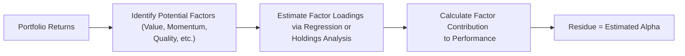

## Introduction and Core Concepts

Factor Attribution and Style Analysis might sound borderline nerdy, but they are absolute game-changers when dissecting a portfolio’s performance. Whether we’re chatting about private equity funds, hedge funds, or even real asset strategies, it can feel tricky to pin down what’s truly behind a manager’s results. Is it a savvy call on small-cap stocks? Or maybe an accidental tilt to a high-growth factor during a tech rally?

In essence, factor attribution tries to figure out which systematic forces—like value, momentum, or liquidity—are driving returns. Meanwhile, style analysis zeroes in on how a manager’s “style” (e.g., growth-oriented vs. value-oriented, or short-term momentum vs. contrarian) aligns with or diverges from common benchmark expectations. By combining these tools, investors can better identify genuine alpha, assess how stable a strategy might be over time, and avoid paying active-management fees for something that’s basically just a one-dimensional factor bet.

## Why Factor Exposures Matter

Factor investing started drawing attention decades ago with the realization that certain systematic risk exposures tended to outperform the market over long horizons. Think “value,” “size,” or “momentum.” Researchers identified these so-called “anomalies” that could explain why some strategies thrived while others lagged.

• Value Factor captures the concept of buying undervalued assets (often measured by ratios like price-to-earnings or price-to-book).  
• Momentum Factor basically says: yesterday’s winners might keep winning tomorrow (at least in the near term).  
• Size Factor historically points out that smaller, more nimble companies sometimes outperform larger, established firms.  
• Quality Factor tracks attributes such as profitability, low earnings volatility, or strong balance sheets.  
• Carry Factor appears in asset classes like currencies and fixed income, capturing the value of “earning the spread” or yield differential across regions or instruments.  
• Liquidity Factor, a bit trickier, often comes into play in hedge funds or private investments, where less liquid assets promise a premium.

Alternative investment managers often tap into these risk factors, either knowingly or by happenstance. When you examine a real estate fund’s returns, for instance, part of the story might be exposure to the “size” factor if the fund invests in smaller, niche markets, or a “value” factor if it targets properties with lower price-to-rent multiples. Hedge funds may load up on momentum or carry strategies. Private equity managers might place big bets on small, distressed companies for buyouts, effectively leveraging both size and value factors. Being able to measure these exposures helps you see if your manager is truly skilled—or just on a hot streak because the factor exposures are in favor.

## Returns-Based Style Analysis

Sometimes, you can’t see exactly what’s in a manager’s portfolio. Proprietary positions, opaque strategies, or a limit on disclosures might keep things behind a curtain. That’s where Returns-Based Style Analysis (RBSA) comes in. RBSA uses a manager’s historical returns to infer factor exposures. The key idea is to find a combination of factors or indexes whose returns most closely replicate the portfolio’s return pattern.  

The typical math behind RBSA might look like this:

Rᵖ = α + β₁•Rᵥᵃₗᵤₑ + β₂•R₍ₛᵢᵥₑ₍ + β₃•Rₘₒₘₑₙₜᵤₘ + … + ε

Where:  
• Rᵖ = Portfolio returns  
• Rᵥᵃₗᵤₑ = Returns on a value factor index  
• R₍ₛᵢᵥₑ₍ = Returns on a size factor index  
• Rₘₒₘₑₙₜᵤₘ = Returns on a momentum factor index  
• α = Alpha (the unexplained portion, potentially manager skill)  
• β = Factor loadings that indicate how strongly each factor influences the portfolio

In an ideal scenario, you can interpret α as true alpha if your factor definitions are robust. However, you’ve got to keep a few disclaimers in mind. First, if a manager’s style changes over time (a phenomenon we call “style drift”), then a simple linear regression might be misleading unless you run it in rolling windows or use time-varying parameters. Second, RBSA can be confounded if the factors you chose as proxies do not neatly capture the manager’s exposures (e.g., your “value” index might not reflect the precise type of undervaluation a manager is targeting).

## Holdings-Based Style Analysis

Holdings-Based Style Analysis is like popping the hood of the car. Instead of guessing the engine’s configuration based on how it sounds, you are looking directly at each bolt and cylinder. Now, if the fund discloses or you can otherwise gather the list of actual positions—maybe you get monthly or quarterly updates—then you can see how each position maps to certain factor exposures.

For instance, let’s imagine a hedge fund that invests in 40 equities. You can take each name and see:  
• Market capitalization (size factor)  
• Valuation multiples (value factor)  
• Momentum metrics (momentum factor)  
• Leverage or balance-sheet metrics (quality factor)  

Then, you effectively aggregate these statistics to measure the overall tilt of the portfolio. If you do a thorough job, you can pick up on more subtle exposures—like how certain positions may reflect a “growth” bias even if the manager’s pitch deck says “value.” We often see discrepancies like that, ironically enough, especially if the manager is chasing recent winners while proclaiming they’re 100% dedicated to undervalued stocks.  

Plus, a holdings-based approach allows you to spot potential divergences from historical norms. Maybe the manager typically invests in stable, dividend-paying instruments until quite recently. Suddenly, they have a chunk of the portfolio allocated to high-volatility biotech names. That’s style drift, and it might reveal a shift in strategy or a short-term opportunistic play that could change the risk profile of your overall portfolio.

## Why Alternative Investments Require Multi-Factor Models

Unlike traditional equity or bond managers, alternative investment strategies can be more dynamic, holding everything from exotic derivatives to direct real estate. A single factor proxy for “equities” might not cut it. For a macro fund playing in international currencies, an FX carry factor might be critical. For a private equity real estate fund, you might need to isolate factors such as property type, geographic location, and real estate cycles.  

Additionally, many alternative funds employ leverage or short positions, modify exposure through derivatives, or adjust exposures over time. Factors in these contexts can be more fluid. A manager might be “long momentum” in rising markets but quick to hedge or reverse the position in a downturn, complicating a simple regression-based approach.  

What’s more, the “liquidity factor” can loom large in private market strategies. Investors may receive an illiquidity premium for locking up capital. Typically, you can’t see that factor directly in daily returns. Instead, you see a smoother return pattern that may understate risk and produce an illiquidity-based “excess” return that can be misconstrued as alpha.

## Separating Genuine Alpha from Factor-Driven Returns

Let’s be frank: sometimes investors pay 2-and-20 (2% management fee, 20% performance fee) for returns that a systematic factor strategy could generate at a fraction of the cost. This is not to say factor bets are easy or guaranteed profit, but factor exposures can be replicated more cheaply using ETFs or futures if you have the right infrastructure and capacity.

A robust factor attribution model can help detect whether a manager’s apparent outperformance is mostly explained by factor tilts. If the majority of the returns line up with, say, a momentum factor loading, that questionable “alpha” might actually be something you can replicate through a do-it-yourself momentum portfolio.  

Below is a simplified outline of how an advanced factor approach might parse out the sources of returns:

In practice, you might run multiple regression frameworks or advanced optimization routines. If that leftover “Residue” is persistently positive after controlling for known factors, you’ve probably got a manager who delivers genuine alpha. That is pure gold, but it’s also relatively rare. Many managers produce positive alpha in certain market environments but struggle to maintain it consistently.  

Keep in mind that alternative strategies can shift exposures quickly, so you’ll need to do repeated or rolling analyses to see if factor exposures remain stable. Some managers excel at “market timing” a factor by getting in when it’s about to rally and getting out before it sours. Even if that’s just factor-based, timing skill can still be alpha. The point is to figure out whether that skill is systematic or just luck.

## Dynamic Strategies and the Limits of Factor Analysis

Sure, factor analysis is powerful, but it’s not a cure-all. The typical linear model approach is flawed if:  
• The strategy is extremely dynamic, flipping factors month to month.  
• The relevant factors themselves shift in definition (e.g., “value” in tech might require a different lens than “value” in industrials).  
• The manager uses derivatives or other structural exposures that standard factor proxies do not capture.  
• Market conditions undergo abrupt regime changes (e.g., from high to low inflation).

I once sat with a hedge fund manager who bragged about “unparalleled expertise in volatility trading.” He used complex over-the-counter (OTC) options trades with time-varying greeks (delta, gamma, vega). If you try to attribute everything to basic equity style factors such as momentum or size, you’ll likely fail. You might need specialized “volatility factor” or “convexity factor” definitions.  

And let’s not forget the cyclical nature of factors. It’s no secret that value does well in certain cycles (like coming out of a recession), while momentum might dominate in strong bull markets. Carry strategies thrive in stable markets but can get hammered in a risk-off environment. That cyclical behavior can make it tough to estimate factor loadings if you only run a single regression across an entire cycle.

## Practical Tips for Effective Style and Factor Analysis

• Use multiple factor definitions. “Value” might mean different things: low P/E, low price-to-book, or discounted cash flows. A single index might not capture all nuances.  
• Keep your factor model updated. Market relationships evolve, and the data for factors like momentum or liquidity can shift dramatically.  
• Conduct rolling analyses. A rolling regression or rolling exposures chart over six- or twelve-month windows helps identify style drift and time-varying exposures.  
• Combine returns-based and holdings-based methods if possible. Returns-based analysis reveals broader patterns, but holdings data provides deeper insight.  
• Don’t ignore transaction costs, leverage, and short selling constraints—these can cause real differences in a manager’s factor loadings compared to a “paper” factor portfolio.  
• Consider macro factors too. Some strategies are heavily fueled by interest rate cycles, currency regimes, or other broad macro conditions.

## Cautionary Notes

Relying solely on factor attribution to pass judgment on a manager can be tricky. Maybe the manager is a skillful stock-picker who also happens to be in a bullish factor environment. Alternatively, a manager might appear to have alpha that is really just illiquidity premium or hidden factor exposures. That’s the puzzle.  

It’s also essential not to double-count alpha if you inadvertently use a wide array of overlapping factors. The more factors you add, the less “unexplained” return remains. So strike a balance: use a robust factor set, but not an overly cluttered one that saps the significance out of your alpha estimate.

## Anecdote: From Claims of Brilliance to Exposure Reality

I remember working with one private equity manager. They were thrilled about their “transformative operational improvements” in their portfolio companies. We discovered through a factor replication test that if you simply tracked small-cap, highly leveraged buyout indexes, you would have captured about 80% of the returns, net of fees. The manager’s unique skill might have contributed some alpha, but it certainly wasn’t as large as their marketing pitch implied.  

Having that insight changed the LP’s decision around re-upping capital. They didn’t necessarily walk away from the fund, but they negotiated better fees, aligning more of the manager’s compensation to actual alpha, not factor-driven beta.

## Conclusion and Exam Tips

Factor Attribution and Style Analysis remain essential tools for dissecting the performance puzzle of alternative investments. Stay vigilant about factor definitions, remember that exposures can shift, and be mindful of the trade-off between thoroughness (lots of factors) and clarity (isolating the manager’s true skill).  

Exam-wise, you might see scenario-based prompts where you have to:  
• Identify which factor exposures best explain a manager’s performance.  
• Distinguish alpha from systematic factor performance.  
• Evaluate how style drift might undermine the consistency of returns-based analysis.  
• Recommend improvements to factor attribution models.  

When constructing your answers, be sure to connect the dots between conceptual definitions (e.g., value factor, momentum factor) and practical usage (i.e., regression analysis, rolling windows). Time management is key in exam settings—so practice summarizing findings in a concise manner, focusing on the most relevant factors.  

## References and Further Reading

• Grinold, R. C., & Kahn, R. N. (2000). “The Fundamental Law of Active Management.” McGraw-Hill.  
• Wilcox, J. W. (2007). “Investing by the Numbers: A Guide to Quantitative Modeling of Financial Markets.” Wiley.  
• Gibson, R. C. (2013). “Asset Allocation: Balancing Financial Risk, Fifth Edition.” McGraw-Hill.  

Consider visiting the CFA Institute’s official website for updated material and factor definitions, and check out academic journals like The Journal of Portfolio Management for the latest research on factor investing.

## Test Your Knowledge: Factor Attribution and Style Analysis



### Which of the following statements best describes the role of factor attribution in performance analysis?

- [x] It separates a portfolio’s returns into components linked to systematic risk exposures versus potential alpha.  
- [ ] It measures only fixed-income exposures in global bond portfolios.  
- [ ] It captures the market timing skill of a manager without adjusting for systematic risks.  
- [ ] It replaces the need for returns-based style analysis and holdings-based analysis.  

> **Explanation:** Factor attribution disentangles systematic factor influences (value, momentum, etc.) from the unexplained portion of returns, which may represent alpha.

### A manager claims to generate consistent alpha by picking undervalued companies. Which factor would you inspect most closely to test this claim?

- [x] The value factor.  
- [ ] The momentum factor.  
- [ ] The size factor.  
- [ ] The liquidity factor.  

> **Explanation:** A manager focusing on undervalued companies should exhibit a tilt toward the value factor if that drives performance.  

### In Returns-Based Style Analysis (RBSA), what does the alpha term typically represent?

- [x] The portion of returns not explained by the selected factors.  
- [ ] The risk-free rate of return.  
- [ ] The weighting scheme of the underlying portfolio holdings.  
- [ ] The interest rate sensitivity.  

> **Explanation:** Alpha represents any returns above and beyond what can be explained by systematic factor exposures.

### Holdings-Based Style Analysis is generally more accurate than RBSA because:

- [x] It uses the actual positions to determine factor exposures.  
- [ ] It’s simpler to perform without any portfolio disclosures.  
- [ ] It disregards dynamic strategies altogether.  
- [ ] It never requires rebalancing of factor proxies.  

> **Explanation:** By evaluating actual holdings, one obtains a direct measure of the portfolio's factor tilt, leading to more precise and granular insights.

### Why is it important to conduct rolling factor analyses for many alternative strategies?

- [x] Because factor exposures can shift over time, revealing style drift or changing bets.  
- [ ] Because static models eliminate the need for alpha calculations.  
- [ ] Because factor definitions never evolve.  
- [ ] Because short positions cannot be included without rolling windows.  

> **Explanation:** Many alternative strategies are dynamic, so analyzing rolling windows helps detect time-varying exposures.

### Which of the following is an example of a liquidity factor exposure?

- [x] Earning a premium for investing in less liquid assets such as private equities.  
- [ ] Preferring highly traded large-cap stocks only.  
- [ ] Using only derivatives with overnight settlement.  
- [ ] Opting for cash-like products in all instances.  

> **Explanation:** Illiquid or lightly traded assets often command a premium, which can appear as a distinct factor exposure.

### How might style drift manifest in a hedge fund?

- [x] A manager shifts from a long-only value strategy to a growth-oriented approach.  
- [ ] A manager invests more in the same factor exposures.  
- [ ] A manager stays strictly within its original mandate.  
- [ ] A manager passively tracks an index.  

> **Explanation:** Style drift entails changing the emphasis on certain factors or strategies over time, potentially moving away from the original declared style.

### Why must factor definitions and calibration be “regularly updated?”

- [x] Market conditions evolve, altering how factors behave and which metrics best capture them.  
- [ ] Once set, factor definitions never change.  
- [ ] Regulatory bodies always set global factor definitions.  
- [ ] Factors do not drive any meaningful portion of returns.  

> **Explanation:** Factors may shift in relevance as market conditions change, requiring continual refinement of factor proxies.

### When analyzing a current portfolio of equities, how is a holdings-based style analysis performed?

- [x] Analyze each stock’s key characteristics and aggregate them to identify overall factor tilts.  
- [ ] Regress historical returns on a set of factor indexes.  
- [ ] Directly compare the portfolio with the risk-free rate.  
- [ ] Rely exclusively on the manager’s subjective self-assessment.  

> **Explanation:** Holdings-based style analysis involves classification of each position’s attributes (e.g., size, valuation, momentum), and then summing them to gauge the portfolio’s overall style and factor exposures.

### True or False: A manager who loads significantly on momentum one quarter and transitions to a value tilt in the next quarter may confound a simple, static factor attribution model.

- [x] True  
- [ ] False  

> **Explanation:** Dynamic strategies can cause factor exposures to shift rapidly, making a static model potentially misleading.


