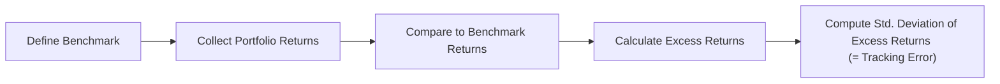
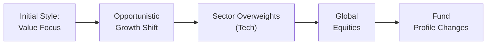

## Introduction: Why Tracking Error and Style Drift Matter

Let’s explore what often feels like a deceptively simple topic: measuring how closely (or not) a portfolio tracks its benchmark, and how an investment strategy can inadvertently or intentionally shift from its initial style. In practice, these insights can make all the difference in ensuring investors get what they signed up for—especially when it comes to alternative investments, where benchmarks can be trickier and strategies can morph over time. You might be thinking: “Wait, do hedge funds or private equity managers even have benchmarks?” The answer: many do (albeit with some creativity), and measuring how well they stick to their stated approach is essential for risk monitoring and manager evaluation. I remember back in the day—well, not to date myself too badly—when I was analyzing a seemingly “market-neutral” hedge fund. Everything looked squeaky clean until we realized the manager had quietly started piling into a volatile emerging market equity bet. That’s style drift. And it matters a lot to investors depending on your objectives.

Below, we’ll break down the mechanics of tracking error and how it’s used as a gauge of active management. Then we’ll look at style drift: the phenomenon that can lead to unintended exposures in your portfolio. Don’t worry if these items feel a bit intangible at first. We’ll use practical examples, a few formulas, and a handy Mermaid diagram or two to make it more concrete. 

## Understanding Tracking Error

### Definition and Key Concepts

At its core, **tracking error** is the standard deviation of the difference in returns between a portfolio and its designated benchmark. Think of it as the volatility of the portfolio’s excess returns. If your portfolio exactly mimics the benchmark every day (something we might call a “benchmark-hugging” strategy), the difference between the portfolio’s returns and the benchmark’s returns is essentially zero—hence, the tracking error would be zero. On the other hand, a high tracking error indicates the portfolio’s returns are zigzagging around quite differently from the benchmark. 

A common formula for tracking error is:


\text{Tracking Error} = \sqrt{ \frac{1}{T-1} \sum_{t=1}^{T} \Big[(r_{p,t}-r_{b,t}) - \overline{(r_{p}-r_{b})}\Big]^2 }


Where:  
• \\(r_{p,t}\\) is the portfolio return at time \\(t\\).  
• \\(r_{b,t}\\) is the benchmark return at time \\(t\\).  
• \\(T\\) is the total number of periods.  
• \\(\overline{(r_{p}-r_{b})}\\) is the average excess return (portfolio minus benchmark) over those \\(T\\) periods.

Anyway, the takeaway? A high tracking error generally signals a deliberate departure from the benchmark weighting, typical of managers employing active strategies. A low tracking error suggests an index-like behavior and minimal deviation. Low or high is neither inherently good nor bad—it just indicates how “daring” or “benchmark-constrained” the manager is.

### Relationship to Active Share

Closely related but conceptually different is **Active Share**, which represents the percentage of portfolio holdings that differ from the benchmark. Active Share focuses on the holdings themselves (e.g., your portfolio invests in some mid-cap names that aren’t in the S&P 500, or uses different position weights), while tracking error focuses on return patterns over time. 

Both measures help us gauge the manager’s level of active management. It’s totally possible for a manager to have a high Active Share but a moderate tracking error if the out-of-benchmark positions aren’t very volatile. Similarly, a manager could have a lower Active Share but a higher tracking error if they overweight certain volatile sectors of the benchmark.

### Example of Tracking Error Calculation

Let’s do a quick simplified numeric example—no need to panic, we’ll keep the math short:

• Over three months, suppose your hedge fund’s returns are (in %) 2.0, -1.0, and 3.5.  
• The benchmark returns over the same three months are 1.0, -0.8, and 3.2.  

We calculate the excess returns each month:  
• \\(2.0 - 1.0 = 1.0\%\\)  
• \\(-1.0 - (-0.8) = -0.2\%\\)  
• \\(3.5 - 3.2 = 0.3\%\\)

The average excess return is \\((1.0 + (-0.2) + 0.3)/3 = 0.37\%\\).

Then we measure the squared deviations of each excess return from 0.37%:  
• \\((1.0 - 0.37)^2 = 0.40^2 = 0.16\\)  
• \\((-0.2 - 0.37)^2 = (-0.57)^2 = 0.32\\)  
• \\((0.3 - 0.37)^2 = (-0.07)^2 = 0.0049\\)

Next, the sample variance is \\(\frac{0.16 + 0.32 + 0.0049}{3-1} = \frac{0.4849}{2} = 0.24245\\).

The tracking error is the square root of that: \\(\sqrt{0.24245} \approx 0.4924\\), or about 0.49% in monthly terms. Over short horizons, these numbers can look small, but annualizing them (multiplying by \\(\sqrt{12}\\) for monthly data) would give a higher figure.

That’s basically how you’d do it, though in real life you’d likely have many more data points and a fancier software tool to handle the calculations.

### Tracking Error in Alternative Investments

You might argue: “But alternative investments—like private equity or real estate—often have illiquid or irregular performance patterns, so how does tracking error even apply?” Well, in many alternative segments, custom benchmarks or peer group benchmarks exist (like a private equity index). Tracking error remains useful for measuring how a fund’s performance deviates from that reference. 

In hedge funds, for instance, you often see a manager pick an index like the HFRI (Hedge Fund Research Index) or a specific sector sub-index. If they claim to run a “global macro” strategy, and the reference is a global macro index, but their returns look suspiciously correlated to S&P 500 with a big variance from the actual global macro index, that probably signals the manager deviates from the stated strategy or invests in different exposures. Hence, tracking error helps you figure out if the manager’s style is consistent with your expectations.

Here’s a quick flowchart to illustrate the tracking error calculation process conceptually:

## Style Drift: When Your Strategy Isn’t What It Used to Be

### Defining Style Drift

**Style drift** occurs when a portfolio manager deviates from the originally stated strategy or style. For example, a manager might start out investing in mid-cap value stocks (aligned with a “value” approach in a certain **Style Box**), but over time, invests heavily in growth stocks or large-cap names. Some deviation is normal—it could be opportunistic or a response to a changing market environment. However, if it becomes significant and persistent, it can undermine the whole point of investing in that manager’s style. 

In alternative investments, style drift can be sneakier. Imagine a long/short equity hedge fund manager claiming a “market-neutral” approach yet drifting into net long positions in volatile emerging market equities. Or a farmland investment manager who said they focus on stable orchard operations but then invests in high-risk expansions in foreign countries. If you, as an investor, wanted a stable, conservative approach, you might be in for a shock when the portfolio’s returns start gyrating. 

### Why Style Drift Happens

Managers can drift for many reasons, both good and bad:

• **Opportunistic Style Drift**: Good deals come along, or the market environment changes. The manager sees potential for higher returns or better diversification and shifts the portfolio slightly.  
• **Strategy Breakdown**: The manager’s original approach isn’t working well (or perhaps has capacity limits). They quietly pivot in an attempt to salvage performance.  
• **Benchmark-Hugging**: Sometimes, ironically, style drift can manifest as shifting closer to a mainstream benchmark to avoid underperformance.  
• **Unintended Accumulation**: Over time, little changes in exposures accumulate, leading to a structural shift away from the stated style.  

### Consequences of Style Drift

One major outcome is **unintended exposures**. You hired a manager to deliver, say, small-cap value returns for diversification. Then you discover they’ve loaded up on large tech stocks. Suddenly, your overall portfolio might become more correlated with your existing large-cap growth holdings, thus losing the diversification you aimed for. 

Another subtle effect is mismatch in risk tolerance. If your strategic asset allocation rests on the assumption that this manager invests with moderate volatility in certain segments, style drift can produce either significantly higher or lower risk than you planned. That can throw a monkey wrench in your overall portfolio construction.

### Monitoring Style Drift with Factor Exposures and Constituent Weights

One practical approach: examine how the portfolio’s **constituent weights** shift relative to the original or stated strategy. Are you seeing allocations to a sector or factor not typical of the style? Has the manager’s region weighting changed drastically? Programmatic factor models (e.g., analyzing exposure to value, momentum, quality, or other factors) can help quantify changes over time. If these changes exceed an acceptable threshold, an alarm bell should ring, prompting a conversation with the manager.

## Bringing Tracking Error and Style Drift Together

### Using Tracking Error as a Style Drift Indicator

When you’re dealing with alternative funds that do have benchmarks, a rising tracking error might signal a shift in exposures. Perhaps the manager is deviating from their original style box. Of course, some managers explicitly choose a broader or inappropriate benchmark, so you’ll want more granular analysis. You might see a scenario where the manager keeps pegging themselves to the “average” hedge fund index. But if they deviate widely from that index’s behavior, you can suspect style drift.  

Sometimes, actively managed alternative strategies are expected to have relatively high tracking error from the get-go, simply because they’re taking big bets. In that case, a stable level of high tracking error might be normal and not necessarily indicate style drift, so context matters.

### Communication and Transparency

Honestly, the best remedy for style drift is up-front communication. **Investment Mandates** normally contain constraints about what’s allowed (and what isn’t), as well as explicit statements about the manager’s objectives. **Compliance Monitoring** ensures the manager is staying within set limits. But market conditions can change drastically, so you as an investor may not mind a style shift if it’s explained and aligned with your broader goals (a manager might say, “We’re overweight technology right now because of the cyclical upswing,” and you might be totally fine with that).

When the manager doesn’t provide clarity or when mandated constraints are repeatedly broken, you risk an unpleasant surprise—like discovering you’re dangerously exposed to a single industry or region.

## Diagrams for Visualizing Style Drift

The following diagram illustrates how style drift can unfold over time. Think of it as a branching path: the manager starts in a certain style box, and each decision pushes them a bit further from that original center.

By the final node, you can see how the cumulative effect might result in a portfolio that only faintly resembles the original mandate.

## Best Practices: Preventing Unwanted Style Drift

### Clear Investment Mandates and Style Boxes

Start by having the manager clearly define their style within a **Style Box** or factor model: is it small-cap growth? Arbitrage? Commodities? If the strategy is broad-based, say so from day one. Then, your monitoring and compliance folks can be sure to watch for major deviations. 

### Regular Factor Exposure Analyses

Running factor models (for equities this might be Fama-French or a custom factor approach) helps detect creeping changes. For instance, if your manager was once strongly tilted to “value” but is now neutral or even leaning “growth,” that’s a clue they’ve drifted.

### Periodic Check-Ins and Documentation

It’s typical for institutional investors to schedule quarterly or semiannual check-ins. That’s a chance to look at the manager’s exposures and see if they line up with what was promised. If there’s a difference, ask about the rationale.

### Using Tracking Error with Peer Groups

While style drift can’t always be measured solely by looking at tracking error relative to a broad market benchmark, you might compare the manager’s performance to a **peer group** or strategy-specific benchmark. If the difference in returns is growing over time, that’s another clue there may be style drift or a change in portfolio composition.

## A Personal Take on Style Drift

If I had a dollar for every time I’ve encountered a manager who started out with a clear investment story—like focusing on mid-cap shipping stocks—only to end up dabbling in biotech, I’d probably fund a private equity deal of my own. Style drift can be opportunistic (sometimes leading to truly impressive returns) or reactive (by trying to chase performance when original ideas lag). Just remember that any drift can hamper your diversification or risk management. And from what I’ve seen, surprises in an investment strategy rarely stay hidden for long. 

## Potential Pitfalls and Strategies to Overcome Them

• **Pitfall**: Ignoring low but rising tracking error. A modest but steadily increasing tracking error can be a red flag that the manager is gradually creeping away from the benchmark.  
  **Solution**: Evaluate changes in factor exposures or sector composition over time. 

• **Pitfall**: Overreliance on the manager’s self-reported style.  
  **Solution**: Conduct your own holdings-based analysis using the portfolio’s position-level data (if available). Be sure to cross-verify with any risk analytics your institution uses.

• **Pitfall**: Not adjusting for market conditions. In abnormal markets, even a consistent manager might produce high tracking error, reflecting overall market turbulence.  
  **Solution**: Compare tracking error in context of volatility regimes, macro events, or shifts in underlying factor returns.

• **Pitfall**: Confusing short-term drift with a permanent shift.  
  **Solution**: Distinguish between a temporary tilt and a runway-level pivot. Review the manager’s commentary and your next quarter’s factor data to confirm any new patterns.

## Exam Tips and Key Takeaways

For the CFA exam, you’ll often see scenario-based questions describing a manager’s portfolio and how it differs from a stated benchmark or style. The question might ask you to identify signals of style drift or to interpret the significance of rising tracking error. Time-weighted returns, money-weighted returns, or risk decomposition might also come into play.

• **Practice Calculation**: Be comfortable with the tracking error formula and the conceptual difference between net returns and gross returns.  
• **Interpretation**: Understand that a higher tracking error is not inherently bad—it can be part of a manager’s alpha pursuit.  
• **Style Drift**: Recognize the difference between “tactical tilts” and wholesale style changes.  
• **Communication is Key**: If a question scenario highlights manager communications (or the lack thereof), it may be nudging you to discuss due diligence or risk oversight.  
• **Ethical Dimension**: Remember the CFA Institute Code of Ethics and Standards. Style drift without adequate disclosure could be a breach of “fair dealing” or “misrepresentation” if it leads clients to believe the manager is following a stated style when they aren’t.

## References and Further Reading

• CFA Institute’s “Standards of Practice Handbook” – an essential guide to ethical and professional conduct.  
• Grinold, Richard C., and Ronald N. Kahn. “Active Portfolio Management: A Quantitative Approach for Producing Superior Returns and Controlling Risk.” (Focus on chapters related to tracking error)  
• Jacobs, Bruce I., and Kenneth N. Levy. “Equity Management: The Art and Science of Modern Quantitative Investing.” (Dives into style drift, factor-based analysis, and portfolio construction)  

If you’re curious, you might also check out case studies from institutional investors or real-world white papers examining how style drift affects performance. Good luck as you integrate these concepts into your broader understanding of alternative investments!

---

## Test Your Knowledge: Tracking Error and Style Drift Essentials



### Tracking error is best defined as:
- [ ] The absolute difference between a portfolio’s total assets and the benchmark's total assets.
- [x] The standard deviation of the excess returns between a portfolio and its benchmark.
- [ ] The difference in average annual returns between a portfolio and its peer group.
- [ ] The correlation coefficient between portfolio returns and benchmark returns.

> **Explanation:** Tracking error measures how far a portfolio’s returns deviate from its benchmark, focusing on the volatility (standard deviation) of the excess returns.

### Which measure highlights the portion of portfolio holdings that differ significantly from the benchmark?
- [ ] Tracking Error
- [ ] Benchmark-Hugging Score
- [x] Active Share
- [ ] Sharpe Ratio

> **Explanation:** Active Share expressly measures the difference in holdings relative to the benchmark, while tracking error looks at return patterns.

### A portfolio that closely mirrors its benchmark on a continual basis would likely exhibit:
- [x] Low tracking error
- [ ] High tracking error
- [ ] Negative style drift
- [ ] High factor exposure

> **Explanation:** Low tracking error indicates the portfolio is not deviating much from the benchmark’s returns.

### Which of the following best describes a scenario of style drift?
- [ ] A manager invests in additional securities within the original mandate.
- [ ] A manager regularly rebalances within small tolerances around the same style box.
- [ ] A manager discloses a new sector strategy after investor approval.
- [x] A manager who originally focused on small-cap value stocks shifts into large-cap growth stocks.

> **Explanation:** Style drift refers to deviating from the originally stated style or mandate, reflected here by moving from small-cap value to large-cap growth.

### In alternative investments, a rise in tracking error could signal:
- [x] Deviations from the stated strategy or benchmark
- [ ] Higher correlation with the benchmark
- [x] Potential style drift away from the declared approach
- [ ] Lower factor exposures

> **Explanation:** When tracking error rises, it often indicates a growing difference between portfolio returns and the reference index. This can point to style drift or shifts in strategy.

### Opportunistic style drift can be viewed as:
- [x] Potentially beneficial if it exploits market mispricing
- [ ] Always unethical and against the CFA Institute Code
- [ ] Automatically indicative of poor governance
- [ ] Useless in periods of low volatility

> **Explanation:** Style drift can sometimes be beneficial for performance if driven by genuine market opportunities, although it needs proper disclosure.

### A manager who substantially aligns with the benchmark weights but takes strategic overweight or underweight positions each month is most likely:
- [ ] Exercising no active strategy
- [ ] Completely diverging from the benchmark
- [x] Engaging in a moderate active approach with some tracking error
- [ ] Violating compliance regulations

> **Explanation:** A manager who makes overweight or underweight decisions relative to the benchmark is attempting to add alpha, creating some tracking error.

### When analyzing style drift risk, examining factor exposures can help:
- [x] Detect shifts in a manager’s investment tilt over time
- [ ] Erase tracking error
- [ ] Confirm that portfolio assets are at zero risk
- [ ] Guarantee outperforming the benchmark

> **Explanation:** Tracking factor exposures over time reveals how the manager’s style might be changing, potentially reducing or increasing certain risks.

### According to the CFA Institute’s Code, a manager dramatically altering strategy without informing clients is likely violating:
- [x] Duties to Clients (fair dealing, loyalty, prudence, care)
- [ ] Duties to Employers (compliance with the employer’s code)
- [ ] The mosaic theory
- [ ] Specific regulations from the Commodities Futures Trading Commission

> **Explanation:** Significant strategy shifts without proper disclosure can breach the manager’s duty of loyalty, prudence, fairness, or care to clients.

### Style drift refers to the practice of maintaining a consistent investment style regardless of market conditions.
- [ ] True
- [x] False

> **Explanation:** Style drift is the opposite: it implies a deviation away from the originally stated or expected style.


