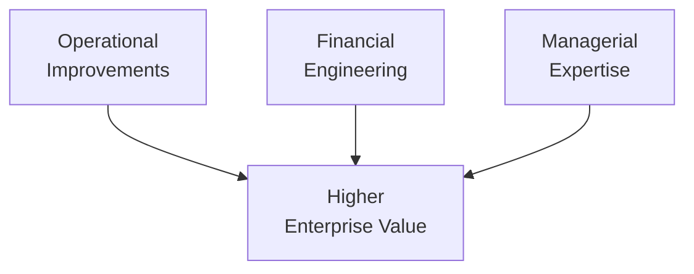

## Introduction
Private equity (PE) is a distinctive segment of the investment universe, offering opportunities to invest in both early-stage ventures and mature businesses through private ownership structures rather than public markets. If you’ve ever had a friend who excitedly told you, “I just got funding from a venture capitalist for my new health-tech startup,” that’s a classic PE story at its earliest stage. On the other hand, you’ve probably also heard of large buyout firms swooping in to acquire struggling or undervalued companies. It might sound dramatic—and trust me, it is—but these transactions aim to achieve outsized returns by improving operations, capital structures, and management practices before selling or taking companies back to public markets.

In the big picture, PE strategies commonly fall into three main categories: venture capital (VC), buyouts, and distressed investing. These can be viewed along a continuum from the earliest phases of a company’s life cycle to its restructuring, potential bankruptcy, or significant operational overhaul. This article dives into all three, explaining how they differ, how they fit in the broader alternative investments space, and how they might show up on a CFA exam or in real-world portfolio decisions.

## Private Equity Essentials
Private equity funds usually operate as limited partnerships, where the general partner (GP) manages the fund and the limited partners (LPs) provide capital commitments. Over time, the GP identifies, conducts due diligence on, and invests in private (or public-to-private) companies, focusing on value creation strategies. Key aspects include:

• Capital Calls and Distributions: Investors commit capital up front, but it is usually drawn down (called) progressively when deals arise. Eventually, gains are returned via distributions (e.g., after an exit such as an IPO or sale to a strategic buyer).  
• Fee Structures: Typically, the manager receives a management fee (often around 2% per year) plus carried interest (often 20% of profits above a hurdle rate).  
• Long-Term Focus: Unlike public market funds, private equity horizons might stretch five to ten years.  

Here’s a simplistic diagram of how these relationships fit together:

The idea is that LPs provide capital to the fund. The fund invests in portfolio companies, strives to create value, and eventually returns profits to the LPs.

## Venture Capital
Venture capital (VC) is like the bright-eyed, hyper-enthusiastic teenager of the private equity world. It focuses on funding early-stage or high-growth startups, often in technology, biotech, consumer internet, or other innovative sectors. VC firms take a substantial equity stake in these companies, provide strategic guidance, sometimes place a partner or designated professional on the board, and leverage their network for business development. The big hope? One of these startups becomes the next big unicorn.

### Key Venture Capital Characteristics
• Stage Focus: Seeds, Series A, Series B, and beyond—each stage corresponds to a different risk-return profile. Early stages are riskier but offer higher potential returns if the company really takes off.  
• Valuation Challenges: Startups often have no cash flow history. Valuations rely on future projections and intangible factors like management capability and product-market fit.  
• Exit Strategies: Common exit paths include initial public offerings (IPOs), trade sales (e.g., acquisition by a larger competitor), or secondary sales to later-stage investors.  

As you might guess, VC is high-risk with a significant failure rate. If you invest in 10 startups, you could see 6 or 7 fail outright, 2 or 3 yield modest returns, and 1 that becomes a superstar, returning 10x or even 50x. That single home run can deliver the bulk of a fund’s returns.

### Example
Imagine a health-tech fund invests $1 million in a startup targeting telemedicine solutions. In two years, the company grows revenue from zero to $2 million, then scores a partnership with a major hospital network. The venture fund invests additional follow-on capital. Three years later, the startup is acquired by a major pharmaceutical company for $50 million. The fund’s stake is sold for $10 million, yielding a 10x return on that investment. That’s the dream scenario that keeps VCs hunting for the next unicorn.

## Buyouts
Buyouts represent the more mature side of the fund spectrum. Here, a private equity fund acquires a controlling interest in a relatively established, possibly publicly listed company, often using a significant amount of debt financing—hence the term leveraged buyout (LBO).

### Core Elements of Buyouts
• Capital Structure: Leverage is a key lever. PE managers structure deals to optimize the ratio of debt to equity, aiming to increase returns on the equity portion if the company’s cash flows remain stable or grow.  
• Value Creation: Buyout specialists love to talk about operational improvements—cost-cutting, management team restructuring, new product lines, or expansions into new geographies.  
• Alignment of Interest: Managers often co-invest, ensuring that they share both risks and rewards.  
• Typical Holding Period: Ranges from 3 to 7 years. The sponsor aims to exit after turning the company around or enhancing its profitability.  

### Example LBO Structure
To illustrate, suppose a fund wants to buy a $100 million revenue manufacturing firm valued at $200 million. The fund might contribute $50 million in equity and raise $150 million in debt, using the target’s assets and expected cash flows as collateral. Over several years, the fund’s professionals work alongside company management to streamline operations, restructure poorly performing divisions, and expand into new markets. If the firm can boost overall EBITDA, repay debt, and ideally grow top-line revenue, the eventual exit could yield a substantial multiple on the original equity investment.

Consider a simplified internal rate of return (IRR) scenario. If the fund contributes $50 million in equity and, four years later, sells the company for $300 million total enterprise value (after paying off the remaining debt and distributions), the equity piece might be worth $120 million (this is a hypothetical). You can apply a standard IRR formula:


\text{IRR} \approx \sqrt[4]{\frac{120\text{M}}{50\text{M}}} - 1 = \sqrt[4]{2.4} - 1


This would yield an IRR somewhere around 24% per year (rough approximation)—quite attractive relative to many traditional asset classes.

## Distressed Investing
Distressed strategies involve investing in companies experiencing serious trouble—financial, operational, or both. Distressed investors might buy debt (traded at a fraction of par value) or equity in a bankrupt or near-bankrupt firm, hoping that once the company recovers, these securities will soar in value.

### Core Distressed Approaches
• Restructuring: The investor may negotiate a debt-for-equity swap, reorganize management, and provide fresh capital to stabilize operations.  
• Legal and Regulatory Nuances: Bankruptcy laws, creditor rights, and priority of claims vary by jurisdiction. Distressed specialists must be well-versed in the legal environment to ensure they get the best recovery.  
• Turnaround Expertise: Some funds specialize in operational turnarounds, bringing in professional managers or forging alliances to salvage the firm’s brand name or valuable assets.  

### Example
Picture a mid-sized retail chain that’s hemorrhaging money. A distressed fund might purchase its bonds for 25 cents on the dollar. If the company emerges from Chapter 11 bankruptcy with restructured operations and the bondholders receive new equity, the investment value might climb to 60 or 70 cents on the dollar—or more if the company thrives post-bankruptcy.

## Value Creation in Private Equity
No matter the strategy—VC, buyouts, or distressed—the fundamental driver is value creation. That generally comes from three prongs:

1. Operational Improvements: Enhancing efficiency, cutting costs, improving manufacturing or distribution, and boosting sales channels.  
2. Financial Engineering: Optimizing the capital structure with leverage to amplify returns.  
3. Managerial and Strategic Expertise: Introducing strong leadership, pivoting business models, or injecting new technology and processes.  

### Quick Mermaid Diagram on Value Creation

## Risk Factors and Considerations
PE investments can seem glamorous, but they’re also fraught with pitfalls:

• Illiquidity: Investing in private companies is not like buying shares of Apple that you could sell with a few mouse clicks. Capital is locked up for years.  
• Significant Failure Rates (VC): Early-stage ventures often fail outright, leaving investors with little or no return.  
• Operational Risk: If a buyout goes sour, the leveraged debt can crush equity returns.  
• Legal and Regulatory Risk: PE transactions may be subject to antitrust reviews, regulatory approvals, and complex cross-border legal frameworks.  
• Reputation and Ethics: Private equity can draw scrutiny for layoffs or cost reductions post-acquisition. Maintaining ethical and ESG-compliant practices is vital for investor relations and public image.  

## Global Considerations
Private equity is now a truly global phenomenon. Funds in North America, Europe, Asia, and emerging markets each face a unique mix of cultural, regulatory, tax, and political challenges. Currency fluctuations can add complexity too. For instance, a US-based fund investing in a Brazilian e-commerce startup might face currency risk if the Brazilian real depreciates relative to the US dollar.

Global expansions also present opportunities. Some buyout teams use their operational expertise to modernize manufacturing plants in developing economies, or distribute tech solutions across new frontiers. Distressed investors might find bargains where local banks can’t or won’t extend rescue financing.

## Integration with Portfolio Construction
From a portfolio perspective, PE often serves as a diversifier, albeit with higher risk and illiquidity. Institutional portfolios might allocate 5–15% to private equity or more, depending on their size, time horizon, and risk appetite. Through a strategic asset allocation lens, private equity may offer higher expected returns over the long run, though it’s also accompanied by more volatility and less transparency.

Candidates preparing for advanced CFA exams (especially Level III) often see questions on how to incorporate these asset classes into a broader portfolio, measure performance (e.g., IRR vs. time-weighted returns), and address the J-curve effect (where early negative returns occur due to fees and slow initial capital deployment).

## Best Practices and Common Pitfalls
• Due Diligence: Whether it’s a start-up in the seed round or a mature buyout target, thorough diligence of management, market competition, and financials is crucial.  
• Patience: PE deals take time. Exits might not occur until macroeconomic conditions are ripe.  
• Alignment of Interests: Ensuring the GP’s interests are aligned with those of the LPs (via carried interest, manager co-investment, and good governance) reduces conflicts.  
• ESG Integration: Environmental, social, and governance factors are increasingly scrutinized by institutional LPs. A robust ESG framework can boost reputational value and mitigate risks.  

## Real-World Example – A Quick Anecdote
I remember chatting with a friend who joined a rapidly growing software startup in Silicon Valley. The company had raised multiple rounds of VC funding—each time at a higher valuation—until eventually an established tech giant bought them out. The VCs realized a significant uplift, effectively “passing the baton” for the next stage of growth. My friend was pretty happy with her stock options, but the real winners were the early VCs who took that leap of faith on a small but promising idea.

## Conclusion
Private equity can bring excitement, complexity, and potentially substantial rewards to a portfolio. Venture capital is the adrenaline-fueled path of early-stage innovation, buyouts are about strategic transformation (often supercharged with debt), and distressed investing offers a chance to resurrect troubled companies. Each approach demands specialized expertise and careful risk management, but, handled properly, can produce outsize returns compared to traditional investments.

## Final Exam Tips
• Be prepared to differentiate between venture capital, buyouts, and distressed strategies, including their unique risk-return profiles.  
• Practice calculating IRR and multiples of invested capital for hypothetical PE scenarios.  
• Understand how to evaluate a fund’s performance over time (e.g., the J-curve effect, time-weighted vs. money-weighted returns, and the nuances of carried interest).  
• Don’t overlook the role of economic cycles—buyout and distressed opportunities often accelerate when credit is tight or the broader market is in decline.  
• For constructed-response questions, detail both operational and financial engineering aspects of value creation. If discussing a distressed deal, reference legal protections, restructuring strategies, and leverage the capital structure hierarchy.  

## References
- CFA Institute (official curriculum materials on private equity)  
- Kaplan, S. N., & Strömberg, P. (2009). “Leveraged Buyouts and Private Equity.” Journal of Economic Perspectives.  
- Lerner, J., Hardymon, G., & Leamon, A. (Harvard Business School). “Venture Capital & Private Equity: A Casebook.”  
- EVCA (European Private Equity & Venture Capital Association) Guidelines  

## Practice Questions: Private Equity Mastery



### Which characteristic best defines venture capital investing?
- [ ] Investing exclusively in large, established companies with stable cash flow
- [x] Providing early-stage or high-growth funding in exchange for equity
- [ ] Leveraging distressed debt to assume control of a troubled company
- [ ] Extending senior-secured loans to a mature mid-cap firm

> **Explanation:** Venture capital focuses on startups and high-growth businesses, sometimes before they generate meaningful revenue.

---

### In a leveraged buyout, which of the following is the primary driver of equity returns?
- [ ] An increase in the interest expense
- [ ] A decrease in capital expenditures
- [x] The use of debt to amplify returns on the equity portion
- [ ] Expansion of the workforce at the acquired company

> **Explanation:** By using leverage, a smaller equity investment can yield higher returns if company performance stays strong or improves.

---

### A private equity firm purchases bonds at 25 cents on the dollar from a company nearing bankruptcy. Which type of PE strategy does this scenario exemplify?
- [ ] Venture capital
- [ ] Growth equity
- [x] Distressed investing
- [ ] Mezzanine financing

> **Explanation:** Purchasing discounted debt or equity in a troubled or bankrupt firm for potential turnaround gains is a hallmark of distressed investing.

---

### Which of the following best describes the J-curve effect in private equity performance?
- [ ] A period of declining IRRs during the later years of the fund
- [x] An initial dip into negative returns due to fees and slow investment deployment before subsequent gains
- [ ] The management fee rising steadily over the life of the fund
- [ ] A uniform pattern of returns throughout the fund’s life

> **Explanation:** PE funds often show negative returns in early years before capital is fully invested, with returns increasing after exits materialize.

---

### Which is generally TRUE regarding venture capital exits?
- [x] IPO or sale to a larger firm are typical exit strategies
- [ ] VC holdings can be liquidated on a public exchange easily
- [ ] Most VC funds rely on dividends to produce returns
- [ ] The holding period is generally less than one year for each investment

> **Explanation:** Venture capital exits are often achieved through public listings (IPOs) or acquisitions by a larger entity after the startup has matured.

---

### In a private equity fund, carried interest is typically:
- [x] A share of the profits above a defined hurdle rate
- [ ] A fixed percentage of assets under management
- [ ] The interest rate on the fund’s debt obligations
- [ ] A penalty fee for early redemption

> **Explanation:** “Carry” is performance-based compensation for the general partner, usually 20% of profits after meeting a preferred return or hurdle.

---

### During a buyout, which of the following operational improvements might a PE firm implement to drive value?
- [x] Streamlining the product portfolio and cutting unprofitable lines
- [ ] Refusing to engage in due diligence
- [ ] Increasing overhead costs without reason
- [ ] Liquidating a profitable subsidiary arbitrarily

> **Explanation:** PE firms usually aim for efficiency and profitability, often by trimming non-core activities, investing in growth segments, and optimizing internal processes.

---

### Which statement is most accurate regarding risk factors in private equity?
- [ ] Liquidity risk is minimal because shares can be sold easily
- [ ] Macroeconomic shocks rarely affect buyout strategies
- [x] Illiquidity and potential for total loss are significant concerns in PE
- [ ] Distressed investing is less risky than other forms of private equity

> **Explanation:** PE entails higher risk, chiefly illiquidity and the possibility of losing the entire investment, especially in early-stage or distressed situations.

---

### A cross-border buyout deal might involve additional complexities such as:
- [ ] Guaranteed lower interest rates on loans
- [ ] Elimination of currency risk
- [x] Fluctuations in foreign exchange rates and diverse legal frameworks
- [ ] Automatic government subsidies for international transactions

> **Explanation:** Currency volatility, varying regulations, and cultural differences can complicate cross-border PE transactions.

---

### True or False: A distressed fund’s primary strategy is typically to provide venture capital to seed-stage companies.
- [ ] True
- [x] False

> **Explanation:** Distressed funds focus on troubled or underperforming companies, often targeting debt or equity in restructuring scenarios, not seed-stage startups.


