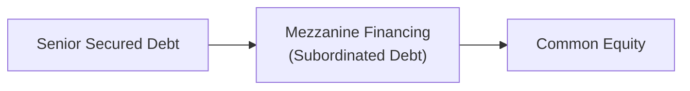

## Introduction

Mezzanine financing and convertible instruments can feel, well, a little intimidating at first. There’s all this talk about subordinated debt, warrants, conversion prices, and who gets paid first when times get tough. Perhaps you’ve even heard a colleague mention they’ve secured a “mezz slice” to finance a buyout but you weren’t entirely sure what that meant. 

In this section, we’ll break down the mechanics, negotiation points, and practical applications of mezzanine financing and convertible instruments. No advanced finance dictionary needed—though we will define a few terms along the way. So let’s jump in.

## Overview of Mezzanine Financing

Mezzanine financing often sits in the “middle” of a company’s capital structure, right between senior debt (like a bank loan) and equity (the usual shares of stock). This makes it subordinate to senior lenders but senior to common shareholders. If the borrower can’t pay its bills or worse, if it enters bankruptcy, mezzanine financiers line up for repayment after senior lenders but before equity holders. 

Now, why on earth would anyone want to be in this middle spot? The main reason is that mezzanine financing typically pays higher yields than senior debt. In many cases, it also includes additional sweeteners such as warrants or conversion features that allow the lender to participate in the upside of the business—if things go well.

### Ranking in the Capital Structure

Visually, many folks like to depict the ranking something like this:



In a typical capital stack:
• Senior debt has first claim on assets.  
• Mezzanine or subordinated debt stands behind senior debt in a default scenario but ahead of equity.  
• Equity holders come last.

Mezzanine can be structured in a variety of ways—sometimes it’s pure subordinated debt with a high coupon, sometimes it’s a debt–plus–warrant structure. Whichever the form, the idea remains the same: it gives the sponsor or the management team access to more leverage than senior banks might be willing to provide alone, without giving up as much equity as a purely new equity investor might demand.

### When and Why It’s Used

Mezzanine financing is especially popular in leveraged buyouts, growth capital situations, or recapitalizations. Imagine you’re looking to acquire a target company. The bank can only lend so much—maybe up to a certain multiple of EBITDA. You’d like to avoid ponying up a huge chunk of equity to fill the gap, so you decide to layer in some mezzanine debt, which typically demands an annual coupon of, say, 8–14%, plus some warrants for equity upside. It’s more expensive than senior debt, but cheaper than giving away big swaths of ownership. 

A personal story: once I worked with a small manufacturing firm that used mezzanine financing for an acquisition. At first, everyone panicked—“Why not just get more bank debt?” they asked. But the bank had already reached its lending limit. The team wanted to maintain majority equity control, so they turned to mezz. In the end, the business grew, the exit multiple was nicely higher, and those mezz lenders also made a tidy sum thanks to the warrants—everyone (mostly) went home happy.

### Key Features and Terms

• Coupon (Cash or PIK): Mezzanine lenders can earn interest in cash or via “payment-in-kind” (PIK), where interest is accrued and added to the loan balance. PIK can be especially appealing if the borrower wants to reinvest cash to fuel growth.  
• Warrants: These attach to the mezzanine loan, often allowing lenders to buy shares at a predetermined price. If the equity value appreciates, these warrants can become quite valuable.  
• Covenants: While mezzanine loans typically have fewer covenants than senior credit agreements, they often still include restrictions on additional debt, certain operational changes, or major transactions to protect the mezzanine lender’s position.  
• Inter-Creditor Agreements: These define who gets repaid first if there’s a default, specifying that senior lenders get repaid ahead of mezzanine providers.  

## Credit Analysis and Due Diligence

Because mezzanine sits behind senior debt, lenders undertake fairly extensive due diligence. They focus on the borrower’s leverage capacity, strategic plan, and projected cash flows. Typically, mezzanine lenders want to see that even under conservative scenarios, the company will be able to service interest payments on both senior and mezzanine layers (plus have room for capital expenditures and operational expenses).

A big question in mezzanine deals is the “debt cushion” one enjoys behind the senior secured loans. For instance, if the company’s total enterprise value is $100 million and the senior lenders have $60 million of debt, there’s $40 million of implied cushion for the mezzanine lenders. But if the industry is cyclical or the company’s valuations are volatile, that cushion could shrink very quickly in a downturn. 

## Convertible Instruments

Convertible bonds or notes are another popular hybrid in corporate finance. Picture it as a debt instrument that carries a coupon, but also gives the holder the right to convert into a certain number of shares at a predetermined price. They’re not exactly the same as mezzanine financing, but they often appear in similar contexts—especially when the issuer is in growth mode or the investor wants equity upside with partial downside protection.

### Structure and Rationale

Let’s say a convertible bond might have a five-year maturity and a 4% coupon. The bond’s indenture states that the holder can convert each $1,000 face value bond into a certain number of shares if the share price exceeds the conversion price. Investors love this because:

• If the share price goes up significantly, they can convert and participate in equity upside.  
• If the share price remains low, they still earn the coupon and get their principal back at maturity (assuming no default).  

From the issuer’s perspective, a convertible bond offers a lower interest rate compared to a non-convertible bond because of the equity option’s embedded value. But the issuer is effectively giving away potential equity if the stock does well.

### Conversion Mechanics

A typical example: Suppose a firm issues a $1,000 par convertible bond paying a 4% coupon annually, with a conversion price of $50 per share. Each bond can be converted into 20 shares ($1,000 / $50), ignoring any fractional share issues. If the market price per share rises to $60, the bondholder might convert and effectively get $1,200 worth of stock per $1,000 face value bond. 

To illustrate in Python-style pseudocode:

```python
par_value = 1000
coupon_rate = 0.04
conversion_price = 50

annual_coupon_payment = par_value * coupon_rate

conversion_ratio = par_value / conversion_price

print("Annual coupon payment:", annual_coupon_payment)
print("Shares if converted:", conversion_ratio)
```

This snippet just highlights the math behind the coupon payment and conversion ratio—it’s straightforward, but also quite powerful in practice. 

## Negotiating Points and Agreement Terms

Both mezzanine financing and convertibles are usually heavily negotiated, especially in private deals. Some topics that often appear at the negotiating table:

• Conversion Price or Ratio: For convertibles, a higher conversion price always benefits the issuer, while a lower price benefits the investor.  
• Coupon Rate and Maturity: The interest rate (as well as whether it’s paid in cash or PIK) and the bond’s maturity date significantly influence total cost.  
• Call and Put Provisions: Issuers sometimes have the right to “call” (redeem) the debt early, often at a premium, if the stock price hits certain thresholds. Conversely, investors might want a “put” option that lets them force redemption if performance lags or if certain triggers occur.  
• Equity Kicker or Warrant Coverage: In mezzanine deals, the amount of attached warrants (and the strike price of those warrants) is a key piece of the puzzle.  
• Inter-Creditor Agreement: Spell out in plain detail how the senior loans and mezzanine or convertible tranches will coexist. If the borrower faces distress or breaches covenants, who gets to accelerate payments first? Who can foreclose on collateral?

## Real-World Example: Mezzanine Financing in a Growth Recapitalization

Imagine GrowthWorks, a software firm earning $20 million in annual EBITDA. The founder-owners want to expand into new markets, but they don’t want to dilute their equity ownership too much. The bank is willing to provide only $40 million in senior debt, leaving a $10 million funding shortfall.

Enter a mezzanine lender that offers a $10 million subordinated note at a 10% annual coupon, plus warrants for 5% of the fully diluted equity. GrowthWorks is comfortable paying that high coupon because they expect their software expansion to yield robust cash flows in a couple of years. And the owners would rather give up 5% of the equity upside than 20% if they had invited an outside equity investor. 

If GrowthWorks thrives and eventually sells for a high multiple, the mezz lender’s warrants could become quite valuable, rewarding the lender for taking on a riskier slice of the capital stack. Meanwhile, the founders avoided heavier equity dilution. That’s mezzanine in action.

## Distressed Situations and Subordination

In good times, mezzanine investors earn higher returns than senior lenders. But in tough times, they’re the ones who face serious risk. Because mezzanine is subordinate, it’s not unusual for mezz investors to recover little or nothing if the borrower collapses and the assets are liquidated. Inter-creditor agreements specify that senior lenders usually get first dibs on the assets or claims in a restructuring. 

However, sometimes mezzanine or convertible investors can negotiate “standstill periods” that force the senior lenders to wait or coordinate with them for enforcement actions. They might also bargain for covenants that limit how much additional senior debt can be layered on top of them.

## Behavioral Considerations

In the world of private capital, sponsors, founders, and mezzanine lenders all bring different motivations and biases to the table. Some might undervalue the potential upside (fearing an overly optimistic valuation). Others might be too optimistic about growth and take on more leverage than they can handle. 

It’s also common for lenders to anchor on historical performance, sometimes leading to overconfidence. On the flip side, sponsors may fear losing control or might discount the cost of mezzanine, focusing on not giving up equity. Balancing these perspectives is crucial—both sides want a deal that’s sustainable.

## Advantages and Disadvantages

### Advantages

• Less Dilution: Mezzanine allows issuers to raise extra capital without giving away a large chunk of equity.  
• Higher Return Potential for Lenders: Mezzanine and convertible investors can earn substantial yields and equity-like upside.  
• Flexible Structuring: The parties can customize coupons, maturities, call options, etc.  
• Useful in Leveraged Transactions: Fills funding gaps where senior lenders won’t go.  

### Disadvantages

• Cost: It’s more expensive than senior debt.  
• Substantive Due Diligence: Mezz lenders require significant information and influence.  
• Covenants and Complexity: These deals tend to have relatively intricate covenants, making legal documentation more involved.  
• Potential for Ownership Dilution: If warrants or conversion features are triggered, the original owners get diluted.

## Sample Table: Comparing Mezzanine vs. Senior Debt vs. Equity

|                      | Senior Debt          | Mezzanine Financing                | Equity                       |
|----------------------|----------------------|------------------------------------|-------------------------------|
| Risk Level           | Low                 | Intermediate, subordinated         | Highest                      |
| Expected Return      | Lowest              | Medium to high (8–14%+ plus upside)| Potentially highest (unlimited upside, but risk) |
| Payment Priority     | 1st in liquidation  | After senior debt                  | Last in liquidation          |
| Dilution to Owners   | None                | Moderate if warrants are exercised | Immediate dilution           |
| Typical Covenants    | Strict              | Less strict than senior            | N/A (but governance rights)  |

## Tax Considerations and Jurisdictions

Tax treatments vary widely by country. Generally, interest payments on mezzanine or convertible debt can be tax deductible for the issuer, whereas issuing equity is not. That said, some jurisdictions impose limitations on how much debt is deductible (thin-capitalization rules). Cross-border deals add layers of complexity—like withholding taxes on interest or structural subordination in certain regions.

## Potential Pitfalls

• Overleverage: Stacking senior debt and mezzanine can strain a company’s finances, especially if cash flows slow.  
• Misalignment of Interests: Borrowers might resent the equity dilution from warrants; lenders might worry that management will take bigger risks with the business.  
• Complex Inter-Creditor Disputes: If a distressed scenario arises, cooperating with senior lenders can get messy and lead to legal battles.  
• Market Timing: If convertible bond holders convert their debt at times that are unfavorable for the issuer, or if they don’t convert when the issuer would prefer them to, tensions arise.  

## Best Practices for Structuring Deals

• Maintain Realistic Cash Flow Projections: Over-optimistic projections can lead to trouble, so incorporate multiple scenario analyses.  
• Align Incentives: Balance the coupon, equity kickers, or conversion features so that both parties share growth potential while mitigating risk.  
• Consider Strategic Objectives: For example, if you plan to exit in a few years via an IPO or sale, be sure your mezzanine or convertible structure is crafted to facilitate that exit.  
• Document Covenants Clearly: Avoid ambiguity in inter-creditor agreements—this clarity is crucial when problems arise.  

## Regulatory and Ethical Considerations

Mezzanine financiers and convertible bond investors typically must comply with local securities regulations, especially if the instruments are structured in ways that trigger prospectus or disclosure requirements. From an ethical standpoint, the CFA Institute Code of Ethics and Standards of Professional Conduct emphasize full disclosure to clients and fairness of dealing. If you’re ever structuring a mezzanine deal, be transparent about the potential risks and returns—particularly for retail or smaller investors who might not fully grasp the complexities.

## Exam Application

In a CFA exam setting, you might see a scenario describing a buyout transaction where the candidate is asked to evaluate the optimal financing structure. They might provide a capital structure with certain ratios of senior debt, mezzanine debt, and equity, and you’d need to weigh the cost of capital, potential dilution, and risk implications. Alternatively, you could be given a convertible bond scenario and asked to calculate the conversion value, break-even stock price, or discuss how changes in volatility affect the bond’s attractiveness.

When you write your answers, be sure to:
• Clearly show the step-by-step calculations for interest coverage or conversion.  
• Relate your recommendations to the target’s strategic growth plan.  
• Comment on the risk–return tradeoffs for each slice of capital.

## Conclusion

Mezzanine financing and convertible instruments bring exciting possibilities to the private capital arena—giving companies access to flexible funding, and offering investors a hybrid risk–reward profile. While these structures can be more complicated than straightforward equity or senior debt, they play a vital role in filling capital gaps. The key is doing your homework, conducting thorough due diligence, and clearly aligning incentives. 

No matter how you slice it, navigating mezzanine and convertibles is equal parts art and science. My advice? If you find yourself structuring a deal, keep the communication lines wide open, be transparent about expectations, and remember that these deals are all about balancing risk and return in a fair, sustainable manner.

---

## References & Further Reading

• “Mezzanine Financing Explained,” Harvard Business Review  
• Golub Capital and Crescent Capital Group (mezzanine lender resources)  
• Fitch Ratings and Moody’s methodologies on subordinated debt  
• CFA Institute Code of Ethics and Standards of Professional Conduct  

---

## Test Your Knowledge: Mezzanine Financing and Convertible Instruments



### Which statement best describes mezzanine financing?  
- [ ] It ranks above senior debt but below equity and typically lacks any equity upside.  
- [x] It is subordinate to senior debt and often includes an equity kicker or warrant.  
- [ ] It is the same as common equity and carries no fixed interest obligation.  
- [ ] It requires no due diligence and carries no covenants.  

> **Explanation:** Mezzanine financing is a subordinated layer of debt sitting below senior obligations and frequently contains warrants or other equity-linked options.

### A primary advantage of using mezzanine debt in a leveraged buyout is:  
- [x] It can enhance total leverage without significantly diluting existing equity holders.  
- [ ] It provides the lowest interest rate of all debt instruments.  
- [ ] It eliminates the need for senior lending.  
- [ ] It provides total immunity from default risk.  

> **Explanation:** Mezzanine debt typically carries higher interest than senior debt but resorts less to equity issuance, thus preserving equity ownership.

### In a convertible bond, the conversion price refers to:  
- [ ] The market price of the underlying equity at maturity.  
- [ ] The coupon rate set by the bond issuer.  
- [ ] The price at which the bond may be redeemed prior to maturity.  
- [x] The predetermined price per share at which the debt can be converted into equity.  

> **Explanation:** The conversion price is the fixed share price used to determine the amount of equity a convertible bondholder receives upon conversion.

### Suppose a company issues a convertible bond with a face value of $1,000 and a conversion price of $50 per share. How many shares can the investor receive if they choose to convert?  
- [x] 20 shares  
- [ ] 5 shares  
- [ ] 25 shares  
- [ ] 50 shares  

> **Explanation:** Conversion ratio = $1,000 / $50 = 20 shares.

### Which of the following is NOT typically a feature of mezzanine financing?  
- [x] Guaranteed repayment with treasury backing  
- [ ] Subordination to senior debt  
- [ ] Potential for warrants or equity kickers  
- [ ] Higher coupon relative to senior loans  

> **Explanation:** Mezzanine financing does not guarantee repayment. It is a subordinated instrument and carries higher risk than senior debt.

### An advantage of a convertible bond from the issuer’s perspective is:  
- [ ] It carries the highest possible coupon to attract investors.  
- [x] The coupon rate is generally lower than a comparable bond without conversion features.  
- [ ] It cannot be converted into equity under any circumstance.  
- [ ] It forces early maturity if the share price declines.  

> **Explanation:** Because investors value the embedded equity conversion option, issuers can typically pay lower interest on convertible bonds.

### In a distressed scenario, mezzanine lenders typically:  
- [ ] Have the same recovery priority as senior secured loans.  
- [ ] Rank above all secured creditors.  
- [x] Recover after senior creditors but before equity holders.  
- [ ] Assume operational control of the company.  

> **Explanation:** Mezzanine debt is subordinate to senior debt but senior to equity in the capital structure.

### Which covenant is most likely included in a mezzanine financing deal?  
- [x] Restrictions on issuing additional debt that ranks senior or pari passu.  
- [ ] Unrestricted dividend payments to equity holders at all times.  
- [ ] Automatic conversion to preferred equity.  
- [ ] A strict prohibition on vendor payments.  

> **Explanation:** Mezzanine lenders typically seek to restrict the borrower from issuing further senior or equal-ranking debt that could dilute their position.

### A main difference between mezzanine debt and common equity is that:  
- [x] Mezzanine debt includes fixed interest obligations, whereas equity only offers returns once debt is serviced.  
- [ ] Equity must be repaid at maturity, while mezzanine debt is perpetual.  
- [ ] Mezzanine debt holders always have voting rights, but equity holders do not.  
- [ ] There is no difference in liquidation priority; both are last in line.  

> **Explanation:** Mezzanine debt is contractually obligated to pay interest and ranks higher than equity in the event of liquidation.

### True or False: A convertible bond’s conversion ratio remains fixed throughout the life of the bond.  
- [x] True  
- [ ] False  

> **Explanation:** Typically, the conversion ratio remains fixed in the bond indenture, though there may be anti-dilution provisions under special conditions.


