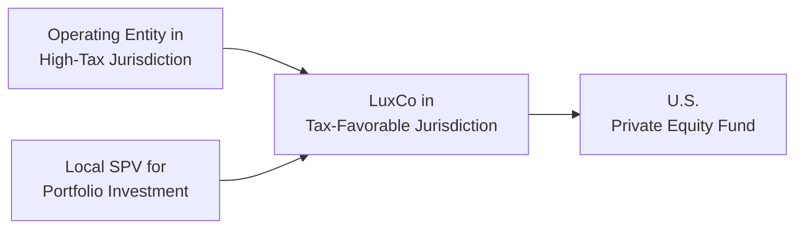

## Introduction
If there's one thing I've learned while sitting in countless board meetings for private investment deals, it's that investors are always looking for ways to optimize taxes. Let’s face it—no one enjoys seeing a big chunk of their capital vanish into tax obligations that could’ve been minimized with proper planning. Enter the world of tax-efficient holding company structures: a sophisticated toolkit used by private equity sponsors, venture capital investors, and even family offices to minimize tax leakage and optimize returns.

This section focuses on how these structures work in practice, the key considerations for building them, and common pitfalls to avoid. Whether you’re just dipping your toe in private capital or you’ve been around the block a few times, it’s often the nuanced details of cross-border taxation, regulatory frameworks, and special purpose vehicles (SPVs) that can make or break an otherwise promising deal.

## Why Tax-Efficient Holding Company Structures Matter
Investing in private capital (both equity and debt) is about maximizing returns while managing risk—taxation being one of the more complex risk elements. Tax efficiency can affect:

• After-Tax Returns – Even a small reduction in an investor’s effective tax rate can significantly boost net returns over time.  
• Capital Flows and Liquidity – Holding companies in tax-favorable jurisdictions can improve dividend distribution flexibility and reduce withholding tax burdens.  
• Regulatory Compliance – With global watchdogs paying closer attention to aggressive tax practices, structuring your investments carefully can keep you on the right side of the law.

The concept of layering multiple corporate entities across different jurisdictions can be a bit intimidating. Yet setting up the right structure early can pay off handsomely—sometimes literally, through a higher after-tax internal rate of return (IRR).

## Common Domiciles for Holding Companies
So, where do people usually park their holding companies? Some well-known jurisdictions include the United States (particularly Delaware), Luxembourg, the Cayman Islands, British Virgin Islands (BVI), and Singapore. Each has unique regulatory, legal, and treaty advantages.

• Delaware (USA): Often favored for its well-established corporate law, strong legal precedents, and business-friendly environment. Domestic investors might also find certain state-level tax benefits.  
• Luxembourg: Known for its extensive network of double tax treaties (DTTs), robust regulatory environment, and specialized vehicles such as the Société de Participations Financières (SOPARFI).  
• Cayman Islands: Popular for offshore funds and SPVs due to zero direct taxes on income, profits, or capital gains—though you must carefully consider evolving global transparency initiatives.  
• Singapore: Offers a stable political climate, significant regional treaties, and government incentives encouraging foreign investment.

Selecting a domicile often involves analyzing tax treaties, legal predictability, asset protection laws, and local compliance costs. It’s like picking the right home base for your operation—you want safety, convenience, and cost-efficiency all in one.

## Special Purpose Vehicles and Asset Protection
At the heart of many tax-efficient holding structures lie SPVs: those single-purpose entities that might ring-fence liabilities or isolate a particular asset’s risks. Consider an example: A private equity fund invests in a biotech startup with valuable intellectual property (IP). To protect that IP from potential lawsuits or other claims, the fund routes the investment through an SPV. That way, if something goes awry in another portfolio company, the biotech IP remains insulated.

Beyond liability separation, SPVs can help manage currency exposures, facilitate co-investments, or group assets with a common risk profile. They’re also essential when it comes to:

• Keeping Transaction-Specific Risks in Check  
• Meeting Investor-Specific Requirements (for example, investors with unique environmental, social, and governance (ESG) mandates)  
• Simplifying Exit Processes (an SPV can be bought or sold with fewer legal tangles)

Just remember that an SPV is not an invitation to hide ownership or engage in questionable tax practices. Global regulatory bodies, armed with OECD Base Erosion and Profit Shifting (BEPS) guidelines, are increasingly scrutinizing SPVs to ensure they have “substance” (real operations, management, or employees) rather than existing solely on paper.

## Transfer Pricing, BEPS, and Global Oversight
Now, let’s talk about the dreaded transfer pricing rules—an area that can quickly get complicated. Transfer pricing aims to ensure that transactions between related parties—like a holding company and its operating subsidiaries—happen at arm’s-length terms. If a large portion of a multinational’s profits is artificially “shifted” into a low- or zero-tax jurisdiction, that’s a red flag for regulators.

The OECD’s BEPS initiative (Base Erosion and Profit Shifting) has introduced measures to curb such aggressive tax practices. As part of BEPS, countries have begun implementing stricter requirements:

• Country-by-Country Reporting (CbCR): Firms must disclose revenue, profits, taxes paid, and other economic data in each jurisdiction.  
• Substance Requirements: Shell companies with minimal local operations but large profit allocations are under intense scrutiny.  
• Hybrid Mismatch Arrangements: Tax regulators are disallowing structures that exploit differences in two jurisdictions’ treatment of the same instrument or entity.

Any cross-border structures must respect local and global rules to avoid fines, reputational damage, or unexpected back taxes. And it’s not just about ticking boxes—investors hate surprises more than anything. Nothing burns an LP’s goodwill faster than a mid-stream revelation that the general partner’s brilliant “tax efficiency” plan was borderline abusive.

## Withholding Taxes and Dividend Flow
A common challenge for private capital investments is withholding tax on dividends, interest, or royalties paid across borders. You might have come across scenarios where a 30% withholding tax rate is automatically applied to non-resident payments unless a treaty reduces the rate.

To mitigate such outcomes:

• Use Existing Treaties: Holding companies established in treaty-friendly jurisdictions often benefit from reduced rates.  
• Plan the Payment Flows: Aim for interest or dividend payouts in an order that takes advantage of netting rules, foreign tax credits, or local exemptions.  
• Evaluate Intra-Group Loans: Sometimes, re-categorizing equity as debt results in interest payments (often subject to different withholding rates) instead of dividends, but caution around thin-capitalization rules is essential.

Remember, a multi-layer structure might reduce withholding tax in one place, only to trigger it somewhere else. Always map out the full chain of distributions—like a roadmap of capital flows—to see if you’re truly saving taxes or merely shifting them around.

## Long-Term Implications and Exit Strategies
Setting up a holding company is not just about day-to-day tax efficiency; it’s also about making your eventual exit smoother. If you plan an initial public offering (IPO) or a sale to a strategic acquirer, certain jurisdictions have:

• Fewer Capital Gains Taxes on Share Sales: Some countries, like Singapore or certain European destinations, offer exemptions if the holding period or activity type meets specific criteria.  
• Lower Withholding Taxes on Repatriation: Minimizing taxes on final distributions at exit can add significantly to an investor’s realized returns.  
• Local Compliance Requirements: The last thing you want is for your dream exit to stall because of harmful regulatory constraints in your holding company’s jurisdiction.

Also, watch out for “exit taxes” that some countries impose if you relocate your holding entity. It may be better to stay put in your original setup or time your move to reduce the tax burden.

## Case Example: Cross-Border Private Equity Deal
Imagine a private equity fund based in the United States investing in businesses across Europe. The fund sets up a Luxembourg holding company (LuxCo) to leverage Luxembourg’s favorable double tax treaties. The LuxCo then establishes local SPVs in each target market.

Below is a simplified mermaid diagram illustrating how capital and dividends might flow:

1) The U.S. fund invests in LuxCo.  
2) LuxCo invests through local SPVs to acquire controlling stakes in European portfolio companies.  
3) Dividends flow from the local SPVs back to LuxCo, often at a reduced withholding tax rate because of Luxembourg’s tax treaties.  
4) LuxCo distributes funds to the U.S. fund, potentially using its own treaty network to minimize withholding taxes and avoid double taxation.

In practice, the success of what looks like a neat chain depends on meeting substance rules in Luxembourg (like local directors, offices, and real decision-making) and structuring each local SPV to comply with local tax laws. 

## Best Practices and Pitfalls
• Engage Tax and Legal Experts Early: Unless you’re comfortable with the weeds of international taxation (most of us are not), consult experts during deal inception.  
• Substance, Substance, Substance: Show real operational presence in the holding location. Avoid “mailbox” entities with minimal oversight or employees.  
• Monitor Regulatory Changes: BEPS, transfer pricing, and local tax law changes happen regularly—periodically review your structure to ensure compliance.  
• Watch for Overlapping Taxes: If not planned correctly, you could end up layering taxes instead of saving them. Double check with local tax counsel for each country.  
• Anticipate Future Exits: The best structure for day-one might not be ideal for your eventual exit strategy.

## Conclusion and Exam Tips
Tax-efficient holding company structures can dramatically impact an investor’s net returns, but the terrain is ever-evolving. You know, I once met a CFO who thought their structure was bulletproof—until new regulations forced a massive reorganization (and legal fees that no one enjoyed). The moral? This stuff isn’t static. Be ready to adapt as you scale, expand to new geographies, or as local tax laws change.

From a CFA Level III exam perspective, expect scenario-based questions where you’ll need to assess if a particular structure aligns with broad tax efficiency, risk management, and global regulation constraints. You might also see essay prompts exploring the trade-offs between different domiciles or requiring you to evaluate the after-tax IRR on an investment given certain withholding rates or treaty provisions.

• Familiarize yourself with the OECD’s BEPS action plans.  
• Understand how transfer-pricing rules might apply to related-party transactions.  
• Practice computing after-tax returns with different withholding rates and see how changes in these rates alter deal economics.

Good luck, and keep your eyes open for the big picture as well as the finer details—it’s usually one foot in the big picture, one foot in the local legal environment, that ensures success.

## References
• OECD (Organization for Economic Co-operation and Development) – Various guidelines and frameworks on BEPS and transfer pricing.  
• Mindy Herzfeld, “International Taxation in a Nutshell” – A digestible introduction to key global tax principles.  
• Tax Foundation – Studies on global tax competitiveness and updates on major jurisdictions.  
• Official CFA Institute Curriculum, particularly sections relating to portfolio structuring and global taxation.

## Test Your Knowledge: Tax-Efficient Holding Company Structures Quiz



### Which of the following is a primary reason for establishing a holding company in a tax-favorable jurisdiction?

- [x] To reduce withholding taxes and take advantage of double tax treaties
- [ ] To guarantee sequence-of-returns risk is mitigated
- [ ] To avoid filing annual financial statements entirely
- [ ] To bypass anti-money-laundering (AML) regulations

> **Explanation:** Obtaining lower withholding tax rates and leveraging tax treaties is a major advantage. Holding companies still face AML regulations and often must file annual reports, though filing requirements can be simpler in some jurisdictions.

### When setting up a Special Purpose Vehicle (SPV), which of the following is most consistent with "substance" requirements under BEPS?

- [x] Having local directors and evidence of real decision-making within the SPV’s jurisdiction
- [ ] Maintaining a mailbox address but supervising operations from another country
- [ ] Only using a virtual office service
- [ ] Fully delegating all operational decisions to the parent company

> **Explanation:** BEPS guidelines expect SPVs to demonstrate genuine operational substance, including local directors and decision processes that take place in the SPV’s jurisdiction.

### Under OECD BEPS initiatives, which reporting mechanism forces multinational enterprises to disclose country-by-country tax and financial data?

- [ ] Double Taxation Treaties
- [ ] Transfer Pricing Rulings
- [x] Country-by-Country Reporting (CbCR)
- [ ] Exchange of Information on Request

> **Explanation:** CbCR is an outcome of BEPS that requires companies to submit a detailed report of their financial and tax information for each jurisdiction in which they operate.

### If a U.S. private equity fund invests in a European company via a Luxembourg holding firm, which is a likely tax benefit?

- [x] Reduced withholding tax on dividend flows back to Luxembourg due to favorable DTT rates
- [ ] Elimination of all local compliance requirements in Europe
- [ ] Guaranteed exemption from capital gains taxes in all European countries
- [ ] Complete immunity from anti-avoidance rules

> **Explanation:** Luxembourg’s extensive treaty network often provides reduced withholding rates, but local compliance, capital gains taxes, and anti-avoidance rules still apply.

### Which of the following might trigger additional scrutiny from tax authorities when using SPVs?

- [x] A mismatch between economic activity and profit allocation
- [ ] Locating back-office staff in the SPV’s jurisdiction
- [x] Charging fully loaded transfer prices for services
- [ ] Providing substantial disclosure in financial statements

> **Explanation:** If the SPV allocates substantial profits with minimal associated economic activity, authorities suspect profit shifting. Transparency and robust local operations usually reduce that scrutiny.

### The term “withholding tax” generally refers to:

- [x] A tax withheld at source on certain cross-border payments like dividends or interest
- [ ] A separate national income tax
- [ ] A mandatory corporate social responsibility contribution
- [ ] A one-time capital levy on newly formed companies

> **Explanation:** Withholding tax is imposed on the payment of dividends, interest, or royalties to non-residents, collected at source.

### A critical component of designing a tax-efficient holding company structure involves:

- [x] Mapping out the entire chain of capital flows from operating entities to investors
- [ ] Immediately dissolving all onshore subsidiaries
- [ ] Relying exclusively on tax havens
- [ ] Avoiding professional tax counsel

> **Explanation:** A clear view of capital flows, in consultation with tax experts, helps prevent unexpected layering of taxes or running afoul of local rules.

### For private equity investments, why might certain jurisdictions provide more favorable exit treatment?

- [x] Some offer reduced or zero capital gains taxes if certain criteria are met
- [ ] They eliminate foreign exchange risk
- [ ] They impose higher withholding taxes to encourage reinvestment 
- [ ] They allow non-disclosure of realized gains

> **Explanation:** Jurisdictions like Luxembourg or Singapore may offer exemptions or reduced rates on capital gains if the investment meets certain holding periods or operational criteria.

### Transfer pricing standards aim to:

- [x] Ensure transactions between related parties reflect fair market (arm’s-length) pricing
- [ ] Encourage the use of intangible assets for profit shifting
- [ ] Mandate direct expropriation of foreign subsidiaries
- [ ] Restrict legitimate inter-company transactions

> **Explanation:** The arm’s-length requirement prevents artificially inflated or deflated prices that move profits from high-tax to low-tax areas without genuine operational justification.

### A minimal local operational footprint (“mailbox company”) in a supposedly “tax-friendly” jurisdiction can be considered acceptable under BEPS initiatives:

- [x] False
- [ ] True

> **Explanation:** BEPS guidelines are specifically designed to discourage shell or “mailbox” companies that lack real business substance. 


