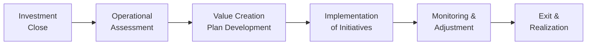

## Introduction

When investors talk about private equity and private debt, they often get excited about sourcing deals, negotiating terms, and closing transactions. But here’s something that drastically sets successful investors apart: the work that comes after the deal closes. You know, that often underappreciated phase where ownership shifts from “mission accomplished” to “time to roll up our sleeves.” Because once the ink is dry, private capital professionals aren’t merely passive financiers—they’re catalysts for real change inside their portfolio companies.

In this section, we’ll explore the various ways to create value after you’ve committed capital, from strategic realignments to cost optimization, synergy identification, ESG implementation, and so much more. So if you’ve always wondered what people mean by “active management” in private capital, this is where the magic happens.

## The Value Creation Framework

### Focusing on Growth, Efficiency, and Strategy

Even though each portfolio company is unique, most post-investment value creation efforts fall into three broad buckets:
• Revenue Enhancement  
• Cost Optimization  
• Strategic Positioning  

At the risk of oversimplifying, think about these three categories as the biggest levers you can pull to change the trajectory of a company’s performance.

• Revenue Enhancement: Entering new markets, launching new products, rethinking pricing strategies, cross-selling, and leveraging digital channels for broader and more effective marketing.  
• Cost Optimization: Streamlining the supply chain, reducing overhead, managing working capital more efficiently, upgrading technology to automate processes, and renegotiating contracts.  
• Strategic Positioning: Adapting the broader corporate strategy to changing market conditions. This might include bolt-on acquisitions, partnerships, or an expanded ESG focus to increase brand value and resilience.

### Operating Partners and Specialized Expertise

Remember how we often say “people make all the difference”? Well, in private equity firms, that difference comes in the form of the Operating Partner—an in-house expert dedicated to improving operations, bolstering leadership, and guiding strategic initiatives across portfolio companies. In my experience, a strong Operating Partner can just step into a messy supply chain conversation and magically unravel solutions that an overwhelmed management team might not see.

These professionals come armed with deep operational know-how—perhaps they spent years overseeing large-scale transformation projects, or they might have specific skills in digitization or lean manufacturing. For instance, if your firm invests in manufacturing businesses, an Operating Partner with a background in optimizing assembly lines and adopting new machinery can immediately spot hidden inefficiencies and propose action steps.

## Key Performance Indicators (KPIs) and Dashboards

### Why KPIs Matter

The metric “EBITDA margin” might be old news, but trust me, robust and dynamic Key Performance Indicators are everything when it comes to tracking performance in real time. The more promptly you catch slippages or spot improvements, the easier it is to refine your strategies. For instance, a commercial-stage software company might track monthly recurring revenue (MRR) or churn rate, while a manufacturing firm might track throughput and defect rates.  

These KPIs aren’t just fancy numbers for investor presentations; they’re the daily or weekly heartbeat checks that inform your decisions. Nothing beats seeing a real-time performance dashboard that highlights strategic wins or flags potential risks.

### A Quick Python Example

Sometimes, managers want a straightforward snapshot of how certain KPIs evolve over time. Below is a simple Python snippet that calculates a cumulative revenue growth figure—very simplified, yet illustrative:

```python
import pandas as pd

data = {
    'Month': ['Jan','Feb','Mar','Apr','May','Jun'],
    'RevenueGrowth': [5.2, 4.5, 4.9, 5.4, 6.0, 6.3],  # in %
    'EBITDA': [2.1, 2.3, 2.5, 2.6, 3.0, 3.1]         # in millions
}

df = pd.DataFrame(data)
df['CumulativeRevenueGrowth'] = df['RevenueGrowth'].cumsum()
print(df)
```

In practice, portfolio companies use far more sophisticated KPI tracking systems. But no matter how advanced the dashboards, the point remains: robust measurement is vital for timely decision-making.

## Reevaluating Management Teams

### Leadership Changes and Executive Coaching

Let’s be blunt: sometimes you realize the management team that got you this far isn’t the one that’ll take you to the next level. Or maybe they just need more specialized skills. It might be uncomfortable, but reevaluating leadership is all part of post-investment oversight.

In many cases, executive coaching and targeted skill-building can help an underperforming team pivot. For example, if the CEO excels at product innovation but struggles with CFO-level tasks, it might be cheaper and more fruitful to hire a strong CFO instead of replacing the top executive. And in other instances, a more direct leadership change is needed. There’s no one-size-fits-all solution here—just consistent monitoring, transparent communication, and swift action if things do not improve.

### Aligning Incentives

One of the best ways to motivate a leadership team is with a well-structured incentive plan. This is about aligning management’s upside with that of the investors. Suppose the plan ties a chunky bonus to achieving a 20% IRR (internal rate of return) upon exit. Leaders then have skin in the game and an incentive to make decisions that benefit both day-to-day operations and the big-picture investment timeline.

In formula form, IRR is the rate \\( r \\) that sets the net present value (NPV) of all cash flows to zero:


\text{NPV} = \sum_{t=0}^{T} \frac{C_t}{(1+r)^t} = 0


When management has a share in that IRR outcome, you can watch their motivation skyrocket.

## Facilitating Synergy and Bolton Acquisition Opportunities

### Sharing Services and Resources

If you manage multiple businesses within a specific sector, synergy is not just a buzzword—it’s a genuine goldmine of cost savings and potential revenue expansion. Let’s say you own two cutting-edge software companies that both rely on complex cloud infrastructure. Merging some of their cloud operations or negotiating joint services with a single provider can often open up pricing discounts or collaborative product improvements.  

In other words, synergy is about letting your portfolio companies leverage each other’s resources: from sales contacts and vendor networks to back-office administrative functions. This approach naturally benefits margin expansion and fosters valuable cross-learning among teams.

### Bolt-On Acquisitions

Sometimes, synergy is best achieved through a bolt-on acquisition (also known as a tuck-in deal). Here, you add a smaller, complementary company to your existing portfolio firm to boost market share or enhance product offerings. But bolt-ons aren’t just about scale—they can bring in specialized technology, innovative processes, or even fresh customer channels.  

Culturally, though, you want to ensure both the acquired company and the existing portfolio company can integrate smoothly—otherwise you might be left with brand confusion or conflicting teams. I once saw a neat bolt-on turn chaotic because the product lines overlapped too much and the marketing teams started stepping on each other’s toes. So plan carefully!

## ESG and the Sustainability Advantage

These days, focusing on environmental, social, and governance (ESG) factors is more than just a box-ticking exercise. It can actually unlock efficiency gains, reduce regulatory and reputational risks, and even open up new customer segments who value sustainability. Implementing an **ESG playbook** might include systematically reducing carbon emissions, improving labor practices, and setting up robust governance structures.  

Take carbon emissions, for instance. By installing IoT (Internet of Things) sensors on manufacturing equipment, a company might spot inefficiencies that simultaneously reduce environmental impact and lower energy bills. That’s a legit win-win scenario.

## Continuous Refinement: Strategy and Exit Planning

### Monitoring and Adapting

Value creation is rarely a linear process. You’re bound to face market headwinds, rising competition, or even internal snags that throw you off course. That’s precisely why an iterative approach can make all the difference—continuously refine the corporate strategy, pivot to meet customer demands, explore new product lines, or reorganize the operational structure as you go. This cyclical approach is captured well in the flow diagram below.



Rather than a one-and-done blueprint, post-investment value creation is an ongoing cycle of evaluating, planning, executing, monitoring, and refining.

### Preparing for Exit

Much of post-investment work is done with an eye on the ultimate exit—through an IPO, strategic sale, sponsor-to-sponsor deal, or even secondary buyouts. When you’ve made consistent improvements in growth, operations, and ESG standing, your portfolio company can be significantly more attractive and command better valuations.  

An effective transition process will highlight the improvements made. Gather data on how revenue soared or how operating margins improved due to synergy with another portfolio company. Emphasize new strategic partnerships or expansions into foreign markets. The more you can demonstrate a proven track record of healthy returns and measured risk management, the better the exit multiple you’ll likely secure.

## Best Practices, Pitfalls, and Strategies

• Be Proactive, Not Reactive: Don’t wait until something breaks to step in. Ongoing engagement helps pre-empt major issues.  
• Focus on Scalability: Even if a company is small, set it up for expansion. Overhauling processes mid-stride can be awkward and expensive.  
• Watch Out for Culture Clashes: Synergy and bolt-on acquisitions can fail if integration plans ignore cultural and organizational alignment.  
• ESG Is Not an Afterthought: Start ESG frameworks early. They become part of the firm’s DNA and can lead to tangible performance improvements.  
• Leadership Buy-In: All your strategies can backfire if top management or the board resists. Communication and alignment are essential.  

## Practical Exam Tips

• Be Prepared for Scenario-Based Questions: The CFA exam might present a case study about a private equity firm with multiple portfolio companies. You could be asked to recommend specific value creation strategies, interpret KPI dashboards, or propose leadership changes.  
• Integrate ESG Into Your Answers: The global climate for corporate governance has shifted. Make sure to highlight potential ESG enhancements.  
• Emphasize Quantitative and Qualitative Factors: While EBITDA improvements or IRR calculations are important, also show awareness of cultural alignment, synergy feasibility, and operational complexities.  
• Manage Time Wisely: In constructed-response questions, be concise. State your rationale and the expected impact of your proposed actions.  
• Reference the CFA Institute Code of Ethics: Discussions about operational improvements and leadership changes can raise ethical considerations, so be prepared to address them.

## References and Further Reading

- Bain & Company and Boston Consulting Group Reports on Private Equity Value Creation.  
- Meyer, T., & Mathonet, P. (2005). Beyond the J-Curve: Managing a Portfolio of Venture Capital and Private Equity Funds.  
- ESG Reporting Frameworks by the Sustainability Accounting Standards Board (SASB).

----

## Test Your Knowledge: Post-Investment Value Creation Methods Quiz



### Which of the following best describes the role of an Operating Partner in a private equity firm?

- [x] A professional who specializes in driving operational improvements and strategic changes in portfolio companies.
- [ ] A financial analyst solely responsible for modeling IRR.
- [ ] A general partner responsible for fundraising and client relations.
- [ ] A hired consultant for finalizing legal documents.

> **Explanation:** An Operating Partner devotes attention to optimizing the operations of portfolio companies, focusing on processes, cost savings, and strategic direction.

### What is the primary rationale behind introducing bolt-on acquisitions as part of a post-investment strategy?

- [x] To complement the existing portfolio company’s offerings and potentially realize synergy benefits.
- [ ] To offload underperforming business units.
- [ ] To bypass the need for external financing.
- [ ] To shift accountability to an external party.

> **Explanation:** Bolt-on acquisitions bring complementary resources and can enhance market share, product lines, or operational capabilities, thus achieving synergy.

### A private equity firm invests in a manufacturing company and decides to create a KPI dashboard. Which KPI would be the least relevant for manufacturing operations?

- [ ] Defect rate on the assembly line.
- [ ] Throughput or production capacity.
- [ ] Inventory turns.
- [x] Average time visitors spend on a webpage.

> **Explanation:** Although online metrics can matter if the company sells directly via e-commerce, “average time visitors spend on a webpage” is not typically a core manufacturing KPI.

### Which factor most often triggers a reevaluation of a portfolio company’s management team post-investment?

- [ ] Expansion of global capital regulations.
- [x] Consistent underperformance relative to agreed KPIs.
- [ ] Contractual obligations from limited partners.
- [ ] Low synergy with other portfolio firms.

> **Explanation:** When a leadership team fails to meet performance benchmarks, investors reexamine whether changes (including coaching or replacements) might be needed.

### In assessing synergy among multiple portfolio companies, which approach is generally most beneficial?

- [x] Leveraging shared services, vendor relationships, and cross-selling opportunities.
- [ ] Keeping all companies isolated to maintain independent cultures.
- [ ] Focusing on competition between portfolio companies to drive improvements.
- [ ] Limiting synergy efforts until immediately before exit.

> **Explanation:** Sharing services and coordinating across different portfolio businesses can reduce costs, enhance revenue, and accelerate market penetration.

### How does an ESG playbook help in post-investment value creation?

- [x] It ensures environmental, social, and governance factors become integrated into strategy and operations, improving sustainability and brand value.
- [ ] It strictly focuses on investor relations and marketing decisions.
- [ ] It replaces the need for KPI development.
- [ ] It lowers the need to track financial metrics.

> **Explanation:** ESG strategies can boost brand reputation, streamline operations, and mitigate regulatory risks, all of which improve value.

### Why is incentive alignment crucial for portfolio company management teams?

- [ ] Because equity incentives can only be offered to senior executives.
- [x] It motivates them to make decisions that are in line with both short-term operations and long-term investment objectives.
- [ ] It eliminates the need for a board of directors.
- [ ] It mandates a single, universal KPI across all portfolio companies.

> **Explanation:** When management’s upside depends on performance targets, they are incentivized to act in the best interest of the investors and drive business success.

### When preparing for an exit, why is it important to document the improvements made since the initial investment?

- [x] To demonstrate the tangible shifts in revenue growth, margins, and strategic positioning to potential buyers.
- [ ] To justify emission discrepancies to regulators.
- [ ] To inflate purchase price allocations.
- [ ] It has no real relevance to the actual exit process.

> **Explanation:** Showcasing the company’s evolution since acquisition can help justify a higher valuation to prospective buyers.

### Which statement best describes the iterative nature of post-investment value creation?

- [x] Continuous monitoring, adapting, and refining strategic actions as market conditions change.
- [ ] One-time strategic planning that remains constant throughout the investment period.
- [ ] Outsourcing all key decisions to third-party consultants.
- [ ] Finalizing value creation strategies only when the exit is imminent.

> **Explanation:** Active owners regularly assess market scenarios, adjust strategies, and refine their approach to optimize performance.

### True or False: Achieving cost savings is the only meaningful aspect of post-investment value creation.

- [x] False
- [ ] True

> **Explanation:** Value creation includes revenue growth, strategic repositioning, leadership improvement, and ESG considerations, not just cost cutting.


