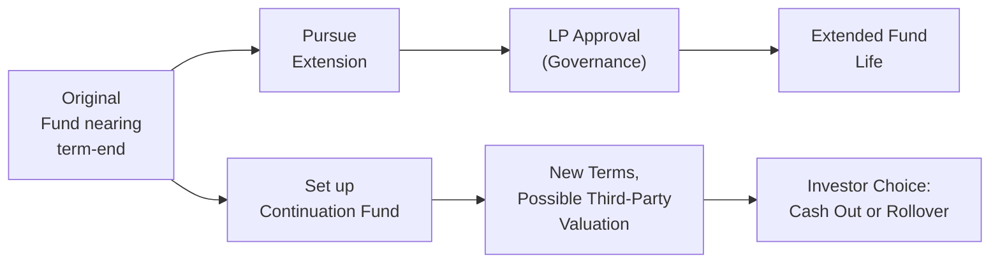

## Introduction
Well, let’s say you’re running a private equity fund. You’re inching toward that typical 10-year mark, and you suddenly realize: not all the portfolio companies are “ready” for exit. Maybe the markets are choppy or maybe a few portfolio firms need more time to achieve that elusive profitability milestone. So what do you do? In many cases, you’ll explore fund restructuring or extension strategies.

Fund restructuring and extension strategies revolve around prolonging the life of an existing vehicle or creating entirely new structures, like a continuation fund or a secondary vehicle, that let managers (the GPs) and investors (the LPs) see certain investments through to their full potential. Of course, it’s never just about the money. This process is also heavily influenced by governance guidelines, transparency around valuations, reputational outcomes, and the need to align every party’s objectives.

In this section, we’ll take a deep dive into the rationale, mechanics, and common pitfalls of restructuring and extension strategies in private equity and private debt funds. Whether you’re a budding analyst or a seasoned pro with some prior stints in fund administration, understanding these steps can help you effectively navigate the complexities of winding down—or winding up—a private investment vehicle.

## Typical Fund Lifecycle
Before we tackle restructuring head-on, let's recall the usual lifecycle of a private equity or debt fund:

• Formation and Fundraising: GPs market the fund to institutional investors (LPs).  
• Investment Period (Years ~1–5): GPs deploy capital into portfolio investments—be they early-stage ventures, leveraged buyouts, distressed debts, or other private deals.  
• Monitoring and Value Creation (Years ~3–7): The GP works actively with portfolio companies to improve operations, governance, or capital structures.  
• Harvesting or Exit (Years ~4–10): The fund begins realizing gains via public listings, strategic sales, or other exit avenues.  
• Wind-Down (Around Year 10): Typically, the fund dissolves after distributing proceeds to investors according to the partnership agreement and the waterfall structure.

The challenge? Sometimes, unresolved investments remain beyond Year 10. If the GP believes additional time (and possibly additional capital) can unlock more value, an extension or restructuring might come into play.

## Rationale for Restructuring and Extensions
Why extend a fund or restructure it in the first place?

• Maximizing Value: Some portfolio companies may be on the cusp of breakthroughs—like a pharmaceutical firm awaiting crucial regulatory approvals or a technology company approaching its next product cycle. A forced exit could mean missing out on potential upside.  
• Market Timing: Alternative investments can be highly sensitive to economic cycles. If macro conditions are unfavorable for an exit—think liquidity crunch or depressed valuations—waiting can yield significantly better outcomes.  
• Providing Optionality: LPs may have varying liquidity constraints. A restructuring can give some investors a liquidity option (via a secondary vehicle) while allowing others to remain committed.  

A year ago, I personally spoke with a GP who had a robust pipeline of deals but found the exits delayed by market uncertainty. They convinced many LPs to extend the fund by two years, citing stable valuations and growth trends. The outcome was fairly positive, but not without hiccups. This example drives home how communication and trust are pivotal in any extension scenario.

## Governance and Transparency
Alignment of interests is everything. GPs must not only propose an extension or restructuring but also justify it thoroughly:

• LP Approval: The Limited Partnership Agreement (LPA) typically outlines how many extensions are permissible (often one to two years, subject to a supermajority or unanimous LP vote).  
• Advisory Committees: LP advisory committees can act as a sounding board for restructuring discussions. Their input is especially critical when valuing illiquid or hard-to-price assets that will be rolled into new structures.  
• Independent Fairness Opinions: When rolling assets into a continuation fund, GPs may use third-party valuation providers to ensure objectivity.  
• Fee Transparency: Investors need a clear view of any additional management fees or carried interest structures that might persist under the extension or new vehicle.

Let’s also remember that the GP’s reputation is on the line. If investors sense that the GP is prolonging a mediocre portfolio just to keep earning fees, trust and future fundraising efforts can be significantly impaired.

## Implementation Approaches
Below are common strategies for executing a fund extension or restructuring:

• Direct Extension of Original Fund  
  - The GP seeks consent (usually from an LP advisory committee or a requisite percentage of committed capital) to extend the fund’s life by one or two years.  
  - Fees might be reduced to reflect the more limited overhead in the final stretch.  

• Continuation Fund  
  - The existing assets transfer into a newly-formed vehicle, sometimes called a “continuation fund.”  
  - Investors receive the choice to cash out (selling their stake to new or existing LPs) or roll their investment into the continuation fund.  
  - The GP typically redefines fees and carry terms.  

• Secondary Vehicle  
  - A third-party secondary fund (or the GP’s affiliated secondary platform) purchases LP interests in the old fund.  
  - LPs can liquidate their positions usually at a negotiated discount/premium to net asset value (NAV).  

Each approach seeks to match the liquidity needs of exiting investors with the potential value-creation runway for those comfortable staying the course.

### Visualizing an Extension and Continuation Fund
Here’s a simplified Mermaid diagram to illustrate the end-of-life pathways:

## Key Considerations for GPs and LPs
### Valuation
Accurate portfolio valuations are critical. When assets are transferred from the old fund into a new vehicle, LPs want a fair price so no party is disadvantaged.

### Fees and Economics
Extensions can carry revised fee schedules. Some GPs impose lower management fees to reflect that active investment is over, focusing primarily on monitoring existing positions. That said, carried interest may still apply to final exit proceeds.

### Legal and Regulatory
Restructuring might trigger new regulatory filings, especially if the new vehicle has different jurisdictional constraints or if marketing a continuation fund crosses certain securities registration thresholds. In cross-border contexts, variations in local regulations can complicate matters further.

### Reputational Risks
An extension might be seen as “GP protectiveness” if performance lags. On the flip side, a swift liquidation of underperformers might lead to reputational damage if LPs suspect the GP gave up on hidden value or forced suboptimal exits. Balancing these narratives is critical.

## Distressed or Underperforming Funds
Let’s face it: not all funds are roaring successes by the end of their 10th year. In some cases, managers pursue partial liquidation or wholesale recapitalization:

• Partial Liquidation: Selling off certain portfolio companies that are market-ready while retaining others that need more time.  
• Asset Sales to Strategic Buyers: Sometimes, a bulk sale to another fund or strategic acquirer is the best path forward—even if at a discount.  
• Recapitalizations: Infusing additional equity or new debt to stabilize faltering companies, with existing LPs deciding whether to contribute more capital or face dilution.  

I recall seeing a distressed buyout fund that was forced to accept a new round of financing at a fairly low valuation. The GP approached the LPs, who voted to let the sponsor bring on external capital in exchange for a stake in the portfolio. Some original LPs parted ways, but those who stayed actually recovered more capital than expected, all because the fund had enough runway to complete its turnaround plan.

## Communication and Reputational Considerations
Transparency fosters trust. If a GP suddenly announces a 2-year extension with no prior consultations, expect an outcry from LPs. Instead, best practice involves:

• Early Warning Systems: Alert investors a year or two before final term if it’s clear the original timeline might not suffice.  
• Robust Data Sharing: Provide financial statements, valuations, and growth forecasts so LPs can gauge whether an extension is in their best interests.  
• Ongoing Dialogue: LPs appreciate being involved in the process—through advisory committees, annual gatherings, or one-on-one calls.

Reputation is intangible yet vital. A well-managed extension or restructuring, with LP buy-in and transparent communication, can actually enhance a GP’s standing in the market. Conversely, withheld information or perceived misalignment can damage even the strongest track record.

## Practical Examples and Case Scenarios
• Continuation Fund Scenario: A GP holds five portfolio companies, two of which have substantial upside but require an additional 2–3 years and possibly fresh capital. They form a continuation fund with new capital from both existing and new investors. LPs who prefer liquidity sell their stakes to the new fund at a fair price determined by an independent valuation firm.  
• Secondary Transaction Route: If LPs want out, and the GP lacks interest or resources to keep certain assets, the fund sells that portion to a secondary buyer. The discount or premium depends on the perceived health of the underlying investments and the overall market appetite for secondaries.  
• Hybrid Approach: Some LPs might cash out partially, leaving a portion of their commitment in the extension vehicle. This can be a “best of both worlds” solution: partial liquidity now, potential upside later.

## Glossary
• **Continuation Fund**: A vehicle created to hold existing investments beyond the original fund’s term.  
• **Secondary Vehicle**: A fund that acquires stakes in existing private equity or debt funds, providing liquidity to the selling LPs.  
• **GP (General Partner)**: The fund manager who makes investment decisions, typically with unlimited liability for management actions.  
• **LP (Limited Partner)**: Contributing investor(s) with limited liability. They are generally not involved in day-to-day fund activities.

## Conclusion and Exam Tips
Fund restructuring and extension strategies are multifaceted tools for handling end-of-term assets that still have potential (or require extra care). What seems like a simple decision—“extend or liquidate?”—often involves complex negotiations, regulatory oversight, revised fee structures, and reputational stakes.

When prepping for exam questions around fund restructuring, pay special attention to:
• Governance: Understand how LP advisory committees and approval thresholds work.  
• Fee Mechanics: Know how management fees and carried interest may be adjusted during an extension.  
• Valuation Protocols: Be prepared to interpret or critique the fairness of asset valuations in a restructuring scenario.  
• Communication and Ethical Standards: Remember the CFA Institute Code of Ethics emphasizes transparency, conflicts-of-interest management, and fair dealing toward all clients/investors.

Keeping these tips in mind, you’ll be better equipped to address both theoretical and scenario-based questions that might appear in item sets or constructed responses. As always, practice reading and quickly interpreting partnership agreements and extension clauses—these can pop up in vignettes and require you to effectively “find the detail” that drives the exam’s correct answer.

## References and Additional Resources
• Preqin, “Secondary Market Review.”  
• Forbes, “Liquidity Solutions for Private Equity Investors.”  
• American Investment Council (AIC) publications on best practices in private fund governance.  
• CFA Institute, “Standards of Practice Handbook.”  

---

## Test Your Knowledge: Fund Restructuring and Extension Strategies



### Which of the following best describes a “continuation fund” in the context of private equity?

- [ ] A fund that invests in early-stage venture deals.  
- [x] A newly created vehicle designed to hold existing portfolio assets beyond the original fund’s term.  
- [ ] A short-term loan facility used to finance capital calls.  
- [ ] A vehicle exclusively used for distressed debt acquisitions.  

> **Explanation:** A continuation fund is specifically formed to hold assets that may need more time to mature beyond the life of the original fund.  

### Which is the most common reason for a private equity fund to seek an extension beyond its typical 10-year term?

- [ ] To lower the management fees during the fund’s investment period.  
- [ ] To avoid paying taxes on realized gains.  
- [ ] To discontinue performance reporting obligations.  
- [x] The GP believes additional time could maximize value for certain portfolio companies.  

> **Explanation:** Extensions are typically granted because the GP sees further upside in portfolio investments that would otherwise be forced to exit prematurely.  

### In a fund extension scenario, which governance body is most likely to have the authority to approve or reject the extension?

- [ ] The regional securities regulator.  
- [ ] The fund’s external auditors.  
- [x] The LP advisory committee or the requisite LP majority (per the LPA).  
- [ ] The bank providing subscription line financing.  

> **Explanation:** Extensions generally require approval from LPs, often through a vote or the LP advisory committee as dictated by the partnership agreement.  

### Why might a GP engage an independent valuation provider during a restructuring?

- [x] To ensure fair pricing of assets when some LPs exit while others remain.  
- [ ] To identify new co-investment opportunities.  
- [ ] To replace the fund’s internal accounting team.  
- [ ] To manage capital calls and distribution notices to investors.  

> **Explanation:** Third-party valuation helps align all parties’ interests by providing an objective basis for any transfer or rollover of assets.  

### Which of the following structures typically offers investors a way to exit their positions if they do not wish to continue in the fund?

- [ ] A newly incorporated special purpose vehicle with no secondary component.  
- [x] A continuation fund that provides a secondary option to cash out.  
- [ ] Recapitalization with mandatory reinvestment.  
- [ ] A standard direct extension without any liquidity feature.  

> **Explanation:** Continuation funds can give LPs the choice to liquidate their stake or roll it over under new terms.  

### In a distressed or underperforming fund scenario, what is a primary advantage of partial liquidation?

- [x] The fund can sell off market-ready assets to generate liquidity while retaining other assets that need more time.  
- [ ] All portfolio companies receive equal proceeds from the sale.  
- [ ] It extends the investment period indefinitely.  
- [ ] It automatically guarantees maximum returns for all LPs.  

> **Explanation:** Partial liquidation allows the GP to unlock liquidity for certain assets while preserving the potential of others.  

### What role does reputational risk play when GPs consider fund extensions?

- [ ] Reputational risk is irrelevant because investors always prefer holding assets for a longer period.  
- [x] A poorly handled extension can harm the GP’s standing, potentially making future fundraising more difficult.  
- [ ] Reputational risk strictly rests with the LPs, not the GP.  
- [ ] GPs can offset reputational risk by refusing future capital calls.  

> **Explanation:** If investors perceive the extension as a fee-driven maneuver or poorly managed, the GP’s reputation—and future fundraising ability—can suffer.  

### A key ethical practice according to the CFA Institute Code and Standards during a fund restructuring would be:

- [x] Providing fair and transparent disclosures to LPs about valuations and extension terms.  
- [ ] Concealing underperforming assets until the future potential can be better realized.  
- [ ] Negotiating terms that favor one large LP over smaller ones.  
- [ ] Increasing management fees to incentivize the GP.  

> **Explanation:** Transparency and fair treatment of all investors are cornerstones of the CFA Institute Code and Standards.  

### Which of the following best summarizes a secondary vehicle approach?

- [ ] The GP simultaneously redeems all LP shares at NAV without external capital.  
- [x] Existing LP positions are transferred to another fund or buyer, allowing original LPs to exit partially or fully.  
- [ ] The GP sets up a brand-new parallel fund with the exact same investment mandate.  
- [ ] The fund invests exclusively in farmland and natural resources.  

> **Explanation:** A secondary vehicle acquires existing limited partnership interests, offering liquidity solutions for the selling LPs.  

### A true statement about an LP advisory committee’s involvement in restructuring or extension is:

- [x] They often review and provide feedback on proposed extension terms, valuations, and fee arrangements.  
- [ ] Their only function is to enforce regulatory compliance.  
- [ ] They have authority to modify the overall investment strategy of the fund.  
- [ ] They appoint new GPs at the fund’s inception.  

> **Explanation:** Advisory committees typically serve as a governance layer, reviewing and approving or rejecting key structural changes in line with the LPA.  


