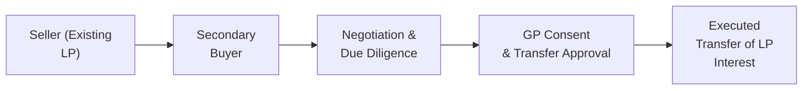

## Introduction

Secondary transactions in private capital markets—especially in private equity and private debt—are often misunderstood, yet they’ve grown into a powerful tool for many investors. If you’ve ever heard someone say, “Wait, we can actually sell our stake in that private equity fund before the fund invests or exits?”—yep, that’s exactly what we’re talking about here. The secondary market, once a quirk in the alternative investments world, has become significantly more transparent and liquid. 

We’ll explore how secondary transactions work, why investors may want to pursue them, how to think about valuation, and how to handle all the critical steps like negotiation and obtaining general partner (GP) approvals. You’ll also see that these transactions are no longer just for big institutional players; more smaller investors are getting in on the action.

## Overview of Secondary Transactions

Think of a secondary transaction, sometimes just called a “secondary,” as a sale of an existing limited partner (LP) stake in a private fund—whether that fund is a buyout, venture capital, or even a private debt vehicle. Let’s say an investor in a private equity fund wants out early to raise cash, rebalance a portfolio, or simply reduce exposure to a specific strategy. This investor can sell the interest to a buyer who wants immediate exposure to a partially funded or maturing portfolio, instead of making a new commitment that might take years to deploy.

### Motivations for Buyers and Sellers

• Sellers: They might be adjusting their allocations (e.g., cutting down on private equity to invest more in real estate), they might need liquidity for other commitments, or they may just want to simplify a portfolio that got a bit unwieldy.  
• Buyers: They want immediate access to an already-invested portfolio that might have shorter time to exit (and distributions). They also might negotiate a price discount, hoping to capture embedded value if they can hold out until the fund’s final realizations.

## Growth of the Secondary Market

Back in the day—I’m talking 10 or 15 years ago—secondary deals felt almost taboo, partly because they weren’t so transparent. People didn’t know how to price them, and the potential discounts were large. Now, it’s a different story. There are specialized secondary funds (sometimes multi-billion-dollar in size), dedicated advisory platforms, and robust data on typical discounts or premium ranges. These developments have made secondaries a key portfolio management tool.

## Key Players and Transaction Flow

Secondaries often involve:
• Original LP (the “Seller”)  
• Potential buyer (specialized secondary fund, institutional investor, or sometimes another LP in the same fund)  
• General Partner (GP) of the fund (must often approve the transfer)

Below is a simple flow diagram showing the main steps:



1. Seller decides to list or privately negotiate the sale.  
2. Buyer and seller find each other (sometimes through a secondary intermediary).  
3. Buyer does due diligence on the fund’s underlying portfolio.  
4. Buyer and seller negotiate price, structure, and timing.  
5. GP consents to the transfer (or not).  
6. The interest is legally transferred to the buyer, who becomes the new LP in the fund.

## Valuation and Pricing

Valuing a secondary stake typically starts with the fund’s latest net asset value (NAV). Then, the buyer will scrutinize the underlying companies or assets in the fund, the GP’s track record, the expected timelines, and macro conditions. After that, the buyer might propose a price at a certain discount (or premium) to the reported NAV.

In practice, many deals are quoted as “X% of NAV.” For example, you might see an offer at 95% of the December 31 NAV. We can think of it as a present value calculation, where the buyer expects to earn a certain internal rate of return (IRR) from the time of purchase.

Here’s a simplified KaTeX expression for the buyer’s target purchase price:


\text{Purchase Price} = \sum_{t=1}^{T} \frac{\text{Expected Distribution}_t}{(1 + r)^t}


…where r is the buyer’s required rate of return, and T is the number of expected distribution periods. If the sum of discounted cash flows is less than the reported NAV, the buyer may offer a discount to account for illiquidity, or for the risk that the GP’s valuations might be optimistic.

## Negotiating Secondary Deals

Well, negotiations can be a bit tricky—especially if you’re the buyer hoping for a decent discount, but the seller thinks the underlying companies will produce stellar exits. When I worked with a client who desperately needed liquidity after their asset allocation changed, we had to weigh the cost of accepting a lower price versus holding the position. It was a tense dance. 

Ultimately, the depth of the buyer pool, the quality of the fund, and market conditions for private equity secondaries all contribute to where the final price ends up. In bullish markets, we’ve sometimes seen secondaries trade at or above NAV.

## Stapled Transactions

A “stapled secondary” is a twist: the buyer agrees to purchase existing LP interests (the “secondary” part) but only if the GP also grants them a position in a new primary fund. It’s like a bundle sale. Or, from another angle, it’s a way for the GP to secure commitments for its new fund while facilitating liquidity for existing LPs. This can be beneficial if the seller wants out, the buyer wants in, and the GP wants fresh capital. But it also raises interesting governance issues: GPs have to balance old and new investors fairly.

## Secondary Transactions in Private Debt

So far, we’ve focused on equity-oriented secondaries, but there’s more. In private debt, secondaries can involve the sale of positions in syndicated loans or private placements. Usually, some form of lender consent or borrower consent is required for a loan transfer—they don’t want random folks popping onto the lender list. This can complicate the process. Transfer restrictions, especially in smaller private loan deals, might require limited or no transfer rights until a certain anniversary date or a performance milestone. Buyers need to verify these details in the loan agreement or the fund’s limited partnership agreement.

Key points for private debt secondaries:
• Consent Requirements: The borrower or administrative agent might need to sign off.  
• Loan Market Pricing: Pricing is typically pegged to a reference rate or a par-based approach, plus any accrued interest.  
• Credit Quality: The buyer’s analysis centers on the borrower’s credit profile.  

## Transfer Restrictions and GP Approvals

Before you do your victory dance, you’ve got to ensure that your fund’s limited partnership agreement actually allows for a secondary sale. Some older or smaller funds have quite strict clauses: an LP may not transfer without GP’s express written approval, or the LP might be forced to offer the stake to existing partners first (a right of first refusal). 

These rules exist because GPs prefer to control who sits at the table; they don’t want investor troublemakers or folks who lack the resources or know-how. As a prospective buyer, always double-check these restrictions and confirm that the GP is on board. Typically, GPs evaluate the buyer’s capital structure, track record, and commitment to adhering to the same rules the original LP followed.

## Risk Management and Considerations

• Discount/Pricing Risk: If market sentiment shifts, you might not get the discount you want.  
• Liquidity Risk: Even in a more liquid secondary market, secondaries can take months (or longer) to close.  
• Portfolio Fit: Make sure the geographical and sector exposures fit your broader portfolio strategy.  
• Regulatory & Tax Issues: Cross-border secondaries can trigger local regulations; for instance, certain jurisdictions require foreign investor approvals.  
• GP Alignment: Some secondaries happen under distressed conditions, which might reflect lack of alignment between the GP and existing LPs.

## Real-World Example (Hypothetical)

Let’s say an institutional LP wants to exit a mid-market buyout fund. The fund’s NAV is USD 100 million (LP’s share). The bidder sees possible strong exits in two to three years, but also sees some shaky portfolio companies. They offer 92% of NAV, or USD 92 million, factoring in potential minor write-downs but also anticipated distributions. The seller, strapped for liquidity, haggles a bit but eventually settles on 95% of NAV. The GP consents, the paperwork is finalized, and everyone moves on. Might sound straightforward, but that negotiation was a rollercoaster behind the scenes, trust me.

## Common Pitfalls

• Failing to read the partnership agreement thoroughly. So many folks skip the minutiae.  
• Overestimating the speed of exit. Even though it’s a “secondary,” it’s still private.  
• Underestimating complexity in private debt transfers—lender consents are no joke.  
• Overpaying for high-quality funds. In a hot market, you can easily cut into your returns.  
• Not engaging in specialist advice or skipping a quality intermediary, resulting in suboptimal discovery of pricing and terms.

## Best Practices and Strategies

• Start Early: If you’re the seller, begin evaluating your liquidity options well ahead of any urgent need.  
• Work with a Specialist: Secondary advisory firms or established secondary funds may provide data, contacts, or specialized knowledge.  
• Confirm Tax Treatment: Secondary transactions might be taxed differently than typical fund distributions.  
• Model Potential IRRs: If you’re a buyer, do scenario analyses for best, base, and worst-case outcomes.  
• Evaluate the GP’s Performance and Communication Style: Some GPs are more open to secondaries than others.

## Python Example: Estimating Discounted Price

Below is a simple Python snippet that uses a discounted cash flow approach to guess a fair purchase price for a secondary stake. This is purely illustrative—actual deals rely on deeper valuations.

```python
import math

projected_distributions = [10_000_000, 15_000_000, 20_000_000]  
discount_rate = 0.12  # 12% required rate of return

present_value = 0
for i, cf in enumerate(projected_distributions, start=1):
    present_value += cf / ((1 + discount_rate) ** i)

print(f"Estimated Fair Purchase Price: ${present_value:,.2f}")
```

The output might tell you something like “$34,894,024.75,” which you’d then compare with the fund’s reported NAV or other references. That difference informs your discount or premium decision.

## Conclusion

Secondary transactions in private equity and debt can provide real opportunities—for both sellers seeking early liquidity and buyers searching for attractive, possibly discounted access to maturing portfolios. Yet these deals carry their own complexities. From valuation nuances and GP consent to carefully navigating stapled transactions, secondaries require a strong command of legal, financial, and strategic considerations.

Ultimately, remember that secondaries are a rapidly professionalizing corner of the market, with more data and specialized advisors than ever before. Use that knowledge to optimize pricing and manage risk, whether you’re buying or selling. Good luck, and keep an eye on those fund documents—seriously, you don’t want any surprises there.

## References and Further Reading

• ILPA (Institutional Limited Partners Association). “Secondary Transactions in Private Equity: Best Practices.”  
• UBS or Credit Suisse annual reports on the state of the secondary market.  
• Greenhill Cogent, Lazard, and Evercore research on secondary market volumes and trends.  
• “Private Equity Valuation Guidelines” by the International Private Equity and Venture Capital Valuation (IPEV) Board.  
• CFA Institute, “Standards of Practice Handbook,” for guidance on ethical and professional responsibilities.

## Test Your Knowledge: Secondary Transactions in Private Equity and Debt



### Which of the following best describes a “secondary transaction” in private capital markets?

- [ ] The initial fundraising for a new private equity fund
- [ ] The sale of shares after a portfolio company’s IPO
- [x] The purchase or sale of an existing LP stake in a private equity or debt fund
- [ ] The issuance of new partnership interests by the GP

> **Explanation:** A secondary transaction is specifically about an investor’s existing stake in a private fund being bought or sold before the fund’s final exit. It’s not about new fundraising or post-IPO share sales.

### What is a stapled secondary?

- [ ] A secondary deal in which the seller provides credit support to the buyer
- [x] A transaction in which the buyer commits to a new fund while purchasing existing fund interests
- [ ] A secondary deal that requires unanimous LP consent
- [ ] A transaction involving only distressed debt assets

> **Explanation:** A stapled secondary pairs the secondary purchase with a commitment to a new vehicle (i.e., a new fund) offered by the same GP. This can align incentives for both the GP and the buyer.

### Which factor most commonly influences the purchase price (discount/premium) of a secondary stake?

- [ ] The original private placement memorandum
- [ ] The historical list of all prior LPs in the fund
- [x] The fund’s latest reported NAV and expected future distributions
- [ ] The branding strength of the GP’s management team

> **Explanation:** While GP branding may play a role, the key determinant of secondary pricing is the fund’s NAV and the anticipated cash flows. The buyer calculates a fair price by discounting future distributions back to present value.

### In a secondaries deal, what is typically required before a transfer of an LP interest can be finalized?

- [x] Approval from the GP (as set out in the limited partnership agreement)
- [ ] A public listing on the stock exchange
- [ ] A syndicated loan facility
- [ ] A new private placement memorandum

> **Explanation:** Most limited partnership agreements require general partner consent to transfer LP interests, ensuring the GP retains control over the fund’s investor base.

### Which of the following describes why sellers might seek a secondary transaction for a private equity stake?

- [x] The need for liquidity or a desire to rebalance the portfolio
- [ ] A belief that investing more capital in the same fund is better
- [x] A strategic pivot that reduces private market exposure
- [ ] A desire to hold the interest until final distribution

> **Explanation:** Sellers often seek liquidity or need to adjust their exposure to private capital. Holding until final distribution is, ironically, the opposite of what secondaries accomplish.

### Which of the following is a unique challenge associated with secondary transactions in private debt funds?

- [ ] GPs rarely consent to such transactions
- [x] Transfer restrictions and lender or borrower consent requirements
- [ ] They can only be sold on public secondary exchanges
- [ ] They must only be traded at par value

> **Explanation:** Many debt instruments have transfer restrictions, and consent from borrowers or lenders may be required, adding complexity.

### Which is the most likely advantage for a buyer in a secondary transaction?

- [ ] Guaranteed returns above benchmark
- [x] Potentially acquiring an interest at a discount with a shorter duration to liquidity
- [x] Diversifying investment exposure relatively quickly
- [ ] Full exemption from common fund fees

> **Explanation:** Secondaries can offer a discount and shorter time to liquidity because the fund is already partially invested. Buyers also gain quick and diversified exposure.

### Which of the following best characterizes a potential pitfall in secondary transactions?

- [ ] Immediate dividend obligations
- [ ] Elimination of all future capital calls
- [x] Overestimating the speed to exit or underestimating the complexity of the deal
- [ ] Exemption from GP approval processes

> **Explanation:** A common pitfall is assuming the deal will close swiftly and the discount will automatically yield outsized returns—those assumptions can blow up if the underlying assets don’t exit on time or legal complexities arise.

### Why might a GP favor a stapled secondary transaction?

- [x] It secures capital for the next fund while providing partial liquidity for existing investors
- [ ] It alleviates fee pressure on existing LPs  
- [ ] It eliminates the need for any future capital calls
- [ ] It bypasses market valuations entirely

> **Explanation:** Stapled secondaries help GPs raise or guarantee commitments for a new fund, while also allowing existing LPs to exit or reduce exposure.

### True or False: Secondary transactions have become more transparent and liquid as specialized secondary funds and intermediaries have increased.

- [x] True
- [ ] False

> **Explanation:** In recent years, the secondary market has grown, with more data, specialized advisors, and improved pricing transparency, making it a valuable tool for portfolio management.


