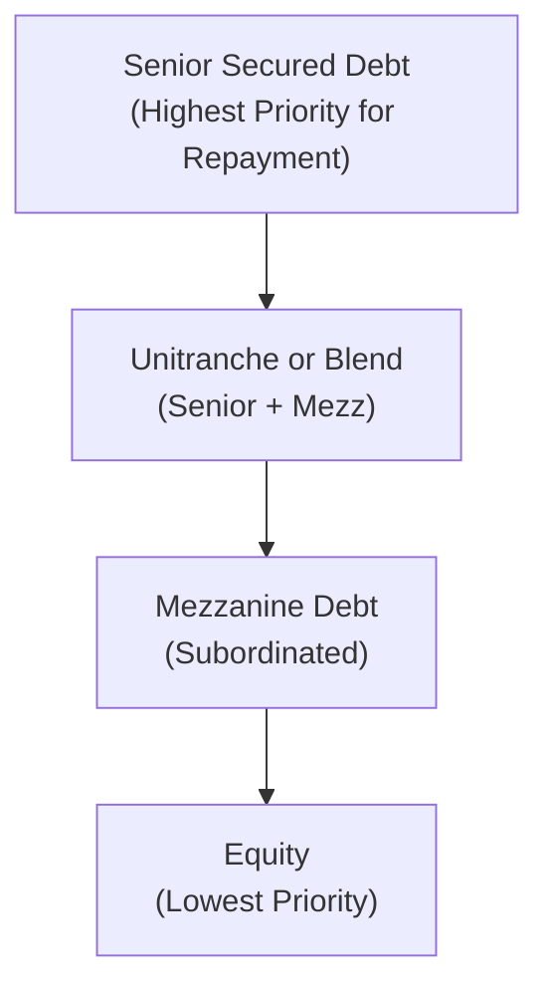

## Introduction
Private debt. Two simple words, right? Yet, for many, it conjures up images of dimly lit backrooms with hush-hush deals being made. Actually, it’s not that shadowy at all—though sometimes it feels that way when you compare it with the more transparent world of public bonds and syndicated loans. Private debt is just debt that isn’t issued or traded on a public exchange, which means the lenders are often specialized asset managers or funds rather than big banks. They might say, “Hey, we’ll give your company a loan at a decent rate and with flexible terms, but in return, we want to see tangible security or, at the very least, some robust financial covenants.” Makes sense, right?

Meanwhile, direct lending is a subset of that broader private debt universe. You skip the middle steps of going to a major commercial bank or launching a public bond, and you borrow directly from a private credit fund or specialized lender. This concept really took off a few years ago when large banks began retreating from certain lending markets, possibly due to stricter capital requirements or risk constraints. That’s where private lenders stepped in—they saw opportunity. And so, the modern direct lending environment was born.

In this section, we’ll unwrap the details behind private debt and direct lending, from the “unitranche” structures (which sound fancy but basically combine senior and mezzanine tranches into a single loan) to the day-to-day challenges of monitoring credit risk. We’ll also chat about how private debt can fit into your broader portfolio strategy, and how it might offer that extra punch of yield (along with some unique risks).

## The Rise of Private Debt
If you’re wondering why private debt has boomed over the last decade or so, let me share a quick anecdote. I used to know a CFO at a mid-sized manufacturing company—let’s call her Jamie—who complained that her bank had started turning off the lending taps right after the global financial crisis. The bank demanded more collateral, shorter terms, and higher rates. Suddenly, a private credit fund approached her with, “We’ll offer you a more flexible capital structure, but we’ll want tighter covenants and a slightly higher interest rate.” Jamie took the offer, because it let her company expand production and invest for future growth without overly restrictive bank terms. Stories like this have happened everywhere—especially in the middle-market segment, fueling the surge in direct lending.

From a macro perspective, banks are subject to capital adequacy requirements and regulatory constraints that can discourage certain types of lending. So private funds, free from many of those constraints (though not from all forms of oversight), stepped in to fill the gap. As a result, we now see entire funds—and even multi-strategy platforms—dedicated exclusively to private debt.

## Key Concepts in Private Debt
Before diving deeper, let’s define a few critical elements that underpin private debt and direct lending. Some terms might sound intimidating, but trust me, they’re relatively straightforward once you break them down:

- Senior Secured Loans: These loans are at the top of the capital structure. This means in the event of default, senior lenders get first dibs at the borrower’s assets (collateral). The risk is comparatively lower than other forms of debt, so interest rates are often lower.

- Unitranche: A single debt facility that bundles senior and mezzanine debt into one integrated loan. It simplifies documentation, but typically comes with a blended interest rate that sits somewhere between senior loan rates and mezzanine rates.

- Mezzanine Debt: This is a hybrid that rests below senior loans but above equity. It commands a higher return (and sometimes an equity kicker) because it’s riskier than senior debt but less risky than pure equity. 

- Covenants: These are contractual provisions designed to protect lenders. They can be financial (e.g., maintaining certain leverage ratios) or operational (e.g., restricting certain types of corporate actions).

- Default Risk: The risk that the borrower won’t repay principal or interest in a timely manner. This is absolutely crucial to analyze when we’re dealing with private debt because there isn’t always a deep secondary market to unload the position.

- Credit Enhancements: Additional structural features, like collateral, personal guarantees, or standby letters of credit, that mitigate default risk.

### Visualizing the Capital Structure
Here’s a quick mermaid diagram to illustrate where different types of debt and equity stand in the typical corporate capital stack:

As you move from A to D, the potential returns generally increase, but so does the risk. 

## Risk-Return Profiles
Well, the million-dollar question is always: “What kind of return can I expect, and at what risk?” Senior secured loans carry less risk and thus offer lower yields. Mezzanine debt, on the other hand, can yield significantly more, sometimes with an equity kicker. You can think of mezzanine like that in-between zone: It’s not as safe as senior debt, but it’s not quite as risky as pure equity.

Private debt can also be structured in numerous creative ways. We can have interest rates that float (like LIBOR plus a spread, or these days SOFR plus a spread), or fixed rates for the life of the loan. There may be “PIK” (payment-in-kind) interest—where the interest is not paid in cash but rolled into the principal. Each structure modifies the risk-return equation. And, you know, you want to watch for covenants that might accelerate repayment or trigger default if the borrower’s financial performance dips.

## Direct Lending in Practice
Direct lending is basically the art of bypassing traditional banks. Instead of a bank, a fund or specialized lender steps in to structure the loan directly with the borrowing company. One reason borrowers might choose direct lending is speed. When you apply for a bank loan, you sometimes wait weeks—if not months—for approvals. With private lenders, decisions can come faster (though not always, depending on the lender’s internal processes).

This “direct” approach often benefits smaller or mid-sized companies (sometimes referred to as the “middle market”), which may not have easy access to public bond markets. The deal sizes can range from a few million dollars all the way into the hundreds of millions. 

### The Cash Flow Process
To grasp how direct lending works, check out this simplified flow:

1) Investors commit capital to a private credit fund.  
2) The fund identifies lending opportunities.  
3) The borrower obtains the loan and makes interest + principal payments.  
4) The fund passes distributions back to investors as yields or other forms of return.

## Credit Analysis and Due Diligence
But how do you decide whom to lend to? It’s not as simple as reading a rating agency’s opinion, because a lot of these borrowers are unrated. So private lenders usually perform deep due diligence that covers:

- Borrower’s Financial Health: Studying financial statements, adjusted EBITDA, leverage ratios, and liquidity.  
- Industry Dynamics: Understanding sector trends, competitive positioning, and potential disruption.  
- Collateral Valuation: Determining if assets used as collateral (like property, equipment, or inventory) have sufficient liquidation value should default occur.  
- Management Quality: Evaluating the experience and credibility of the leadership team.  
- Covenants: Determining the appropriate financial covenants that align with the company’s expected performance.  

Some lenders might even send in their own teams or third-party specialists for field examinations—verifying inventory counts, accounts receivable, or operational processes. It may seem intrusive, but private lenders need to ensure they have robust real-time data to limit risk exposure.

## Portfolio Perspectives
Why would a portfolio manager, say for a pension fund or endowment, get all pumped up about private debt? Generally, it’s the combination of potential yield enhancement, steady cash flows, and diversification. That said, illiquidity is a very real trade-off. If you invest in private debt, you usually can’t sell your position at the snap of a finger. This means you could be locked in for years.

Historically, private debt has shown relatively low correlation with other asset classes, such as public equities or government bonds. This can help smooth out a portfolio’s overall volatility. However, it’s also subject to credit cycles. In an economic downturn, defaults might spike, and the recovery process for private loans can be messy. So you want to size these allocations carefully.  

From an exam perspective (yes, let’s not forget we’re all doing this for the exam, too!), remember that private debt is often cited as an illiquid asset with higher yields, needing specialized credit analysis. You might see question prompts about how to incorporate direct lending into an asset allocation, or you might be required to evaluate a potential default scenario by referencing a borrower’s capital structure.

## The Regulatory Environment
After the global financial crisis, regulators increased capital requirements for banks (“Basel III” and beyond). Banks either scaled back or exited certain lending spaces to comply with these restrictions. That vacuum was quickly filled by private lenders. 

In some jurisdictions, there are also regulations specifically designed to protect small businesses and limit predatory lending. Private credit funds must be mindful of these. Meanwhile, institutional investors (like insurance companies or pension funds) might have their own set of rules regarding how much private debt exposure they can hold. 

Internationally, it can get more complicated. Different countries have varying rules about foreign ownership of debt, capital controls, or tax treatment of interest payments. If that’s not enough complexity, credit funds may also adopt offshore structures to optimize taxes for certain investors. So yeah—private debt might be “private,” but it’s certainly not free of regulatory strings.

## Common Pitfalls and Best Practices
People often say private debt is “the new private equity.” It’s a catchy phrase, but it can be misleading. Private equity investors typically have direct control of a business (and an equity stake). Private debts, by contrast, remain lenders. Even if the borrower fails, the lender’s recourse is primarily tied to contractual claims. 

Here are some pitfalls to watch out for:
- Overreliance on covenant-lite structures. Without tight covenants, lenders may not detect early signs of distress.  
- Underestimating illiquidity. In a downturn, trying to exit a private loan early can be painful (or nearly impossible).  
- Inadequate diversification. Allocating too much to a narrow industry or group of borrowers can magnify risk.  
- Insufficient capital cushion. Private lenders should maintain a buffer to handle drawdowns and losses.

And some best practices:
- Proactive Monitoring: Regular updates on borrower performance and immediate follow-up on covenant breaches.  
- Scenario Analysis: Stress-tests for multiple economic conditions, especially if the borrower is in a cyclical industry.  
- Thorough Documentation: Loan agreements should be crystal clear on borrower obligations, default triggers, and enforcement strategies.  
- Alignment of Interests: Sometimes, co-investment by the borrower’s management results in better alignment and performance.

## Case Example: Mezzanine Financing in Manufacturing
Imagine a mid-market manufacturer. They want to buy new equipment to expand capacity, but first-lien senior lenders are maxed out. Instead of equity finance (which would dilute existing owners), they pursue mezzanine financing from a private credit fund. The mezz piece might carry a 10-12% coupon plus warrants granting the fund the right to buy shares at a set price in the future.

- If the expansion goes well, the company’s cash flows easily cover the mezz coupon, and the warrants could become valuable.  
- If they stumble, the mezz lender will likely try to renegotiate or enforce covenants. It’s riskier than senior debt, but the higher coupon compensates.  

This scenario highlights a typical use case for mezzanine: bridging the gap between senior lending capacity and desired growth capital.

## Conclusion
Private debt and direct lending have carved out a major niche in modern finance. For borrowers, these structures offer potentially more flexible funding. For investors, it can provide an appealing way to boost yields and diversify away from publicly traded bonds. Yet these benefits come with strings attached—longer lock-up periods, higher default risk, and the need for specialized underwriting.  

In my opinion, we’re going to see private debt continue to grow, especially among institutional investors searching for stable income streams in a potentially low-yield environment. Just be sure to do your homework. Private debt can be amazing if you get it right, and a major headache if you get it wrong. The difference lies in robust credit analysis, savvy structuring, and active monitoring.

## References
- Private Debt Investor: <https://www.privatedebtinvestor.com>  
- CFA Institute, Credit Risk Analysis Frameworks  
- Standard & Poor’s, Leveraged Finance and Direct Lending Best Practices  

## Exam Tips
• Understand how to compare private debt vs. public bonds in terms of return expectations, liquidity, and credit risk.  
• Memorize the typical capital stack, especially how senior debt, mezzanine, and equity rank in terms of claims and rewards.  
• Practice evaluating default risk scenarios. Be ready to put on your credit analyst hat and parse cash flow statements, coverage ratios, and covenant terms.  
• Anticipate questions about how private debt fits into portfolio allocation and why some investors value it as a diversification tool.  
• Keep in mind the role of regulatory factors in shaping private debt’s growth.

## Test Your Knowledge: Private Debt and Direct Lending



### Which best describes private debt?
- [ ] Debt issued in the public markets with extensive regulatory disclosure.
- [ ] Debt that is originated and serviced only by commercial banks.
- [x] Debt that is not issued or traded on public exchanges, typically offered by specialized lenders or funds.
- [ ] Government debt issued via central banks.

> **Explanation:** By definition, private debt refers to debt instruments that are not publicly traded, such as those offered by specialized funds or direct lending platforms.

### Which characteristic is most common in a mezzanine financing arrangement?
- [x] It may include both debt and an equity component (e.g., warrants).
- [ ] It is always senior to any other form of corporate debt.
- [ ] It must be repaid before any other outstanding obligations.
- [ ] It only offers a fixed coupon and no other benefits to lenders.

> **Explanation:** Mezzanine debt frequently includes an equity kicker, such as warrants, to compensate lenders for the higher risk they incur relative to senior secured debt.

### In a covenant-lite loan structure, which risk is heightened for lenders?
- [ ] Lower interest rate risk.
- [ ] Lower liquidity risk.
- [x] Higher risk of not detecting early borrower distress.
- [ ] Lower probability of default.

> **Explanation:** Covenant-lite loans have fewer protective terms, making it more difficult for lenders to catch potential credit problems early and take timely action.

### Which of the following best explains why direct lending has grown in recent years?
- [ ] Traditional banks have loosened their lending standards and restricted private funds.
- [ ] Direct lending often provides borrowers with no due diligence requirements.
- [x] Regulatory changes have constrained banks’ ability to lend, creating opportunities for private funds to fill the gap.
- [ ] Interest rates in the broader market have significantly increased, reducing the need for private capital.

> **Explanation:** Stricter capital requirements have forced banks to curtail certain lending activities, allowing private credit funds to step into the space.

### Which statement is most accurate regarding the unitranche structure?
- [ ] It typically has the highest seniority and the lowest cost of capital.
- [x] It blends senior and subordinated debt into a single loan with a single interest rate.
- [ ] It is a purely equity-based financing tool without interest payments.
- [ ] It only applies to distressed companies seeking bankruptcy protection.

> **Explanation:** By combining senior and subordinated loans into one blended facility, unitranche structures streamline financing for borrowers but often carry a higher blended rate than pure senior loans.

### In the event of default, which party generally has the first claim on the borrower’s assets?
- [ ] Equity holders.
- [x] Holders of senior secured debt.
- [ ] Mezzanine lenders.
- [ ] Subordinated shareholders.

> **Explanation:** Senior secured debt typically occupies the highest priority in the capital stack. Hence, these lenders have first claim on assets upon default.

### Which factor often makes private debt attractive within a diversified portfolio?
- [x] Potentially lower correlation with public equities and fixed income.
- [ ] Guaranteed liquidity in all market conditions.
- [x] Higher yields but no exposure to default risk.
- [ ] Mandatory rating by major credit rating agencies.

> **Explanation:** Private debt can enhance portfolio diversification and yield. However, it does carry material default risk and typically lacks liquidity.

### A borrower in the manufacturing sector is seeking growth capital, but its senior debt capacity is maxed out. Which financing option might best fill the gap?
- [ ] Asset-backed securities.
- [x] Mezzanine debt.
- [ ] Treasury bonds.
- [ ] Short-term commercial paper with no covenants.

> **Explanation:** Mezzanine financing is commonly used when senior capacity is exhausted and an equity issuance is not desired. It offers additional capital with partial equity-like features.

### Which approach is a best practice for lenders when monitoring a private debt position?
- [ ] Perform a one-time credit analysis at loan inception and avoid further follow-ups.
- [x] Conduct periodic site visits, review covenants regularly, and analyze updated financial statements.
- [ ] Rely solely on credit rating agencies for ongoing borrower risk assessments.
- [ ] Automatically roll over debt without evaluating potential changes in the borrower’s situation.

> **Explanation:** Ongoing analysis and covenant checks enable lenders to spot and address early signs of borrower distress, a critical element of effective risk management in private debt.

### True or False: In unitranche lending, interest rates are always lower than in a traditional senior loan.
- [x] True
- [ ] False

> **Explanation:** Actually, be cautious here. In many cases, unitranche rates can be higher than a pure senior loan but lower than a separate senior+mezzanine structure when taken as a blended average. Some might consider it “lower than combining separate facilities,” but comparing it strictly to senior debt alone might reveal a higher coupon. Even though the statement sounds straightforward, real-world deals vary widely. The typical idea is that unitranche can be more expensive than a standard senior loan but cheaper than a full mezz combo. (This subtlety sometimes appears in exam questions!)


