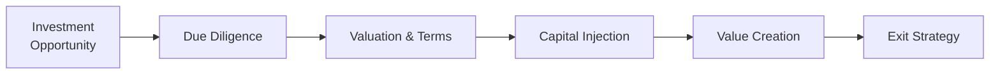

## Introduction

Perhaps you've heard a friend excitedly talking about investing in a startup or participating in a private equity deal—these stories are filled with big dreams of growth, but they can get pretty complicated once you peel back the layers. Well, private capital investments, whether in equity or debt, often hinge on detailed and careful valuations. And these valuations don’t just pop out of thin air; they're influenced by market conditions, industry trends, macro cycles, and even the personalities sitting around the negotiation table.

In this section, we’ll cover major valuation methods used for private companies, explain why it's so important to factor in illiquidity when working through valuations, and detail common exit strategies to help you envision how investors eventually realize returns. We’ll also discuss how to manage liquidity constraints over the life of a private investment. So, buckle up. Let's dive in.

## Valuation Approaches for Private Companies

One thing that caught me off guard early in my career was just how differently private and public companies can be valued. Unlike public equities—where share prices are flashed at you in real time—private firms don’t have that readily available “market price.” Instead, we rely on multiple valuation techniques, each giving us a slightly different perspective.

### Discounted Cash Flow (DCF) Analysis

The DCF method is rooted in projecting a company’s future cash flows and discounting them to the present value using an appropriate discount rate (often denoted r). This model is a cornerstone of corporate finance and a favorite among many analysts looking at private equity investments.

Here’s a simplified representation of the equity value derived from a DCF approach:

$$
\text{Equity Value} = \sum_{t=1}^{n} \frac{FCFE_t}{(1 + r)^t}
$$

Where:
• \\(FCFE_t\\) represents the forecasted Free Cash Flow to Equity in each period t.  
• \\(r\\) is the cost of equity or an appropriate discount rate.  
• \\(n\\) is the total number of forecast periods.

If you’ve ever cracked open a thick financial model, you know these forecasts can be sensitive to even tiny changes in assumptions. A 0.5% tweak in the discount rate could change your final valuation by millions (or billions) depending on the scale. It’s crucial to test different scenarios—like “best,” “base,” and “worst”—to see how the investment’s value holds up under varied conditions.

### Comparable Company Analysis

Sometimes known as “comps,” this approach involves comparing the target private company with a set of publicly traded peers. We look at valuation multiples (like EV/EBITDA, P/E) and see where the private company might stack up.

But watch out for a mismatch: the private firm might be smaller, less diversified, or have a narrower distribution network. Adjusting for these differences is as much an art as it is a science. Comps can be enlightening, but you always need to qualify the analysis with a good understanding of how the companies differ.

### Precedent Transactions Analysis

In many private equity deals, you’ll see bankers pitching a “precedent transaction” approach—basically, analyzing multiples paid in similar M&A or leveraged buyout (LBO) transactions. This method looks at historical deals in the same sector or with a similar growth profile. Sometimes, especially in hot markets, multiples can skyrocket and you might see valuations that defy logic (because maybe the buyer had strategic reasons to pay a premium).

Again, do your homework: confirm the time period of the transactions, the reason behind any premium (like synergy potential or a strategic rivalry), and the capital structure used to finance the deals. A robust set of transaction comps can be super helpful, but outdated data from five years ago might not reflect current macro conditions—especially if interest rates or sector fundamentals have shifted drastically.

### Adjusted Book Value

Every so often, particularly in asset-intensive industries (real estate, heavy manufacturing), we rely on adjusted book value. This entails taking the company's balance sheet assets and liabilities and reevaluating them to better reflect fair market values rather than historical cost. While it’s often a more conservative approach, it’s useful if the target is close to or at liquidation value, or if you want a baseline to see how intangible assets (like intellectual property) or intangible liabilities (like certain off-balance-sheet items) might affect the overall valuation.

## Managing Illiquidity Discounts

Unlike shares of a publicly traded giant, a private investment can’t just be sold tomorrow at the click of a button. This liquidity gap typically commands an “illiquidity discount.” Investors often apply a certain percentage discount to valuations to compensate for the slower (and more complicated) process of exiting the position.

The magnitude of this discount can vary widely—some might apply a 10–20% discount, while others might go higher depending on factors like the type of industry, the stage of the company (e.g., high-growth startup vs. mature, cash-generative business), and general economic conditions. In a booming economy with plenty of strategic buyers lurking, the illiquidity discount might shrink. In a slow, risk-averse environment, you might see it widen as it becomes tougher to find motivated buyers.

## Exit Strategies

You might be thinking, “So I’ve bought these private shares… how do I ever see my money again?” Exit strategies are the bread and butter of private capital investing. Here are four of the most common ways out:

• Trade Sale: The company is sold to a strategic acquirer—think of a big industry player wanting to snap up a smaller competitor for synergy or market-share reasons. This is often the dream scenario for many private equity funds. The collaborations can create synergy (or at least we hope so!).  
• Secondary Buyout: When one private equity fund sells a portfolio company to another PE fund. This can sound like a case of “pass the parcel,” but it’s often a legitimate route if the new fund has a different skill set for the next stage of growth.  
• Initial Public Offering (IPO): Selling shares to the public for the first time. This route can create a lot of buzz, but also demands heavy underwriting fees and compliance obligations. Market timing is crucial, as an IPO in a down market can be a painful experience for all involved.  
• Recapitalization: Often seen when a private equity sponsor refinances or restructures a portfolio company’s debt. This might return some capital to equity holders without an outright sale. Still, it doesn’t always result in a full exit.

One time, I watched a small regional chain of specialty coffee shops pivot to a national brand under private equity ownership. Eventually, they pursued a secondary buyout, handing the company over to a larger private equity group with more growth resources. The original PE fund locked in a healthy return—no IPO needed, no trade sale. Just a new financial partner with a fresh plan.

## Liquidity Considerations

Private equity investments typically have holding periods of anywhere from three to seven years—though some can stretch far longer if the road to growth is bumpy. During that time, the sponsor and investors might have limited (or no) ability to cash out. That’s why many limited partnership agreements (LPAs) impose lock-up periods or severely restrict transfer rights.

It’s wise to identify potential buyers (strategic or financial) early on. Let’s say you’re investing in a niche manufacturing company. You might keep a short list of potential industrial giants that could see synergy in buying you out. Or you might keep an eye on vertical integration trends that could spark interest from a bigger fish in the supply chain.

Short version: plan for the illiquidity. You can’t necessarily “hammer out” if the market dips. If your main capital has a large chunk tied in private deals, you likely need to keep enough in liquid assets that you don’t get stuck in a cash crunch.

## Macro Conditions, Capital Market Cycles, and Industry Trends

Valuations of private companies rarely exist in a vacuum. Economic indicators—like interest rates, inflation, and GDP growth—can influence the discount rate you use in a DCF, affect how generous or stingy buyers might be, and even shift entire industries. For instance, a steep rise in interest rates can dampen buyout activity because the cost of leveraged debt skyrockets.

Likewise, consider the cyclical or secular trends in the company’s industry. Are we dealing with a hot “disruptive tech” sector with sky-high innovation potential? Or is it a stable, mature industry with relatively limited growth prospects? Both can present opportunities, but the multiple you’re likely to pay—whether 5× EBITDA or 15×—can vary drastically. Keep an eye on broader market sentiment, as it can fuel or suppress exit opportunities.

## Potential Conflicts in Multi-Investor Structures

When multiple investors—say, different private equity funds or co-investment partners—share the same cap table, you might encounter misaligned incentives. One investor might want to exit at year four, while another is eager to keep the company growing until year seven. This can spark tension and slow down negotiations with potential buyers.

Clear documentation on “drag-along” or “tag-along” rights can save you a headache. These provisions define what happens if a majority investor wants to sell and how minority shareholders can respond. It’s best to clarify from the start: if the ideal exit comes early, do we all agree to move forward?

## Scenario Analysis and Stress Testing

Back when I was new to building financial models, I learned quickly that “stuff happens” in real-world business. So stress testing is essential. By adjusting key assumptions—like revenue growth, operating margins, or the discount rate—you see how fragile (or robust) your valuation is.

• Base Case: The most realistic assumption set.  
• Upside Case: The “everything goes right” scenario, with stronger revenue growth and stable costs.  
• Downside Case: The “brace-yourself” scenario, maybe factoring in new competition or an economic downturn.  

This helps ensure your capital structure is prepared for unexpected turbulence. Stress testing is also beneficial for negotiating with other stakeholders who might question your assumptions.

## Documentation for a Smoother Exit

A moment of real talk: nobody likes rummaging through disorganized financial statements or incomplete corporate records during due diligence. Thorough documentation from day one pays off big when the exit moment arrives. Keep an up-to-date data room with:

• Audited financial statements  
• Board minutes and strategic updates  
• Key contracts and licensing agreements  
• Intellectual property registrations (if relevant)  

When a potential buyer sees you’ve got everything in order, it can significantly speed up negotiations (and might even support a higher valuation).

## Practical Example: Valuing a Technology Startup

Let’s imagine you’re valuing a small enterprise software startup poised for significant growth—think big data analytics for Fortune 500 companies. You might:

• Develop a DCF to project free cash flow for the next five years. Because tech can scale quickly, the growth rates in initial years might be high, e.g., 40–50% revenue growth.  
• Compare your startup to publicly listed enterprise software firms with similar revenue models (SaaS structures). Adjust for the fact that your startup’s brand is lesser known and might have a narrower client base.  
• Explore precedent transactions in the software industry. Check any notable acquisitions. If you see a big tech giant acquiring companies at 10× forward revenue, that’s a (somewhat) relevant benchmark.  
• Factor in an illiquidity discount. Because you’re dealing with a private startup, maybe you decide an additional 15% discount is warranted.  
• Perform scenario analysis. In the most optimistic story, your startup becomes the next big SaaS platform. But in the downside scenario, major competitors replicate your features, cutting your projected cash flows in half.

This approach gives you a robust sense of the potential valuation range. Then it’s about negotiating the final deal terms with the founders and existing investors.

## Best Practices for Private Capital Valuation

• Stay Current on Industry Multiples: Don’t rely on old data sets. Markets shift quickly.  
• Perform Ongoing Due Diligence: Revisit your assumptions regularly. If revenue is trending below plan after year one, refine your model.  
• Consider the Holistic Picture: DCF alone isn’t enough. Use comps and precedents to sanity-check your outputs.  
• Engage Experts if Needed: Valuation specialists or accountants can help navigate nuances—especially for intangible assets.  
• Maintain Ethical Standards: Per the CFA Institute Code of Ethics, ensure that your valuation process is objective, transparent, and honest.  

## A Visual Overview of the Private Investment Lifecycle

Below is a simple Mermaid diagram illustrating a typical private investment lifecycle, from initial due diligence to exit:

This high-level flow also underscores the importance of planning for valuation, exit, and liquidity from day one.

## Final Exam Tips

• Link Valuation to Strategy: On exam questions, show that you understand how valuation methods connect to the bigger strategic context—like synergy, alignment of interests, and macro influences.  
• Highlight Key Risk Factors: Examiners often want you to demonstrate an awareness of how interest rates, economic cycles, and industry competition shape private company valuations.  
• Scenario Analysis Essentials: Practice building scenario analyses quickly so you can discuss the implications of changes in cost of capital or growth assumptions.  
• Know Your Exits: For short-answer or essay-style questions, be ready to articulate the pros and cons of each exit route.  
• Integrate Ethical Frameworks: If a question touches on governance or conflicts of interest in multi-investor deals, mention relevant CFA Institute Code of Ethics principles and align them to your solution.  
• Time Management: If it’s a multi-part question, be strategic. Outline your major points first, ensuring you address each requirement thoroughly but concisely.

## References

• Damodaran, A. (2012). Investment Valuation: Tools and Techniques for Determining the Value of Any Asset, 3rd Edition.  
• Koller, T., Goedhart, M., & Wessels, D. (2020). Valuation: Measuring and Managing the Value of Companies (7th Edition). McKinsey & Company.  
• PitchBook and Preqin Databases for current market transaction multiples and exit trends.  
• CFA Institute. (Current Edition). CFA Institute Code of Ethics & Standards of Professional Conduct.

## Test Your Knowledge of Valuation Approaches, Exit Strategies, and Liquidity



### Which of the following best describes how a Discounted Cash Flow (DCF) analysis is calculated?

- [ ] Multiplying the company’s EBITDA by a market multiple.  
- [x] Projecting the company’s future cash flows and discounting them to a present value.  
- [ ] Adding up the company’s net income over the last five years.  
- [ ] Taking the total assets minus total liabilities.  

> **Explanation:** A DCF projects future free cash flows and discounts them back to the present to determine their net present value.

### Which of the following factors typically demands an “illiquidity discount” in private equity valuations?

- [ ] Higher public market volatility.  
- [ ] Strong brand awareness of the private firm.  
- [x] The difficulty in quickly selling a private position.  
- [ ] Shorter typical holding periods compared to public stocks.  

> **Explanation:** Private company shares can’t always be traded freely, so investors require a discount to compensate for the relative illiquidity.

### A trade sale is best described as:

- [ ] The distribution of equity shares to existing bondholders.  
- [x] Selling the business to a strategic buyer in the same or related industry.  
- [ ] Converting the business into a publicly traded company.  
- [ ] An internal reorganization without changing ownership.  

> **Explanation:** A trade sale typically involves selling the company to a strategic acquirer who seeks synergy or market expansion.

### One of the main reasons to perform scenario analysis when valuing a private company is to:

- [x] Understand how changes in assumptions affect the valuation range.  
- [ ] Meet regulatory requirements for public disclosures.  
- [ ] Simplify the negotiation process by eliminating uncertainties.  
- [ ] Remove the need for a DCF analysis.  

> **Explanation:** Scenario analysis helps in gauging the sensitivity of the valuation to various inputs, aiding risk assessment.

### Which valuation approach typically uses multiples derived from recent M&A transactions to estimate the target’s value?

- [ ] Comparable Company Analysis  
- [ ] DCF Analysis  
- [x] Precedent Transactions Analysis  
- [ ] Adjusted Book Value  

> **Explanation:** Precedent Transactions use multiples from completed deals to approximate valuation for similar companies.

### In the context of exit strategies, a secondary buyout refers to:

- [ ] The sale of shares via an IPO.  
- [x] A private equity fund selling a portfolio company to another private equity fund.  
- [ ] Selling the company’s assets to a competitor.  
- [ ] Raising debt against the company’s cash flow to buy out existing shareholders.  

> **Explanation:** A secondary buyout is essentially a deal between two private equity funds involving the same portfolio company.

### Which best captures a key drawback of relying solely on the Adjusted Book Value method for valuation?

- [x] It may not reflect the future earnings potential of the business.  
- [ ] It always inflates the company’s value by too much.  
- [ ] It fully accounts for intangible assets like brand equity.  
- [ ] It is only permissible under U.S. GAAP.  

> **Explanation:** Adjusted Book Value focuses on revaluing balance sheet items and often overlooks earnings potential or intangible assets.

### In a scenario where interest rates suddenly rise significantly, which impact is most likely on private equity deals?

- [x] Financing becomes more expensive, potentially lowering valuations.  
- [ ] Entry multiples increase drastically.  
- [ ] Exit timelines shorten as buyers rush in.  
- [ ] Illiquidity discounts drop to near zero.  

> **Explanation:** Higher interest rates usually make leverage more expensive, depressing valuations and making deals less attractive.

### When multiple investors with different timelines hold equity in a private company, a common document that clarifies rights and obligations in exit events is:

- [x] A Shareholders’ Agreement with drag-along and tag-along provisions.  
- [ ] The private placement memorandum.  
- [ ] A non-disclosure agreement.  
- [ ] A due diligence report.  

> **Explanation:** Drag-along and tag-along provisions in shareholders’ agreements help align investors on how to proceed with exits.

### True or False: Recapitalization can provide partial liquidity to existing shareholders without a complete exit.

- [x] True  
- [ ] False  

> **Explanation:** A recapitalization often involves refinancing or restructuring the company’s debt, which can free up cash to be distributed to shareholders and provide partial liquidity.




