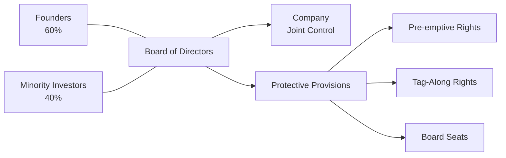

## Introduction
Growth equity and minority investments can be an exciting corner of the private capital universe. I vividly recall chatting with an entrepreneur friend—let’s call her Lisa—who had hustled for several years to build her tech-enabled services company from the ground up. The company was big enough that she no longer commented on every tiny detail, but it still had plenty of headroom for growth. She wanted to open a new regional office and maybe roll out a fresh product line. Yet, she wasn’t keen on giving up control of the entire shop. It’s in moments like these that growth equity and minority investments swoop in to save the day.

In essence, growth equity (sometimes called expansion capital) provides funding to established companies—folks like Lisa—who need a cash injection to spur accelerated growth, enter untapped markets, or even make some strategic acquisitions. Minority investments, on the other hand, let founders or existing majority shareholders keep the driver’s seat while still tapping into resources, networks, and capital from outside investors who own less than 50% of the business. These flexible structures can be incredibly appealing—especially if a management team wants both autonomy and strategic support. And that, in a nutshell, is why we find growth equity and minority investments to be such a compelling topic in the realm of alternative investments.

Below, we’ll explore the ins and outs of growth equity and minority investments from a vantage point relevant to CFA® candidates and finance professionals. We’ll talk structuring, due diligence, strategic alignment, risk management, exit strategies, and best practices. We’ll dip into real-world anecdotes, incorporate small bits of personal reflection, and, hopefully, keep it entertaining.

## Key Characteristics of Growth Equity
Growth equity deals share many of the features of private equity (PE). However, what often sets them apart is their focus on relatively mature companies (though still in a “growthy” phase, if you will) where the risk profile is considerably lower than an early-stage, pre-revenue startup. Let’s break down a few hallmark traits of growth equity.

• Established Companies: Growth equity targets companies that have moved well beyond the seed or venture stage. They usually have a proven product or service, existing customers, and stable (or at least steadily increasing) revenues. In many instances, their earnings may be modest or reinvested right back into the firm, but the business has already demonstrated traction and viability.

• Expansion Plans: The primary reason to raise growth equity capital is to accelerate expansion—whether that’s geographic expansion, an acquisition spree, or a push into new market verticals. In other words, management needs additional resources to scale without relinquishing complete ownership.

• Ownership Retention: In growth equity deals, owners often retain a significant (sometimes controlling) stake. Investors typically come in with minority positions so that founders or existing shareholders can remain at the helm, driving the company’s strategic vision.

• Focus on Revenue Growth Rather than Turnaround: Growth equity typically does not revolve around heavy operational or strategic turnarounds—there’s no significant restructuring or slashing of overhead. The thoroughness of operational improvements will vary, but the overarching goal is to capture additional market share rapidly.

• Exit Orientation: Like other private capital structures, growth equity investors eventually want to exit, possibly via an IPO, strategic sale, or sponsor-to-sponsor deal. Terms are typically negotiated up front to clarify exit horizons, protective provisions, and governance rights.

## Minority Investments: Empowering Without Overpowering
Minority investments, as the term suggests, do not confer a controlling interest in the company. Investors typically hold under 50% of the equity. So, how does this dynamic play out, and why do some founders love it?

• Founder Autonomy: When the founder or existing majority shareholders retain more than half the voting power, they preserve the final say on big decisions. You’d be amazed (or maybe not) at how important that is to entrepreneurs who want to preserve their “baby” and keep their brand identity intact.

• Support and Network: Minority investors often bring more than a check. They deliver expertise, strategic introductions, and operational know-how. The best minority investors work as partners, not overlords.

• Limited (But Real) Protection: Minority shareholders typically include various protective provisions in their deal documents. These protections might revolve around anti-dilution measures, veto rights for major transactions (mergers, acquisitions, or big capital expansion), or constraints on changes to the board composition.

• Sharing the Benefits: Although a smaller slice of ownership, minority investors still seek an attractive return. They’ll often push for performance milestones and alignment of interests. That can mean a board seat, certain governance rights, or convertible structures that reward them if the company outperforms.

## Typical Deal Structures
Growth equity and minority deals often come wrapped in a specific structure, such as preferred equity or convertible shares. These structures provide downside protection for investors while giving them a shot at the upside if things go well. Here are a few common approaches:

1. Preferred Equity: This is a separate class of shares that sits “above” the common equity in the capital stack. Preferred shares typically get priority for dividends or liquidation proceeds. It’s a relatively straightforward way for investors to protect themselves if the company underperforms.

2. Convertible Shares: A convertible instrument can be turned into common equity (or sometimes a different class of shares) at a predefined conversion ratio or trigger. If the company thrives, investors enjoy the benefits of equity appreciation; if it stalls, investors can be partially protected with liquidation preferences.

3. Warrants and Options: Sometimes, minority stake deals will involve warrants or options that allow the investor to buy additional shares in the future, often tied to performance or valuation targets.

4. Participating Preferred: In select cases, investors will structure “participating preferred” equity. This grants them not only a liquidation preference but also the ability to receive additional proceeds as if they converted into common stock. This sweetens their pot considerably, though entrepreneurs generally find it more investor-friendly than founder-friendly.

## Due Diligence: What Investors Look For
Growth equity and minority investors often conduct extensive due diligence to ascertain that the company can indeed scale. While any private equity or venture investor does diligence, growth-oriented deals have specific areas of emphasis:

• Historical Growth & Traction: Are existing revenues on a stable upward trend? Does churn remain within acceptable bounds?

• Market Size & Scalability: Investors want to see that the market has enough room for expansion, given the infusion of new capital. A product that’s too niche or a saturated market might dampen the potential track.

• Management Team: This is absolutely huge. Growth equity investors want a management team with proven leadership skills that can handle an expanding organization. Does management have depth? The CFO is typically evaluated to see if they can handle sophisticated financial controls.

• Strategic Milestones: Potential investors often look for well-defined milestones—be it launching in X new geographies, achieving Y million in revenue, or releasing new product lines. The existence of a clear strategy indicates that management knows how to deploy capital effectively.

• Governance & Controls: Growth naturally pushes an organization’s structure and processes. Investors like to see that the corporate governance framework is strong enough to handle the complexities of more employees, bigger budgets, and possibly multiple locations.

• Valuation: Because growth equity deals come at later stages, valuations can be quite hefty, reflecting the relatively lower business risk. However, determining the right price is still tricky. Many investors use a combination of discounted cash flow (DCF), comparable companies, and scenario analysis to triangulate a fair valuation.

Below is a brief Python code snippet that demonstrates a simplified scenario analysis for an investor’s target IRR:

```python
import numpy as np

def target_irr_investment(initial_investment, exit_value_low, exit_value_mid, exit_value_high, r=0.2, years=5):
    """
    Checks if a deal can meet a target IRR in low, mid, and high scenarios.
    :param initial_investment: float, amount invested now
    :param exit_value_low: float, exit amount in the low scenario
    :param exit_value_mid: float, exit amount in the mid scenario
    :param exit_value_high: float, exit amount in the high scenario
    :param r: float, target IRR
    :param years: int, investment horizon
    :return: dict with scenario feasibility
    """
    required_multiple = (1 + r) ** years
    invest_scenarios = {
        'low_scenario': exit_value_low / initial_investment,
        'mid_scenario': exit_value_mid / initial_investment,
        'high_scenario': exit_value_high / initial_investment
    }
    results = {}
    for scenario, multiple in invest_scenarios.items():
        results[scenario] = (multiple >= required_multiple)
    return results

result = target_irr_investment(10_000_000, 20_000_000, 30_000_000, 50_000_000, r=0.20, years=5)
print(result)
```

In this tiny snippet, the function calculates whether different exit-value scenarios meet a target internal rate of return (IRR) over a given horizon. In real-world deals, of course, the analysis would be more comprehensive, factoring in partial exits, convertible triggers, preferences, and so on.

## Key Financial Concepts and Formulas
One of the most commonly cited metrics for measuring returns in private investments is the IRR (Internal Rate of Return). In a single-period format, the IRR is the rate “r” that solves the following equation:


\displaystyle \sum_{t=0}^{T} \frac{C_t}{(1+r)^t} = 0


where \\( C_t \\) represents the net cash flow at time \\( t \\). A higher IRR indicates stronger project returns, all else equal.

For multi-stage deals, we might also consider the money multiple or MOIC (Multiple on Invested Capital). For instance, if you invest \$5 million and net \$20 million at exit—disregarding the time value of money—your MOIC is \\( \frac{20}{5} = 4 \\). IRR accounts for the time value of money more precisely, while MOIC is a simpler but less time-sensitive indicator.

## Governance, Control, and Protective Provisions
Minority investors typically negotiate certain rights into the shareholder agreements. These can include:

• Board Representation: Investors often want a seat on the board, ensuring they have insight into major decisions and the company’s performance.

• Protective Provisions (or Veto Rights): The ability to say “Hold on!” to major moves like a merger, re-domiciliation, or massive capital raise. They can’t drive decisions unilaterally, but they can at least prevent damaging moves.

• Pre-emptive Rights: These let investors maintain their ownership percentage in the face of new share issuances and avoid unexpected dilution.

• Liquidation Preferences: If the company goes under or is sold below a certain threshold, the minority investors may get first dibs on the proceeds before the common shareholders.

• Tag-Along and Drag-Along Rights: Tag-along ensures that if majority shareholders sell their interest, minority investors can join the sale under the same terms. Drag-along forces minority investors to sell if the majority do, streamlining big transactions.

A quick diagram in Mermaid.js might look like:



In this simplified schematic, founders and minority investors both feed into the Board of Directors and govern the company. Protective provisions branch out to illustrate how minority investors may influence certain critical decisions.

## Aligning Strategic Goals
To maximize the success of a growth equity or minority stake deal, alignment between the investor and the management team is absolutely paramount. Neither side wants to be in a scenario where the investor’s preference is to push for a quick trade sale, while the founder envisions a decade-long growth horizon.

• Clear Roadmaps: A robust business plan clarifying how new capital will be deployed. Among the key performance metrics might be monthly recurring revenue (MRR), user growth, or international expansions.

• Agreed-Upon Timelines: If the target exit timeline is five years, both parties should collectively craft a multi-year plan. If expansion results take longer (e.g., new markets have high barriers to entry), that should be built into the plan.

• Frequent Communication: If the relationship sours because of miscommunication—maybe expansions cost more than expected or a new product flops—transparent communication fosters trust and helps realign strategy.

• Milestones and Rewards: The deal may be structured so that management receives additional equity or bonuses upon hitting growth milestones. This further unifies short-term motivations with long-term goals.

## Potential Benefits and Drawbacks
### Benefits to Entrepreneurs
1. Growth Capital Without Losing Control: Lisa, from my earlier anecdote, can retain most of her equity while getting the funds needed.
2. Access to Expertise: Minority investors can introduce professional networks, contact potential clients, and help with governance best practices. 
3. Optionality for Future Rounds: With a modest dilution, the company can pave the way for a subsequent round—maybe a full buyout or even an IPO.

### Benefits to Investors
1. Exposure to a High-Growth Asset: Growth equity can deliver significant upside if the company scales effectively. 
2. Lower Risk vs. Early-Stage Ventures: The companies are more established, with—hopefully—lower downside risk. 
3. Diversifying Portfolios: Limited partners appreciate the mid-range risk/return profile that growth equity can complement in a broad private equity portfolio.

### Drawbacks and Watch-Outs
1. Governance Conflicts: Minority investors may want more say, while founders remain protective of autonomy. 
2. Overvaluation Risks: The window for growth might be narrower than originally pitched. Over-inflated valuations can come back to bite everyone if the company fails to hit lofty projections.
3. Limited Liquidity: Since we’re playing in private capital land, liquidity events—such as an IPO or an acquisition—might be unpredictable.
4. Control Issues: Protective provisions can become cumbersome if overly restrictive, hindering the founder’s ability to make quick, strategic decisions.

## Real-World Examples and Case Studies
• Tech-Enabled Consumer Goods Company: Imagine a subscription-based health foods supplier experiencing 30% annual growth but struggling with nationwide distribution. A growth equity investor provides \$30 million in preferred equity, targeting an expansion into 50 new states within two years. The founder’s stake dilutes from 70% to 60%, but they remain the controlling shareholder. Post-investment, the company invests in logistical infrastructure, marketing, and additional staff. Within three years, the investor might exit via a public listing, reaping a 3–4x return on capital.

• Minority Stake for Family Businesses: A family-owned manufacturing plant wants to open a new production line. They can’t raise the needed \$10 million from a commercial bank on good terms. A minority investor steps in, offering capital, technical know-how on modernizing assembly lines, and connections. The family retains 55% ownership, comfortably in control. Five years later, the business’s revenue doubles, and the minority investor has an attractive exit to a strategic buyer in the same industry.

## Risk Management and Mitigation
### Thorough Legal Documentation
Use robust legal documentation to clarify the investor’s protective provisions, voting rights, and board representation:

• Representation & Warranties: The founders represent the business as described—lack of hidden liabilities, no major undisclosed lawsuits, etc.  
• Covenants: Affirmative covenants to maintain certain financial ratios; negative covenants restricting big capital expenditures without investor consent.

### Staged Funding
Sometimes investors structure capital infusions in tranches. Each disbursement depends on the company’s ability to meet specified milestones. This approach helps manage risk when expansions or product rollouts face uncertainty.

### Transparent Reporting
Growth equity and minority investors often require monthly or quarterly KPI updates, or a seat on the board, so they can regularly assess progress. This real-time oversight, while not overly intrusive, can help spot red flags early.

### Portfolio Diversification
From an investor’s standpoint, growth equity deals are just one slice of the broader private capital portfolio. Spreading risk across multiple companies—including different industries and geographies—mitigates the overall portfolio volatility.

## Exam Tips for CFA® Candidates
• Practice Distinctions: Be prepared to differentiate between growth equity, venture capital, buyouts, and distressed strategies. Recognizing nuance is often tested.  
• Understand Terminology: Terms like “liquidation preference,” “participating preferred,” “anti-dilution,” and “protective provisions” frequently pop up in exam scenarios.  
• IRR vs. MOIC: Know how to calculate each, and how they differ in measuring performance. Remember time value of money.  
• Scenario Analysis: The CFA exam might present a scenario where you must evaluate exit outcomes under different assumptions. Practice building or interpreting simple models.  
• Ethical Considerations: Growth equity deals can raise conflict-of-interest issues, especially regarding minority rights and potential misalignment with founder goals. Keep the CFA Institute Code of Ethics in mind.  
• Essay Questions: The exam’s constructed-response questions might require you to recommend an appropriate private investment strategy for a given client scenario—growth equity vs. buyout vs. venture—based on risk tolerance, time horizon, and governance preferences.

## Conclusion
Growth equity and minority investments occupy a sweet spot in the private capital spectrum: they offer companies the fuel to expand while preserving autonomy, and they provide investors with a relatively attractive risk-return profile—somewhere between venture capital seeds and full-scale leveraged buyouts. Whether you’re a future investment manager, an aspiring CFO, or a curious observer, understanding how to structure, evaluate, and manage these deals is crucial.

Indeed, from a portfolio management perspective, growth equity can help achieve diversification and balance in an alternatives allocation. For the entrepreneurial crowd, a minority investment might be the perfect partnership that leaves founders in the driver’s seat but with a rocket booster strapped on.

If you aim to incorporate growth equity or minority deals into a portfolio—or if you’re facing an exam question that puts you in the seat of an allocator deciding among different private equity flavors—remember the critical points: check alignment of objectives, measure carefully, manage governance, and keep a watchful eye on exits and valuations. 

## References and Further Reading
• “Minority Shareholder Rights,” Harvard Law School Forum on Corporate Governance.  
• Bain & Co. and PwC Reports on Growth Equity Trends and Best Practices  
• Corporate Finance Institute, “Hybrid Financing Structures”  
• CFA Institute Materials on Private Equity and Alternative Investments  

--------------------------------------------------------------------------------

## Test Your Knowledge: Growth Equity and Minority Investments



### Which statement best describes the objective of growth equity investments?

- [ ] To fully acquire mature, underperforming companies and turn them around through cost-cutting.
- [x] To provide expansion capital to established companies with the goal of accelerating growth.
- [ ] To invest exclusively in early-stage startups with no revenue history.
- [ ] To force majority ownership and control, focusing on restructuring.

> **Explanation:** Growth equity deals typically target established companies that desire additional capital to scale into new markets or product lines. They do not completely acquire or restructure the companies.

---

### Which of the following rights is most commonly associated with minority investments?

- [x] Protective provisions allowing investors to veto major corporate changes.
- [ ] The ability to unilaterally fire the management team.
- [ ] Full control over exit decisions with no input from the founder.
- [ ] Automatic board majority upon purchase of shares.

> **Explanation:** Minority investments typically include protective provisions or veto rights for major transactions. However, they do not typically grant unilateral power over operations or exits.

---

### Preferred equity in growth equity deals typically provides:

- [x] Priority over common shareholders in the event of a liquidation.
- [ ] Zero control or influence over the company’s governance.
- [ ] A guaranteed IPO within three years of investment.
- [ ] No possibility of capital gains, only dividend returns.

> **Explanation:** Preferred equity ensures that investors receive priority in liquidation, offering additional downside protection. However, it doesn’t guarantee an IPO or eliminate potential capital gains from growth.

---

### What is a key drawback for the founding team when accepting a growth equity investment?

- [ ] Immediate full transfer of ownership.
- [ ] Complete relinquishment of strategic decision-making.
- [x] Ownership dilution that reduces their percentage stake.
- [ ] No access to the investor’s network or expertise.

> **Explanation:** While founders retain control in a growth equity deal, they must typically accept some degree of ownership dilution. However, they still benefit from capital infusion and the expertise an investor can offer.

---

### Which of the following typically occurs when the investor’s stake remains under 50%?

- [x] The founding team maintains a controlling interest.
- [ ] The investor can override all major operational decisions.
- [x] The investor may have veto rights on major strategic moves.
- [ ] The investor automatically gains board majority.

> **Explanation:** Minority stakes usually mean the investor has less than 50% ownership. The founding team still controls the company, but the investor can negotiate veto rights on key decisions. They do not, however, automatically get majority board representation.

---

### A growth equity investor might prefer convertible notes because:

- [x] They offer downside protection plus potential equity upside.
- [ ] They eliminate the need for any legal documentation.
- [ ] They guarantee a constant yield regardless of performance.
- [ ] They never convert to equity under any circumstance.

> **Explanation:** Convertible instruments often provide a cushion if the company fails to meet expectations, but can still convert into equity if it performs strongly, giving investors the potential upside.

---

### Which scenario would make growth equity a better fit than a buyout?

- [x] The company seeks capital to expand operations while the founder retains control.
- [ ] The investor aims to restructure the target from top to bottom.
- [x] The founder only wants to sell below 50% of the company’s shares.
- [ ] The potential for cost-cutting and asset stripping is significant.

> **Explanation:** Growth equity deals are generally used by companies aiming to expand, not undergo a full buyout or major restructuring. Founders often seek to retain control, so selling only a minority stake suits their objectives.

---

### From an investor standpoint, one advantage of minority growth investments is:

- [x] Potential for significant returns if the company scales successfully.
- [ ] Complete immunity from capital losses.
- [ ] An obligation to manage daily operations.
- [ ] Inability to exit early or impact major decisions.

> **Explanation:** Growth equity investments can yield attractive returns if the company accelerates growth. However, investors also face risk, retain some (but not total) governance influence, and still have structured means for exit.

---

### A typical exit route for growth equity investors is:

- [x] An IPO or strategic sale after the company’s expansion.
- [ ] Forcing the company to remain private indefinitely.
- [ ] Selling back their shares to the founders at cost.
- [ ] Immediate liquidation of the company’s assets.

> **Explanation:** Growth equity investments often end in an IPO, a strategic sale, or sometimes a sponsor-to-sponsor transaction once growth objectives have been met. Immediate liquidation is usually not the goal of an expansion-focused investment.

---

### True or False: Condition-based “tranche investing” is often employed in growth equity deals to mitigate risk.

- [x] True
- [ ] False

> **Explanation:** Tranche-based funding is a common feature in many growth-oriented deals. Investors release capital in stages as the company meets agreed-upon milestones, helping reduce the risk of poor capital deployment.


