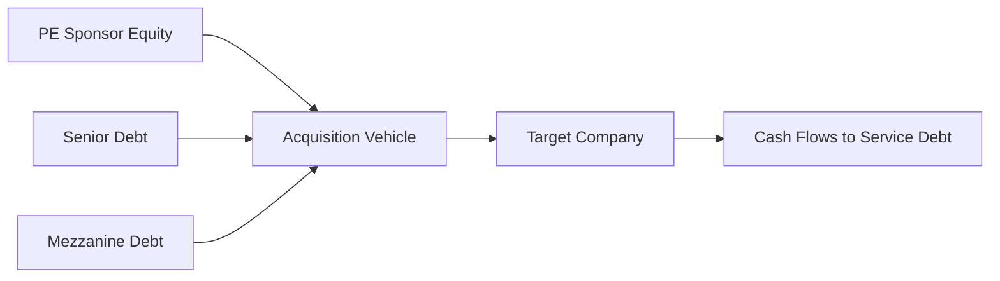

## Overview

So, let’s talk about leveraged buyouts (LBOs). It’s one of my favorite topics in private equity—partly because I remember the first time I tried to build an LBO model on an old, squeaky laptop in my tiny apartment. I was juggling multiple spreadsheets, my coffee was lukewarm, and, wow, did it feel intimidating. But after working through the logic bit by bit, I realized that building an LBO model is actually a systematic process: you gather the right inputs, carefully structure your sources and uses of capital, and outline your assumptions about the target company’s operations. Once you get the hang of that, you realize these models are some of the most fascinating insights into how private equity firms drive returns.

At its core, an LBO is a transaction in which a private equity sponsor—maybe along with other co-investors—acquires a target company primarily using borrowed funds. The borrowed money is secured by the target company’s assets or cash flows. The sponsor then leverages these cash flows to pay down the debt over the life of the investment. If everything goes well, the sponsor sells (or exits) the investment at a higher valuation than at entry (through improvements in the business, deleveraging, or valuation multiple expansion), thus generating outsized returns on the equity invested.

This model is a crucial analytical tool in the private equity world. It helps determine the potential returns for the equity investors under various assumptions, while also flagging any potential pitfalls such as insufficient coverage of interest expenses, covenant breaches, or too narrow of a margin of error in certain stress scenarios. Let’s dig deeper into how this all works.

## Foundations of an LBO

An LBO typically involves:

• A significant tranche of debt financing.  
• A portion of equity from the private equity (PE) sponsor (and possibly from management).  
• The expectation that the target’s future cash flows will cover interest payments and gradually pay down principal over time.  

Because the sponsor invests only a fraction of the total purchase price (often 30% or less, depending on market conditions), the returns on that equity can be magnified if the investment thesis holds up (i.e., if the business grows earnings, pays down debt, and secures a meaningful exit multiple).

In practice, an LBO model is designed to address questions like:  
• How much can we pay for a company and still meet our return targets?  
• How does changing the capital structure—using different types of debt—affect credit risk and return potential?  
• At what points do we breach covenants, and how likely are these scenarios?  

Ultimately, an LBO model must clearly show how the capital flows through the structure, what the projected financials of the target will look like over the investment horizon, and how sensitive these results are to changes in key variables—such as revenue growth, cost structure, or external factors like interest rates.

## Key Components of an LBO Model

When I first built an LBO model, I remember creating separate worksheets for each essential section. It might seem like a lot, but the structure keeps everything organized. The main pieces include:

### Sources and Uses of Funds

• Sources: Where does the money come from? Typical sources are senior bank debt, mezzanine debt, subordinated notes, and equity contributions from the sponsor (and possibly management).  
• Uses: How is the money allocated? This includes the purchase price (i.e., equity value plus any assumption/refinancing of existing debt), fees to bankers and lawyers, and other one-time charges such as compensation for management rollovers.

A simplified sources and uses table gets you thinking: “Okay, I have this chunk of money from senior debt, some from mezzanine debt, plus my equity. I’m putting it toward the purchase price and associated fees. Here’s my leftover cushion, if any.”

### Capital Structure

Once you line up the sources, you have to figure out how the transaction’s capital structure is layered. It often has multiple tranches of debt, each with its own interest rate, covenant packages, and repayment terms. Typical tranches include:

• Senior secured debt (e.g., revolver, term loans).  
• Second-lien or mezzanine debt.  
• Subordinated or high-yield bonds.  
• Equity layer (the sponsor’s stake).

These layers impact the required interest or coupon payments, priority of payment, and how quickly you can pay down principal. It’s essential to get each piece right because it shapes the post-buyout financial statements.

### Pro Forma Financial Statements

To see what happens after the LBO, you look at the income statement, balance sheet, and cash flow statement on a projected basis—what we call “pro forma” financials. The idea is: “Assume the deal closes at time zero. Now, how do things look for the next five to seven years?”

• Pro forma income statement includes new interest expenses resulting from the LBO debt.  
• Pro forma balance sheet recognizes the new debt and adjusted equity.  
• Pro forma cash flow statement reveals how quickly debt can be paid down and what level of free cash flow is available for reinvestment.

### Value Creation Initiatives

Private equity sponsors usually have a plan for how to boost the target’s performance. Maybe they see cost-cutting opportunities, revenue expansion in under-tapped markets, or synergies from acquiring an adjacent player down the road. You’ll want to reflect these assumptions in the model. A small, well-considered increase in EBITDA margins can significantly improve an LBO’s economics because it increases both the ability to service debt and the terminal value (if the exit occurs at an EBITDA multiple).

### Exit Strategy

The sponsor typically plans to exit in about five to seven years, hoping to achieve a certain internal rate of return (IRR). Some LBO models assume an exit multiple (e.g., EV/EBITDA) that might be the same as the entry multiple. Others will incorporate a range of exit multiples to see how multiple contraction or expansion might affect returns. Alternatively, the sponsor might set a target IRR (say 20–25%) and then see what exit price they need to charge to investors or strategic buyers to hit that return.

### Sensitivity Analysis

If there’s one thing that’s certain, it’s that nothing goes exactly as planned. Sensitivity tables let you see how changes in key assumptions—like exit multiple, revenue growth, or interest rates—affect your overall IRR. Believe me, these sensitivity tables can vastly reduce the “unknown unknowns” of the deal, letting you zero in on a comfortable range of outcomes before deciding whether to pursue the transaction.

## Step-by-Step LBO Model Construction

I’ll walk you through a common approach. If you’re following along in a spreadsheet, you might label separate tabs for each step:

### 1) Transaction Assumptions

Pull together the target’s historical performance, management’s growth projections, and key transaction terms:

• Purchase price: Often expressed as a multiple of LTM (last twelve months) EBITDA.  
• Financing structure: The amount of each debt tranche, interest rate, fees, etc.  
• Equity contribution: How much the sponsor is willing to invest.  
• Closing date: The day the transaction finalizes.

### 2) Sources and Uses

Lay out a table with rows for each source of capital (e.g., senior term loan, mezzanine loan, sponsor equity) and each use (e.g., equity purchase price, refinance existing debt, transaction fees). Confirm that total sources equal total uses.

### 3) Pro Forma Capitalization

This step updates the target’s balance sheet to reflect the new capital structure. The new debt is added, equity is adjusted for the sponsor’s contribution, and intangible items like goodwill might be created (depending on the purchase price above book value).

### 4) Build Out the Income Statement

Project the operational line items—revenue, cost of goods sold, operating expenses. Then incorporate your new interest expenses from each debt tranche along with any changes to depreciation and amortization. This way, you see how net income is affected post-LBO.

### 5) Construct the Cash Flow Statement

An LBO is all about using internal cash flows to pay down debt. So, carefully track interest expenses and principal repayments. If the business generates ample free cash flow, you can accelerate debt repayments, which further lowers interest and boosts equity returns.

### 6) Debt Schedule and Waterfall

Create a detailed schedule that shows how each tranche of debt is repaid. Senior debt usually has mandatory amortization. Mezzanine or subordinated debt might have bullet maturities or PIK (payment-in-kind) features. The model must handle these differences precisely.

### 7) Exit Analysis

Pick a holding period (five years is typical). Project the final-year EBITDA, multiply it by an assumed exit multiple, and subtract net debt. This derived equity value is what the sponsor pockets at exit. Then, compute the IRR on the sponsor’s initial equity investment.

### 8) Sensitivity and Scenario Testing

Explore what happens if your revenue stays flat or even declines. Or if interest rates jump by 100 basis points. Or if your exit multiple is acutely lower than the entry multiple. By building a sensitivity table—say with one axis for EBIT growth and another for exit multiple—your model will provide a matrix of IRRs. That’s how you see if you can make money in both the base case and the downside scenario.

## Mermaid Diagram of a Basic LBO Structure

Below is a simple flow diagram showing how capital flows in an LBO deal. Equity, senior debt, and mezzanine debt are used to acquire the target, and the target’s cash flows later service the debt:

## Sensitivity and Scenario Analyses

I remember once, we thought we had a deal locked in because the base-case IRR was 25%. Then we ran a downside scenario where revenue growth was just 1% below forecast and the exit multiple was slightly lower. Boom! Our IRR shrank to 12%. That near miss taught me to always build robust scenario analyses, so as not to get blindsided.

### Common Variables to Test

• Sales growth rate (or market expansion).  
• EBITDA margin improvements.  
• Exit year (earlier vs. later).  
• Exit multiple (could be lower than entry).  
• Interest rates (LIBOR/SOFR changes or credit spreads).  

### Stress Testing Covenants

Most senior debt comes with financial covenants—like a maximum leverage ratio or minimum interest coverage ratio. It’s good to incorporate formulas that dynamically calculate these ratios each quarter or each year, alerting you when you violate them. After all, breaching a covenant can trigger events of default, forcing the sponsor to renegotiate or inject additional equity.

## Case Example

Let’s do a tiny numeric example (nothing too fancy, just for illustration):

• Purchase price = 8× EBITDA on an LTM EBITDA of $50 million → $400 million purchase price.  
• Sources and Uses: 50% from senior debt ($200 million), 10% from mezzanine debt ($40 million), and 40% from equity ($160 million).  
• Assume senior debt has a 5% interest rate, mezz debt has a 10% interest rate.  
• Management projects EBITDA to grow at 8% annually.  

Over a 5-year horizon, the company’s EBITDA grows to about $74 million ($50 million × (1 + 8%)^5). If we assume a 7.5× exit multiple, the exit enterprise value is $555 million. Subtract net debt (depending on how much has been paid down), and the remainder goes to equity holders. Run the IRR calculations, see if we meet or exceed the target.

While this example is basic, it illustrates how the model’s logic works. Real deals often include multiple forms of debt, step-ups in interest rates, or performance-based adjustments. But at the end of the day, you’re always looking to figure out your equity returns under various assumptions, ensuring the transaction is viable.

## Common Pitfalls

• Overoptimistic Projections: Don’t just put in heroic growth. If management says 20% annual top-line expansion for five years, question carefully.  
• Ignoring Covenant Constraints: The model might say we can handle interest coverage—but covenants can be more restrictive.  
• Oversimplifying the Exit Multiple: Real-world valuations shift, so if your model only has a single exit multiple assumption, you might not see potential downside.  
• Underestimating Transaction Fees or Ongoing Costs: Advisors, lawyers, bankers, consultant fees can erode returns if you skip them in your model.  
• Not Considering Liquidity Requirements: Make sure enough cash remains in the business for working capital and capital expenditures.  

## Best Practices for Building a Solid LBO Model

• Keep it Modular: Use separate tabs for assumptions, financial statements, and sensitivity analysis.  
• Label Clearly: Clear naming conventions let you know exactly where each input or formula is.  
• Double-Check the Circular References: Complexity arises when interest expense, debt balances, and cash flows interact. Use iterative calculations if needed.  
• Document Assumptions: Write out in a cell note or separate section what each assumption is based on, so your co-workers (and future you) can understand the rationale.  
• Stress Test: Always test for scenario extremes (recession-level sales growth, ballooning interest rate, or exit multiple contraction).

## Formula for IRR

Often, we talk about IRR, the discount rate that sets net present value (NPV) to zero. In a simplified sense, if your initial investment is I₀ and your cash flows for each period t are CFₜ, the IRR solves:


\text{NPV} = \sum_{t=1}^{n} \frac{CF_t}{(1 + IRR)^t} - I_0 = 0.


Because it’s rarely solved analytically, we typically rely on IRR functions in spreadsheets. The main point is that the IRR measures the overall return, blending the growth in equity value with the time value of money.

## Conclusion

Building an LBO model can feel intimidating at first—just like it did for me when I tried it alone with a sinkful of coffee mugs. But once you break it down, it becomes a straightforward exercise in systematic logic. Draft your sources and uses, piece together the debt schedule, build your pro forma financials, and test different exit scenarios. The greatest risk is letting overconfidence or unrealistic assumptions creep in. So, remain cautious, let the sensitivity analyses guide you, and you’ll have a robust LBO model that offers a clear window into your potential returns and pitfalls. After all, finance is about balancing risk and reward, and an LBO model is a prime example of how to do that elegantly.

## Glossary

• Leveraged Buyout (LBO): Acquisition funded significantly by debt, with target company cash flows servicing the debt.  
• Sources and Uses of Funds: A table specifying where funds come from (equity, debt) and how they are used (purchase price, fees).  
• Pro Forma Financials: Projected financial statements assuming completion of a proposed transaction or event.  
• IRR (Internal Rate of Return): Discount rate making the net present value (NPV) of all cash flows equal to zero.  
• Multiple Expansion: Increasing the valuation multiple (e.g., EV/EBITDA) from entry to exit, thereby enhancing returns.

## References & Further Reading

• “Private Equity Leveraged Buyouts” (CFA Institute curriculum).  
• Damodaran Online (NYU) for comprehensive LBO modeling tutorials.  
• Wall Street Prep or Training the Street LBO model guides.  
• Chapters 3.1–3.5 of this Volume for broader context on Private Equity and Debt Investments.  
• For covenant analysis, see also Chapter 2.1 and 3.7 regarding risk and management team considerations.

---

## Test Your Knowledge: Leveraged Buyout Financial Modeling Essentials



### Which of the following best describes an LBO?

- [x] An acquisition structure that relies heavily on external debt financing, with target cash flows used to service that debt.
- [ ] A strategy to purchase a company mainly with retained earnings.
- [ ] A method of refinancing corporate bonds at lower interest rates.
- [ ] An approach that involves only mezzanine financing and no equity contributions.

> **Explanation:** LBOs typically depend on significant debt, where the target’s own cash flow is the primary repayment source.

### In an LBO model, the “Sources and Uses” section primarily serves to:

- [x] Outline where the transaction’s funds come from and how they will be allocated.
- [ ] Provide detailed revenue and expense assumptions for the next 10 years.
- [ ] Show the final year’s IRR based on exit multiples.
- [ ] Summarize the legal structure of the acquisition vehicle.

> **Explanation:** The first step in an LBO model is clarifying Sources (debt, equity, etc.) and Uses (purchase price, fees, etc.), ensuring total sources = total uses.

### When modeling debt tranches in an LBO:

- [x] Each tranche typically has different interest rates, repayment schedules, and covenants.
- [ ] All debt tranches carry the same seniority and interest rates.
- [ ] Mezzanine debt always comes with zero interest.
- [ ] Senior debt is always repaid last.

> **Explanation:** One of the main complexities in an LBO model is layering multiple debt pieces, each with unique terms.

### Which factor is most critical to ensure that a leveraged buyout is viable?

- [x] Sufficient cash flow to service the debt and meet any covenants.
- [ ] An exceptionally low purchase price multiple no matter the company’s fundamentals.
- [ ] Keeping management and employees unaware of the new ownership structure.
- [ ] Having a significantly higher exit multiple than any industry comps.

> **Explanation:** A common pitfall is ignoring whether the company’s operating cash flow can realistically handle interest and principal payments.

### In an LBO scenario, multiple expansion refers to:

- [ ] The process of adding more debt tranches into the capital structure.
- [x] An increase in the valuation multiple (EV/EBITDA) from entry to exit.
- [ ] The addition of new lines of business for the target company.
- [ ] The usage of advanced financial models to expand scenario outputs.

> **Explanation:** Multiple expansion is going from, for instance, an entry multiple of 7× EBITDA to an exit multiple of 8×. This can significantly boost equity returns.

### If a sponsor wants a 20% IRR, which part of the LBO model is most relevant to figure out how high the exit price must be?

- [x] The exit analysis that projects equity value after debt paydown and any multiple changes.
- [ ] The original sources and uses table.
- [ ] The pro forma balance sheet dated two years prior.
- [ ] The initial capitalization table.

> **Explanation:** The exit analysis focuses on final-year EBITDA and the chosen exit multiple, determining proceeds to equity holders and in turn the IRR.

### Sensitivity analyses in an LBO model typically test:

- [x] Variations in operating performance, interest rates, exit timing, and exit multiples.
- [ ] Only the best-case scenario to provide the highest IRR estimate.
- [ ] Corporate governance structures at the target.
- [ ] The color scheme for presentation.

> **Explanation:** LBO outcomes hinge on operational and market assumptions. Testing these assumptions is crucial to understand potential upside and downside.

### Which financial statement is most useful for identifying a company’s ability to service LBO debt?

- [ ] The statement of shareholders’ equity.
- [x] The cash flow statement.
- [ ] The statement of comprehensive income.
- [ ] None—financial statements are unnecessary in LBO analysis.

> **Explanation:** The cash flow statement shows whether the business produces enough free cash flow to handle interest and principal repayments.

### Why is stress-testing covenants essential in an LBO model?

- [x] A covenant breach can trigger a default event, forcing fund managers to renegotiate or inject equity.
- [ ] It allows increased dividend payments to the sponsor.
- [ ] It permanently removes the requirement for interest payments.
- [ ] Covenants have no real-world consequences.

> **Explanation:** Violating covenants is a huge risk and can drastically change the outcome of an LBO.

### True or False: In a leveraged buyout, the target’s management typically has no involvement or ownership stake.

- [ ] True
- [x] False

> **Explanation:** Often, management rolls over equity or invests alongside the sponsor. This alignment of incentives aims to drive the target’s performance.


