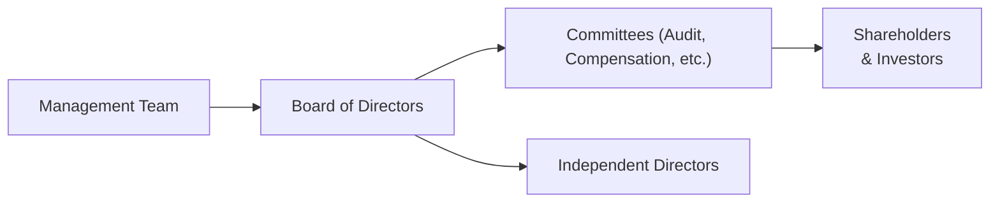

## Introduction
Have you ever wondered why some private investments flourish under a stellar leadership team, while others flounder despite solid financials? I’ll never forget the time I worked with a private equity sponsor that had an outstanding portfolio company in a niche technology sector. Despite attractive fundamentals, that investment almost hit the rocks because, well, the management team’s strategic vision simply didn’t align with evolving market realities. This situation taught me that no matter how promising the investment thesis might appear on paper, the caliber of the individuals at the helm can make—or break—the entire deal. And that, my friends, is why evaluating a company’s management team and governance structure should be at the very top of your due diligence list.

In the realm of private capital—encompassing everything from venture capital and buyouts to private debt—investors typically accept longer lock-up periods and reduced liquidity compared to public markets. They do so because they anticipate higher returns, portfolio diversification, or a greater degree of control. Yet all that potential means little if the management and governance structures aren’t designed to catalyze value creation. After all, successful private capital investments hinge on motivated managers who operate within frameworks that protect investor interests, foster transparency, and encourage professional accountability.

## The Importance of Management Team Evaluation
Evaluating the quality of a leadership team can be both straightforward and surprisingly tricky. You might think, “I’ll just check their track record, Google their names, and look at the company’s most recent annual report—easy!” But thorough due diligence involves much more than that. It’s about understanding an individual’s domain expertise, their capacity for strategic thinking, and, most importantly, their ethical compass.

It’s a bit like assembling a sports team. A star player’s performance stats are essential, sure, but you also want to know how they fit within the culture of the team, whether they can adapt to different playing styles, and whether they keep everyone motivated. Let’s break down the key elements of this evaluation:

• Track Record and Past Performance: A manager’s historical successes and stumbles can be revealing, especially in similar industries or cycles.  
• Domain Expertise and Experience: Is the leadership well-versed in the sector’s nuances? Do they understand its technological or regulatory challenges?  
• Strategic Vision and Alignment: Do they have a clear roadmap? How do they respond to external changes like evolving consumer demand or new competitors?  
• Cultural Fit: This is subjective, but personalities and values matter. Shareholder alignment is smoothest when management and investors share similar work ethics and principles.  
• Integrity and Ethical Behavior: Sound governance starts at the top. Background checks, references, and checking for potential red flags are part of the process.

While you should look to your standard financial and operational due diligence, it’s equally important to go beyond the numbers. In-person interviews, site visits to facilities, and multiple conversations with colleagues or industry peers can offer an unvarnished perspective on how a leader actually performs day-to-day.

## Corporate Governance: The Pillar of Sound Oversight
If the management team drives the operational engine, then the governance structure is the steering system. Good corporate governance establishes the checks, balances, and accountability needed to safeguard capital. It’s about clarifying who’s responsible for what, ensuring that decisions are made equitably, and preventing abuses of power.

In private investments, you’ll often see robust governance mechanisms spelled out in shareholder agreements, limited partnership agreements, or operating agreements. For instance, there might be “reserve matters” requiring investor consent for big decisions—acquisitions, capital raises, or executive hires. The ultimate goal is to create a framework where the management team has the autonomy to run the business on a day-to-day basis, but investors still have the final say on matters that significantly affect valuations or risk profiles.

In my opinion, setting up strong governance early on saves everyone a lot of headaches down the road. A well-structured board, for example, can serve as a sounding board and source of expert advice, not just a regulatory compliance tool. The best boards I’ve worked with knew how to strike a balance between providing necessary oversight and letting management implement their strategic plans without excessive interference.

## Board Composition and Independence
One of the most critical pillars of governance is the board of directors. I’ve seen boards that are too large, rendering them ineffective. I’ve also come across boards dominated by one or two individuals with outsized influence. Neither extreme is helpful. The sweet spot generally includes a balanced mix of internal executives, investor representatives, and independent directors who bring an unbiased perspective.

• Independent Directors: These are professionals with no direct stake in the company’s daily operations or in the controlling investor’s sphere. They offer objective viewpoints, help mediate conflicts of interest, and ensure that major strategic decisions serve the best interests of all shareholders.  
• Subcommittees and Their Roles: Boards often delegate specialized tasks (audit, compensation, governance, etc.) to subcommittees. The audit committee, for instance, reviews internal controls and financial reporting; the compensation committee addresses management pay structures.

Below is a simple diagram illustrating how management, the board, and investors often interact:

In an ideal scenario, the board meets frequently enough (say, quarterly or monthly, depending on the industry) to stay updated and weigh in on major decisions—without wasting valuable time on minor operational details. By making sure the board is populated with credible individuals who can offer strategic guidance and oversight, investors can rest a bit easier, knowing that their capital is being carefully stewarded.

## Compensation and Incentive Structures
One of the most common reasons for disagreements between investors and management, in my experience, is misaligned incentives. If the head honcho’s bonus is tied purely to near-term sales, don’t be surprised if your CFO invests more in quick revenue drivers and less in long-term brand building or R&D. Meanwhile, if the incentive plan is linked to an exit valuation at some indefinite future date, managers might opt for short-term actions that prop up the share price rather than value-creating measures that take longer to bear fruit.

Typical compensation packages often blend a base salary, short-term bonuses, and long-term incentives such as stock options or performance shares. The trick is to ensure the mix truly promotes the behaviors you want. You might see something like this:

• Base Salary: Reflects industry standards and the executive’s skill set.  
• Annual Bonus: Tied to key performance metrics like EBITDA targets, revenue milestones, or operational efficiencies.  
• Equity Compensation: Options or restricted stock units vesting over multiple years—meant to align management’s longer-term interests with those of investors.

Consider the following table, which contrasts two hypothetical executive incentive structures:

| Compensation Element     | Program A                              | Program B                                  |
|--------------------------|----------------------------------------|--------------------------------------------|
| Base Salary             | Mid-range for industry                  | Top quartile for industry                  |
| Annual Bonus            | 10-15% of salary tied to revenue growth | 20-25% of salary tied to EBITDA and ROIC   |
| Equity Compensation     | 10% of total comp in 3-year vest        | 25% of total comp in 5-year vest           |
| Overall Alignment       | More short-term oriented                | Stronger long-term emphasis                |

If you want management to prioritize stable cash flow and margin growth, Program B might be a better design. Ensuring that the equity portion vests appropriately and is subject to performance conditions avoids the dreaded scenario where executives cash out early and leave the company in limbo. Of course, it’s not always as simple as “just pick Program B”—every company has unique needs, maturity levels, and capital structures, so you want to tailor the plan accordingly.

## Conflicts of Interest
Conflicts of interest are everywhere in private investments, but they can be particularly pronounced in family-owned businesses or founder-led ventures. If the founder also sits on the board and has personal relationships with key stakeholders (like major suppliers or distributors), decisions can get murky. One minute you’re evaluating a procurement contract; the next thing you know, you’re dealing with someone’s cousin’s company that might not be the best vendor but is chosen because of family ties.

The risk extends to investor groups as well. A private equity sponsor who also manages multiple portfolio companies might push a questionable synergy arrangement that benefits one portfolio investment at the expense of another, all in the name of expanding total assets under management. Or family offices might invest in multiple deals where certain beneficial terms are “lost in translation” to day-to-day managers.

Practical ways to mitigate these conflicts include:

• Formal Conflict-of-Interest Policies: Mandated disclosures, recusal requirements, and official board approvals for related-party transactions.  
• Clear Division of Roles: Avoid excessive CEO or CFO powers in founder-led shops, or at least establish effective oversight by the board or an independent committee.  
• Periodic Audits and Third-Party Reviews: Bringing in external auditors or consultants to evaluate key transactions can help identify problems early.

Where these checks aren’t in place, an investment can unravel quickly due to everything from nepotism to fraudulent dealings. It might sound dramatic, but trust me, these situations aren’t as rare as you’d hope. Strong governance protocols that anticipate such conflicts can help minimize the damage.

## The Sponsor’s Role: Hands-On or Passive?
Another aspect worth considering is whether the sponsor or lead investor takes a heavy-handed management approach or prefers a “once-a-quarter-check-in” strategy. Neither extreme is inherently right or wrong. It often depends on the nature of the business, the experience of the management team, and the sponsor’s own comfort level with operational involvement.

Hands-on Approach:
• Investors may directly embed operational experts or former executives in the company to guide strategic initiatives.  
• More oversight can be beneficial especially in turnaround scenarios where the company’s existing leadership needs additional support.  
• Potential downside: Hiring too many consultants can create friction if the existing management team feels undermined.

Passive Approach:
• Investors meet minimally, focusing on top-level governance rather than day-to-day operations.  
• This approach might work if management is high caliber, has proven performance, and doesn’t need external experts meddling.  
• Risk: If market conditions shift rapidly, a passive board might react too slowly.

In reality, many sponsors adapt their involvement level over time. For instance, in the early stages of a leveraged buyout, the sponsor might be deeply involved in reengineering cost structures. After the business stabilizes, they could scale back to a more advisory role to allow management greater autonomy.

## Reporting Frameworks and Escalation
Let’s talk about reporting—a topic that’s easy to overlook when you’re enthralled by the potential of an exciting new investment. But timely, accurate, and transparent reporting is the lifeblood of an effective governance system. It’s what keeps everyone on the same page and helps catch red flags before they become unmanageable crises.

Typical reporting frameworks include:
• Monthly or Quarterly Financial Reporting: Detailed income statements, balance sheets, and cash flow statements, often supplemented by operational metrics.  
• Board Packages: Prepared ahead of board meetings to spotlight strategic updates, major milestones, or performance vs. budget.  
• Escalation Procedures: A well-defined chain of communication in case something big—and possibly detrimental—happens. For instance, a sudden regulatory investigation or a large unbudgeted expense might require immediate board involvement.

Setting up these frameworks can feel mechanical, but in my experience, a well-organized reporting system is worth its weight in gold. It’s much better to have that important data at your fingertips rather than scrambling to compile it under pressure.

## Common Pitfalls and Best Practices
• Overreliance on Charismatic Leaders: Don’t let a big personality overshadow a weak strategic plan.  
• Unclear Lines of Authority: Ensure roles and responsibilities are well-defined, making it evident who’s accountable for what.  
• Infrequent Board Meetings or Subpar Attendance: Everyone on the board should consistently show up prepared.  
• Ignoring Cultural Fit: Even the best management team can fail if there’s constant friction with investors or an incompatible corporate culture.  
• Neglecting Succession Planning: A management transition without a strategy can cripple a company’s momentum.

On the bright side, best practices—like building a qualified board with independent directors, regularly reviewing compensation alignment, and maintaining open communication channels—can turn a simple oversight mechanism into a real value driver.

## Glossary
Corporate Governance: The system by which companies are directed and controlled, focusing on roles, responsibilities, and accountability.  
Board Composition: The makeup of a board, including independent directors and industry experts.  
Compensation Alignment: Structuring management pay to align with company performance and investor returns.  
Conflict of Interest: A situation in which personal or external interests might influence objective decision-making.

## References and Further Reading
• Corporate Governance and Ethics (CFA Institute materials)  
• National Association of Corporate Directors (NACD) guidelines  
• McKinsey & Company: Various articles on best practices in executive assessment and board oversight  

## Exam Tips for CFA Level III Candidates
• Focus on Interrelationships: When faced with scenario-based questions, consider how management incentives, corporate governance frameworks, and conflicts of interest interplay to affect investment outcomes.  
• Use Real Options in Answers: Show how you might propose modifications to governance structures (like adding an independent director) or adjusting performance metrics in a compensation plan.  
• Watch Out for Behavioral Biases: Overconfidence in charismatic leaders can be a hidden exam trap. Always analyze underlying fundamentals, governance, and independent oversight.  
• Time Management in Constructed-Response Sections: Outline your approach—evaluate the management’s track record, highlight governance strengths/weaknesses, and link them to specific solutions. Then fill in details.  
• Concrete Examples: The exam will reward you for referencing best practices or recognized frameworks—things like NACD guidelines or well-structured board composition can earn partial credit even if your final calculation or recommendation might be slightly off.

Remember: The CFA Level III exam often tests your ability to integrate these concepts in personalized, essay-type questions. So practice by writing out your thought process—and be prepared to weigh trade-offs in governance decisions, including the effects on risk, return, and alignment of interests.

---

## Test Your Knowledge: Management Team Evaluation and Governance Quiz



### Which of the following factors is crucial in evaluating a management team for a private capital investment?

- [x] Domain expertise and a proven track record
- [ ] Strict adherence to a short-term earnings focus
- [ ] Shying away from implementing ethical guidelines
- [ ] Avoiding cultural fit considerations

> **Explanation:** Management evaluation hinges on expertise, track record, cultural fit, and ethical alignment. Short-term earnings focus alone does not ensure long-term success, and ethical guidelines are integral to sound governance.

### A primary function of corporate governance in private investments is to:

- [x] Provide checks, balances, and accountability for leadership decisions
- [ ] Maximize short-term profits exclusively
- [ ] Eliminate the need for independent audit procedures
- [ ] Limit transparency in financial reporting

> **Explanation:** The core aim of corporate governance is ensuring proper oversight, accountability, and transparency. Maximizing short-term profits and limiting audits or transparency would undermine investor protections.

### An independent director on a board:

- [x] Has no direct stake in daily operations or controlling investor’s sphere
- [ ] Must be a family member of the CEO
- [ ] Cannot serve on any board committees
- [ ] Is required only in public companies

> **Explanation:** Independent directors bring impartial insights, which helps mediate conflicts of interest and ensure decisions benefit all shareholders. The other options run counter to the definition of true independence.

### Misaligned incentives in executive compensation often result in:

- [x] Strategic decisions that prioritize personal or short-term gains over long-term company health
- [ ] Decreased risk to the overall investment
- [ ] No effect on leadership decisions
- [ ] Simplified board oversight processes

> **Explanation:** If incentive structures favor quick gains (e.g., bonuses for short-term revenue), management might skip investments needed for sustainable growth, creating potential misalignments with investor objectives.

### Which of the following best describes a hands-on approach by a sponsor?

- [x] Embedding operational experts to guide strategic initiatives
- [ ] Eliminating board meetings to avoid conflicts
- [x] Increased frequency of management check-ins
- [ ] Focusing only on top-level governance with minimal direct involvement

> **Explanation:** A hands-on sponsor often places operational experts or specialists within the company and ramps up the frequency of interactions with management. This is distinct from a passive governance style.

### A robust reporting framework in a private investment context usually includes:

- [x] Monthly or quarterly financial statements and operational metrics
- [ ] Completely ad-hoc updates whenever management decides
- [ ] Eliminating budget variances from board discussions
- [ ] Prohibiting the use of an audit committee

> **Explanation:** Key components are consistent financial statements, operational metrics, and dedicated committees (like an audit committee) to ensure accountability and transparency.

### Which governance measure most effectively addresses conflicts of interest in family-owned businesses?

- [x] Independent review and approval of related-party transactions
- [ ] Allowing the founder to approve all family hires without oversight
- [x] Structured board committees with external members
- [ ] Avoiding mention of conflicts

> **Explanation:** Establishing an independent board committee, employing third-party reviews, and ensuring objective approval for related-party transactions reduce the risk of nepotism or bias.

### In evaluating board composition, an investor should:

- [x] Seek a mix of internal executives, investor representatives, and independent directors
- [ ] Ensure the board is dominated by executives with similar backgrounds
- [ ] Exclude independent or outside experts
- [ ] Restrict board meetings to once a year

> **Explanation:** A balanced board fosters diverse perspectives, counteracts biases, and ensures healthy debate. Domination by one group or infrequent meetings often stifles effective oversight.

### Which of the following underscores the importance of succession planning?

- [x] Leadership transition without a strategic plan can disrupt momentum
- [ ] Leadership transitions should always happen spontaneously
- [ ] A successor should be chosen solely based on personal ties
- [ ] Succession planning is irrelevant if the current CEO is successful

> **Explanation:** Even successful CEOs eventually move on. Without a thoughtful, transparent succession process, the firm risks operational discontinuities and strategic misalignment.

### True or False: In a well-structured governance setup, independent directors have the authority to veto any transaction unilaterally.

- [x] True
- [ ] False

> **Explanation:** In certain governance structures, independent directors can wield veto power over critical transactions to protect minority investors and avoid conflicts of interest.


