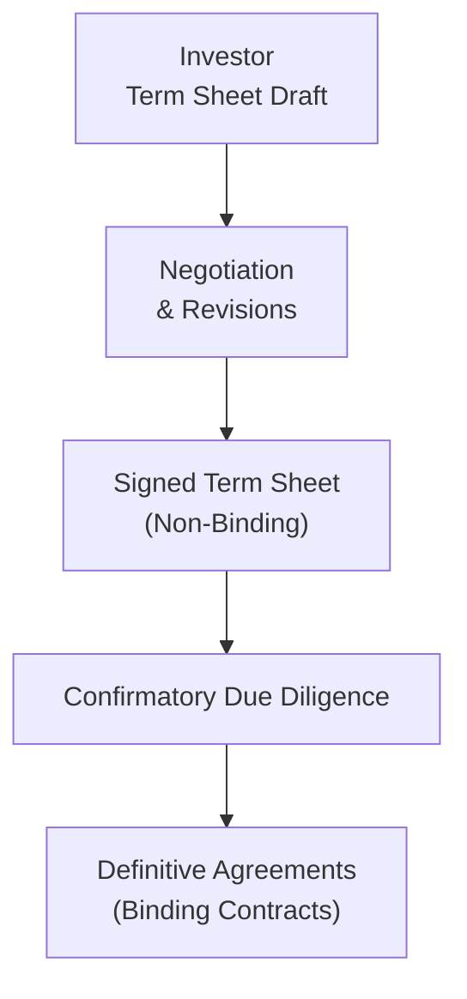

## Introduction and Basic Concepts

So, I remember sitting in a cramped conference room—my coffee gone cold—while a founder nervously flipped through a 15-page document. That document was the term sheet, and it spelled out the major terms of an upcoming investment. Honestly, we were all equally anxious, especially when we got to the "investor protections" section. That’s when I realized how critical these protective clauses and provisions can be for both the investor and the company seeking funds.

A term sheet is essentially a non-binding outline of the deal. It’s like a blueprint before you build a house: you want to be sure you’re capturing all the structural bits correctly before actually constructing the real thing. If you get the major pieces right, your definitive agreement (the legally binding contract that follows) will go more smoothly. If something’s off, well, you know, that can lead to headaches down the road.

Below, we’ll dig into how investors protect themselves with provisions like liquidation preferences, anti-dilution clauses, veto rights, and more. We'll walk through real-world examples, highlight best practices, and even point out a few amusing slip-ups that have tripped up folks in the past. By the end, you’ll see why a strong term sheet is more than just a formality—it's a critical guide for the entire investment journey.

## Defining the Term Sheet

A term sheet lays out economic and governance terms, such as:

• Valuation of the company (pre-money and post-money)  
• Ownership structure (how many shares at what price)  
• Liquidation preferences (who gets what if everything goes sideways—or up!)  
• Protective provisions (board seats, veto rights, anti-dilution)  
• Expected timelines for due diligence and closing

While non-binding in most jurisdictions, a term sheet exerts powerful influence over the final, binding documents—like the Shareholders’ Agreement or the Subscription Agreement. Messing up the term sheet can create tension between investors and founders later on. Plus, local regulations and customary market practices will shape the language used, which is another reason why working with experienced legal counsel is essential.

## Key Elements of Investor Protections

Ever wonder why investors can sometimes have so much say in a company’s day-to-day decision-making? The reason is straightforward: they’re putting money at risk, so they want to ensure that risk remains acceptable. (I can’t blame them, can you?) Below are several protective provisions commonly found in term sheets.

### Protective Covenants

Protective covenants serve as guardrails. They define what the company can and cannot do without investor consent. Common protective covenant categories include:  

• Issuing new shares or changing share classes  
• Incurring new debt beyond certain thresholds  
• Approving mergers, acquisitions, or liquidation events  
• Changing the company’s corporate governance structure

These covenants help investors prevent sudden or reckless decisions, such as diluting existing shares or over-leveraging the company.

### Veto Rights

When we talk about “veto rights,” we’re referring to the investor’s ability to reject certain corporate actions. In many deals, major decisions like amending the bylaws or making big capital expenditures require unanimous board approval (including the investor representative). Veto rights keep the investor in the loop on high-impact decisions. Overuse of veto rights can strain founder-investor relationships, yet from the investor perspective, it’s a vital safety net.

### Board Representation and Voting Rights

Investors often secure a board seat or observer seat. This seat grants them the ability to vote on strategic initiatives—and yes, sometimes that means blocking decisions they view as irresponsible. The balance of power on the board is a delicate dance: founders want freedom to innovate, while investors want to steer the company away from excessive risks. Many times, the final arrangement is a reflection of the investor’s experience in guiding strategic growth, combined with the founders’ creativity and vision.

### Tag-Along and Drag-Along Rights

• Tag-Along Rights: If a majority shareholder sells their stake to another party, tag-along rights let minority shareholders “tag along” and sell their shares under the same terms. This prevents a situation where a minority is left behind with a new controlling shareholder they didn’t choose.  

• Drag-Along Rights: Conversely, majority shareholders can “drag along” minority shareholders in a sale under certain conditions. That way, if an attractive buyer wants 100% of the company, minority shareholders can’t block the transaction.  

These provisions reduce friction in potential exits, ensuring an orderly share sale for all parties.

## Liquidation Preferences

Let’s say you come across a company that does great for a while but eventually ends in a sale at a price below expectations or, worse, shuts down. Who gets paid first? That’s where liquidation preferences step in. They’re basically a capital stack ordering that determines how proceeds get distributed.

Preferred shares, for example, often have a “1x” liquidation preference, meaning such shareholders get their initial investment back before anyone else sees a dime. Some deals specify “participating preferred,” allowing these preferred shareholders not only to get their investment back first but also to share in the residual proceeds as if they also held common equity. In more founder-friendly environments, you might see “non-participating preferred,” meaning the investor has a choice: take the 1x preference or convert to common equity and share in the upside.

Here’s a quick numeric example—no complicated mathematics, promise:

• Investor invests $2 million in exchange for preferred shares that represent 25% of the company. The liquidation preference is 1x, non-participating.  
• The company gets acquired for $6 million.  
• The investor can take the $2 million preference or convert to common shares and receive 25% of the $6 million (which is $1.5 million).  

In this scenario, the investor picks the preference of $2 million (higher than $1.5 million), leaving $4 million for the other shareholders. If it was a bigger exit, say $20 million, the 25% stake is worth $5 million—well above the $2 million preference—so they’d typically convert to common shares.

## Anti-Dilution Clauses

Ever feel that sting when you buy stocks at a certain price, only to watch them drop? Investors in private deals feel that too, especially if future financing rounds value the company lower than they did. Hence the dreaded “down round.” Anti-dilution provisions protect early investors from that sting by adjusting the conversion price of their preferred shares to reflect the new lower valuation.

Two main variants exist:

• Full Ratchet: The conversion price adjusts to the price of the new round, effectively giving the investor as many shares as if they had invested at the new lower price. This is extremely investor-friendly and can heavily dilute founders and other shareholders.  

• Weighted Average (Broad- or Narrow-Based): The price adjusts based on the size of the new round relative to the total shares outstanding. This method is considered less punishing to founders and other stakeholders.

To illustrate, suppose an investor invests $1 million at $10 per share for 100,000 shares. A year later, the company raises more capital at $5 per share. Under a full ratchet, the early investor’s shares effectively re-price at $5, so they now have the equivalent of 200,000 shares (except for certain legal formalities). Weighted average anti-dilution, however, will produce some intermediate conversion price, resulting in fewer than 200,000 shares—still some protection, but not as harsh.

## Information Rights and Due Diligence

Investors want periodic updates on how the company is using their money. Makes sense, right? Information rights typically include:

• Quarterly or annual financial statements  
• Budget approvals prior to the start of fiscal periods  
• The right to inspect the books under certain conditions (with appropriate notice)  

Information rights may seem less contentious than, say, liquidation preferences, but they are vital. Imagine discovering a huge cash burn way too late because the company only sent an annual statement. Frequent updates, even if sometimes they contain negative news, help keep everyone aligned and aware.

## Geographic and Market Variations

Oh, by the way, not all term sheets look alike. Venture capital norms in Silicon Valley might differ from those in Europe or Asia. In some regions, government regulations demand specific disclosures or place restrictions on certain protective rights. And for large private equity buyouts, you may see more robust sets of covenants—like those in leveraged finance deals—plus specialized clauses around management changes, earn-outs, or non-competes. So always check local best practices (or consult attorneys with relevant expertise) to ensure that your term sheet is appropriate for the market you’re in.

## Role of Legal Counsel

I know, I know, the disclaimers about lawyers can sound tedious. But trust me, an experienced lawyer who specializes in venture capital or private equity can save everyone big headaches. They’ll clarify what’s “market standard” for your specific stage and geography and help you negotiate balanced terms. They’re also a crucial ally in drafting enforceable provisions, explaining trade-offs, and ensuring that what’s in the term sheet syncs up with the final contract. In short, your counsel can be the difference between a fair, mutual arrangement and a fiasco.

## Post-Term Sheet Confirmatory Due Diligence

Don’t forget, the term sheet is merely the initial handshake. After it’s signed, you typically enter into confirmatory due diligence—that deeper, more formal process of verifying the company’s financial, legal, and operational status. Investigations can include:

• In-depth reviews of financial statements and forecasts  
• Customer reference calls or site visits  
• Legal checks for potential liabilities or pending litigation  
• IP audits, particularly for tech-based companies  

If anything alarming shows up, the investor can renegotiate or, in extreme cases, walk away. This underscores why the term sheet is often non-binding: it’s conditional upon your final due diligence passing muster.

## Visualizing the Term Sheet Process

Below is a simple Mermaid diagram that shows a high-level overview of how the term sheet process flows:

From drafting to negotiation, from signing to due diligence—these steps let both parties test the waters before fully committing.

## Practical Example: Balancing a Protective Provision

Let’s bring some life to these concepts. Suppose an early-stage company that’s developing medical devices needs $5 million. A venture capital (VC) fund invests in exchange for 20% ownership and a seat on the board. The VC also demands anti-dilution protection and a 1x liquidation preference. Meanwhile, the founders want to preserve autonomy over day-to-day management and product decisions.

After some back and forth, the final term sheet might look like this:

• Equity Ownership: 20% post-money.  
• Liquidation Preference: 1x, participating up to the original investment amount.  
• Anti-Dilution: Broad-based weighted average.  
• Board Seat: 1 seat for the VC, 2 seats for founders, 2 independent seats mutually agreed upon.  
• Protective Covenants: Major decisions (mergers, acquisitions, issuance of new stock classes) require VC approval.  

In this scenario, the founders get a balanced approach: no full ratchet anti-dilution, plus shared governance that preserves some independence. The VC, on the other hand, has the reassurance of a liquidation preference and meaningful protective rights to keep an eye on big decisions.

## Best Practices and Common Pitfalls

It’s easy for founders to view investor protections as burdensome, or for investors to push for extremely rigid terms that hamper entrepreneurial freedom. Striking a balance is key.

• Don’t Overcorrect: Investors who demand overly aggressive terms (like multiple liquidation preferences or full ratchet anti-dilution) can stifle morale and hamper future fundraising.  
• Avoid Ambiguity: Vague language in the term sheet will lead to confusion later. Spell out exactly what triggers the anti-dilution, or precisely which decisions require investor approval.  
• Keep Communication Open: Regular check-ins can help both sides adjust if conditions change.  
• Think Long-Term: Terms that look great at the seed stage might become liabilities at the Series C or exit. Craft provisions that are fair and flexible over time.

## Key Takeaways and Exam Tips

• Liquidity Hierarchy: Understand how liquidation preferences rank among different share classes and how this can be tested in scenario-based questions.  
• Valuation Conflicts: Realize how anti-dilution clauses can cause tension. The CFA exam might test your ability to calculate outcomes under various anti-dilution provisions.  
• Governance vs. Economics: Distinguish between terms that control how decisions get made (like board seats) versus terms that allocate profit or loss (like liquidation preferences).  
• Balanced Negotiation: The exam might present a case where an investor demands protective rights, but the founder pushes back. Know how to identify a “market standard” compromise.  
• Documentation Nuances: Expect questions on typical components of a shareholders’ agreement and how they support or modify the term sheet.  
• Ethical Standards: In line with the CFA Institute Code of Ethics, be transparent and fair, especially in disclosures about conflicts of interest, performance projections, and obligations to other stakeholders.

Finally, practice recognizing “red flags” in term sheets—like contradictory or overly complicated provisions—and understand how they might be revised.

## References and Further Reading

• NVCA (National Venture Capital Association) Model Term Sheet  
• ABA (American Bar Association) resources on private deal documentation  
• Brad Feld & Jason Mendelson, “Venture Deals: Be Smarter Than Your Lawyer and Venture Capitalist”  
• CFA Institute Standards of Professional Conduct (emphasizing disclosures and fair dealing)  

## Quiz: Mastering Investor Protections and Term Sheet Analysis



### 1. Which of the following best describes the purpose of a term sheet in a private investment deal?

- [x] It outlines the proposed terms and conditions in a non-binding format.
- [ ] It is the legally binding agreement that finalizes the investment.
- [ ] It is a document used solely for regulatory reporting.
- [ ] It is the final valuation report for the deal.

> **Explanation:** A term sheet is a non-binding document setting out the core terms of the deal, including valuation, governance rights, and protective provisions.

### 2. Why might an investor insist on a liquidation preference?

- [ ] To convert their shares to common stock in any circumstance.
- [x] To ensure priority payout if the company is sold or liquidated.
- [ ] To guarantee a personal loan to management.
- [ ] To adjust the share price in a future financing round.

> **Explanation:** A liquidation preference determines payout priority, ensuring certain shareholders recover their investment before others in liquidation events.

### 3. Which statement about anti-dilution provisions is correct?

- [ ] They prevent any future issuance of company shares.
- [ ] They are always preferred by founders and never investors.
- [x] They protect investors from value erosion if new shares are issued at a lower price.
- [ ] They immediately convert preferred shares into debt instruments.

> **Explanation:** Anti-dilution clauses adjust the investor’s ownership if new shares are issued below their original purchase price.  

### 4. Tag-along rights are primarily designed to:

- [ ] Force minority shareholders to sell their shares at below-market prices.
- [ ] Allow new investors to enter a deal on the same terms as previous investors.
- [ ] Let the company issue more shares without consent.
- [x] Permit minority shareholders to join a share sale initiated by majority shareholders.

> **Explanation:** Tag-along rights protect minority shareholders by allowing them to “tag along” under the same sale terms.

### 5. A “1x non-participating” liquidation preference generally means:

- [x] The investor either takes their investment amount back first or converts to common equity, but not both.
- [ ] The investor automatically receives double their investment if the company is successful.
- [ ] The investor can only receive a redemption at par value.
- [ ] The investor’s shares are forcibly converted at the time of liquidation.

> **Explanation:** A 1x non-participating liquidation preference gives the investor the right to recoup their original investment first or opt to convert to common if that yields a higher return.

### 6. Full ratchet anti-dilution typically favors:

- [x] Investors, because it resets the conversion price to the new lower round price.
- [ ] Founders, because the investors take more risk.
- [ ] Founders, because it avoids any change in share count.
- [ ] Lenders, because it converts equity to debt in a down round.

> **Explanation:** Full ratchet is the strictest form of anti-dilution, providing maximum protection for investors (and maximum dilution for founders).

### 7. Which of the following is a common protective covenant?

- [ ] Requiring management to issue frequent press releases.
- [x] Restricting the issuance of new shares without investor consent.
- [ ] Guaranteeing founders can sell their shares anytime.
- [ ] Prohibiting all board members from attending board meetings.

> **Explanation:** Protective covenants often limit the company’s right to issue new shares without the investor’s approval, among other high-impact actions.

### 8. Why is legal counsel particularly important during the term sheet negotiation?

- [x] They ensure terms are enforceable, reflect market standards, and align with local regulations.
- [ ] They serve as the mediator between the company’s workforce and suppliers.
- [ ] They underwrite the offering from a purely financial perspective.
- [ ] They create marketing materials for the new product launch.

> **Explanation:** Lawyers specialized in venture capital or private equity ensure the term sheet’s clauses are legally sound and suitable for local norms.

### 9. In a participating preferred scenario, which outcome occurs?

- [x] The investor claims their liquidation preference and also participates pro rata in remaining proceeds.
- [ ] The investor always converts to common shares at liquidation.
- [ ] The investor receives only the same amount as common shareholders in a liquidation event.
- [ ] The investor has no priority over common shareholders.

> **Explanation:** Participating preferred means the preferred shareholder first claims their preference and then shares in any remaining proceeds as if they also held common stock.

### 10. True or False: Term sheets are always legally binding contracts.

- [ ] True
- [x] False

> **Explanation:** Term sheets are typically non-binding; they outline proposed terms that may change pending due diligence and further negotiation.


