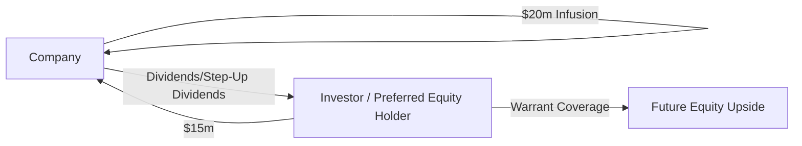

## Introduction
Have you ever seen a company juggling its financing needs, trying to nail that sweet spot between a manageable debt schedule and not giving away too much equity? Well, that’s precisely where structured private capital solutions come in. Unlike standard equity or senior debt instruments, structured solutions can be super flexible, often bridging the gap when a straightforward loan or a plain-vanilla equity issuance just won’t cut it. These financing arrangements can give private companies powerful tools to secure growth capital, limit dilution, or handle short-term liquidity needs during rocky periods.

I remember working on a deal for a mid-sized manufacturing firm that was launching a new product line without enough cash to scale. They didn’t want to give up too much ownership, nor did they have the pristine credit profile needed for a large bank loan. So, we explored a structured solution—part mezzanine loan, part equity kicker. Sure, the documentation was extensive, and the terms were heavily negotiated, but it let the founders stay in the driver’s seat while still accessing the funds they needed. Let’s dig into what makes these deals tick and why they can be such a game-changer in private markets.

## Key Characteristics of Structured Private Capital
When we talk about “structured private capital,” we’re generally referring to financing arrangements that combine features of both debt and equity. This hybrid approach can involve:

• Preferred equity with convertible features  
• Mezzanine debt topped with warrants  
• Revenue-sharing agreements that shift payout obligations to when revenue is realized  
• Complex covenant baskets that activate step-up rates or give additional rights to investors upon certain triggers  

These solutions often reign supreme when:  
• Conventional bank financing is either too rigid or insufficient.  
• The company needs to preserve operational control and limit equity dilution.  
• Private equity backers seek better downside protection while still participating in upside potential.  
• There are large valuation gaps in negotiations between founders and new investors.  

In short, structured private capital aims to tailor a capital stack that meets the company’s precise objectives—be it fueling acquisitions, financing expansions, or restructuring balance sheets—without the typical constraints or costs of purely senior debt or equity infusions.

## Instruments in Structured Private Capital Solutions
Below are some of the most common instruments found in these solutions:

### Mezzanine Debt
Mezzanine debt typically ranks below senior loans but sits above common equity in the capital stack. Its coupon is often higher than a standard bank loan, reflecting the higher risk. It may also include equity kickers like warrants.

### Preferred Equity
Preferred equity comes with priority over common stock in receiving dividends and distributions. It can include conversion rights into common shares, step-up provisions if performance metrics fall short, and more.

### Warrants
Warrants are rights (but not obligations) to purchase shares at a specific price, usually within a certain timeframe. They let investors participate in equity upside without immediately injecting new equity capital at the outset.

### Revenue-Sharing Agreements
Revenue-sharing deals permit investors to receive a slice of future revenues in exchange for upfront capital. This structure can be appealing for companies with steady top-line growth but uncertain or volatile earnings before interest, taxes, depreciation, and amortization (EBITDA).

### Step-Up Rates
You might see a coupon or dividend rate that increases (or “steps up”) if the company fails to meet certain targets. So if your business hits a rough patch, the cost of capital literally goes up, encouraging timely performance.

## Typical Transactions and Motivations
Structured deals often emerge when a private company is:  
• Seeking partial liquidity for early investors or founders.  
• Executing a recapitalization where both equity and debt terms are renegotiated.  
• Lacking robust cash flows to support an all-senior loan structure.  
• Desiring to avoid an overly dilutive equity issuance.  

Investors, in turn, might embrace these complex structures for the prospect of equity-like returns but with certain debt-like protections. If the company performs well, they gain a strong payoff. If it struggles, they have protective terms designed to mitigate losses.

## Structured Capital Stack Visualization
Sometimes it helps to see how these instruments slot into a company’s overall capital structure. Let’s visualize a simplified layered capital stack, starting with senior debt at the top (lowest risk, lowest reward) and ending with common equity (highest risk, highest reward).

• Senior Debt: Typically secured by company assets, with priority claims.  
• Mezzanine Debt: Subordinated to senior debt, but often offers equity kickers.  
• Preferred Equity: Priority over common stock for dividend payments, can include conversion options.  
• Common Equity: Residual claim, last in line but with unlimited upside potential.

## Advantages and Benefits
Claims aside, structured private capital solutions bring compelling advantages:

• Reduced Dilution: By using mezzanine or preferred instruments, founders and early shareholders might not need to give up as much common equity.  
• Flexibility in Repayment Schedules: The financing terms can be adjusted (e.g., payment-in-kind (PIK) interest, revenue-based payments) to match the firm’s cash flow patterns.  
• Potentially Lower Cost of Capital: Compared to raising pure equity at a discounted valuation, structured solutions can be cheaper if the company performs well.  
• Alignment of Incentives: Tools like warrants or convertible preferred shares often create strong alignment between investors and management.

## Potential Pitfalls and Risks
But every rose has its thorns:

• Higher Overall Cost of Capital: Because these deals involve elevated risk levels, the interest rates and yield requirements can be substantial.  
• Complex Covenants: It’s not uncommon to see layered covenants that restrict business decisions or trigger step-up rates at inopportune times.  
• Incentive Misalignment: If poorly structured, the new investor group might push a company into high-risk ventures or hamper strategic flexibility.  
• Dilution if Conversions Trigger: Those warrants can come back to bite if the share price soars—existing shareholders face more dilution than they might have expected.  

I recall a scenario where an energy equipment supplier used a structured deal to get capital for upgrading its machinery. They didn’t read the fine print on performance triggers, and a string of minor operational hiccups triggered a default provision. The step-up performed like a financial avalanche, straining the company’s liquidity until a refinancing was needed—often at an even steeper cost.

## Scenario Testing and Stress Analysis
Rigorous modeling is vital. Scenario testing can help estimate how each piece of the deal structure behaves under different market conditions. You want to see:

• What happens to the company’s cash flow if sales drop 30%?  
• When might step-up rates or default covenants be triggered?  
• Are there built-in mechanisms (like PIK toggles) that could balloon debt if the company elects not to pay cash interest?  
• Does the equity kicker become too dilutive under certain exit valuations?  

This forward-looking analysis helps align the economic incentives of all stakeholders and ensures the structure can withstand at least moderate volatility—something that, let’s be honest, is pretty much guaranteed in many sectors these days.

## Example of Preferred Equity Financing
Imagine a private healthcare technology firm seeking $20 million in growth capital. Traditional lenders shy away because the company’s intangible asset base doesn’t offer a ton of collateral. A pure equity raise would heavily dilute founders who still see massive upside potential. So they approach a specialized finance firm and strike a deal: 

• A $15 million preferred equity infusion with a 5% annual dividend, payable in cash or in stock at the company’s option.  
• A 20% warrant coverage (giving the investor the option to buy an additional stake at a predetermined strike price).  
• A step-up dividend rate to 7% if the company fails to achieve a given revenue milestone by the second year.

In this scenario, the company preserves some capital flexibility (they can choose to pay dividends in-stock), but the investor is protected via preferential treatment and an equity upside kicker. If the firm’s growth doesn’t materialize as planned, that dividend cost rises. Meanwhile, if they knock it out of the park, the warrants potentially dilute the founders, but presumably at a higher valuation because of success.

## Sample Cash Flow Diagram
To help illustrate how the funds (and obligations) might move in such a scenario:

## Regulatory and Accounting Considerations
From a regulatory standpoint, structured capital solutions often fall into a gray area because of their hybrid nature. Under IFRS (e.g., IFRS 9) and US GAAP, the classification of these instruments (equity vs. liability) depends heavily on whether there’s an obligation for the issuer to deliver cash or another financial asset. In practical terms:

• Convertible debt instruments might require bifurcation of the conversion feature (treated as a derivative).  
• Preferred shares with mandatory redemption often must be reported as liabilities instead of equity.  
• Classification can significantly impact a firm’s leverage ratios, interest coverage, and other popular debt metrics used by lenders and rating agencies.  

Ethically, it’s crucial stakeholders clearly understand these intricacies, so as not to misrepresent the balance sheet or the true risk profile of the transaction—a key concern under the CFA Institute Code of Ethics and Standards of Professional Conduct. Investors should ensure they’re thoroughly disclosing all relevant risks and conflicts associated with these structures.

## Best Practices
• Conduct stress-tests for multiple revenue and expense scenarios.  
• Negotiate covenant terms that balance investor protections with operational freedom.  
• Seek alignment of incentives—warrants or revenue-sharing triggers that encourage value creation.  
• Avoid “hidden bombs,” such as overly punitive step-ups or default triggers that can torpedo the business.  
• Maintain open, honest communication with all stakeholders, in line with professional standards.

## Conclusion and Exam Tips
Structured private capital solutions provide flexible avenues for private firms to access capital while balancing the concerns of investors who want both upside participation and downside protection. Before jumping into these deals, everyone involved needs to run robust scenario tests, hash out fair covenants, and ensure classification under IFRS or US GAAP is handled correctly. 

On the CFA exam front, you may see scenario-based questions requiring you to evaluate structuring features—from how a convertible preferred might affect a company’s cost of capital to analyzing covenant stress situations. Focus on evaluating risk-reward trade-offs, ensuring you can articulate how structured solutions differ from plain-vanilla equity or senior debt, and keep an eye out for potential misalignments in the investor-company relationship.

## References and Further Reading
• Moody’s and S&P publications on structured finance transactions  
• “Structured Finance: A Guide to Asset Securitization,” by Steven L. Schwarcz  
• IFRS 9 for guidance on classification and measurement of financial instruments  
• Various boutique advisory firm white papers on nuanced structured capital solutions

---

## Test Your Knowledge: Structured Private Capital Solutions



### Which of the following is a key reason companies pursue a structured private capital solution?
- [ ] To eliminate all forms of debt from their balance sheet  
- [x] To access financing that falls between standard equity and senior debt  
- [ ] To avoid any reporting requirements under IFRS or US GAAP  
- [ ] To reduce reliance on common stock and maintain minimal leverage  

> **Explanation:** Structured private capital solutions allow firms to raise hybrid financing that blends characteristics of both debt and equity. This filling-the-gap approach is a primary motivation for many companies.

### Which best describes mezzanine debt in the context of structured capital solutions?
- [ ] A purely convertible instrument that must always convert into equity  
- [ ] A senior secured loan that ranks above all other debt  
- [x] A subordinated form of debt, often including warrants or other equity kickers  
- [ ] A direct common equity investment at a discounted valuation  

> **Explanation:** Mezzanine debt is typically subordinate to senior loans and can feature warrants, giving it both debtlike and equitylike characteristics.

### A “step-up rate” provision generally:
- [ ] Minimizes future interest or dividend obligations under all conditions  
- [ ] Eliminates the principal repayment if certain benchmarks are missed  
- [x] Requires an increased coupon or dividend payment if specific targets are not met  
- [ ] Terminates investor rights in the event of a covenant breach  

> **Explanation:** A step-up rate is a mechanism that increases the interest or dividend rate under specified adverse conditions or missed performance milestones.

### A revenue-sharing agreement:
- [ ] Grants the investor a permanent controlling stake in the company’s equity  
- [ ] Is identical to an equity warrant since both are convertible  
- [x] Pays the investor a defined percentage of revenues until a target return is reached  
- [ ] Eliminates all risk for the investor by requiring zero capital contribution  

> **Explanation:** In revenue-sharing structures, investors receive a portion of the company’s revenue in exchange for providing upfront capital. It does not involve an automatic conversion to equity.

### What is one major advantage for founders in using structured private capital over a straight equity issuance?
- [ ] Immediate cancellation of current debt  
- [x] Potentially lower dilution of equity holdings  
- [ ] Complete freedom from covenant restrictions  
- [ ] Guaranteed future public listing  

> **Explanation:** Founders often prefer structured solutions to keep common equity dilution in check, while still receiving the needed funds for expansion or restructuring.

### Which of the following is a potential pitfall of structured financing?
- [ ] Low interest rates relative to senior debt  
- [ ] Elimination of all covenant requirements  
- [x] Overly punitive terms triggered by minor covenant breaches  
- [ ] Inability to attract sophisticated investors  

> **Explanation:** Overly restrictive covenants and steep step-up rates are among the risks that can make structured financing quite expensive or burdensome in adverse scenarios.

### Under IFRS or US GAAP, classification of structured instruments often hinges on:
- [x] Whether the issuer is obligated to deliver cash or another financial asset  
- [ ] The popularity of the investment among venture capitalists  
- [ ] Management’s personal preference for classification  
- [ ] The size of the company’s workforce  

> **Explanation:** Accounting standards for hybrid instruments depend on the specific contractual obligations and rights of each instrument—particularly whether there is a liability to deliver cash.

### Within the capital stack, mezzanine debt ranks:
- [ ] Higher than senior secured debt  
- [ ] Equally with preferred equity  
- [x] Below senior debt but above common equity  
- [ ] Alongside common equity  

> **Explanation:** Mezzanine debt is subordinate to senior debt but has priority above common equity in the event of liquidation.

### When running scenario tests for a structured deal, which factor is most critical?
- [ ] The color of the company’s annual report cover  
- [ ] The shape of the company’s office building  
- [x] Sensitivity of cash flows to changes in sales or cost assumptions  
- [ ] The personal credit scores of entry-level employees  

> **Explanation:** Scenario testing revolves around projecting how changes in revenue and expense variables affect the company’s ability to service structured capital obligations.

### True or False: Warrants always obligate an investor to immediately purchase equity.
- [ ] True  
- [x] False  

> **Explanation:** A warrant grants the right, but not the obligation, to purchase equity at a specific strike price within a given timeframe. It’s not a mandatory conversion.


