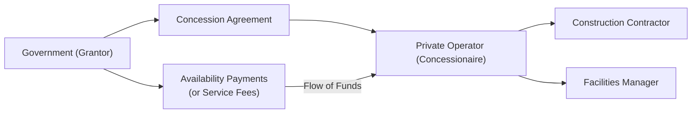

## Introduction

Social infrastructure is one of those concepts that most folks appreciate—who doesn't like efficient hospitals or well-maintained school buildings?—but it can seem abstract until you’re actually involved in financing or operating these public-service facilities. In simple terms, social infrastructure refers to the built environment needed for essential community services, such as hospitals, schools, and community centers.

When we talk about “alternative investments,” we often think of hedge funds, private equity, or real estate projects meant to drive profits. But social infrastructure investment includes a special dimension: the public-interest mandate. This means governments typically desire improved service quality alongside private sector efficiency, while private investors want stable, predictable returns and manageable risks. A well-structured concession agreement can align these goals.

## Core Concepts and Importance

Public-Private Partnerships (PPPs) in social infrastructure aim to combine government oversight with private industry innovation. These arrangements usually fall under “PFI” (Private Finance Initiative) or other PPP frameworks, and the government grants a concession for a private party to design, build, operate, and maintain an asset. The private party—often called the concessionaire—gets compensated through availability payments, service fees, or usage fees, depending on the contract.

The concept of “availability” often surfaces in these contracts. In an availability-payment model, the private operator receives a fixed payment, provided they meet the agreed-upon quality benchmarks (like ensuring hospital wards are properly staffed and operational). This helps reduce revenue volatility for the private operator, because the payment isn’t entirely dependent on demand. For example, even if fewer patients than expected check into the hospital (maybe it’s a new facility that hasn’t built up its reputation yet), the operator still gets paid for keeping the quality of service high.

Seriously though, why do it this way? Couldn’t the government just build and run the school on its own? Sure, but many governments, especially in regions with constrained budgets, prefer to offload some of the design, construction, and operational responsibilities to private entities that (hopefully) execute more efficiently. Investors, in turn, see an opportunity for stable, bond-like returns anchored by contractual agreements with a public entity—a structure that can naturally fit a long-term portfolio seeking steady cash flows.

Below is a simplified diagram illustrating a typical social infrastructure concession structure.

In this diagram:  
• The government grants the concession and pays availability payments or service fees.  
• The private operator (the concessionaire) enters contracts with construction firms and facilities managers to build and maintain the asset.  
• The government monitors performance to verify whether quality benchmarks are being met.

## Concession Agreements in Detail

Concession agreements specify the rights and obligations of each party. Typically, a government entity sets performance standards (like maximum response times in an emergency ward or maximum classroom sizes in a school). The private operator invests capital, sometimes with third-party lenders, to build the asset and then operates it for a set number of years. After that period, the asset may revert to government ownership.

### Key Features

• Duration: Many concession agreements run for 20 to 30 years (or more), ensuring that the private operator can recoup the upfront capital expense.  
• Fees: Could be availability-based (where the operator is paid if certain facility standards are maintained) or usage-based (tied to the facility’s actual occupancy or usage). Sometimes there’s a hybrid approach.  
• Quality and Performance Standards: Contracts often tie compensation to meeting defined service standards—think “hospital readmission rates” or “school building maintenance” metrics. These ensure the private operator remains aligned with the public interest.  
• Risk Allocation: Typically, the private party takes on design, construction, and operational risks, while the government addresses broader political or macro-level risks (like changes in regulation). However, everything is negotiable.

## Demand Considerations and Stability

One aspect that draws investors to social infrastructure is the relative stability in demand. Schools and hospitals are essential, so usage is typically more stable than, say, a toll road that might suffer dramatically if traffic declines. Of course, stable demand doesn’t always guarantee stable cash flows—political turbulence, contract disputes, or changes in government policy can complicate matters.

For instance, I once spoke to a hospital administrator in a new PPP hospital: They were confident about long-term demand but worried about possible policy changes. If a newly elected government decides that certain PPP projects are overpriced or misaligned with public priorities, you could face renegotiation or reputational problems. In short, you might have usage volumes, but if the government support falters, the economics can shift in a heartbeat.

## Financing Structures

In many social infrastructure projects, financing is set up to minimize revenue volatility. For instance, a government might guarantee a minimum occupancy level at a school, or it might pay a flat per-student fee to the concessionaire. When that’s combined with strictly enforced performance standards, the private operator can bank on fairly predictable revenue while also being heavily incentivized to maintain the asset.

### Common Financing Mechanisms

• Traditional Project Finance: Private investors and lenders finance the bulk of construction costs, with the asset acting as collateral. Once operational, revenue streams cover debt service.  
• Government-Backed Loans or Guarantees: Many governments support social infrastructure by guaranteeing partial repayment in case of operational shortfalls.  
• Availability Payment Model: As noted, the concessionaire gets regular payments once the facility meets specific service and building-maintenance standards, regardless of actual usage.  
• Lifecycle Costing: The concessionaire is often responsible for costs across the entire project life, from initial design to final handback. This approach reduces the government’s near-term financial burden and encourages efficient construction that lowers long-term maintenance expenses.

## Performance and Quality Standards

Social infrastructure projects often come with a moral imperative: we’re not just building a fancy structure; we’re providing health care, education, or community services. That’s why measuring success goes beyond mere returns on investment. Government agencies use key performance indicators (KPIs) to ensure the private operator maintains ethical and professional standards. For instance, a public school built under a concession agreement might have:

• Maximum teacher-to-pupil ratios for each classroom.  
• Requirements for technology infrastructure, like educational software and computing facilities.  
• Strict building maintenance and security protocols (CCTV, well-lit corridors, safe recreational areas).  

If these targets aren’t met, the operator could lose some or all of its availability payments. No wonder thorough due diligence is essential before a private investor decides to operate a social asset!

## Political and Regulatory Risks

In social infrastructure, political risk can sometimes overshadow financial or operational risk. Public outcry over “privatizing essential services” occasionally leads to abrupt policy changes. In the worst scenarios, projects can be canceled, renegotiated aggressively, or transferred back to public management before the concession term ends. It’s crucial, then, for investors or concessionaires to thoroughly evaluate:

• The stability of the current government;  
• The presence (or absence) of multi-party consensus on social infrastructure PPPs;  
• The legal recourse available, such as arbitration or indemnity clauses, in case of disputes.

While it sounds dramatic, think of how healthcare policies can shift with each new administration. If you’re running a hospital under a 30-year concession, you’ll definitely want contractual protections that survive multiple political cycles.

## Real-World Example

Let’s talk about a hypothetical “Community Healthcare Center” built via a PFI-style concession. The government needed new facilities to handle outpatient surgeries and general practice consultations. Under a 25-year concession, a private consortium financed and constructed the building, installed medical equipment, and agreed to maintain the premises. In return:

• The government pays a quarterly availability fee, assuming the facility meets cleanliness, staffing, and equipment uptime targets.  
• A portion of revenue is usage-based. If a certain number of patients use the facility, the operator’s service fee might increase proportionally—but subject to cost-saving efficiency targets.  
• The concession includes a thorough quality regime: random inspections, patient satisfaction surveys, and readmission rate tracking, all of which can trigger performance bonuses or penalties.  

The result? The government got a modern facility without funding the construction cycle itself, presumably delivered faster under the private partner’s oversight. The operator secured a stable, inflation-indexed revenue stream. And the local community got improved healthcare access.

## Potential Pitfalls and Best Practices

Concession agreements for social infrastructure may seem straightforward, but hidden traps abound—trust me, it’s easy to be dazzled by guaranteed revenues only to find you’re locked into unmanageable standards or exposed to reputational fallout.

• Overly Optimistic Demand Forecasts: Even essential services can see usage variances. Investors can mitigate risk by insisting on some form of guaranteed minimum payment.  
• Underpriced Maintenance Costs: Cutting corners on maintenance might reduce short-term costs, but contract penalties or degraded service quality will come back to haunt the operator.  
• Inflexible Contracts: Over time, social needs evolve. A concession agreement that’s too rigid might stifle necessary adjustments, leading to conflict or poor service outcomes.  
• Political Backlash: A new political regime may renegotiate or terminate the contract if the public views it as unfavorable. Writing robust step-in rights or pre-agreed termination payouts into the contract can reduce this uncertainty.  

When negotiating, all parties should remember their shared, overarching goal: a well-functioning public asset that remains beneficial for decades.

## Glossary

Availability Payment: Payment made to an operator regardless of usage, as long as certain service quality standards are maintained.  
Social Utility: The broader community welfare that a social infrastructure project aims to serve (e.g., improving public health).  
PFI (Private Finance Initiative): A public-private partnership framework originated in the U.K. for funding public infrastructure projects.  
Quality Standards: Operational benchmarks with which private operators must comply to receive full payment.  
Political Risk: Risk associated with policy changes, contract renegotiations, or other government actions that could disrupt the project.  
Service Fee: Payment tied to the level of service provided (or the capacity offered) by the operator.  
Public-Interest Mandate: The requirement that social infrastructure investments align with community needs—e.g., ensuring universal access or minimal service levels.  
Lifecycle Costing: An approach that accounts for all project costs—from initial design to long-term maintenance—within the concession structure.

## Conclusion and Exam Tips

Social infrastructure offers a potentially stable investment avenue, particularly for institutional investors seeking diversity beyond traditional equities or fixed income. However, it comes with unique challenges. You know, I’ve seen folks dive into these contracts without anticipating how changing political or community sentiments might alter the entire risk-reward equation. Always keep your eyes open to the broader social and regulatory context.

For CFA exam-related questions, be prepared to:  
• Identify differences between demand-based and availability-based revenue models.  
• Evaluate how political risk and contract structures influence the risk-return profile.  
• Understand the lifecycle approach to cost management and maintenance.  
• Demonstrate how performance metrics and quality standards can act as operational constraints or incentives for investors.  

Stay alert to how these social infrastructure topics intersect with ethics, especially given the public-welfare dimension. On exam day, you might be asked to break down a case-study describing a hospital PPP concession—perhaps with toggling demand forecasts or shifting political support—and figure out the best possible solutions for risk mitigation. Good luck!

## References

• The World Bank’s “Infrastructure PPPs” Resources  
• OECD Policy Papers on Social Infrastructure  
• CFA Institute Program Curriculum, Level I (2025 Edition)  

## Social Infrastructure and Concession Agreements Knowledge Check



### Which statement best describes social infrastructure investments?

- [ ] They include purely revenue-generating assets such as toll roads.  
- [x] They focus on essential public services such as schools and hospitals.  
- [ ] They primarily relate to renewable energy projects like solar farms.  
- [ ] They cannot be financed via private capital due to their public nature.  

> **Explanation:** Social infrastructure assets are focused on public services like education and healthcare. While toll roads count as infrastructure, they usually come under “economic infrastructure,” meaning the nature of their revenue source is different from social services.

---

### Under an availability-payment model, an operator’s compensation is primarily tied to:

- [ ] The direct usage of the facility by end users.  
- [ ] Market demand and fluctuation in user numbers.  
- [x] Meeting agreed-upon quality standards and asset availability.  
- [ ] Revenue generated from concessionaire-owned commercial shops.  

> **Explanation:** In an availability-payment model, revenue does not depend on user volume. Instead, payments hinge on maintaining necessary service standards and keeping the asset available for use.

---

### One of the biggest political risks associated with social infrastructure PPPs is:

- [ ] The inability to secure enough workers to operate the facility.  
- [x] Contract renegotiation or early termination by a new administration.  
- [ ] Hospital readmission rates that exceed benchmarks.  
- [ ] Increased competition from a privately owned facility.  

> **Explanation:** A major concern for long-term social infrastructure is that a change in political leadership could lead to an abrupt shift in policy, including renegotiation of existing agreements.

---

### In a concession agreement for a school, the operator is often responsible for:

- [x] Construction, ongoing maintenance, and meeting service standards.  
- [ ] Curriculum design and certification of students.  
- [ ] Hiring teachers and determining academic policies without oversight.  
- [ ] Granting diplomas and handling academic accreditation.  

> **Explanation:** Private operators in social infrastructure typically design, construct, and maintain the physical assets. The government generally retains authority over academic standards and credentialing.

---

### What is the primary goal of linking service fees to quality metrics (like hospital wait times)?

- [ ] Making operators less profit-driven.  
- [ ] Limiting the operating hours of the facility.  
- [x] Ensuring alignment between private operator incentives and public interest.  
- [ ] Eliminating the need for government oversight.  

> **Explanation:** Linking fees to metrics such as wait times encourages operators to deliver consistently high service standards in line with community needs.

---

### Which of the following best characterizes the role of lifecycle costing in concession agreements?

- [x] It incorporates design, construction, maintenance, and operating costs over the project’s entire life.  
- [ ] It only accounts for repairs after the initial construction phase is complete.  
- [ ] It focuses on decommissioning costs rather than ongoing maintenance.  
- [ ] It values only capital expenditures, ignoring operational costs.  

> **Explanation:** Lifecycle costing seeks to account for all costs from day one to project end, thereby incentivizing prudent long-term decision-making and cost management.

---

### A typical duration for a social infrastructure concession might be:

- [ ] 5 years or less.  
- [ ] 10 years.  
- [x] 20 to 30 years or longer.  
- [ ] Indefinite.  

> **Explanation:** Most social infrastructure concessions have long durations—20 to 30 years, or even longer—allowing the private operator time to recoup significant upfront expenditures.

---

### Why might investors be attracted to availability-based social infrastructure projects?

- [ ] They can set user fees independently without regulatory oversight.  
- [x] They benefit from a predictable and stable revenue stream.  
- [ ] They can quickly exit the project within a few months if returns disappoint.  
- [ ] They take zero responsibility for building maintenance.  

> **Explanation:** Availability-based contracts mitigate demand risk by offering fixed revenue streams, assuming the operator meets specified service levels, making returns more predictable.

---

### Which of the following is generally a standard risk allocation in a social infrastructure PPP?

- [x] The private operator takes on design and construction risk.  
- [ ] The private operator is responsible for changes in national healthcare policy.  
- [ ] The government assumes all risks for construction delays.  
- [ ] No risks are transferred to the private sector.  

> **Explanation:** Typically, design and construction risk lies with the private operator, whereas macro-level policy risks often remain with—or partly shared by—the government.

---

### True or False? Social infrastructure concession agreements may include penalties or reduced payments if service providers fail to meet performance metrics.

- [x] True  
- [ ] False  

> **Explanation:** Many social infrastructure agreements have provisions that reduce or withhold payments if the operator fails to satisfy specified performance or quality standards.


