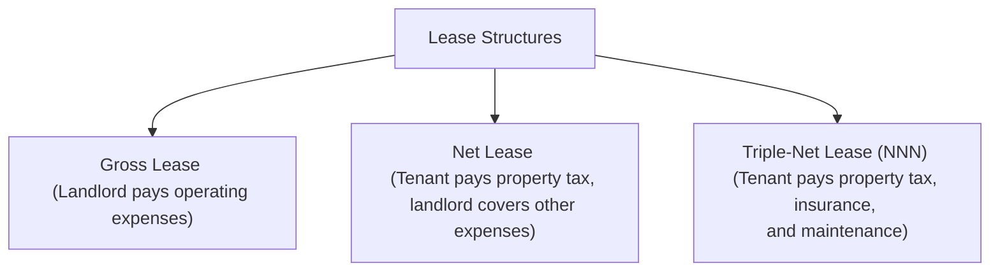

## Introduction
Real estate investments often hinge on a delicate balance between predictable income and the uncertainties of market fluctuations. A single vacant storefront, a troubled tenant, or even a change in operating expenses can throw off an investor’s carefully projected cash flows. Yet, these risks also present incredible opportunities for those who know how to identify solid tenants, structure favorable leases, and calculate rental yields accurately. So, let’s dig in and see how tenant risk, lease structures, and rental yields are interlinked—and why they matter for all sorts of real estate investors.

## Tenant Risk
Tenant risk is basically the risk that occupants of your property won’t meet their lease obligations—either through late rent payments or outright default. This risk is often correlated with the tenant’s creditworthiness, the resilience of their industry, and their ability to fulfill all contractual terms. I remember working in a small property management firm where a new café tenant had an amazing concept but very little cash on hand. We struck a deal because the neighborhood was gentrifying and we believed in the brand, but the store closed within a year. Poof—rent lost, and the expense of finding a replacement soared well beyond what we’d budgeted.

• Creditworthiness: Prospective tenants with a robust balance sheet and a history of timely payments generally pose less risk. You might see large corporate tenants with investment-grade credit. They tend to be safer, albeit you may need to offer them more concessions, like a lower monthly rate or improvements.

• Tenant’s Sector Resilience: A tech start-up or trendy restaurant might be exciting, but they bring a higher default probability if the economy sours. On the other hand, essential businesses like grocery stores or pharmacies usually have steadier cash flows.

• Time Horizon: Stable, long-term tenants with a proven track record in your building (or in other properties) might offer predictable income. But if you love the idea of short-term flexible leases to adapt to changing markets, you’ll inherit more turnover risk.

## Lease Structures: An Overview
The lease structure dictates who pays for what in a landlord–tenant relationship—whether you’re on the hook for taxes, insurance, and maintenance or if the tenant is. Understanding the differences can be crucial because these expenses have a direct impact on net operating income (NOI) and, ultimately, property valuation. 

Let’s say you own a small office building. It’s in a thriving part of town, so you figured you could command high rents, but you didn’t pay attention to the lease structure. Under a gross lease, you ended up shouldering hefty property taxes and insurance premium hikes that materialized mid-year. That sort of surprise hits your bottom line, possibly reducing an 8% anticipated yield to around 6%—not a minor difference.

Below is a simple diagram illustrating three common lease structures:

• Gross Lease: This is straightforward. The landlord covers most costs—maintenance, insurance, and taxes. The tenant pays a flat rent, and that’s largely it. This naturally simplifies life for the tenant, but it means variable costs (like snow removal or a spike in property insurance) could erode the landlord’s net income.

• Net Lease: In a net lease, the tenant shoulders some portion of the property’s operating expenses (often property taxes). The landlord may still pay for insurance, major structural repairs, or certain maintenance fees. Because the tenant picks up part of the tab, the base rent in a net lease might be slightly lower than under a gross lease.

• Triple-Net (NNN) Lease: If you crave predictability as a landlord, the triple-net lease might be your best friend. Under NNN, tenants pay property taxes, insurance premiums, and maintenance costs (beyond just basic upkeep). The landlord’s primary job is to collect the rent check and handle major structural repairs. These leases are common in free-standing retail (like big-box restaurants or pharmacies) and can yield stable, predictable cash flows.

## Rental Yields and Key Considerations
In real estate, especially from an investor’s vantage point, property returns are often expressed as a yield on the amount invested. Rental yield, in its simplest form, is:


\text{Rental Yield} = \frac{\text{Annual Net Rent}}{\text{Purchase Price}}


Say you purchased a small retail property for $1,250,000. After all operating expenses (taxes, insurance, repairs, you name it), you net $100,000 a year in rental income. That’s an 8% rental yield:


\text{Rental Yield} = \frac{100{,}000}{1{,}250{,}000} = 8\%


Folks often compare this yield against alternative investment opportunities—like bonds or equities—to decide if the real estate deal is worth the capital outlay. You might find yourself liking a triple-net property at a 5.5% yield if it has a creditworthy tenant (e.g., a major, well-rated retailer) and minimal risk.

### Lease Duration and Renewal Options
Longer leases can benefit the landlord in terms of predictable cash flow. If you’ve just locked in a 10-year lease, you can rest easy about occupancy for a while (assuming the tenant remains financially healthy). But the flip side is that you sacrifice flexibility: if market rents surge after three years, you can’t usually reopen negotiations until renewal (unless you have built-in rent escalators or mid-term rent adjustments).

Shorter leases, on the other hand, allow you to reprice the property more frequently to reflect current market conditions. However, that can lead you to the headache of tenant turnover. Turnover risk grows when tenants have frequent exit options. And the cost of re-tenanting—broker fees, marketing, property improvements—should definitely be on your radar.

### Rent Escalations and Indexation
Many leases include rent escalations to keep up with (or outpace) inflation. You might see annual 2–3% increases or escalations tied to an index such as the Consumer Price Index (CPI). If inflation ticks up unexpectedly, index-linked leases protect your real returns. But watch out for the other side: if inflation is lower than the fixed step, your tenant may try to renegotiate or push back.

### Tenant Concessions
Let's be honest: it’s a competitive market out there. To sweeten the deal, landlords might offer concessions, such as one or two months of free rent, or maybe extra tenant improvements. Concessions can be an effective negotiation tool, especially for prime tenants who bring brand value and foot traffic. However, concessions reduce your effective rental yield, so weigh that carefully.

### Covenant Strength
This refers to the legal enforceability of the lease terms, plus any guarantees provided by the tenant or its parent company. A triple-net lease with an airtight covenant from an established firm is usually viewed as low-risk. Conversely, smaller or brand-new entities may not offer the same robust covenant, which heightens your risk exposure.

## Additional Risk Management Tools
• Diversification: If possible, hold multiple properties or multiple tenants under one roof to spread your default risk.  
• Lease Guarantees: Obtain corporate or personal guarantees from tenants when you sense borderline credit strength.  
• Security Deposits or Letters of Credit: These provide a cushion if the tenant defaults.  
• Insurance Policies: Commercial property insurance, rent loss coverage, and others can protect your cash flow stream.

## Best Practices and Common Pitfalls
1. Conduct Thorough Due Diligence: Check prospective tenants’ financial statements, business credit reports, and references before signing long-term leases.  
2. Monitor Market Rents: Periodically benchmark your rents against similar properties in the neighborhood. If you’re significantly below market rent, you risk leaving money on the table.  
3. Budget for Maintenance: Even in NNN leases, some capital expenditure items (like major structural replacements) might remain your responsibility.  
4. Maintain Good Tenant Relations: A bit of courtesy can go a long way. Quick responses to maintenance requests and fair lease terms may encourage reliable tenants to stay or renew.  

I remember being a part of a real estate syndicate that overlooked some pretty hefty capital expenditure reserves because the building had stable tenants. Then we got slammed by a roof replacement. That turned a profitable year into a borderline break-even. Lesson learned: always keep an ample contingency fund.

## Exam Tips and Strategies
For exam scenarios, you can expect item sets or mini-cases that ask you to calculate rental yields, assess lease structures, or compare potential tenants based on credit risk. A typical question might give you partial-year occupancy assumptions, seasonal patterns, or escalation clauses. Be prepared to:

• Carefully separate gross lease from net lease expenses.  
• Perform quick yield calculations using net figures.  
• Factor in concessions or escalations.  
• Evaluate the trade-offs between a high-rent, short-term lease vs. a lower-rent, longer-term lease.  
• Understand the impact of occupant default on lease revenue assumptions in a discounted cash flow approach.

Try laying out all relevant numbers to ensure no hidden expense or rent escalation gets overlooked. Watch out for partial-year calculations if a lease starts mid-year. It’s easy to be tripped up by small details.

## Conclusion
Tenant risk, lease structures, and rental yields are all crucial interlocking pieces of the real estate investment puzzle. A property’s success isn’t just about prime location and good looks—knowing how to select reliable tenants, negotiate favorable contractual terms, and compute returns can make or break your portfolio performance. At the end of the day, real estate remains part art, part science. Personal experience and a willingness to adapt to shifting market conditions go a long way. So, keep your diligence sharp, your lease terms balanced, and your yield calculations precise. The rest tends to fall in place.

## References
• Brueggeman, William B., and Jeffrey D. Fisher. Real Estate Finance & Investments.  
• International Council of Shopping Centers (ICSC), for retail lease structure guidelines: <https://www.icsc.org>  
• CFA Institute Program Curriculum (Level I, 2025 Edition).  

## Test Your Knowledge: Tenant Risk, Lease Structures, and Rental Yields



### A landlord under a gross lease typically:
- [x] Pays most property-related expenses, such as taxes and insurance.
- [ ] Requires the tenant to pay property taxes.
- [ ] Transfers maintenance costs to the tenant.
- [ ] Minimizes variability in operating expenses.

> **Explanation:** Under a gross lease, the landlord covers expenses like taxes, insurance, and maintenance. This results in greater variability in the landlord’s net operating income if those costs rise unexpectedly.

### One advantage of a triple-net (NNN) lease for landlords is:
- [x] Predictability of net income due to tenants bearing most expenses.
- [ ] Higher rental income than a lease without tenant responsibilities.
- [ ] Minimal vacancy risk under any economic scenario.
- [ ] Guaranteed short-term flexibility for raising rents.

> **Explanation:** Triple-net leases have the tenant paying taxes, insurance, and maintenance costs, creating a stable and predictable income for the landlord. However, it doesn’t guarantee there will be no vacancy if the tenant’s business falters.

### When calculating rental yield, the denominator generally reflects the property’s:
- [ ] Annual gross rental income.
- [ ] Annual net operating income.
- [ ] Discounted present value of future rents.
- [x] Acquisition price or purchase price.

> **Explanation:** Rental yield is often calculated by dividing annual net rent by the property’s acquisition price or purchase price, providing a straightforward yield figure.

### A tenant’s creditworthiness primarily affects:
- [x] The likelihood of consistent rent payments.
- [ ] The property’s location rating.
- [ ] The landlord’s insurance rates.
- [ ] The building’s structural integrity.

> **Explanation:** Creditworthiness is a key indicator of a tenant’s ability to pay rent consistently and on time, which directly impacts the owner’s cash flows.

### Under typical lease structures, which of the following is TRUE regarding net leases?
- [x] The tenant usually covers at least one major expense, such as property tax.
- [ ] The landlord has no ongoing costs and only collects rent checks.
- [x] Net leases always have a higher base rent than gross leases.
- [ ] Net leases automatically include future rent escalations.

> **Explanation:** Net lease tenants often pay property tax plus some but not all operating expenses. Base rent can be lower or higher than a gross lease, depending on negotiations.

### Turnover risk in real estate investing refers to:
- [x] The risk (and cost) associated with having to find new tenants when an existing tenant leaves.
- [ ] The loss of rental yield when interest rates rise.
- [ ] Landlord’s inability to manage property maintenance.
- [ ] Municipal tax reassessments.

> **Explanation:** Turnover risk is the time and cost involved in marketing, refurbishing, and securing a new tenant after the previous one vacates.

### A shorter lease term:
- [x] Offers the landlord more frequent opportunities to adjust rent.
- [ ] Always reduces tenant risk.
- [x] Typically removes the possibility of concessions.
- [ ] Guarantees higher annual net rent.

> **Explanation:** Shorter leases let landlords adjust quickly to changing market conditions but can also increase turnover risk. Concessions may still be offered, and not all short-term leases guarantee higher net rent.

### Rent escalations tied to the CPI:
- [x] Help maintain real returns when inflation rises.
- [ ] Are rarely used for commercial properties.
- [ ] Substitute for the security deposit.
- [ ] Are mandatory in all net leases.

> **Explanation:** CPI-based escalations enable rent adjustments according to inflation, protecting the landlord from erosion of purchasing power. They are not mandatory but commonly used to keep rent aligned with inflation.

### A corporate guarantee often:
- [x] Strengthens the tenant’s covenant by backing lease obligations with the corporation’s balance sheet.
- [ ] Reduces the effective income to the property owner.
- [ ] Is only essential if the tenant is already creditworthy.
- [ ] Eliminates the need for operating expense reserves.

> **Explanation:** A corporate guarantee can reduce the landlord’s risk by ensuring the parent company will pay the rent if the subsidiary tenant defaults.

### True or False: A landlord under a triple-net lease (NNN) is still responsible for major structural repairs to the property.
- [x] True
- [ ] False

> **Explanation:** Although tenants under triple-net leases pay taxes, insurance, and maintenance, landlords often retain responsibility for major structural or capital improvements.  


