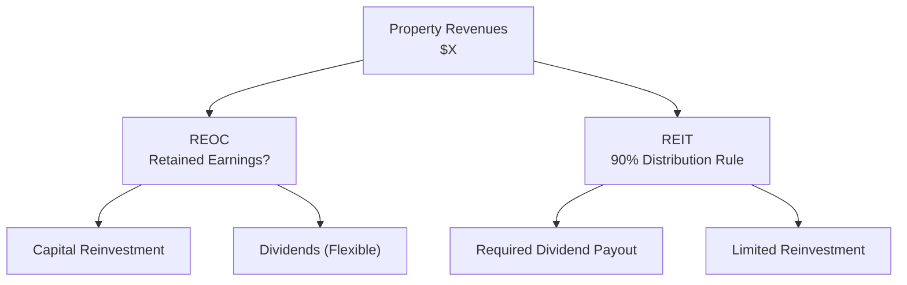

## Introduction

You know, I used to wonder why some real estate companies paid out giant dividends, while others barely paid anything at all. At first, I thought it was all about short-term vs. long-term strategy. But then someone pointed out that a real estate company’s tax status might be the real driver here. That was the day I realized that the difference between a Real Estate Operating Company (REOC) and a Real Estate Investment Trust (REIT) isn’t just about how much property they own—it’s also about how they’re structured under various jurisdictional laws.

In simpler terms, the REIT model appeals to investors hungry for income and tax-advantaged dividends, whereas a REOC might be more of a growth engine, retaining profits to reinvest in new projects. This article explores these two real estate structures, how they function, and how you might want to approach them in a portfolio context.

## Real Estate Operating Companies (REOCs)

Real Estate Operating Companies (REOCs) are public or private enterprises that invest in real estate assets—often commercial properties, residential developments, or mixed-use estates. They focus on:

• Direct ownership and operation of properties.  
• Generating revenue from rents, property management, or development sales.  
• Reinvesting a substantial portion of earnings to expand their operations.

Unlike REITs, REOCs do not receive special tax treatment as pass-through entities. That often means they pay corporate-level tax (depending on their jurisdiction), and they can choose what portion of earnings to pay out in dividends. Some might pay no dividend at all if management believes reinvesting in new properties leads to higher long-term returns. As a result, REOC share price returns rely heavily on corporate growth, property market appreciation, and effective asset management.

### Characteristics of REOCs

• Flexible Earnings Retention: REOCs reinvest the lion’s share of profits into acquisitions, developments, or strategic expansions—enabling them to grow more aggressively.  
• Corporate-Level Taxation: They generally pay corporate income taxes, which can affect net cash flow, particularly if that rate is high.  
• Governance: REOCs must follow standard disclosure rules in their home jurisdiction if they are publicly listed, including quarterly or semiannual financial statements and conference calls.  
• Risk Profile: Because they directly bear the risk of property development, leasing, and market cycles, REOCs can be more volatile. When they do well, though, their returns can be strong—like many growth-oriented stocks.

## Real Estate Investment Trusts (REITs)

Real Estate Investment Trusts differ substantially from REOCs in terms of tax and distribution requirements. By meeting specific tests—often referred to as “REIT compliance tests”—a REIT is granted pass-through status, which means it typically pays no corporate-level income tax (or receives preferential tax treatment) as long as it distributes a high percentage (e.g., 90% or more) of its taxable income to shareholders. 

From an investor’s point of view, a REIT typically complains of these hallmark features:

• High Dividend Payouts: By necessity, REITs are known for paying healthy dividends, making them very attractive to income-seeking investors—whether retirees, pension funds, or philanthropic trusts that rely on stable cash flows.  
• Limited Internal Reinvestment: Because they are obligated to distribute the majority of their earnings, adding new properties to a REIT’s portfolio often requires accessing capital markets (through additional equity or debt issuance).  
• Transparent Structure: REITs must meet certain governance and public disclosure requirements if publicly listed, ensuring regular updates on portfolio composition and financial performance.

### Key REIT Compliance Tests

In many jurisdictions (e.g., the U.S. or other advanced markets), REITs must satisfy several conditions to maintain their tax advantages:

• An Asset Test: Typically demands that a certain portion of assets be invested in real estate.  
• An Income Test: Requires that a specified ratio of annual gross income come from real estate–related activities like rent, mortgage interest, or real property sales.  
• A Distribution Test: Obligates REITs to distribute a large portion (often 90% or more) of taxable income to shareholders.  

Failing these tests can result in losing REIT status, triggering standard corporate taxation—an outcome most REIT managers work hard to avoid.

## Distinguishing Key Features

Though both REOCs and REITs invest in real property, their structures lead to distinctly different experiences for shareholders.

1) Tax Treatment:  
• REOCs: Pay taxes at the corporate level; shareholders then pay taxes on dividends (if distributed).  
• REITs: Typically avoid double taxation on net income, passing through the bulk of earnings directly to shareholders.

2) Dividend Policy:  
• REOCs: No distribution requirement; dividends vary widely or might be zero.  
• REITs: Substantial, consistent dividends to meet regulatory minimums.

3) Growth Strategies:  
• REOCs: Rely on retained earnings for expansion; less frequent external capital raises.  
• REITs: Require repeated access to external capital (debt or equity offerings) to finance additional property acquisitions, expansions, or developments, due to the high payout requirement.

4) Investor Profiles:  
• REOCs: Appeal to shareholders with a growth emphasis—investors who look for capital appreciation and are comfortable with potentially higher volatility.  
• REITs: Draw individuals and institutions looking for stable real estate income, plus potential share-price appreciation if the underlying value of properties rises.

Below is a simple table summarizing these differences:

| Feature                       | REOC                           | REIT                                        |
|------------------------------|--------------------------------|---------------------------------------------|
| Dividend Requirement         | Flexible (often low or none)   | Typically ≥90% of taxable income           |
| Corporate-Level Tax          | Yes                            | Usually none if compliance is maintained   |
| Growth Approach              | Reinvestment & operational gains | External capital raises + property acquisitions |
| Typical Investor Focus       | Growth-oriented                | Income-oriented                             |
| Distribution Frequency       | Variable                       | Typically quarterly or semiannually         |
| Financial Transparency       | Public disclosure if listed    | Public disclosure + REIT-specific filings   |

## Example: Growth vs. Income

Imagine a REOC that owns a portfolio of office buildings in growing metropolitan areas. It collects rent, experiences property-value appreciation, and identifies new construction opportunities. Rather than paying large dividends, it retains cash flows to fund new developments. Its share price may go up significantly—assuming the projects succeed—over time, but you as an investor might not see large dividend checks along the way.

Contrast this with a REIT invested in similar properties but structured under REIT rules. It is required to pay out, let’s say, 90% of its annual taxable income. You get steady dividend income (which can be appealing if you value consistent cash flow), but the REIT often needs to issue new shares or debt to expand its portfolio. Its share price might exhibit less organically driven growth and more consistent yield-based returns.

## Liquidity and Governance

Both REOCs and REITs typically list on public stock exchanges (though there are also private versions). Being exchange-traded instructions:

• Enhances liquidity: Investors can buy and sell shares intraday.  
• Imposes public governance standards: Such as quarterly earnings disclosures and annual meetings.  
• Subjects them to market volatility: Share prices can fluctuate significantly with shifts in real estate market sentiment, macroeconomic factors, or changes in interest rates.

One nuance to keep in mind is that some smaller REITs or REOCs may have thinner trading volumes, leading to broader bid-ask spreads. Also, REITs can become “crowded” when interest rate environments change, as investors often treat them similarly to fixed income–like instruments. 

## Risk and Return Perspectives

Real estate can be cyclical, influenced by factors like economic growth, employment trends, and consumer confidence. While both REOCs and REITs respond to such cycles, the magnitude of swings may differ:

• REOCs: Retaining profits can intensify exposure to development and operational risks. A high-development REOC might see steeper losses during real estate downturns, yet it can also outperform if it times expansions well.  
• REITs: A stable dividend payout tends to support share prices during downturns, especially among yield-seeking investors. On the flip side, REITs can encounter financing challenges if capital markets tighten, constraining their ability to seize new acquisition opportunities.

Market correlation is also a factor. While real estate is often considered an alternative asset class with diversification benefits, publicly traded REOCs and REITs can sometimes show higher correlations with overall equity markets, especially when return-seeking investors treat them as stock substitutes.

## Best Practices and Common Pitfalls

When analyzing or investing in either REOCs or REITs, here are a few tips:

• Evaluate Management: Look at track records, especially the executive team’s experience with property cycles, development, lease negotiations, and cost management.  
• Understand Capital Structure: Check debt levels, preferred stock, and maturity schedules for any near-term refinancing risk.  
• Be Cautious with High Dividend Yields: A sky-high yield might be a sign of riskier assets, weak property fundamentals, or an unsustainable payout ratio.  
• Monitor Regulatory Changes: Real estate tax codes, local property laws, and zoning regulations can quickly impact portfolio performance.  
• Study Real Estate Market Dynamics: Rental rates, occupancy trends, and supply-demand metrics are essential for forecasting revenue potential.

## Visualizing the Income Flow

Below is a simple Mermaid diagram illustrating how property revenues flow through a REOC versus a REIT. Notice the REIT’s high distribution requirement, while the REOC retains more capital for reinvestment.

## Concluding Thoughts

Whether you gravitate toward a REOC’s growth and operational approach or a REIT’s steady dividend stream depends on your goals, risk tolerance, and preference for reinvesting versus receiving income. Some folks, especially retirement-focused investors or endowments, might jump at the reliability of a REIT’s constant payout. Others looking for a more “entrepreneurial” angle on real estate might pick a REOC for the potential upside. Either way, performing a thorough due diligence—assessing balance sheets, real estate markets, and macroeconomic conditions—remains crucial.

## Final Exam Tips

• Read the Fine Print on Controls and Governance: CFA Level I and beyond will test your knowledge of how governance structures and disclosures differ between various equity forms (e.g., REOCs, REITs).  
• Practice Calculating Dividend Yields: If you see a question about an investment that pays out 90%+ of its income, it’s probably referencing a REIT structure.  
• Compare Tax Treatment Implications: Know how pass-through tax status affects returns relative to a standard corporate structure.  
• Understand Growth vs. Distribution Trade-offs: The exam often tests your reasoning about why a company might prefer internal reinvestment over external funding, or vice versa.  
• Factor in Macroeconomic Indicators: You might be asked to predict how changes in interest rates or property market cycles affect share prices.  

Think about typical exam scenarios: They might give you a hypothetical investor with specific income needs, then ask whether a REIT or a REOC would fit best. Or you might see a question about capital budgeting and the effect of required distributions on net cash flows. Make sure to clearly articulate your reasoning.

## References

• NAREIT (www.reit.com) – Offers educational resources, market data, and historical performance information.  
• CFA Institute Program Curriculum (Level I, 2025 Edition) – Includes comprehensive readings on alternative investments, real estate, and REIT structures.  
• Market Data Platforms (Bloomberg, FactSet) – For real-time financial data and peer comparisons.  

## Test Your Knowledge: Real Estate Operating Companies vs. REITs



### Which characteristic most clearly distinguishes a REIT from a REOC?

- [ ] Both distribute limited earnings to shareholders.
- [x] REITs are generally required to distribute at least 90% of their taxable income.
- [ ] REOCs face strict pass-through tax obligations.
- [ ] REOCs are required by law to distribute all earnings.

> **Explanation:** REITs usually must distribute 90% or more of their taxable income to maintain pass-through status, whereas REOCs can retain most or all of their earnings.

### An investor wanting a high level of current income from real estate holdings is more likely to choose:

- [x] A publicly traded REIT.
- [ ] A private REOC focused on development.
- [ ] A hedge fund specializing in real estate–linked derivatives.
- [ ] A homebuilding REOC that plows earnings back into new construction projects.

> **Explanation:** REITs generally offer higher dividend payouts due to mandatory distribution requirements, meeting the needs of income-focused investors.

### How does a REIT typically finance property acquisitions?

- [ ] By retaining the majority of its earnings and reinvesting them.
- [x] By issuing new equity or taking on debt, because it must distribute most of its net income.
- [ ] By avoiding external capital to retain corporate-level tax advantages.
- [ ] By converting short-term liabilities to equity automatically.

> **Explanation:** Because REITs are required to pay out a high percentage of earnings, they often rely on external equity or debt markets to fund expansions.

### What is the potential downside of a REOC retaining most of its earnings?

- [x] Increased corporate tax liability and possibly higher volatility due to aggressive reinvestment.
- [ ] Limited ability to reinvest, leading to a shrinking asset base.
- [ ] Forced distribution of all profits, reducing available capital.
- [ ] It violates standard securities regulations in most jurisdictions.

> **Explanation:** REOCs typically pay corporate taxes on retained earnings and can experience volatile returns if their reinvestments do not pay off.

### An investor is comparing two identical real estate portfolios: one structured as a REOC, the other as a REIT. Which factor is likely to differ the most?

- [x] The dividend payout and tax treatments.
- [ ] Valuation methodologies such as discounted cash flow.
- [ ] Occupancy rates in the properties themselves.
- [ ] The sector of real estate in which they invest.

> **Explanation:** While property valuations and sectors could be similar, the dividend requirement and resulting tax implications often create the clearest structural difference.

### Why might a REIT exhibit lower earnings retention than a comparable REOC?

- [x] Regulations mandate that the REIT distribute a major portion of its income.
- [ ] REITs typically reinvest all free cash flows into new projects.
- [ ] REOCs require special permission to retain any income.
- [ ] REITs are subject to the same taxation rules as REOCs.

> **Explanation:** REIT statutes force the distribution of most of the REIT’s income to shareholders, leaving less available for internal reinvestment.

### Which of the following best explains a reason REITs often have high dividend yields?

- [ ] They evade taxes through offshore accounts.
- [x] They must distribute substantially all of their taxable income, thus providing larger dividends.
- [ ] They typically have no corporate-level expenses.
- [ ] Their rental income faces no market-related risk.

> **Explanation:** REITs’ legal obligation to make large distributions results in relatively high dividend yields, which can be attractive to income-focused investors.

### Which of the following would generally be a red flag when analyzing a REIT?

- [ ] Regular equity issuances to fund acquisitions.
- [ ] A high dividend payout ratio consistent with regulatory requirements.
- [ ] A well-diversified property portfolio.
- [x] Inability to meet the 90% distribution requirement due to poor cash flow.

> **Explanation:** Failing to meet the mandatory distribution requirement can jeopardize a REIT’s tax status.

### A REOC focusing primarily on property development is expected to:

- [ ] Provide high and stable dividend payments.
- [x] Retain a large share of earnings to finance growth projects.
- [ ] Limit expansion projects due to distribution obligations.
- [ ] Act identically to a mortgage REIT specializing in lending.

> **Explanation:** REOCs typically reinvest earnings in projects rather than distributing them, which can fuel growth if successful.

### True or False: For regulatory compliance, a REIT must typically invest no more than 10% of its total assets in real property.

- [ ] True
- [x] False

> **Explanation:** A REIT usually must maintain the majority of its assets in real estate, not the other way around. The typical test might require that 75% or more of assets be in real estate–related holdings.


