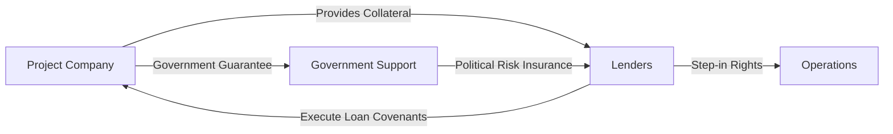

## Introduction

Infrastructure debt has become a pivotal component of the global investment landscape, providing long-term financing alongside stable, predictable yields. This market brings together governments, private companies, and institutional investors, all aiming to develop and maintain essential public services like transportation, energy, water, and telecom networks. Think roads, airports, toll bridges—those sorts of large-scale projects that, you know, people rely on every day. Investors with a slightly longer time horizon might find these instruments appealing because they usually promise relatively steady returns matched to multi-decade project lifecycles.

This section covers the fundamentals of infrastructure debt, including how it’s structured, what sorts of credit and risk assessments are performed, how investors protect themselves via covenants and insurance, and the regulatory environment shaping these deals. It’s kind of like the bedrock for complex financing in infrastructure. In the sections that follow, we’ll also link to broader real-estate and infrastructure concepts discussed throughout this chapter.

## Overview of Infrastructure Debt Instruments

Infrastructure debt instruments typically come in various flavors—loans, bonds, and private placements. Although each structure may follow distinct documentation and issuance processes, their overarching purpose is to finance large projects where repayment relies on the cash flows generated by the infrastructure asset itself. A few key points:

• Longer maturities: Infrastructure projects can stand for decades, so it’s normal to see debt ranging from 10 to 30 years (or more!).  
• Cash-flow matching: The project’s revenue—such as tolls, electricity fees, or lease rentals—feeds directly into paying interest and principal.  
• Private placements: Some issuers bypass public markets by placing bonds directly with institutional investors (pension funds, insurers). These custom deals allow better alignment of covenants, repayment schedules, and other terms.

### Typical Structures

1. Project Bonds  
   Project bonds are publicly or privately issued debt securities, usually secured by the project’s future revenues. They can be investment-grade or high-yield, depending on the project’s cash-flow reliability, sponsor strength, and regulatory environment.

2. Bank Loans and Syndicated Loans  
   Banks often structure loans to fit the cyclical construction and operational phases of the project. A syndicated approach is quite common, where multiple lenders share the funding and risks, especially in mega-infrastructure deals.

3. Mezzanine Financing  
   In some deals, sponsors might layer in mezzanine financing (subordinated debt) to achieve higher leverage. This layer typically carries higher returns (and risk) than senior debt since it sits lower in the capital structure.

4. Private Placements  
   This route pairs well with institutional investors who want a direct stake in a project’s debt structure. You might see fewer regulatory hurdles in some markets, plus more flexible terms tailored to the unique needs of the project and of the investor.

## Credit Analysis for Infrastructure Projects

Infrastructure’s credit analysis differs from corporate credit analysis because the focus leans heavily on the project itself rather than on a corporation’s diversified cash flows. Here, lenders zero in on:

• Concession Terms and Regulatory Stability: If a government concession or license underpins the project’s operation, the viability of that arrangement is critical. Concessions that ensure stable revenue, like guaranteed demand or regulated tariffs, reduce default risk significantly.  
• Project Sponsor Quality: Lenders want to see that sponsors have a track record of delivering similar projects on time and within budget—plus sound governance and a robust financial standing.  
• Operational Track Record: For ongoing projects, lenders assess actual performance. For new ventures, they evaluate feasibility studies, environmental clearances, and the track record of key contractors.  
• Debt Service Coverage Ratio (DSCR): A measure of how the project’s net operating income compares to its debt obligations. DSCR > 1.0 indicates that operating income exceeds debt repayment needs, but lenders often require DSCR well above 1.2 or 1.3 for cushion.  
• Resilience of Revenue Streams: Revenue can be heavily influenced by political decisions, traffic volumes, or commodity prices (in the case of energy). Stability clauses or guaranteed purchase agreements are crucial in mitigating volatility.

You might even see deals where lenders conduct specialized stress tests. For instance, they’ll model a toll road’s traffic at 70% of expected levels or an energy project’s output if there is a 10% decline in power demand.

## Risk Mitigation Techniques

### Covenants

Infrastructure project lenders typically establish comprehensive covenants that define clear operational and financial boundaries for the borrower. For instance, the project company might commit to maintaining a minimum DSCR or a maximum debt-to-equity ratio. If those ratios are breached, the lender can step in to remedy the issues—often halting dividend distributions or requiring additional equity injections.

### Step-In Rights

Step-in rights let lenders take partial (or total) control of project operations if the borrower is in default or if certain performance triggers are hit. Let’s be honest: it’s never pleasant to step in and operate a wind farm yourself—it’s specialized knowledge, right? But for the lender, this prerogative ensures that they can reorganize and salvage revenue streams if current management fails.

### Government Guarantees and Political Risk Insurance

Because infrastructure often intersects with highly regulated sectors or large-scale public interests, governments sometimes extend explicit guarantees to reduce credit risk. In some emerging markets, you’ll also see multilateral agencies like the World Bank offering partial risk guarantees or political risk insurance (PRI). This coverage is basically the investor’s safety net against events like nationalization, policy shifts, or even political instability.

### Collateralization

Most infrastructure debts are collateralized by project assets, which might include land, equipment, or even intangible assets (like contractual rights). Asset pledges grant the lender the right to liquidate the infrastructure or its revenue streams should default occur. Granted, repossessing a highway in the middle of nowhere might not be your dream scenario. But from a lender’s perspective, having a direct claim on real assets is often better than unsecured corporate obligations.

Below is a simple mermaid diagram summarizing the relationship among these key risk mitigation elements:

In this flowchart:
• A represents the project company.  
• B depicts lenders and their direct control or influence.  
• C is the operational control that lenders can assume under step-in rights.  
• D indicates government backing and insurance mechanisms.

## Refinancing and Restructuring

Infrastructure projects can require decades to fully roll out, and it’s hardly surprising that financial conditions shift over such long timelines—interest rates might drop, or technology might drastically change. Refinancing provides a way to optimize capital structure post-construction, often once operational risks have decreased and the project has stable revenue. Common reasons for refinancing:

• Lowering interest costs when credit spreads compress.  
• Adjusting maturity dates to match extended concession periods or expansions in scope.  
• Freeing up equity by leveraging improved project valuation over time.

On the flip side, restructuring is typically a reaction to underperformance or external shocks. Maybe there was a spike in the cost of raw materials, or the project’s revenue stream didn’t ramp up as expected. Recapitalizing or renegotiating terms with lenders can be an alternative to outright default—though it’s rarely a walk in the park.

## Basel III and Regulatory Impact

Banks historically dominated infrastructure lending globally because large-scale infrastructure loans looked like a stable, long-term match for banks’ balance sheets. But hey, regulatory frameworks such as Basel III toughened capital requirements and liquidity constraints on longer-duration or illiquid assets. This shift nudged banks to reduce large exposures, creating new opportunities for alternative lenders such as pension funds, insurance companies, and private debt funds.

### Minimal Regulatory Constraints for Non-Bank Lenders

Institutional lenders not bound by the same regulatory capital rules enjoy more flexibility in holding illiquid, long-duration debt. They might find infrastructure debt particularly attractive as it fits a liability-matching approach for obligations that stretch decades (for instance, pension payouts).

### Deal Complexity and Expertise Gaps

One slight catch is that analyzing and structuring these projects demands specialized expertise that some non-bank lenders might lack initially. So, you will often see collaborations with banks, specialized consultants, or joint ventures that combine the best of both worlds—capital from institutional lenders and underwriting know-how from banks.

## Practical Example: Financing a Tidal Energy Project

To illustrate a real but hypothetical case, let’s consider a tidal energy project off the coast of Country X.  

1. The project sponsor obtains a 20-year government concession to harness tidal power and sell electricity via a regulated tariff.  
2. It issues senior secured bonds worth USD 250 million in a private placement to a group of insurance companies. These investors love the stable yield and matching maturity.  
3. A DSCR covenant of at least 1.30 is locked in; if net income dips below that threshold for two consecutive quarters, the project must withhold distributions and consider raising an equity infusion.  
4. The sponsor also obtains political risk insurance from a multilateral development bank to protect against expropriation, or policy changes that cut short the concession.  
5. Five years into operations, the sponsor sees interest rates tumble. Having built a track record of stable electricity generation, the project refinances the bonds at a lower coupon, thereby freeing up capital to expand the facility.

## Relationship with Overall Portfolio Allocation

From a portfolio perspective, infrastructure debt can provide stable cash flows, diversification, and relatively low correlation with typical public equity markets. However, these instruments do come with long lock-up periods and limited liquidity. For a multi-asset portfolio, a moderate allocation to infrastructure debt can help lengthen the duration and might boost yield in a low-interest-rate environment. That said, do watch out for political and operational risks hidden in each geography or sector.

## Best Practices and Common Pitfalls

• Thorough Due Diligence: Infrastructure deals are never “one-size-fits-all.” Understand local regulations, sponsor track records, and operational complexities.   
• Assessing Covenant Breaches: Overly lax covenants can lead to “covenant-lite” structures that might hamper lenders’ ability to intervene.  
• Monitoring DSCR Over Time: Don’t rely solely on initial DSCR estimates. Service coverage might fluctuate as the project transitions from construction to operation, or if unexpected events arise.  
• Diversification: Spreading risk across diverse infrastructure types (water, roads, energy) and geographies can reduce concentration of adverse political or natural-disaster risks.  
• Potential Over-Reliance on Guarantees: Government and multilateral guarantees are helpful, but conditions can change over the long term. Historically stable governments can shift policies more suddenly than you’d expect.

## Exam Tips and Strategies

1. Understand DSCR and Covenant Triggers: You may be asked to calculate coverage ratios or comment on how they relate to different project risk profiles.  
2. Evaluate Risk Mitigation Tools: Essays might ask how step-in rights or political risk insurance can alter a project’s creditworthiness.  
3. Watch for Regulatory Shifts: You might see item sets describing how Basel III constraints reduce bank participation in project funding. Be prepared to discuss how institutional lenders fill that gap.  
4. Focus on Real-World Examples: The CFA exam increasingly uses scenario-based questions. If the prompt describes a concession-based project with uncertain demand, think about demand risk, coverage ratios, and sponsor reputation.  
5. Distinguish Between Refinancing vs. Restructuring: They sound similar, but exam questions might test your ability to articulate these differences (particularly in default or near-default scenarios).

## References

• World Bank Group, Private Participation in Infrastructure Database  
• Weber, B. & Alfen, H. W. (2023). Infrastructure as an Asset Class.  
• CFA Institute Program Curriculum (Level I, 2025 Edition)

---

## Test Your Knowledge: Infrastructure Debt and Risk Management



### In analyzing an infrastructure debt deal, which factor typically influences the lender’s decision the most?

- [ ] Short-term fluctuations in market sentiment.
- [x] Project-specific revenue stability and regulatory environment.
- [ ] Diversification of the sponsor’s other business lines.
- [ ] The sponsor’s share price in equity markets.

> **Explanation:** Infrastructure debt analysis focuses on the specific project’s cash flows, revenue stability (e.g., from concessions or contracts), and the regulatory framework. Market sentiment or a sponsor’s diversified business lines are secondary compared to direct cash-flow resilience.

### Which statement best describes the role of step-in rights?

- [ ] They allow the borrower to reduce interest payments at specific milestones.
- [x] They give lenders the ability to take over project operations if the borrower defaults.
- [ ] They allow governments to modify concession agreements unilaterally.
- [ ] They permit sponsors to refinance without lender consent.

> **Explanation:** Step-in rights protect lenders by letting them assume control of or replace project management if the borrower fails to meet obligations, helping safeguard the project’s value and cash flows.

### Which of the following would be considered a direct risk mitigation technique typically embedded in infrastructure debt covenants?

- [x] Minimum debt service coverage ratio requirement.
- [ ] The sponsor committing to future share price targets.
- [ ] Government-led forced buyouts of minority shareholders.
- [ ] Eliminating all environmental safeguards.

> **Explanation:** Infrastructure debt investors often require a minimum DSCR, ensuring adequate coverage of debt obligations. Share price targets, forced buyouts, or removing environmental safeguards are not typical covenant items.

### Which of the following is a common reason for refinancing infrastructure debt?

- [x] Reducing interest expenses when the project risk profile improves.
- [ ] Eliminating the need for project insurance.
- [ ] Bridging short-term working capital needs during construction.
- [ ] Avoiding long-term obligations in favor of short-term lines of credit.

> **Explanation:** Once a project becomes operational and stable, the risk decreases, allowing sponsors to refinance at lower rates. Refinancing is not primarily aimed at removing insurance, bridging short-term capital, or replacing long-term obligations with shorter credit lines (which can increase maturity and liquidity risk).

### A project with a DSCR consistently above 1.2 indicates:

- [x] The project’s net operating income is sufficient to cover debt obligations with a buffer.
- [x] Lenders may be more confident about timely repayments.
- [ ] The project receives direct government subsidies.
- [ ] The project is automatically investment-grade rated.

> **Explanation:** A DSCR above 1.2 suggests the project generates sufficient, stable cash flows to meet its debt obligations comfortably. It doesn’t guarantee an investment-grade rating or government subsidies, but does enhance lender confidence.

### In an infrastructure financing context, “private placement” refers to:

- [x] The issuance of securities directly to a limited number of institutional investors.
- [ ] A public equity offering on a recognized stock exchange.
- [ ] A partnership arrangement involving the project sponsors only.
- [ ] A form of mezzanine debt with strict covenants.

> **Explanation:** Private placements involve offering debt or equity to a select group of investors without the broad regulatory requirements of a public offering. It typically involves direct negotiation and tailored terms.

### Which of the following best characterizes the impact of Basel III on infrastructure lending?

- [x] Banks face higher capital requirements, leading to less long-term lending capacity.
- [ ] Banks can lend more aggressively due to lenient equity treatment.
- [x] Institutional investors, such as pension funds, step in to fill the gap.
- [ ] Hedge funds typically avoid infrastructure debt opportunities.

> **Explanation:** Basel III’s stricter capital requirements make long-duration exposures more capital-intensive for banks, often resulting in reduced appetite for large infrastructure loans. This shift opens opportunities for institutional investors with matching long-term liabilities.

### A lender might reassess a DSCR requirement if:

- [x] The project’s future revenue stream becomes more volatile.
- [ ] The project’s share price increases in a public market.
- [ ] The sponsor invests in unrelated business ventures.
- [ ] Local currency appreciates against the U.S. dollar.

> **Explanation:** A DSCR requirement aims to ensure adequate coverage and might need to be tightened if the project’s revenue stability worsens. External factors like share prices or sponsor’s other business ventures do not typically prompt DSCR adjustments; foreign exchange movements can matter but only if the revenue or expenses are denominated differently and affect project cash flow projections.

### Government or multilateral “political risk insurance” typically covers:

- [x] Losses arising from expropriation or abrupt policy changes by host governments.
- [ ] Shortfalls in project revenue due to technology failure.
- [ ] Full repayment of debt regardless of project performance.
- [ ] Damage caused by natural disasters.

> **Explanation:** Political risk insurance primarily protects against losses from government actions, such as expropriation, breach of contract, or regulatory/policy changes. It generally doesn’t cover operational and technological risks or natural disasters.

### Political risk insurance for infrastructure projects is (select one):

- [x] True
- [ ] False

> **Explanation:** Political risk insurance is very real and often used in emerging markets to safeguard lenders and equity investors against governmental or sovereign risks such as expropriation and policy changes.


