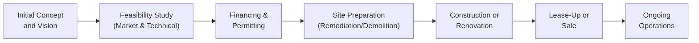

## Introduction and Overview

Have you ever driven past an old warehouse and thought, “Wow, this could be turned into something amazing with the right vision and a bit of elbow grease?” Well, that thought is basically at the heart of redevelopment, especially in the context of brownfield and greenfield projects. In real estate and infrastructure, we tend to gear ourselves toward big investments—all while juggling a range of risks and returns. Brownfields, which are sites previously developed (that might be a bit worn down or even contaminated), can offer relatively established cash flows (since infrastructure is already there). Greenfields, on the other hand, are brand spanking new developments—think building a manufacturing facility on vacant land or raising an entirely new housing complex from scratch.

Sounds straightforward, right? Maybe. In reality, there’s a swirl of factors to consider, from environmental liabilities and regulatory approval to advanced feasibility studies, public incentives, and the dreaded timeline slippages. So let’s walk through these topics in a structured (but hopefully not too stiff) way.

## Brownfield vs. Greenfield: A Quick Primer

### Brownfield Projects
• Definition: Brownfield projects are developments on sites that have existing infrastructure but may also come with contamination or compliance issues.  
• Key Characteristics:  
  – Usually have some track record of demand (you might already have an industrial base or a population center).  
  – Lower demand risk, since the location and usage often have historical data.  
  – Elevated risk from environmental hazards (e.g., asbestos in old buildings, infestations, or soil contamination).  
  – Potential for faster revenue generation because utilities, roads, and support systems frequently exist.

### Greenfield Projects
• Definition: Greenfield projects involve a completely new site, typically undeveloped.  
• Key Characteristics:  
  – No (or minimal) pre-existing facilities, so you can build to modern specs from the get-go.  
  – Potentially higher returns due to greater flexibility in design and usage.  
  – Elevated construction risk, plus the need to confirm that your new project concept truly fits market demand (since it’s brand new).  
  – Often require more capital to lay the foundation for roads, utilities, and infrastructure.  

### Deciding Between Brownfield and Greenfield
Imagine you’re a portfolio manager picking your next real estate or infrastructure investment. Brownfields often make sense if you want something with an existing footprint (like a refurbished shopping center in a proven suburban area). Greenfields can be your best bet if you see strong demographic growth (e.g., a booming city that needs more housing, or a region that’s opening its first renewable energy park). Each path comes with unique risk premiums that hinge on things like contamination, rezoning, infrastructure readiness, or simply the unknown time it will take to complete a fully new build.

## Redevelopment Strategies

In many cases, real estate redevelopment is a sweet spot. Why demolish that historically cool building when you can adapt it to a more modern purpose? Known as “adaptive reuse,” this practice has gained traction, especially as urban areas try to preserve cultural character. Projects might include:

• Converting an old hospital into a high-rise apartment building.  
• Transforming dated retail malls into multi-use offices with co-working spaces.  
• Giving heritage libraries new life as event venues (trust me, I once attended a wedding in a century-old library turned art gallery; it was surreal!).

Redevelopment often benefits from local government incentives, like historic preservation tax credits or local grants, because the city or municipality gets to revitalize neighborhoods and create jobs.

## Feasibility Studies: Your Best Friend

Let’s say you spot a golden opportunity: redeveloping a neglected warehouse district. Before you get starry-eyed, feasibility studies are essential. These studies:

• Evaluate site conditions, including soil analysis and structural integrity.  
• Assess traffic flows; no one wants to build a commercial center that’s a pain to access.  
• Conduct market demand analysis to see if people actually want that new office or residential concept.  
• Estimate costs and revenue timelines.

In more formal terms, a feasibility study looks at the technical, financial, and market viability of any development plan so you know if it’s realistically profitable. A robust feasibility study can span environmental assessments, contractor costs, local economic trends, tax implications, and more.

## Risk and Return Perspectives

### Brownfield Risk and Return
With brownfields, you don’t always start from scratch. That’s an advantage in terms of speed to market and possibly existing tenants. However, environmental unknowns could arise. For instance, you might have to do major soil remediation or building demolition at significant cost. The good news is that you can often gauge local demand patterns, so your revenue forecasts might be more reliable.  

The direct formula might look something like:

R_b = R_f + (Market Risk Premium) + (Brownfield Premium – Environmental Factor)

Where R_b stands for the required return for a brownfield development, R_f is the risk-free rate, and we add in specific risk premiums for brownfield complexities.

### Greenfield Risk and Return
Greenfields tend to have higher potential returns, but also a bigger risk puzzle—construction cost overruns, uncertain end-user demand, and more complicated regulatory approvals. On the plus side, you have a blank canvas: you can incorporate modern sustainability features, advanced building technologies, or the latest in infrastructure design.  

A simplified formula for a greenfield might be:

R_g = R_f + (Market Risk Premium) + (Development Risk Premium) + (Permitting & Regulatory Premium)

You might see these risk premiums shifting depending on the asset class, regulatory environment, or region’s macroeconomic conditions.

## Public Incentives and Government Support

Both brownfield and greenfield projects often qualify for government incentives:

• Tax Credits or Grants: Local or national governments can provide incentives to spur investment in targeted redevelopment zones.  
• Low-Interest Loans: Redevelopment authorities or banks with mandated community investment requirements might lend at below-market rates.  
• Tax Increment Financing (TIF): Future increases in tax revenue from the improved property are used to finance current development costs.  

Local administrations want to see job creation, improved property values, and robust local economic development. As an investor, it’s great if you can help a community while also boosting your returns.

## Environmental and Regulatory Considerations

### Site Contamination
Brownfield properties can come with contamination from old industrial uses. Cleaning it up might involve everything from removing hazardous materials to installing environmental controls or encapsulating certain areas.

### Permitting and Zoning
Greenfields in particular might require more extensive zoning approvals, environmental impact statements, and negotiations with local stakeholders. Remember that a site’s zoning ordinance dictates what you can (and cannot) build. Rezoning a farmland area into a commercial or residential zone can be tricky and time-consuming.

### Community Engagement
Redevelopments—brownfield or greenfield—often have a layer of community engagement. Local residents might worry about increased traffic, changes to the neighborhood aesthetic, or property tax shifts. Engaging early with community forums can smooth out friction and speed up approvals.

## Practical Case Study Example

Let’s consider a hypothetical scenario:

• You have $20 million to invest in a property fund.  
• Option A: A brownfield site with an old textile mill. The building is partially contaminated, so you’d need a $2 million remediation. On the plus side, the city is offering a $1 million historic preservation tax credit if you retain the façade. Market demand looks decent.  
• Option B: A greenfield plot in a fast-growing suburb for a mixed-use retail/residential development. You’ll need to extend city water and sewer lines, adding roughly $3 million in infrastructure costs. You can build exactly what’s in demand—perhaps those modern, open-concept apartments with ground-floor retail. But the timeline is 18 months of construction and approvals before you see any revenue.

In a broad sense:  
– Option A might yield stable returns sooner, with less demand risk but more environmental headaches.  
– Option B might deliver higher returns if the new development concept fits the booming local market. But you have to wait longer (and remain patient during potential regulatory hiccups).

## Diagram: Life Cycle of a Redevelopment Project

Below is a simple Mermaid diagram outlining the typical steps of a redevelopment project:

Each stage carries its own set of tasks, risks, and potential for cost overruns. For instance, if feasibility indicates that your location faces weak demand for commercial space, you might pivot to constructing residential units or mixed-use offices.

## Glossary of Key Terms

• Adaptive Reuse: Converting an old or historic building to a new use (e.g., turning a factory into a hip office space).  
• Feasibility Study: Examination of the technical, financial, and market viability of a proposed project.  
• Site Contamination: Presence of hazardous substances in soil or water, often requiring special cleanup or mitigation.  
• Tax Increment Financing (TIF): A way to fund redevelopment by diverting future property tax revenue increases to finance current project costs.  
• Zoning Ordinance: Local regulations dictating permissible uses for land or structures.  
• Market Demand Analysis: Assessment of the current and future appetite for the project’s intended use (office space, residential, industrial, etc.).  
• Development Risk Premium: An additional required return for investing in complex or uncertain construction projects.  
• Historic Preservation Tax Credits: Financial incentives that encourage the restoration of historically significant properties.

## Best Practices, Pitfalls, and Insights

### Best Practices
• Conduct in-depth feasibility studies early. Skimping on analysis can torpedo your project down the line.  
• Create contingency budgets. Construction almost always costs more or takes longer than you’d like.  
• Engage with local authorities and communities. Building good will can expedite zoning approvals.  
• Diversify your capital stack. Consider different financing sources (like TIF, tax credits, or low-interest loans) to reduce your overall risk.  
• Incorporate ESG factors—energy-efficient designs, local hiring, or heritage preservation can enhance both financial and social returns.

### Common Pitfalls
• Underestimating remediation times or costs for brownfields.  
• Failing to adequately plan for interest rate or inflation risk (especially in longer greenfield builds).  
• Overextending your project scope without matching resources.  
• Ignoring local sentiment (NIMBY—“Not In My Backyard”—movements can derail developments).  
• Missing out on regulatory changes that could hamper your project timeline.

### Personal Anecdote
I once advised on a project to convert an old courthouse into a boutique hotel. The building was gorgeous, but what we didn’t realize at first was the hidden presence of lead paint behind the century-old wall paneling. Let’s just say, if you think a new coat of paint is cheap, wait until you get slapped with lead-based paint removal costs. The experience hammered home the importance of thorough due diligence—particularly environmental site assessments.

## Tips for the Exam

• On exam day, watch for scenario-based questions about brownfield vs. greenfield risk-return trade-offs.  
• Be comfortable describing how major line items in a feasibility study (land costs, construction estimates, discount rates) can shift IRR or net present value.  
• Practice short calculations for discounting future cash flows under different timelines or risk premiums.  
• Understand how to integrate local regulatory or environmental factors into a project’s alpha or risk premium estimate.  
• Review how government incentives (like TIF, tax credits, or interest subsidies) can tweak the overall capital costs or required returns.

## Reference List

• U.S. Environmental Protection Agency’s Brownfields Program:  
  – https://www.epa.gov/brownfields  
• Urban Land Institute Publications:  
  – https://uli.org  
• CFA Institute Program Curriculum (Level I, 2025 Edition)

-----------------------------------------------

## Test Your Knowledge: Redevelopment, Brownfield vs. Greenfield Projects Quiz



### Which of the following statements best describes a brownfield project?

- [ ] A new construction project on vacant land with no prior use.
- [x] A property with existing infrastructure that may require cleanup or redevelopment.
- [ ] A farmland development initiative with emphasis on organic production.
- [ ] A large-scale, public-private partnership with zero contamination risk.

> **Explanation:** Brownfield sites are already developed and often require renovations, expansions, or environmental cleanup.

### Among the risks commonly associated with greenfield investments, which is the most prominent?

- [ ] Lower demand risk due to existing tenant base.
- [ ] Environmental contamination and structural deficiencies.
- [x] Construction, demand, and regulatory uncertainties.
- [ ] Rapid obsolescence of the existing facility.

> **Explanation:** Greenfields are built from scratch, leading to higher uncertainties in construction timelines, demand estimations, and regulatory approvals.

### A developer wants to convert a historic warehouse into a boutique hotel. Which incentive might they leverage most effectively?

- [ ] Farmland tax exemptions.
- [ ] Carbon offset credits.
- [x] Historic preservation tax credits.
- [ ] Future farmland appreciation credits.

> **Explanation:** Historic preservation tax credits can reduce project costs for redeveloping historically or architecturally significant properties.

### Which term refers to a public financing mechanism that diverts future increases in tax revenue to fund current redevelopment expenses?

- [x] Tax Increment Financing (TIF)
- [ ] Capital Gains Waiver
- [ ] Recourse Protection Plan
- [ ] Public-Private Partnership Subsidy

> **Explanation:** TIF is designed to fund redevelopment by capturing the uplift in taxes generated by the improved property.

### In the context of feasibility studies, which of the following is NOT part of a typical market demand analysis?

- [ ] Assessing the local rental market for comparable properties.
- [x] Scheduling staff vacations to avoid on-site conflicts during construction.
- [ ] Forecasting future tenant or buyer demand.
- [ ] Conducting demographic analysis of potential future occupants.

> **Explanation:** Scheduling staff vacations is an operational detail, not a typical component of market demand analysis.

### When deciding whether to invest in a brownfield project, which remediation-related concern is typically evaluated?

- [x] Level of site contamination and the associated cleanup costs.
- [ ] The city’s willingness to rezone from residential to industrial use.
- [ ] Standard farmland fertilization schedules.
- [ ] Real-time shipping logistics for raw materials.

> **Explanation:** Brownfield investments often require environmental cleanup and site remediation, which is a key factor in cost and feasibility analysis.

### What usually explains the higher potential returns on a greenfield investment compared to brownfield?

- [ ] Guaranteed government subsidies for any type of project.
- [x] Flexibility in design and the ability to build modern facilities from the ground up.
- [ ] Lower construction costs due to the re-use of existing structures.
- [ ] Reduced risk from existing tenant contracts.

> **Explanation:** The flexibility to create state-of-the-art facilities and meet growing community needs can yield higher returns, albeit with elevated risk.

### Which of the following stakeholder groups often plays a critical role in shaping local sentiment and can interrupt a project’s timeline?

- [ ] International trade organizations
- [ ] Credit rating agencies
- [x] Local community or neighborhood associations
- [ ] Offshore lenders

> **Explanation:** Local communities can raise concerns (e.g., traffic, aesthetics), and their support is often essential for faster project approvals.

### From a feasibility perspective, why are construction cost overruns a bigger concern in greenfield projects?

- [ ] Funds are guaranteed by local Government agencies.
- [ ] Demand is already established and can absorb cost overruns easily.
- [x] There are more unknown site and infrastructure variables when starting from scratch.
- [ ] Construction costs are always lower in newly zoned areas.

> **Explanation:** Building on undeveloped land introduces uncertainty in infrastructure needs, labor availability, and regulatory processes, which can drive cost overruns.

### A feasibility study presenting a positive net present value (NPV) for a brownfield property would most likely mean:

- [x] The project’s expected cash flows exceed the initial investment once discounted back to present value.
- [ ] The environmental remediation costs are not included in the project’s budget.
- [ ] The project is fully backed by government grants, ensuring zero risk.
- [ ] The site is automatically free from community objections.

> **Explanation:** A positive NPV indicates that the discounted future cash flows exceed costs, suggesting financial viability, even after factoring in remediation and other expenses.


