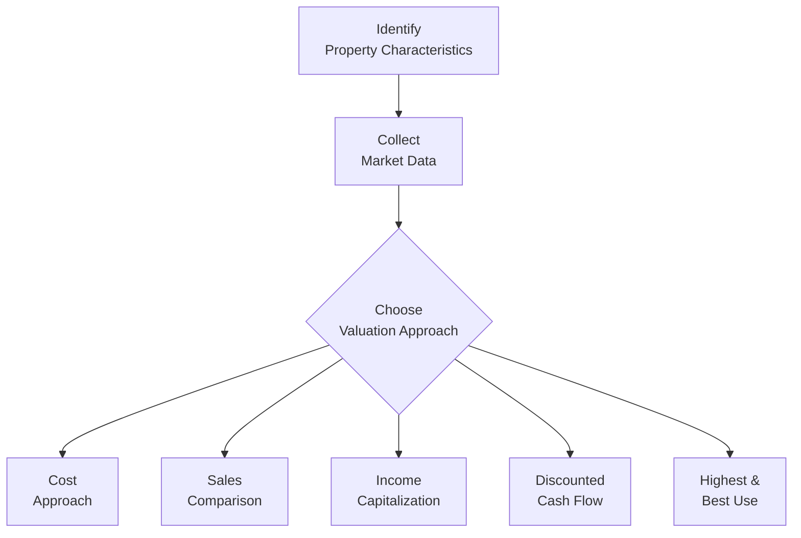

## Understanding Real Estate Valuation

Ever found yourself standing in front of a big, historic building wondering how on earth someone decided its price? It’s that moment where you think, “Wait, who actually figures this stuff out—and how?” The short answer: real estate valuation experts, using a range of methods to determine a property’s worth. Real estate valuation is a critical topic for finance professionals (and, frankly, a fun area of practice once you start digging into it), partly because property assets often form a major portion of an investor’s portfolio. It’s also relevant from a risk management perspective—knowing how to value a building accurately can help mitigate all sorts of financial headaches down the line. 

Below, we’ll walk through some of the most common valuation approaches you’ll encounter in both academic and professional contexts. We’ll also share a few tips and personal touches from folks who’ve spent way too many hours shuffling comparable sales data and analyzing net operating income. If you’re preparing for the CFA exams, or you just want to get a handle on real estate valuation, settle in, and let’s get started.

## Why Valuation Matters

Valuation is more than just slapping a price tag on a piece of land or a building. It affects:

• Investment decisions: Is the property priced fairly? Is it worth adding to a portfolio?  
• Financing: Lenders often loan based on a property’s appraised or market value.  
• Tax assessments: Governments use property valuations to determine property tax liabilities.  
• Insurance: Insurers want accurate valuations to set premiums.  
• Transaction negotiations: Buyers and sellers use valuations to argue for better deals.  

For example, a friend once told me about an office building she almost purchased that was “priced to sell.” But after a thorough valuation, she realized the property’s net operating income was inflated by a short-term, above-market lease. That quick detection saved her from overpaying. 

## Core Valuation Approaches

### Cost Approach

The Cost Approach calculates a property’s value by estimating how much it would cost to rebuild the exact same structure (or a functionally similar one) today, then adjusting for depreciation. 

• Step 1: Estimate replacement or reproduction cost. Replacement cost is the expense to recreate a building with similar utility at current prices. Reproduction cost is the expense to create an exact replicate of the building (historical materials and all).  
• Step 2: Subtract depreciation. Depreciation includes physical wear and tear, functional obsolescence (e.g., an outdated layout), and external obsolescence (e.g., declining neighborhood conditions).  
• Step 3: Add land value. Generally, the land is valued separately using market prices for comparable parcels.  

A straightforward formula might look like this:

(1) Estimated Replacement Cost – Depreciation + Land Value = Property Value

This method is particularly handy for specialized structures (dimly lit theaters, quirky manufacturing facilities) where there may not be many comparables. It can also shine in stable markets where replacement costs are well-known. However, ironically, it sometimes overstates the value if the existing building is significantly older or has intangible location advantages that are tough to convert into cost estimates.

A quick example: suppose you spot a decades-old custom warehouse that would cost an estimated $10 million to build from scratch today. Maybe it’s got $2.5 million of accumulated depreciation. And let’s say the land is worth $3 million. That suggests a valuation of $10 million – $2.5 million + $3 million = $10.5 million. You might adjust that further based on local market nuances, but that’s the basic process.

### Sales Comparison Approach

If you’re curious about whether two houses that look similar on a random suburban street should be worth about the same, you’re already thinking about the Sales Comparison Approach. This approach analyzes recent sales of comparable properties—often called “comps”—and adjusts for differences. 

Here’s how it typically works:

• Step 1: Identify similar properties that sold recently (location, size, condition, style).  
• Step 2: Adjust for differences (e.g., maybe the comparable has a nicer kitchen, brand-new HVAC, or an extra bedroom).  
• Step 3: Arrive at an adjusted sales price for each comparable.  
• Step 4: Use these adjusted prices to estimate the value of the subject property.  

It’s kind of like checking one’s friend’s car sale price on the used car market and then adjusting for the fact your car has half the mileage and fresh tires. The biggest caveat is ensuring your comparables are truly comparable—market trends, property age, condition, and location can all create wide discrepancies. This method is especially common for single-family homes, condos, and smaller properties in active markets.

Let’s say a comp sold for \$500,000 but it had a three-car garage while our subject has a two-car garage. You might reduce that comparable’s price by \$10,000 to reflect the difference, adjusting the comp’s effective price to \$490,000. If another comp had a brand-new roof that ours lacks, you might reduce that comp price by an additional \$8,000. Ultimately, you glean a bracket of adjusted comparable prices that cluster around a certain number—perhaps \$480,000 to \$510,000—and decide the subject is probably worth \$495,000 or so.

### Income Capitalization Approach (Direct Capitalization)

The Income Capitalization Approach is a staple for income-producing properties such as apartments, office buildings, shopping centers, and industrial warehouses. It’s popular among institutional real estate investors who want a quick ratio-based method. The approach is fairly simple in concept:

• Estimate Net Operating Income (NOI).  
• Divide that by an appropriate capitalization rate (cap rate).  

Mathematically:


\text{Value} = \frac{\text{NOI}}{\text{Cap Rate}}


Where:  
• NOI (Net Operating Income) = Potential Rental Income – Vacancy Allowance – Operating Expenses (excluding financing costs).  
• Cap Rate = A market-derived rate that reflects the return required on real estate investments of similar risk.

For instance, if a property’s annual NOI is \$500,000 and market data suggests a 5% cap rate, you’d value it at \$500,000 / 0.05 = \$10,000,000.

Now, identifying the right cap rate is tricky. If you mismatch the cap rate by just a small margin, you could misprice the property significantly. Cap rates usually come from analyzing comparable sales of similar income-producing properties or from broader market research. During times of economic uncertainty, cap rates can shift quickly, so paying attention to local and national market trends is key.

### Discounted Cash Flow (DCF) Analysis

Sometimes you have a property that doesn’t produce a steady income every year—maybe it’s in development, has upcoming lease expirations, or relies on future improvements for revenue growth. That’s where Discounted Cash Flow (DCF) analysis shines. 

DCF tries to project each year’s operating cash flows over a specified holding period (often 5 to 10 years) and then discount those flows back to the present value. You also include a residual (terminal) value at the end of the holding period, which is typically estimated by capitalizing the final year’s NOI or using an expected sale price.

A basic layout might look like this:

(1) Project annual NOI (or sometimes net cash flow if you’re factoring in capital expenditures).  
(2) Select an appropriate discount rate that reflects the opportunity cost of capital and risk.  
(3) Calculate present value of all future NOIs plus the present value of the terminal/residual value.  

In formula terms, if CF₁, CF₂, …, CFₙ are the expected annual net cash flows and Vₙ is the terminal value at year n, and r is the discount rate:


\text{Property Value}_0 = \sum_{t=1}^{n} \frac{CF_t}{(1 + r)^t} + \frac{V_n}{(1 + r)^n}


This method is invaluable when analyzing properties that anticipate changes in occupancy, rent levels, or renovation costs each year. It’s also more flexible than direct capitalization when you anticipate irregular or unstable cash flows. The main challenge: you’re forecasting multiple inputs far into the future, and a small shift in your growth or discount rate can cause big swings in estimated value. 

### Highest and Best Use Analysis

Highest and Best Use (HBU) Analysis determines the most profitable use of a property under current legal (zoning), physical, and market constraints. You’ve seen it in action if you’ve ever wondered why a dilapidated house in a prime commercial area might be razed to make room for a new retail building. HBU analysis says: “What’s the best possible use of this land or property if we consider everything from zoning laws to market demand to feasibility?” 

Basic steps include:  
• Checking the property’s legally permissible uses (e.g., no farmland in the middle of the city if zoning is purely for high-density commercial).  
• Evaluating possible alternative uses for financial feasibility.  
• Determining which alternative yields the highest net present value or highest residual land value.  

This method is especially relevant for raw land, transitional areas, or big renovation projects. It’s less about the building’s existing structure and more about what it could be if redeveloped.

### Special Considerations in Real Estate Valuation

Each property is unique—some more than others (I once appraised a centuries-old castle in a remote area, and the adjustments needed were extraordinary). Here are a few special considerations:

• Location: Access to highways, public transportation, local amenities.  
• Lease Terms: Duration of leases, tenant renewal options, rent escalations.  
• Tenant Credit Quality: Particularly important for properties anchored by a major tenant (e.g., a government agency or a blue-chip firm).  
• Environmental and Zoning Issues: Properties with contamination or unusual zoning restrictions may suffer huge value impacts.  
• Demographics: Urbanization trends, local population growth/decline.  
• Economic Conditions: Interest rates, inflation, overall market supply and demand.  

Valuation experts must also remain vigilant about possible data manipulation—maybe the developer is overly optimistic about future rental rates. Double-checking assumptions is part of the job.

Below is a quick visualization to outline how these methods and considerations fit together:

## Best Practices and Common Pitfalls

When valuing real estate, it’s easy to slip into either overly optimistic or overly conservative territory. Some best practices:

• Gather robust data: Quality inputs (comparable sales, rental rates, market trends) lead to more accurate valuations.  
• Adjust with caution: Don’t over-adjust comps; modest, data-backed adjustments preserve credibility.  
• Reconcile multiple methods: Often, you’ll perform two or three valuation methods and reconcile the results to arrive at a final value.  
• Sensitivity analysis: Particularly with DCF, see how changes in discount rates, rent growth, or occupancy rates affect value.  

Common pitfalls:

• Ignoring hidden costs: Maintenance, property taxes, insurance, or capital expenditures can drastically affect NOI.  
• Misjudging the market: Overly rosy assumptions of rent growth can inflate value.  
• One-size-fits-all approach: The best method can vary with the property type and local market conditions.  
• Overlooking risk: Discount rates and cap rates need to reflect actual property risk.

## Brief Case Study

Picture an old warehouse near a downtown area that’s rapidly gentrifying. The building is mostly vacant, but it’s also got a serious roof problem and is zoned commercial.  

• Using the Cost Approach, you’d find the replacement cost is quite high, minus a hefty chunk for depreciation due to the property’s age.  
• The Sales Comparison Approach might be tough because few similar, run-down warehouses have sold recently.  
• The Income Capitalization Approach might show a meager value if we look at current NOI.  
• A DCF Approach could be compelling if we assume we’ll fix the roof, sign new tenants, and sell the property after five years.  
• Highest and Best Use Analysis might reveal that converting the warehouse into modern office space or a brewery could be far more profitable than leaving it as is.  

Ultimately, the property might be worth more redeveloped or repurposed than in its existing state.

## Regulatory and Accounting Notes

From an accounting perspective (IFRS or US GAAP), real estate can be measured at historical cost less depreciation or at fair value. When using fair value, IFRS (International Financial Reporting Standards) typically allows for revaluation gains or losses through the income statement or other comprehensive income, depending on classification. US GAAP typically uses historical cost unless the asset is held for sale, in which case, valuations may be updated per certain guidelines. Your approach for financial statements might differ from your approach for investment or lending purposes, but in many cases, they’re informed by the same data sources.

## Ethical and Professional Standards

Valuers must adhere to professional standards, such as those put forth by the Appraisal Institute. In the CFA context, following the Code of Ethics and Standards of Professional Conduct is non-negotiable. You have a duty to act with integrity, disclose conflicts of interest, and ensure your valuations are objective. Lack of transparency, data manipulation, or negligence in verifying data can lead to severe reputational and legal consequences.

## Exam Tips for CFA Candidates

• Practice laying out step-by-step solutions for each valuation method. The exam may ask you to compute a property’s value based on given data—or to identify which approach is best in a given scenario.  
• Be precise with your adjustments. For sales comparisons, show your math on how you adjusted for differences in size, quality, or location.  
• When you see a discounted cash flow question, make sure you clearly discount each period’s cash flow and then discount the terminal value. Don’t forget to read the question carefully to see if they’re including or excluding certain costs in their NOI.  
• Pay attention to the reasons you’d prefer one method over another. Sometimes the question is qualitative: “Which approach is most suitable if the property has stable income and numerous comparables?”  
• Don’t mix up the discount rate with the cap rate. Direct capitalization is straightforward, but DCF requires a more explicit discount rate.  
• Time management matters. If you see a big table of data, identify what’s relevant to the question.  

## References

• CFA Institute Program Curriculum (Level I, 2025 Edition).  
• Appraisal Institute (www.appraisalinstitute.org).  
• The Dictionary of Real Estate Appraisal, Appraisal Institute.  

---

## Real Estate Valuation Methods Quiz



### Which of the following best describes the replacement cost in the Cost Approach to real estate valuation?

- [ ] The amount paid 10 years ago to build the property.
- [ ] An outdated figure determined by an insurance company.
- [x] The cost to rebuild a similar structure at current prices.
- [ ] The cost that excludes any land-related estimates.

> **Explanation:** Replacement cost is the estimated current expense to rebuild a structure with similar utility. It reflects contemporary prices and designs, not historical construction costs.

### In the Sales Comparison Approach, what is the primary reason for making adjustments to the sale prices of comparable properties?

- [ ] To ensure that all comparables have the same accessories.
- [ ] To manipulate data for tax benefits.
- [ ] To brand the property as superior to the comparables.
- [x] To account for differences in features, conditions, and locations.

> **Explanation:** The core of the Sales Comparison Approach is to isolate differences in characteristics and location, adjusting each comparable property’s sale price to reflect how it would compare if it mirrored the subject property.

### When applying the Income Capitalization Approach, which formula is generally used?

- [ ] Value = (NOI × Occupancy Rate)
- [x] Value = NOI / Cap Rate
- [ ] Value = (NOI – Depreciation) / Growth Rate
- [ ] Value = Cap Rate / NOI

> **Explanation:** The Income Capitalization Approach is typically expressed as Value = NOI / Cap Rate. Other formulas shown are incorrect manipulations of net operating income and capitalization rates.

### What is a major advantage of using a DCF (Discounted Cash Flow) model for real estate valuation?

- [ ] It guarantees future market value accuracy.
- [x] It can incorporate varying cash flows and changing market conditions.
- [ ] It requires minimal property-specific data.
- [ ] It completely eliminates the need for cap rates.

> **Explanation:** DCF is valuable when a property’s cash flows are expected to fluctuate (e.g., lease expirations, future renovations). While no model guarantees absolute accuracy, DCF offers flexibility to capture evolving property dynamics.

### In Highest and Best Use analysis, which factor is least likely to be relevant?

- [ ] Zoning laws
- [ ] Market demand
- [ ] Property’s physical limitations
- [x] The type of mortgage used to buy the property

> **Explanation:** Highest and Best Use focuses on legal, physical, and financial feasibility. While mortgages may affect the owner’s financing, they don’t usually dictate the optimal property usage.

### An investor is analyzing a potential industrial warehouse with significant deferred maintenance costs but stable rents under a long-term lease. Which valuation method would likely be most straightforward?

- [ ] DCF Analysis
- [x] Income Capitalization Approach
- [ ] Sales Comparison Approach
- [ ] Cost Approach

> **Explanation:** If rents are fixed and stable, the Income Capitalization Approach is straightforward. While a DCF could be used, it’s simpler to apply a cap rate to current NOI in this scenario.

### What is the biggest risk of relying on only the Sales Comparison Approach for valuation?

- [ ] Too many existing comparables in the market
- [x] Inadequate or irrelevant comparables that distort value estimates
- [ ] The possibility of overestimating land value
- [ ] Overcomplicating the discount rate

> **Explanation:** The Sales Comparison Approach is heavily dependent on the availability and relevance of comparable sales. If comps are scarce or inapplicable, valuations can become inaccurate.

### Which factor is not commonly included when calculating Net Operating Income (NOI)?

- [ ] Property taxes
- [ ] Maintenance expenses
- [x] Debt service (mortgage interest)
- [ ] Utilities

> **Explanation:** NOI typically excludes financing costs (interest payments). It focuses on operational income and expenses, not capital structure.

### An office building has a projected net cash flow of $150,000 in Year 1, increasing by 3% each year. A final sale is estimated at $2,000,000 in Year 5. This is a typical scenario for which valuation method?

- [ ] Direct Capitalization
- [ ] Sales Comparison Approach
- [x] DCF Analysis
- [ ] Cost Approach

> **Explanation:** When there’s annual variation in cash flows and a terminal/sale value after a specified period, a DCF approach is most suitable.

### True or False: Using the Cost Approach ensures the market will pay exactly the calculated replacement cost minus depreciation.

- [x] True
- [ ] False

> **Explanation:** Actually, this statement is a bit of a trick. In real-world practice, the market might pay more or less than the cost approach estimate. The max a rational buyer would pay could be guided by replacement cost, but real markets are subject to supply, demand, and behavioral factors. Typically, the statement as read is an oversimplification—hence many appraisers see the Cost Approach as providing an upper bound.  


