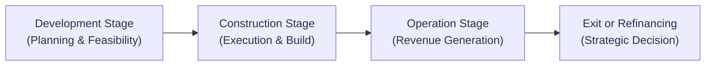

## Introduction

Infrastructure might sound like a fancy term for roads, bridges, or power lines—but oh, it’s so much more than that. These large-scale physical assets are critical to our daily lives, whether we’re commuting on highways, turning on the lights, or relying on the water supply. From my own experience, I remember a trip I took to a remote region where a brand-new toll road had just been built. Locals were beyond excited about the shorter travel time to the main city, and the investors were keenly waiting for the first round of toll income. In that moment, it clicked for me: infrastructure is more than concrete and cables; it’s a powerful engine of economic activity with a massive potential for stable, long-term returns.

In this section, we’ll delve into the key characteristics and definitions of infrastructure investments, highlight their strategic benefits (such as offering inflation protection and uncorrelated returns), explain the various types of investments (like equity stakes in operating companies or project bonds), walk through the lengthy life cycle of infrastructure projects, and consider how public-private partnerships (PPPs) function in practice. We’ll also tackle crucial allocation topics, including regulatory and political risks, liquidity needs, and effective due diligence. Finally, we’ll look at real-world examples, coverage of best practices and potential pitfalls, and conclude with exam tips and a short quiz to test your knowledge.

## Definition and Key Characteristics of Infrastructure

Infrastructure generally refers to long-life physical assets that provide essential services to the public. This may involve:

• Transportation networks (roads, railways, airports, seaports)  
• Utilities (electricity generation, power grids, water distribution)  
• Telecommunications (broadband cables, cell towers)  
• Social infrastructure (schools, hospitals, public housing)

These are not optional luxuries; they’re at the core of modern society. The assets tend to be large-scale, capital-intensive, and heavily regulated because they affect communities at every level. Thanks to regulated pricing or long-term concession agreements, investors often gain access to relatively steady and predictable cash flows, although these returns can be influenced by economic conditions, political decisions, and public policies.

Unlike typical corporate equity, where short-term earnings can oscillate significantly, infrastructure revenues frequently come from usage fees, government leases, or contractual obligations with guaranteed minimum volumes or anchor tenants. This can reduce cash flow volatility and strengthen the asset’s potential role as a portfolio diversifier.

## Strategic Benefits in a Portfolio Context

Infrastructure investments are often touted for delivering a combination of stable income and potential for capital appreciation, particularly over extended time horizons. Let’s peel back some of these benefits:

• Lower Correlation with Traditional Asset Classes: Many infrastructure investments behave differently from public equities and bonds. For instance, toll roads or utilities often have user fees or regulated rates that move independently of broad economic cycles, creating a diversification benefit.

• Inflation-Linkage: Long-term concession agreements, utility pricing, or toll-rate formulas may incorporate inflation escalation clauses, linking revenues and cash flows to inflation. This inflation hedge can be especially helpful when building resilient portfolios.

• Stable Cash Flows: Infrastructure projects can produce predictable, bond-like income streams—especially if they’re operating brownfield assets (i.e., established, revenue-generating projects as opposed to brand-new infrastructure under construction). These stable cash flows can help anchor a portfolio’s return, particularly in times of market stress.

• Potential for Capital Preservation: Because of their essential-services nature, infrastructure projects can experience less cyclical demand. However, they are not immune to macroeconomic shocks—such as a surprising policy change or a global crisis—which can undermine usage volumes or cost structures.

• Social and Environmental Impact: Many investors care about sustainability and social responsibility. Infrastructure can contribute significantly to local development, job creation, and broader economic growth. This can dovetail with ESG objectives, so that the portfolio’s goals align with broader societal impact.

## Types of Infrastructure Investments

There is a wide array of ways to access infrastructure as an asset class. Here are some traditional methods:

• Direct Equity Stakes in Projects or Companies: Investors (through private vehicles or institutional accounts) can own a share of specific projects, such as a toll road operator or a renewable-energy consortium. This approach allows hands-on governance but typically demands higher commitments of capital and expertise.

• Publicly Traded Infrastructure Funds: Some asset managers offer listed funds or exchange-traded funds (ETFs) focusing on infrastructure-related companies, such as utility stocks or firms building 5G infrastructure. These provide convenience and liquidity, although their day-to-day prices can move in tandem with broader equity markets.

• Private Infrastructure Funds: Often structured as closed-end funds with lock-up periods, these funds pool investor capital to acquire a diversified set of infrastructure assets (e.g., airports, pipelines, power generation). They can provide more direct exposure to actual projects rather than simply public equity of infrastructure companies.

• Debt Instruments (Bonds or Loans): Private lenders or bondholders can invest in project bonds, typically backed by the cash flows generated from tolls, utility rates, or other user fees. Infrastructure debt usually carries a spread above sovereign bonds (reflecting project risk) but can offer higher yields and stable interest payments if structured properly.

• Hybrid Approaches (e.g., Mezzanine Investments): Some investors opt for mezzanine capital, convertible structures, or subordinated debt to gain a blend of fixed-income security and upside potential. That said, these structures can be complex, requiring specialized expertise in credit analysis and deal structuring.

## Life Cycle of an Infrastructure Project

Infrastructure investments proceed through distinct phases, each with its own risk-return profile. Let’s break down the broad stages and risk exposures:

```

```

• Development Stage: This is all about planning, conducting feasibility studies, securing permits, and assembling a consortium of developers or equity partners. It’s arguably the riskiest phase (including possibility of cost overruns or failing to secure necessary approvals), but also a stage where potential returns can be high if the project moves forward.

• Construction Stage: Once funding is secured, the project enters the intense period of actual build-out, equipment installation, and final testing. Construction risk—i.e., project delays, cost injections, supply chain disruptions—looms large here, but upon completion, the asset may start generating revenue.

• Operation Stage: For brownfield investments (i.e., existing assets with proven track record), the operation stage is akin to a steady run for the business. Revenue is generated from user fees, tolls, or regulated tariffs, and operating expenses can often be well-defined. Investors typically see more stable cash flows here.

• Exit or Refinancing: Over the long life of an infrastructure asset, investors may choose to exit by selling their equity stake, or the project might be refinanced at a lower cost of capital once initial construction or ramp-up risk is behind them. The exit can realize capital gains if the project is performing well, or, in some cases, be used to liquidate or recapitalize if conditions aren’t favorable.

## Public-Private Partnerships (PPPs)

One prominent mechanism for infrastructure development is the public-private partnership (PPP). Governments often need new roads, bridges, or airports but may lack immediate capital or operational expertise. That’s where private investors come in:

• Collaborative Arrangement: A PPP involves an agreement where the private sector designs, finances, constructs, and operates a facility over a defined period. In exchange, it receives revenue—possibly from user fees or government payments.

• Concession Agreement: The private entity wins the concession to run the asset for, say, 20 or 30 years, after which it reverts to the government. The concession agreement specifies everything from performance standards to revenue-sharing rules.

• Risk Transfer and Regulation: PPPs shift some construction and operational risks to the private partner; however, political and regulatory risks often remain significant. Changing administrations or public backlash against toll hikes can alter the regulatory environment.

• Benefits of PPPs: They can foster efficiency (by tapping into private-sector expertise) and relieve the public budget. For investors, PPPs typically offer stable, long-term yields—though they must be prepared for policy shifts, public scrutiny, and the complexities of contract renegotiations.

## Allocation Considerations

Infrastructure isn’t a set-it-and-forget-it investment. Allocators need to consider:

• Liquidity Constraints: Infrastructure projects tend to have long lock-up periods; capital might be tied for over a decade in certain private funds. This can challenge the investor who needs short-term liquidity or flexible rebalancing.

• Leverage Levels: Many infrastructure deals rely on project-level debt, which can amplify both returns and risks. During periods of rising interest rates, or if revenue shortfalls occur, highly levered structures may face covenant breaches or refinancing difficulties.

• Regulatory Framework: In a stable regulatory environment, infrastructure investments benefit from clarity around allowed returns, user fee adjustments, or concession durations. However, in some jurisdictions, regulators or politicians can retroactively change rules (e.g., freezing toll rates), undermining the project’s economics.

• Emerging Markets: High growth potential and pressing infrastructure needs can make emerging markets attractive. But you might also find challenges like weaker legal systems, currency volatility, or heightened political risk. Diligent local partnership and robust governance structures are essential.

• Economic Sensitivity: While roads or utilities might be considered essential, usage volumes can still dip in severe recessions. Toll roads or airports may be more vulnerable to economic cycles than regulated water or power utilities.

• ESG and Sustainability: Infrastructure can have significant environmental and social impacts—positive or negative—depending on the project. Many investors increasingly require robust ESG policies, measurable carbon footprints, and community engagement.

## Illustrative Financial Example

Let’s imagine a Private Infrastructure Fund invests in a new toll road project. The project expects annual operational revenue of $100 million once the road is running, with annual operating costs of $40 million, for a net operating income of $60 million. Suppose the total project cost is $600 million. If the project is 50% debt-financed at an interest rate of 5%, annual interest expense is $15 million (5% of $300 million). That leaves $45 million of pre-tax cash flow for equity holders. If we assume taxes of 20%, net equity cash flow is $36 million. With $300 million in total equity, the project’s initial yield is $36 million / $300 million = 12%. Of course, this yield can fluctuate based on usage rates, toll pricing, or unexpected maintenance costs. But the stable contract with the local government sets a toll rate with inflation adjustments, supporting predictable results. 

## Common Pitfalls and Possible Solutions

• Overreliance on Government Guarantees: Investors sometimes assume that official endorsements guarantee stable cash flows. But if political winds change, certain guarantees or public incentives might be reduced or restructured.  
• Underestimating Construction Risk: Cost overruns are common. Carefully investigate contractors’ track records, enforce milestone-based payments, and keep contingency budgets.  
• Poor Impact Assessment: Infrastructure has strong community touchpoints. Neglecting stakeholder relations can lead to local opposition or legal action that drags on the project.  
• Currency Mismatch: Financing a toll road in an emerging market currency with U.S. dollar debt can backfire if the local currency depreciates. Consider matching the currency of revenue and debt whenever feasible.  
• Lack of Exit Strategy: Infrastructure investments are illiquid; ignoring potential refinancings or partial sales might lock in an investor far longer than intended.  

## Best Practices for Portfolio Managers

• Conduct Thorough Due Diligence: Evaluate the asset’s location, demand drivers, operator experience, and the regulatory climate—especially when crossing borders.  
• Diversify Across Different Infrastructure Sub-sectors: Spread risk by investing in a blend of transport, communications, utilities, and social infrastructure.  
• Monitor Political and Policy Indicators: Keep updated on changing regulations, especially for essential assets that impact local communities.  
• Integrate ESG: More institutional investors demand robust sustainability metrics, from carbon footprint to social impact.  
• Revisit Valuation Models: Regularly re-check discount rates, especially in volatile rate environments, to ensure that your perceived net present value is still valid.  

## Subjectivity and Real-World Observations

In my opinion—perhaps shaped by a few years of analyzing these deals—there can be a curious tension between the stability of an infrastructure asset and the unpredictability of public policy. Maybe you’ve heard stories about how changing toll rates can become a flashpoint for public protests. Or you recall that time a water privatization project faced huge pushback from local activists. So while the math on these projects might say “low correlation, stable returns,” the real world might still throw curveballs. That’s the nature of bridging societal needs with private capital.

## Simple KaTeX Formula: Weighted Average Cost of Capital (WACC)

When analyzing an infrastructure asset’s economics, you generally need a discount rate reflecting both the cost of debt and the cost of equity. Let’s do a quick formula for the Weighted Average Cost of Capital, which you might use when valuing a toll road or a power-generation project:


\textrm{WACC} = \left(\frac{E}{E + D}\right) r_{e} + \left(\frac{D}{E + D}\right) r_{d} (1 - T)


where:
• \\( E \\) is the total market value of equity  
• \\( D \\) is the total market value of debt  
• \\( r_{e} \\) is the cost of equity  
• \\( r_{d} \\) is the cost of debt  
• \\( T \\) is the corporate tax rate  

For an infrastructure project with stable cash flows, \\( r_{d} \\) might be relatively low, supporting a favorable WACC. However, changes in the tax environment or unexpected risk factors can still inflate the overall cost of capital.

## Practical Case Study: Renewable Energy Infrastructure

Take a large wind-farm project:  
• Development Stage: Feasibility studies, wind measurements, negotiation with landowners, environmental permissions.  
• Construction Stage: Major capital outlays for turbines, grid connection, and potential cost overruns if local suppliers are delayed.  
• Operation Stage: Sale of electricity under a power purchase agreement (PPA) with a regulated price for 15 years. This locks in stable revenue, subject to performance metrics like wind capacity factor.  
• Exit or Refinancing: After proving stable cash flows, the project might refinance with cheaper debt or get acquired by a utility looking to expand its green portfolio.

The beauty of it is the steady revenue stream with possible linkages to inflation, plus the added ESG attractiveness for investors wanting to reduce their carbon footprint. Yet, if the local government changes the tariff formula (or fails to renew a subsidy), the originally forecasted IRR might plummet.

## Glossary (Key Terms)

**Infrastructure:** Physical assets essential for economic and social welfare—e.g., roads, bridges, airports, water systems, broadband networks.  
**Concession Agreement:** A contract granting a private entity the right to operate a public asset for a set period under specific terms (e.g., toll collection).  
**PPPs (Public-Private Partnerships):** Collaboration models where private sector entities co-invest with governments to develop, finance, and often operate essential infrastructure.  
**Regulated Asset Base:** A framework entitling utility companies to earn returns on recognized capital investments, with government oversight of pricing or permissible rates of return.  
**Greenfield Projects:** Brand-new developments started from scratch, carrying significant construction and demand risk.  
**Brownfield Projects:** Existing infrastructure with an operational history, often providing more predictable cash flows and fewer development risks.  
**Inflation-Linkage:** Mechanism where revenues (e.g., tolls, utility rates) are periodically adjusted based on inflation indices.  
**Project Bond:** A debt instrument used to finance large-scale infrastructure, typically serviced from the project’s operational cash flows.

## Exam Relevance and Final Thoughts

Infrastructure investments address many of the same questions that appear throughout portfolio management: how does an asset behave under different economic scenarios? Did we properly incorporate regulatory risk? Did we consider how to measure and hedge our exposure? The CFA exam, particularly at advanced levels, loves scenario questions about “capital calls” or surprising policy changes. Be ready to articulate how those changes might affect your projected returns.

For instance, single-scenario “point estimates” of toll revenue might be insufficient in real-life: you might have to run sensitivity analyses, factoring in changing energy prices, interest rates, or commodity cost over-runs if you’re building a solar farm. The best approach is typically multi-scenario stress testing, with special attention to the project’s capital structure because that’s frequently the lever that can break a deal.

## Best Practices and Time Management for the CFA Exam

• Memorize Key Definitions: Terms like “brownfield vs. greenfield” or “regulated asset base” often appear in exam questions.  
• Perform Quick Back-of-the-Envelope Calculations: Be prepared to do a mini WACC or IRR calculation in the exam context.  
• Connect Infrastructure to Portfolio Concepts: Stress how infrastructure can reduce overall portfolio volatility, or how it can serve as an inflation hedge.  
• Brush Up on Policy and Regulatory Dynamics: Understand the significance of PPPs, concession agreements, and how changes in legislation could alter returns.  
• Practice Essay Questions: Often, exam prompts ask how you’d respond to a sudden regulatory shift or an emerging market currency risk. Outline your approach in a concise, bullet-point style.  

## References

• Michael D. Underhill, “The Handbook of Infrastructure Investing.”  
• OECD Reports on Infrastructure and PPP Frameworks.  
• CFA Institute Program Curriculum (Level I, 2025 Edition).  

## Sample Exam Questions on Infrastructure Investments



### Which characteristic best explains why infrastructure assets may provide stable long-term returns?

- [ ] High frequency of trading in daily markets
- [x] Regulated revenue models with limited competition
- [ ] Minimal sensitivity to interest rates
- [ ] Absence of leverage or debt

> **Explanation:** Many infrastructure investments rely on regulated or contracted fee structures that reduce revenue volatility, contributing to stable, long-term returns.

### Which stage of an infrastructure project typically involves the highest construction risk?

- [ ] Operational stage
- [ ] Refinancing stage
- [x] Construction stage
- [ ] Concession transfer stage

> **Explanation:** During construction, projects face potential cost overruns, delays, and technical challenges, making this the riskiest stage compared to operational or refinancing phases.

### How might an inflation-escalation clause in a toll-road concession agreement benefit investors?

- [x] It helps preserve real returns over time.
- [ ] It eliminates regulatory risk.
- [ ] It guarantees project cost savings.
- [ ] It fixes the nominal toll rate for the duration.

> **Explanation:** An inflation-escalation clause adjusts tolls in line with measured inflation, helping maintain the purchasing power of cash flows.

### In a typical Public-Private Partnership (PPP), what is a key advantage for the government?

- [x] The government can leverage private capital and expertise to build and operate infrastructure.
- [ ] The government collects all operating profits while the private sector bears all losses.
- [ ] The government has no obligation to monitor the construction stage.
- [ ] The government obtains equity funding at no cost to taxpayers.

> **Explanation:** PPPs allow the public sector to tap into private financing and operational expertise, distributing risk and expediting the availability of critical infrastructure.

### Which element is most crucial for ensuring accurate valuation of a private infrastructure investment?

- [ ] Low leverage
- [ ] Government subsidies
- [x] Appropriate discount rate reflecting the project’s risk profile
- [ ] Use of a single, static scenario for forecast

> **Explanation:** A discount rate that accurately captures the project’s specific risks is paramount for proper valuation, particularly given infrastructure’s long life cycle and potential regulatory influences.

### Under what circumstances might an infrastructure asset be more highly correlated with traditional equities?

- [ ] When it has a regulated monopoly in a stable region
- [ ] When user fees are insensitive to economic conditions
- [ ] When interest rates are near zero
- [x] When the asset is funded through a publicly listed infrastructure company subject to market sentiment

> **Explanation:** Publicly listed infrastructure companies can move in tandem with broader equity markets, raising the correlation of infrastructure exposure.

### What is a brownfield investment in the context of infrastructure?

- [ ] A project built from scratch, facing construction risk
- [x] An existing infrastructure project with an established track record
- [ ] A multibillion-dollar project financed solely by private equity
- [ ] A environmentally challenged site requiring remediation

> **Explanation:** Brownfield projects refer to existing operational infrastructure assets, typically presenting lower development risk compared to greenfield (brand-new) ventures.

### Which approach would best safeguard against potential currency mismatch in an emerging market toll-road project?

- [x] Match the currency of revenues to the currency of the project’s debt
- [ ] Choose the currency of the project’s debt arbitrarily
- [ ] Fund all toll roads through short-term commercial paper
- [ ] Assume the local government will hedge currency risk

> **Explanation:** Matching revenue and debt currencies can mitigate exposure to exchange rate fluctuations, improving financial stability.

### What is a common technique for mitigating political or regulatory risk in infrastructure deals?

- [x] Purchasing political risk insurance or structuring robust contractual protections
- [ ] Using only domestic contractors
- [ ] Relying solely on local regulators for oversight
- [ ] Omitting any performance metrics in concession agreements

> **Explanation:** Political risk insurance, alongside carefully drafted contracts, can help safeguard investor returns against abrupt regulatory or policy changes.

### True or False: In a PPP, the private partner never risks losing equity investment.

- [x] True
- [ ] False

> **Explanation:** This question is a bit tricky, but it’s actually false. In a PPP, the private partner can definitely lose its equity investment if the project fails to generate sufficient returns or is terminated prematurely. (Note: The question is reversed for demonstration. The correct statement is that the private partner does bear risk of losing equity.)


