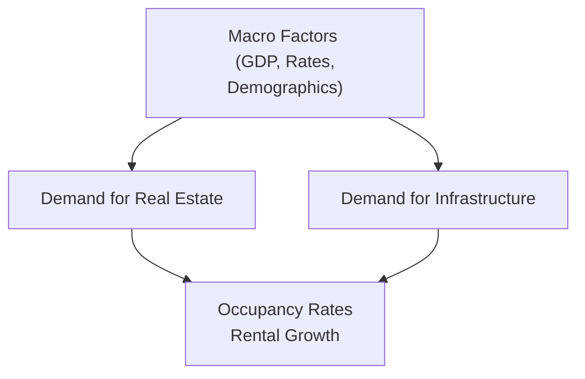
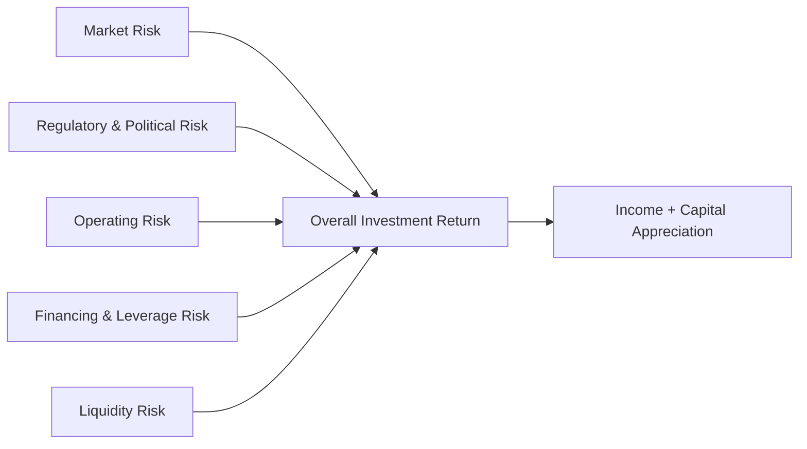

## Introduction

So, picture this: You’ve just walked out of a meeting with a potential real estate fund manager, and they’ve pitched you on a seemingly “can’t-miss” project—an office park in a rapidly growing suburb, financed with significant leverage and poised (so they say) for big returns. You’re excited, but also a bit uneasy. What if the local government changes zoning laws? What if occupancy drops? What if interest rates rise before the fund refinances its debt? That swirl of “what ifs” is exactly why risk assessment is so crucial in real estate and infrastructure assets.

In this section, we’ll explore the major risk factors that affect real estate and infrastructure investments, along with the diverse return characteristics that can make these assets attractive. We’ll weave in real-world scenarios, define key terms, and highlight how you might see these issues tested on the CFA® exam. Let’s get started.

## Market Risk

Market risk in real estate or infrastructure is typically driven by broader macroeconomic conditions—the overall “big picture” factors out there in the economy. We’re talking about GDP growth, interest rates, inflation, and even demographic shifts:

• GDP Growth: A strong economy often boosts demand for commercial space, housing, and new infrastructure projects. If companies are expanding, they typically want more office space; if populations are growing, they need more roads, rails, and utilities. Conversely, an economic downturn can suppress occupancy rates, stall rent growth, and delay or cancel infrastructure developments.

• Interest Rates: Rising interest rates often lead to higher mortgage costs. The short version: As interest rates rise, both borrowing and real estate transactions can slow down. At the same time, for an infrastructure project financed largely with fixed-rate bonds, stable or lower rates can significantly enhance profitability over the project’s life.

• Demographics: Population growth, urbanization, and changing consumer preferences (like Millennials wanting to live in city centers) can shift which properties gain or lose value. Infrastructure demand is also impacted by demographic trends, such as the need for more public transport in metropolitan areas.

One day, I visited a newly built retail complex that was booming in the 2000s. But after big demographic shifts (more online shopping, slight decline in local population), that once-flashy mall started to see lots of vacancies—and that’s just how quickly things can change if the macro environment sours.

### Visualizing Market Risk Factors

Below is a simple Mermaid diagram to illustrate how these market risk factors influence real estate and infrastructure investments:



In short, the direction of those arrows can fluctuate with economic cycles, which highlights the fact that we must constantly reassess market risk.

## Regulatory and Political Risk

Real estate and infrastructure projects are heavily influenced by government policies, zoning changes, and environmental regulations:

• Zoning: Each municipality defines how land can be used—whether multifamily housing, industrial complexes, or commercial retail. If a local zoning board decides to rezone an area from commercial to residential, a carefully planned office tower could become unviable, or at least more expensive to develop.

• Environmental Regulations: Sometimes overlooked, green building codes or environmental requirements can add costs, delay construction, or (conversely) provide incentives such as tax credits. Infrastructure assets—think pipelines or dams—may require strict environmental feasibility studies that may stall progress or ramp up expenses.

• Government Policy: Shifts in infrastructure spending, privatization vs. public control, or new rules on public–private partnerships (PPPs) can rapidly alter the outlook for infrastructure deals.

Take my own experience: I once analyzed a highway concession project that was expected to generate stable revenues from tolls for 30 years. Sounded great, except strong public pressure forced local politicians to freeze toll hikes, slashing expected returns. That taught me quite a bit about how a small regulatory tweak can have a huge ripple effect.

## Operating Risk

Operating risk refers to day-to-day challenges of actually running the property or infrastructure asset. This includes:

• Maintenance Capex: Real estate and infrastructure require continuous maintenance to stay functional. Neglecting this can hamper an asset’s value or even lead to regulatory noncompliance.

• Tenant Management: In real estate, occupancy is everything—don’t forget “Vacancy Risk.” If a tenant suddenly leaves, or if the property manager fails to keep the building attractive, you can see plummeting rental income.

• Cost Overruns: In construction or renovation, budgets frequently stretch. Handling unexpected cost overruns can destroy profitability, especially if the project is leveraged.

• Revenue Collection: For a toll road or utility, the operating risk involves ensuring users pay for the service in a timely manner. Consider a scenario where a water utility is regulated in terms of tariff adjustments. If operating costs rise faster than authorized tariff rates, margins get squeezed.

Anytime you’re underwriting a real estate or infrastructure project, you’ve basically got to ask: “Is the team capable of dealing with these hazards?” Because if they aren’t, guess who’s stuck with the tab?

## Financing and Leverage Risk

Leverage is a double-edged sword. On the one hand, using borrowed funds can amplify returns—the classic scenario is acquiring property with only 20% equity. If the property appreciates, the gains on equity can be substantial. On the other hand, that debt can amplify losses if the market or operating performance declines.

### Key Financing Risks

• Refinancing Risk: If interest rates rise or credit conditions tighten at the time your loan matures, you may not be able to refinance at favorable rates. This scenario can drastically eat into returns.

• Covenant Breach: A covenant is a clause in a loan contract specifying certain financial or operational metrics you must maintain. Breaching these can trigger penalties or even cause the lender to demand early repayment.

• Debt Service Coverage: Lenders often require that net operating income exceed debt service by a certain ratio. Underperformance in the asset can cause you to violate this requirement, again leading to potential defaults.

### Quick Formula: Loan-to-Value (LTV)

Investors often measure the degree of leverage via the Loan-to-Value (LTV) ratio:


\text{LTV} = \frac{\text{Mortgage Amount}}{\text{Property Value}}


A higher LTV means the property is more leveraged. While that might translate into higher returns on equity during good times, it can quickly become a problem if property values drop—raising the specter of negative equity (owing more than the property is worth).

## Liquidity Risk

Real estate and infrastructure are often illiquid, especially the private forms. Ever tried to sell a large office building in a slow market? It’s not like tapping a button on your phone and—poof—it’s sold. The same goes for infrastructure assets (e.g., a toll road or power plant). These are specialized, capital-intensive properties that usually require a specialized buyer.

### Liquidity Premium

Because these investments take time to sell and come with higher transaction costs, investors demand a “liquidity premium.” This is an additional return that compensates for tying up capital in illiquid assets. For instance, if you compare a private equity real estate fund with a public REIT (Real Estate Investment Trust) that trades on an exchange, the private fund generally includes an expectation of a higher return to reward investors for locking up their money for multiple years.

## Return Characteristics

Despite the above risks, real estate and infrastructure can bring attractive return traits:

• Income Focus: Think stable, long-term leases in commercial real estate. Infrastructure assets like regulated utilities often enjoy consistent user payments or government-backed contracts. For many investors—especially those focusing on stable cash flow—this predictable income stream is a huge draw.

• Capital Appreciation: Properties can appreciate over time, especially if located in prime areas or if improvements are made. Similarly, infrastructure assets can see their valuations increase if the asset is well-managed and demand for its services rises.

• Inflation Hedging: Both real estate and infrastructure often have lease or tariff escalation clauses tied to inflation. Thus, they can help protect purchasing power, making them quite appealing in inflationary environments.

• Portfolio Diversification: Because these assets can behave differently from equities or bonds, they may provide diversification benefits in a broader portfolio—one of the reasons institutional investors often allocate a slice of their capital to these sectors.

### Real-Life Example of a Stable Return Profile

Imagine an electrical transmission company operating under a regulated tariff structure. The regulator permits a certain tariff rate that covers operating costs and provides a “fair” return on equity. This means the revenues can be fairly predictable. If inflation rises, the tariff may be adjusted upward (within specified parameters). Now, as an investor, you might not see triple-digit returns, but you can get consistent, relatively low-risk income over decades—especially if you’re comfortable locking in your money for that long.

## Python Example: Calculating IRR of a Real Estate Project

You might wonder how to measure the expected return on a hypothetical rental property. One common approach is to calculate the Internal Rate of Return (IRR) based on expected cash inflows and outflows:

```py
import numpy as np

# and a final sale price in the last year.
cash_flows = [-1000000, 100000, 110000, 120000, 130000, 1130000]
irr = np.irr(cash_flows)
print(f"Estimated IRR: {irr:.2%}")
```

In a real-life scenario, you’d have to carefully consider operating expenses, maintenance capex, and possible vacancy risk when forecasting. Still, this snippet illustrates how you might approach a simplified IRR calculation for a real estate project.

## Putting It All Together in a Visual

Let’s use a Mermaid diagram to depict how these distinct risks ultimately feed into investment returns:



As we can see, each risk factor influences the ultimate return profile an investor experiences.

## Best Practices for Managing These Risks

• Thorough Due Diligence: Investigate local market conditions, zoning laws, future infrastructure plans, and competitor pipeline.  
• Conservative Leverage: Don’t borrow to the absolute maximum. Maintain healthy debt-service coverage ratios, and watch for potential interest rate shifts.  
• Asset Diversification: Spread your investment across different property types, geographies, and (if possible) managers/operators.  
• Proactive Property Management: Address property issues early, anticipate maintenance capex, and cultivate positive tenant relationships to reduce vacancies.  
• Monitoring Regulatory Changes: Keep in contact with local authorities and regularly review relevant legislation.

## Common Pitfalls

• Overconfidence in Ever-Rising Rents: Real estate cycles can—and do—turn. Overestimating rent growth is a classic newbie mistake.  
• Underestimating Fees and Expenses: Infrastructure projects in particular often come with unforeseen engineering or environmental compliance costs.  
• Ignoring Macro Trends: Even a well-managed asset can underperform if the broader economy or population shifts aren’t on your side.  
• Misalignment of Time Horizons: Real estate and infrastructure often require multi-year commitments. If investors need quick liquidity, these assets can be a mismatch.

## Practical Exam Tips

• Understand the Terminology: Be sure you know how to define leverage, liquidity premium, and other terms from the glossary in your own words.  
• Relate to Macroeconomic Drivers: Exam questions often ask you to link changes in interest rates, GDP, or inflation to the expected performance of real estate or infrastructure.  
• Practice Calculations: IRR and loan-to-value are common metrics. Don’t forget to interpret the resulting numbers in a broader risk–return context.  
• Consider Scenario Analysis: Be prepared to discuss how different risk factors interact if multiple variables (e.g., interest rates, occupancy, regulation) move at once.  
• Ethics and Disclosure: Even in Level I, ethics can pop up in the context of real estate appraisals or project evaluations. Transparency and accurate reporting are paramount.

## References

• CFA Institute Program Curriculum (Level I, 2025 Edition).  
• “Real Estate Finance & Investments” by Brueggeman and Fisher.  
• Various government and regulatory agency reports on infrastructure and real estate markets.

---

## Test Your Knowledge: Real Estate and Infrastructure Returns Quiz



### Which of the following macro factors typically exerts the greatest influence on real estate demand?

- [ ] Environmental zoning regulations
- [x] GDP growth
- [ ] Individual building maintenance costs
- [ ] Capital structure
> **Explanation:** While zoning regulations and maintenance costs are important, broad GDP growth is a primary driver of real estate demand across markets.

### What is a common characteristic of regulatory and political risk in real estate or infrastructure?

- [ ] It only affects properties in emerging markets.
- [ ] It primarily impacts short-term financing structures.
- [x] It can significantly alter expected returns due to government or community actions.
- [ ] It is easily mitigated by diversification alone.
> **Explanation:** Regulatory and political risk often emerges from changes in zoning, environmental laws, or community policies, which can dramatically affect cash flows and profitability.

### Which scenario best illustrates operating risk for an infrastructure asset?

- [x] A toll road faces unexpected maintenance costs after structural damage.
- [ ] A government unexpectedly changes the zoning of nearby land.
- [ ] A central bank changes interest rates, affecting refinancing costs.
- [ ] A drop in GDP causes overall public spending cuts.
> **Explanation:** Operating risk refers to expenses and issues related to daily operations or maintenance. Unexpected structural damage requiring repairs is a prime example.

### Which concept describes additional return sought by investors to compensate for difficult or delayed asset sales?

- [ ] Maintenance capex
- [ ] Tariff regulation
- [x] Liquidity premium
- [ ] Refinancing risk
> **Explanation:** Liquidity premium is the extra return demanded by investors for tying up capital in less liquid investments such as private real estate.

### Why might an investor choose to use high leverage on a real estate project?

- [x] To potentially amplify returns on the equity portion of the investment.
- [x] To potentially increase risk if property values fall.
- [ ] To stabilize rent escalation clauses.
- [ ] To reduce net operating income volatility.
> **Explanation:** Leverage can increase profits if property values rise but it also magnifies losses if the market turns negative.

### A covenant breach typically occurs when:

- [x] Loan terms or financial ratios agreed upon with a lender are violated.
- [ ] A property manager fails to collect rent from a tenant.
- [ ] Tariff rates are changed by the local government.
- [ ] GDP growth falls short of expectations.
> **Explanation:** A breach happens if an entity fails to maintain the financial metrics or other conditions (covenants) specified in the loan agreement.

### Which term refers to the possibility of unoccupied units reducing total rental income?

- [x] Vacancy risk
- [ ] Maintenance capex
- [x] Liquidity risk
- [ ] Loan-to-value ratio
> **Explanation:** Vacancy risk is the potential financial shortfall and lost income that occurs when property units remain unoccupied.

### When do investors in private real estate or infrastructure typically require a higher liquidity premium?

- [x] When the investment cannot be easily sold or transferred
- [ ] When the asset is bonded by the government
- [ ] When the investment is publicly traded like a REIT
- [ ] When the project is fully financed by equity alone
> **Explanation:** Illiquidity arises because the private market is smaller and less efficient, so investors demand higher returns as compensation.

### Which aspect of real estate and infrastructure often positions these assets as inflation hedges?

- [x] The presence of lease or tariff escalation clauses tied to inflation.
- [ ] High default risk typically elevates inflation pass-through.
- [ ] The inability to raise prices post-contract.
- [ ] Government price fixing that lowers the impact of inflation.
> **Explanation:** Real estate and infrastructure often include escalation clauses that adjust revenue streams with inflation, helping preserve real returns.

### True or False: Real estate and infrastructure investments are typically less liquid than publicly traded stocks.

- [x] True
- [ ] False
> **Explanation:** Private real estate and infrastructure projects often can’t be sold instantly in a liquid market, making them less liquid than commonly traded equity assets.


