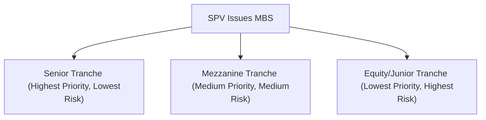

## The Securitization Journey

The idea behind mortgage-backed securities (MBS) might feel a bit dizzying at first. I remember the very first time I heard about them in a grad school lecture: I was thinking, “Wait, so a bunch of folks paying their monthly mortgage bills somehow fuels global capital markets?” But, yep, that’s precisely how it works. Securitization turns those mortgage payments into tradeable bonds—offloading risk from the mortgage originators to a broad spectrum of investors and providing a more expansive flow of capital to homebuyers and commercial projects alike.

At its core, securitization is the process of pooling various types of debt—here, specifically mortgages—into a single financial vehicle. Then, securities (often known as MBS) are sold to investors who receive payments based on the underlying mortgages’ principal and interest streams. Financial institutions benefit, too, because they recoup capital sooner to originate more loans (thus, bridging capital supply and demand). This concept has found its way into all kinds of assets—not just residential mortgages (RMBS) but also commercial mortgages (CMBS), auto loans, credit card debt, and more.

Below is a simplified diagram illustrating the typical securitization process for mortgage loans:


As you can see, it’s a cycle: the mortgage originator sells the mortgage pool to a special purpose vehicle (SPV), which repackages those loans into securities sold on capital markets. Investors buy the MBS, receiving cash flows from mortgage payments, and the cycle of capital becomes self-sustaining—unless, of course, borrowers default or the underlying collateral value plunges. That’s why analyzing mortgage-backed securities requires a careful look at multiple layers of risk.

## Agency vs. Non-Agency MBS

When you dive into mortgage-backed securities, you’ll see references to “agency” vs. “non-agency” MBS. The difference can be huge in terms of risk, yield, and creditworthiness.

• Agency MBS are typically issued (or guaranteed) by government-sponsored entities. In the United States, that means you’ll see names like Fannie Mae (Federal National Mortgage Association) and Freddie Mac (Federal Home Loan Mortgage Corporation). Because of these implicit or explicit government ties, agency MBS come with a level of credit protection that’s often considered fairly strong—though not entirely risk-free. Ginnie Mae, for instance, directly carries the full faith and credit of the U.S. government, while Fannie and Freddie are “sponsored.”  
• Non-agency MBS (sometimes called “private-label” MBS) are not guaranteed by such agencies, so they carry higher credit risk. Issuers might be large banks or private financial institutions, and the underlying mortgages could be subprime or alt-A loans with higher default risk. This class of MBS often appeals to investors seeking bigger yields, but the added returns come with the real possibility of losses if borrowers default.

A quick snapshot comparison is shown below:

| Features         | Agency MBS                          | Non-Agency MBS                          |
|------------------|-------------------------------------|-----------------------------------------|
| Guarantee        | Govt.-sponsored (e.g., Fannie/Freddie) | None (private insurer or none at all)    |
| Typical Credit Risk | Lower                                 | Higher                                    |
| Yield            | Generally lower, more stable         | Potentially higher                       |
| Underlying Loans | Conforming to agency standards       | Often subprime, alt-A, or jumbo          |
| Liquidity        | Typically more liquid                | Varies, can be less liquid               |

## Understanding Tranching

One of the more compelling (and, to be honest, complicated) aspects of mortgage-backed securities is the use of “tranching.” If you ask me, tranching is a neat bit of financial engineering: you take the pool of mortgages and slice them into different classes of securities—each with its own priority claim on the cash flows.

• Senior tranches generally have the highest credit rating and get first dibs on mortgage payments. Consequently, they offer lower yields but face less risk.  
• Subordinated or “junior” tranches get paid only after the senior claims have been satisfied. They’ll usually yield more, but they’re more likely to take losses if borrowers default.

Tranching is often used hand-in-hand with additional credit enhancements, like insurance wraps or excess collateral, all to appeal to a wide range of investor appetites and risk budgets. If you need guaranteed, stable cash flows, you go for the top slices. If you can shoulder the risk, the lower slices might beckon with the promise of bigger returns.

One way to visualize those payment priorities is via a waterfall, which, ironically, might look something like a pyramid in typical diagrams:



The cash flows from the mortgage pool flow first to the Senior Tranche, then any residual to the Mezzanine, and then leftover amounts—if any—to the Equity or Junior Tranche. Losses work in reverse order, hitting the equity first, then the mezzanine layer, and finally creeping up to the senior holders if things get really dire.

## Prepayment and Extension Risk

Mortgage-backed securities carry an idiosyncratic quirk: borrowers can usually decide to pay off (or refinance) their loans early if they find a cheaper interest rate or sell their homes. This is prepayment risk. For MBS investors, it means uncertainty about cash flow timing, potential reinvestment risk, and changes in yield when interest rates fluctuate.

• Contraction risk occurs when interest rates drop, leading borrowers to refinance in droves. Investors get their principal returned sooner than expected, so they might have to reinvest at a lower rate.  
• Extension risk is the opposite scenario: rates rise, fewer borrowers refinance, and the investor ends up holding the security longer than anticipated. Sometimes you want your money back earlier to invest at higher yields—but you won’t get it if your borrowers cling to their existing rates.

Prepayment risk is typically more pronounced in residential MBS (RMBS) than in commercial (CMBS). Commercial loans often have “lockout” periods or penalties for early repayment or defeasance clauses that complicate early refinancing. But that’s part of the fresh complexity you’ll find in commercial real estate deals.

## Commercial Mortgage-Backed Securities

For commercial mortgage-backed securities (CMBS), the collateral isn’t a single-family home, but an income-producing commercial property—think office towers, shopping malls, or multi-family apartment buildings with stable rent streams. Rather than fretting as much about prepayments, investors look hard at the property’s net operating income (NOI) and metrics like the loan-to-value (LTV) ratio or debt-service coverage ratio (DSCR). These metrics help in evaluating default risk. You can’t easily repay a $50 million commercial loan by selling a building overnight, so the mechanics are different from a typical residential scenario.

But, oh, as with many real estate assets, cyclical booms and busts matter. If the economy dips and property occupancy rates fall, the property’s cash flows could shrink, jeopardizing the owner’s ability to service the mortgage. For this reason, the fundamental underwriting of commercial properties—location, tenant quality, lease terms, and the sponsor’s track record—often overshadow more mechanical aspects like prepayment assumptions.

## Credit Enhancement Methods

To make MBS more palatable to a broader range of investors, issuers deploy credit enhancement techniques. These can include:

• Subordination: As discussed in tranching, losses hit the junior tranches first, protecting the senior holders.  
• Overcollateralization: The issuer might pledge more collateral than is strictly needed to cover the value of the issued securities.  
• Insurance/Guarantees: Bond insurers or government agencies sometimes wrap the security to absorb losses or guarantee principal/interest payments.  

If you’ve ever wondered how a pool of, say, “okay-ish” mortgages ends up with a AAA rating—it’s largely through these enhancements (though rating agencies and risk management have come under scrutiny after the 2008 crisis, when certain structured deals turned out riskier than the rating suggested). Not to pick at old wounds, but we all know that meltdown taught us to look closer at the underlying assets and credit enhancement layers.

## Risk Management and Hedging

From a portfolio-management perspective, MBS can add diversification and potential yield pickup relative to Treasuries. However, a typical MBS exposes you to interest-rate risk, credit risk (especially for non-agencies), and uncertain prepayment schedules. Hence, you’ll see sophisticated hedging strategies in practice, such as:

• Interest rate swaps or swaptions to manage shifting yield curves.  
• Using Treasury futures (or Eurodollar futures) to hedge interest-rate risk if you suspect big rate swings.  
• Interest-only (IO) and principal-only (PO) strips as specialized instruments, letting you isolate or offset prepayment risk.  

In real life, portfolio managers often run advanced scenario analyses or option-adjusted spread (OAS) models to forecast how changes in rates or prepayment speeds affect an MBS’s price. It can get pretty technical. I once sat in on a risk management meeting where they spent hours walking through Monte Carlo simulations of interest rate paths—seriously, pages and pages of yield curve scenarios. But that’s part of the job if you’re going to handle MBS effectively.

## A Quick Python Example

If you’re a data or quant geek, you might want to tinker with some basic prepayment modeling. For instance, you can do a simplified “Single Monthly Mortality” (SMM) calculation in Python to estimate monthly prepayment rates. Here’s a quick snippet that demonstrates a naive approach:

```python
import math

def monthly_prepayment_rate(annual_prepayment_rate):
    # Convert from annual to monthly
    return 1 - (1 - annual_prepayment_rate)**(1/12)

apr = 0.06  # let's assume a 6% annual prepayment rate
smm = monthly_prepayment_rate(apr)
print(f"Estimated monthly prepayment rate: {smm:.4%}")
```

This simplistic approach can be refined by adding dynamics for seasonality, interest rate changes, or borrower credit metrics. But it’s helpful for a back-of-the-envelope estimate to see how quickly principal might get returned in a typical MBS.

## Real-World Importance and Best Practices

Mortgage-backed securities played a massive role in the global financial crisis of 2008—GSE failures, subprime defaults, you name it—so it’s essential to remember the necessity of thorough due diligence. Keep your eye on:

• Underwriting standards (Is the borrower well-screened?)  
• Structural protections (Is there adequate credit enhancement?)  
• Collateral characteristics (Property type, location, borrower equity)  
• Macroeconomic conditions (Interest rates, job growth, housing market health)

In practice, analysts build robust cash flow models, stress-test them against various rate paths, and measure default scenarios. Meanwhile, the risk manager double-checks hedging efficiency, looks at correlation to other portfolio assets, and ensures compliance with relevant regulations (such as Basel III or local capital adequacy rules). It may seem like a lot, but the payoffs in yield potential—and the valuable risk diversification—can outweigh the complexities if executed prudently.

## Case Studies and Anecdotes

One of the more famous examples, focusing on the potential pitfalls, was the meltdown of subprime RMBS in the mid-2000s. Lenders extended mortgages to borrowers with poor credit histories, often with adjustable rates that reset to higher levels after a teaser period. When interest rates climbed, many borrowers defaulted. The cumulative effect was catastrophic for some MBS structures that had insufficient credit enhancement (or inaccurate ratings). But well-structured MBS with better underwriting performed far better even during that stressful period.

In a more positive story, certain CMBS deals anchored by top-tier shopping malls or large apartment complexes maintained stable net operating income, showing that fundamentals—like local property demand—really do matter. So not all MBS are made the same. Understanding your collateral is essential.

## Portfolio Implications

Some investment portfolios use MBS as a core holding or a stable, duration-focused instrument. If you’re aiming to immunize a portfolio or reduce relative interest-rate risk while capturing moderate yield, an investment in agency MBS can fit. If you want more credit spread and can handle the ups and downs, non-agencies might be an alternative. And if you’re highly sophisticated, you’ll see how CMBS could integrate into your broader real asset or real estate strategy—especially if you’re analyzing commercial property cycles.

At the CFA Level III exam level (though we’re referencing advanced insights even if labeled as “Level I, 2025 Edition”), you might see scenario-based question sets requiring you to:

• Evaluate the effect of changing interest rates on MBS performance.  
• Compare MBS vs. Corporate Bonds from a yield and risk viewpoint.  
• Assess the role of MBS in a multi-asset portfolio aiming to minimize volatility.  
• Identify the best hedge for a given MBS position if rates are expected to spike or fall drastically.

## Exam Tips

• Be prepared to calculate or interpret “average life” and “duration” of MBS under various prepayment assumptions.  
• Understand the difference between agency and non-agency coverage—particularly how credit risk is transformed or mitigated.  
• Don’t fall for the trap of ignoring prepayment risk. On the exam, they often test your ability to pivot when homeowners refinance or commercial borrowers adopt prepayment-limiting strategies.  
• Practice reading the cash flow waterfalls. They might show you how losses get allocated across tranches.  
• Remember that rating agencies and third-party guarantees can alter the credit profile, but at the end of the day, the assets are only as good as the borrowers’ ability to pay.

## References

• Inside the Mortgage Finance, Industry Publications: https://www.imfpubs.com  
• CFA Institute Program Curriculum (Level I, 2025 Edition)  
• Fabozzi, F. J. (ed.) “Handbook of Mortgage-Backed Securities.”  
• Basel III and other global regulatory documents concerning securitization capital requirements  

---

## Mortgage-Backed Securities & Securitization Quiz



### Which of the following best describes the main purpose of securitization?

- [ ] To reduce liquidity for banks and restructure corporate debt.
- [ ] To lower credit risk for borrowers and force banks to retain more risk.
- [x] To pool loans into tradable securities, creating liquidity for originators.
- [ ] To consolidate personal loans and reduce borrowers’ obligations.

> **Explanation:** Securitization converts pools of mortgages (or other debt) into marketable securities, improving liquidity for the originators and allowing them to make more loans.

### Which characteristic of mortgage-backed securities is most closely associated with borrowers’ ability to refinance at will?

- [ ] Default risk
- [x] Prepayment risk
- [ ] Extension risk
- [ ] Basis risk

> **Explanation:** Prepayment risk is directly tied to borrowers’ option to repay or refinance mortgages early, affecting the timing and amount of cash flows.

### Which factor typically distinguishes agency MBS from non-agency MBS?

- [ ] Higher coupon rate on agency MBS
- [ ] Lower LTV ratio on agency MBS
- [x] Government-sponsored guarantees for agency MBS
- [ ] Non-agency MBS never involves residential properties

> **Explanation:** Agency MBS (e.g., from Fannie Mae or Freddie Mac) typically carry government or government-sponsored guarantees, reducing credit risk compared to non-agencies.

### In a CMBS structure, the most relevant factor determining default risk is:

- [

 ] The borrower’s personal credit score
- [x] The commercial property’s net operating income (NOI)
- [ ] The average rating of municipal bonds
- [ ] The national consumer confidence index

> **Explanation:** CMBS loans are secured by commercial properties, so the property’s ability to generate sufficient cash flow (NOI) to cover debt service is paramount.

### Which technique is a form of credit enhancement commonly used in MBS?

- [ ] Negative convexity
- [x] Overcollateralization
- [ ] Zero-coupon bond issuance
- [ ] Balloon payment schedules

> **Explanation:** Overcollateralization requires more collateral than the face value of issued securities, improving the security’s credit profile.

### What best describes the “equity tranche” in a mortgage securitization?

- [x] The lowest-ranked tranche that absorbs first losses
- [ ] The highest-rated portion of debt with minimal default risk
- [ ] The portion structured with the shortest duration
- [ ] The government-insured element of an MBS

> **Explanation:** The equity (or junior) tranche stands last in the payment waterfall and thus takes losses first if defaults occur.

### Which risk is exacerbated when interest rates rise significantly and mortgage refinancing plummets?

- [x] Extension risk
- [ ] Contraction risk
- [ ] Defeasance risk
- [ ] Overcollateralization risk

> **Explanation:** When rates increase, fewer borrowers refinance, extending the average life of the MBS and exposing investors to extension risk.

### A typical prepayment model for MBS likely incorporates which key assumption?

- [ ] Macro yield curve momentum has no impact on refinancing
- [x] Borrowers are more inclined to refinance as interest rates decline
- [ ] Prepayments occur at a static rate regardless of market rates
- [ ] Longer lockout periods for residential loans than for commercial loans

> **Explanation:** Most models assume the rate of prepayments increases significantly when interest rates drop, as borrowers refinance to lock in lower rates.

### A senior CMBS tranche is most likely protected by junior tranches. This structure is known as:

- [ ] Agency guarantee
- [ ] Prepayment protection
- [x] Subordination
- [ ] Cash-out refinancing

> **Explanation:** In securitizations, subordination means losses flow first to junior tranches, thereby protecting the senior claims.

### True or False: CMBS investors place little emphasis on property-level details such as tenant quality and occupancy rates, focusing mainly on interest rate movements.

- [ ] True
- [x] False

> **Explanation:** Commercial MBS performance heavily depends on the underlying property’s fundamentals, including lease structures, tenant credit, and occupancy rates. 


