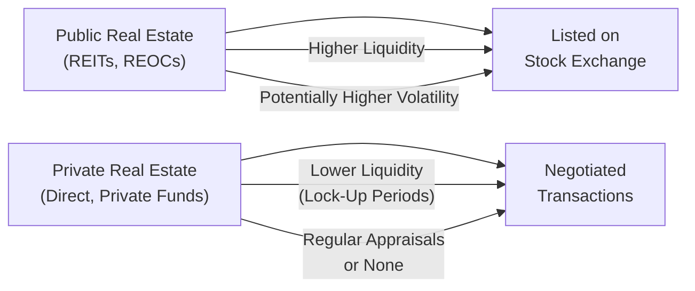

## Introduction and Overview

So, you’re curious about the difference between public and private real estate markets? Let me start by saying that many folks (including a dear friend of mine who recently wanted to invest her savings) discover that real estate can be accessed in more ways than just buying a house or an apartment building down the street. Public real estate and private real estate each present unique opportunities, risks, and considerations. In this section, we’ll break down these key differences, apply them to real-life examples, and touch on best practices you might find useful in your own career (or personal investments).

Remember, this discussion forms part of your broader journey through real estate investing and infrastructure (as covered in this Chapter 4), so we’ll connect to other relevant chapters such as Chapter 2 (for performance and returns) and Chapter 15 (on operational excellence in hedge funds, some lessons of which also apply to real estate). We’ll keep the tone slightly informal, but we will dig deeper into the details to ensure we’re capturing what you need for the CFA® 2025 exam and real-world portfolio management.

## Public Real Estate: High Liquidity and Transparency

### Nature of Public Real Estate

Public real estate typically involves investing through securities listed on stock exchanges. This includes Real Estate Investment Trusts (REITs) and Real Estate Operating Companies (REOCs). As you might recall from earlier sections, a REIT is a special type of company that often enjoys certain tax advantages, provided it meets strict requirements on distributing income to shareholders and focusing on real estate operations. A REOC, on the other hand, is simply a public real estate firm that doesn’t necessarily qualify as a REIT (maybe it retains more of its earnings or fails other REIT rules).

When you buy shares of a publicly listed real estate entity, you’re effectively buying a piece of a large, professionally managed real estate portfolio—like office buildings, shopping centers, industrial warehouses, or even hospitals. The big advantage? Liquidity. If you need to convert that holding to cash tomorrow, you can simply sell your shares in the secondary market, albeit subject to prevailing stock market conditions.

### Advantages of Public Real Estate

• Liquidity: Shares in public real estate vehicles are traded daily. It’s a bit like owning a stock in a retail or tech company—the bid-ask spreads can fluctuate, but you know you can get in and out relatively easily.

• Price Transparency: Public market prices are updated constantly. Investors can see the market’s valuation in real time. This is great if you like to check your portfolio every day (though, ironically, that can increase your stress if prices are volatile).

• Regulatory Oversight: Publicly traded companies must meet disclosure requirements, file periodic reports, and adhere to governance standards. These rules, especially for REITs under local regulations, typically provide a higher degree of transparency.

• Lower Transaction Costs: Relative to direct property transactions, buying or selling shares on a stock exchange can be cheaper and easier. You don’t need to negotiate with a seller about the hallway renovations or the leaky roof; the capital markets have standardized a lot of those transaction details.

### Drawbacks of Public Real Estate

But (and there’s always a but), public real estate can experience significant price swings that sometimes seem disconnected from the underlying property values:

• Higher Volatility: Public real estate securities trade in the broader equity market. Thus, they’re influenced by overall stock market sentiment, interest rates, monetary policy changes, and even geopolitics. This can lead to higher short-term volatility. We’ve seen times when REIT shares fall in tandem with the S&P 500, even though their underlying real estate fundamentals haven’t changed much.

• Correlation with Equities: Because REITs and REOCs trade on stock exchanges, they may be more correlated with the general equity market (Chapter 9 on Global Macro also notes how market conditions can affect broad correlations). This can reduce some of the diversification benefits you might expect from real estate.

## Private Real Estate: Direct Control but Less Liquidity

### Nature of Private Real Estate

In contrast to public real estate, private real estate involves direct ownership or participation in less liquid structures, such as private equity real estate funds. For instance, an investor might join a private partnership that buys a specific commercial property, or invests in multiple properties, or even invests in distressed real estate assets—very much akin to the sections in Chapter 3 that discuss private capital strategies, but focusing on property deals instead of operating companies.

Think of it like this: If public real estate is a quick bus ride to real estate exposure, private real estate might be more like renting a car and driving it yourself. You do get a different (often more direct) experience, but you also handle more responsibilities along the way.

### Advantages of Private Real Estate

• Potential for Higher Returns: Some investors believe private real estate can yield higher returns over the long term, especially if you have the skills and resources to add value via renovations, better property management, or repositioning the property for new uses.

• Direct Control: Owning property (alone or in a private fund) can give you more influence over decisions, such as remodeling, tenant selection, or leasing strategies. If you’re a hands-on person who loves dealing with the nitty-gritty of property management, private real estate might be appealing.

• Lower Correlation with Equities: Because private properties are appraised infrequently (perhaps quarterly or annually) and are not traded minute by minute, they tend to exhibit returns less correlated to short-term stock market fluctuations. In times of market stress, they sometimes appear more stable simply because prices aren’t updated as often (although the true impact on property values might show up later).

### Drawbacks of Private Real Estate

• Illiquidity: Unlike a publicly traded REIT, if you want to sell your stake in a private real estate partnership, it can take months (or years!) to close a deal. You also typically face higher transaction costs, from brokerage and legal fees to property inspections.

• Less Transparency: Private deals aren’t subject to the same reporting and governance requirements as public companies. While that can offer structural flexibility, it can also create information asymmetry and require more robust due diligence (touched on in Chapter 3.3, “Due Diligence and Selection Criteria”).

• Complexity and Operational Risk: You’ll generally need to manage or monitor property operations, handle maintenance, and track tenant dynamics. Even if you’re part of a private real estate fund, that fund might demand capital calls, have multi-year lock-ups, and require substantial paperwork. Let’s just say direct property ownership is not for the faint of heart.

## Pricing Mechanisms and Valuation Lag

One of the biggest differences between public and private real estate markets is how each sector gets priced. Public real estate, like any publicly traded security, experiences constant “mark-to-market.” The share price reflects the collective sentiment of buyers and sellers at that moment. That’s why we say it has high price transparency. You know the market’s consensus valuation right away.

Private real estate, on the other hand, might be valued through periodic appraisals, which are performed by professional valuers or negotiated among parties. The frequency of these appraisals can vary—some do it quarterly, some annually, and some only around major events (like fundraising or bank financing). Hence, there’s a valuation lag. In times of rapid market shifts, private real estate prices may not reflect the new reality until well after the fact—leading to a smoother (but sometimes misleading) historical return profile.

For instance, after a sudden interest rate hike, public REIT shares might drop 10% in a week. Meanwhile, private real estate valuations may stay steady for months until the next appraisal picks up that shift in interest rates and property cap rates.

## Correlation Considerations

The correlation of real estate to other asset classes is a hot topic in portfolio management (see Chapter 1.6, “Comparative Asset Class Analysis,” for more on correlations among different investment segments). If you’re building a diversified portfolio, you probably want to know how real estate interacts with stocks, bonds, hedge funds, or even digital assets (Chapter 7 might pique your curiosity).

• Public Real Estate Correlation: Public real estate often shows higher correlation with equities. That’s a function of daily trading and market sentiment. When the stock market experiences a widespread sell-off, REITs can quickly be dragged along for the ride.

• Private Real Estate Correlation: Private real estate might look less correlated with equities simply because prices do not get updated daily. Over the long term, however, fundamentals (like economic growth, employment, interest rates) can affect both real estate and equities, so the correlation might be higher than it initially appears. It’s not that private real estate is immune; it’s often just slower in reflecting market changes.

## Regulatory Environment and Disclosure

Publicly traded real estate vehicles must comply with rigorous listing and governance standards. This includes regular financial reporting, external audits, board oversight, and other disclosure requirements that investors rely on to evaluate performance. Private real estate is subject to local property laws, private agreements among partners, and relevant securities laws if funds are offered to multiple investors—but it generally does not require the same level of public disclosure. That can be appealing to certain investors who prefer privacy or negotiation flexibility. However, it also demands a more thorough due diligence process because less information may be publicly available.

## Best Practices and Pitfalls

### Best Practices

• Align Investment Goals with Liquidity Needs: If you need frequent liquidity or foresee short holding periods, public real estate is probably more appropriate. If you’re aiming for long-term capital appreciation and comfortable with illiquidity, private real estate might suit you better.

• Conduct Rigorous Due Diligence: In private deals, especially, dig into property fundamentals, sponsor track records, financial statements, and potential conflicts of interest. Even in public real estate, analyzing Net Asset Value (NAV) or the quality of underlying assets can help you avoid overpriced securities.

• Diversify Across Geographic and Property Types: Don’t put all your eggs in one property type or location. Consider a blend of residential, commercial, industrial, and sometimes specialized sectors (life sciences, data centers, cell towers, etc.). Chapter 4.9, “Specialized Property Sectors,” offers a deeper look at unique niches.

• Monitor Leverage: Real estate investments often incorporate debt. Keep an eye on interest rate risks, refinancing schedules, and capital structure. Leverage can magnify both gains and losses.

• Stay Informed of Regulatory Changes: Real estate regulations, tax laws, or local government zoning can shift. For example, new rent control measures or stricter environmental codes can significantly impact property cash flows.

### Common Pitfalls

• Overestimating Liquidity: People forget that private real estate ties up capital for extended periods. If you invest money you might need next year, you could be caught in a bind.

• Ignoring Market Cycles: Real estate can experience major downturns. Just because an appraisal didn’t update immediately doesn’t mean a property’s value is safe. Over the full cycle, fundamental factors come home to roost.

• Lack of Expertise: Running a property is not exactly relaxing if you don’t know what you’re doing. Underestimating maintenance or tenant turnover can eat into your returns. Similarly, picking an underperforming REIT because you didn’t read the disclosures can be equally painful.

• Confusing Short-Term Price Movements with Long-Term Value: While REIT prices can swing daily, that doesn’t necessarily reflect the underlying property’s intrinsic worth. Disciplined investors focus on long-term fundamentals rather than short-term market noise.

## Real-World Examples and Case Studies

• Case Study: REIT Transaction. Suppose an investor decides to put $50,000 into a publicly traded retail REIT. After the purchase, the broader equity market experiences a pullback. The REIT price drops 8%. The investor can choose to hold through the volatility, collecting dividends from the rental income generated by the underlying properties, or sell (if they believe the downturn will persist) without major logistical hurdles.

• Case Study: Private Equity Real Estate Fund. A small institutional investor commits $5 million into a private equity real estate fund that targets undervalued apartment buildings in growing cities. The investor signs up for a 7-year lock-up, with capital calls spread out over two years. The sponsor updates valuations quarterly, but these are slow to reflect immediate changes in the broader economic environment. The investor has to trust the sponsor’s expertise in property renovations and management.

• Example of Valuation Lag: In the 2008 financial crisis, public REIT prices plummeted within months. Prices for equivalent private real estate took almost a year to fully show the price declines in the official appraisals. Eventually, both converged, highlighting how time lags can temporarily mask underlying market realities.

## Diagram: Public vs. Private Real Estate at a Glance

This simplified flowchart depicts how capital flows differently in public vs. private real estate. Public investments go through an exchange with higher compliance and liquidity, while private deals are negotiated one-on-one or within a small group of investors.

## Looking Ahead in This Volume

As you progress through Chapter 4, you’ll find that real estate investing connects with numerous other topics:

• Infrastructure (Section 4.3 and 4.7) can have similarities to private real estate, especially in large, illiquid projects like toll roads or energy pipelines.  
• Mortgage-backed securities and securitization (Section 4.5) bridge the gap between public markets (tradable bonds) and private real estate (underlying mortgages).  
• Chapter 13 (“Advanced Real Estate and Infrastructure Analysis”) will pick up from here, delving into green building strategies, government incentives, and specialized property investments which further layer onto this conversation.

## Quick Glossary Recap

• REOC (Real Estate Operating Company): A public company that owns and operates real estate but may not meet the distribution and operational requirements to be classified as a REIT.  
• Liquidity: The ability to quickly convert an investment into cash at minimal loss.  
• NAV (Net Asset Value): Book value of total assets minus liabilities, often used as a benchmark in real estate to measure intrinsic worth.  
• Price Transparency: How easily market participants can see and transact at current prices.  
• Volatility: How sharply and frequently the price of an asset fluctuates.  
• Disclosure Requirements: Mandatory reports and governance standards for public companies.  
• Valuation Lag: The time delay in updating the value of private (illiquid) assets.  
• Secondary Market: A marketplace, like a stock exchange, where existing securities trade among investors.

## Final Exam Tips

1. Practice Calculation of REIT NAV. Familiarize yourself with how NAV might differ from share price due to short-term market sentiment or intangible factors (like reputation of management).  
2. Understand Correlation Pitfalls. Don’t assume that private real estate’s lower correlation with equities is permanent—part of it reflects lagging valuations.  
3. Think Long-Term. Public markets will react daily, sometimes irrationally, but private real estate can hide short-term stress. Over a full cycle, fundamentals generally rule.  
4. Tie It Back to Portfolio Construction. Public real estate can offer liquidity and diversification benefits but may not be the perfect hedge. Private real estate offers control but can hamper your capital flexibility.

## References

• CFA Institute Program Curriculum (Level I, 2025 Edition)  
• “Commercial Real Estate Analysis & Investments” by Geltner et al.  
• NAREIT (www.reit.com) for market data, research, and policy updates  

## Test Your Knowledge: Public vs. Private Real Estate Markets



### Which of the following is most characteristic of public real estate investments?

- [ ] Illiquid trading structures
- [x] Higher liquidity due to exchange listing
- [ ] Infrequent valuations based on appraisals
- [ ] Lower correlation with equity markets

> **Explanation:** Public real estate invests through exchange-traded vehicles like REITs. This setup allows for higher daily liquidity compared to private real estate.  

### Which factor primarily contributes to higher short-term volatility in public real estate securities?

- [ ] Frequent property appraisals
- [x] Market sentiment in broader equity markets
- [ ] Limited availability of financial disclosures
- [ ] Short lock-up periods in private funds

> **Explanation:** Public real estate securities, such as REITs, are influenced by the daily fluctuations of the broader equity market.  

### How do private real estate assets typically handle valuation?

- [ ] Daily mark-to-market price updates
- [x] Periodic appraisals or negotiated transactions
- [ ] Continuous streaming quotes on a public exchange
- [ ] Fully transparent real-time order book

> **Explanation:** Private assets generally rely on less frequent appraisals and negotiations, reflecting the slower and less transparent nature of the private market.  

### A key disadvantage of private real estate is:

- [x] Lower liquidity and potential long lock-up periods
- [ ] Real-time repricing in secondary markets
- [ ] Overcorrelation with equities
- [ ] Strict disclosure requirements

> **Explanation:** Private real estate can tie up investor capital for extended periods, making it less liquid and often subject to multi-year lock-ups.  

### Which of the following best explains why private real estate might appear less volatile than public real estate?

- [ ] It inherently earns a higher rate of return
- [x] Valuation lag due to infrequent appraisals
- [ ] Superior property management practices
- [ ] Frequent use of leverage in private markets

> **Explanation:** Private real estate prices are updated less frequently, which can smooth out volatility metrics in the short run.  

### Publicly traded real estate companies must:

- [x] Follow strict disclosure and governance rules
- [ ] Lock in investors for at least ten years
- [ ] Restrict distribution of profits to under 10%
- [ ] Refrain from financial leverage

> **Explanation:** Publicly traded companies, including REITs, are subject to regulatory oversight and must follow disclosure requirements and governance standards.  

### Which of the following is most likely the primary driver of public real estate returns over the short term?

- [x] Investor sentiment and equity market movements
- [ ] Slow-moving property appraisals
- [x] Potential mismatch in capital calls
- [ ] Government rent control legislation

> **Explanation:** Public real estate is traded on open markets, so short-term returns can be heavily influenced by overall investor sentiment in the equity market.  

### In a significant market downturn, public REIT prices tend to adjust:

- [x] More rapidly than private real estate values
- [ ] Less rapidly but more severely
- [ ] At the same pace as private property appraisals
- [ ] Only after 6–12 months have passed

> **Explanation:** Public markets reflect changing investor sentiment (and fundamentals) nearly instantly, whereas private valuations may lag.  

### A higher correlation with the equity market is generally seen in:

- [x] REIT shares
- [ ] Directly owned properties
- [ ] Private real estate funds
- [ ] Distressed commercial mortgages only

> **Explanation:** Because they are traded like equities, REIT shares often exhibit greater correlation with stock market indices.  

### True or False: Public real estate investments eliminate all forms of operational risk since all property management decisions are outsourced.

- [ ] True
- [x] False

> **Explanation:** Even though you outsource property management decisions to professionals in a REIT or public real estate company, you still face operational risks (tenant defaults, maintenance failures, natural disasters). Public real estate does not fully eliminate these risks.  


