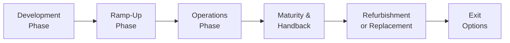

## Overview
Infrastructure projects often evoke vivid images of roads, bridges, airports, and power plants—but they also include less obvious assets like water treatment facilities, communications towers, and even schools built under public-private partnerships (PPPs). These projects are designed to last for decades, serving essential societal needs while hopefully generating stable returns for investors. In reality, though, each infrastructure project goes through distinct phases. Each phase carries its own risks, financial dynamics, and operational considerations. The better we understand these phases, the better we can navigate cost overruns, manage capital structures, and optimize asset performance.  

I remember the first time I visited a large toll road project when I was just starting out. You know that moment when earthly reality meets a massive blueprint? I was struck by how the hustle and bustle of 24/7 construction contrasted with the neat spreadsheets in the project office. In that moment, I realized that bridging the gap between real-world complexities (like unforeseen geological obstacles or local political issues) and the tidy financial models we craft is the true art of infrastructure investing.

Below is a simple Mermaid diagram that shows how an infrastructure project generally moves from inception to exit. Keep in mind, in practice, these phases can overlap or repeat, especially if there are major refurbishments or expansions along the way:



## Development Phase
The Development Phase is like the grand planning stage of a masterpiece—though it can get messy, fast. During this period, sponsors and developers conduct feasibility studies, secure permits, negotiate financing, and finalize design specifications. The project’s blueprint gets fleshed out in terms of engineering details, environmental impact, and local regulatory requirements.

• High Uncertainty: Environmental clearances or community resistance might cause unexpected delays.  
• Capital Outlay and Financing: Typically financed using a mix of equity and debt. Lenders and investors require detailed projections, sensitivity analyses, and robust risk mitigation frameworks.  
• Risk of Cost Overrun: It’s not uncommon for large projects to exceed original budgets. Sometimes you discover hidden geological challenges while building a tunnel, or an unforeseen climatic event forces changes in design.

Individuals who have built or renovated a home might relate—once you open the walls, you never quite know what you’ll find. In the case of infrastructure, the stakes are magnitudes higher.

### Common Pitfalls
• Underestimating Construction Complexity: Early optimism can underestimate labor, materials, or land acquisition costs.  
• Inadequate Contingencies: Projects often skip having sufficient buffer funding.  
• Political and Regulatory Hurdles: Planners might overlook lengthy approval timelines or political pushback.

### Example Formula – Estimating Potential Cost Overrun
While it’s impossible to precisely predict cost overruns, some analysts use a variance-based approach:

Let  
(1) Estimated_Cost = baseline project cost estimate.  
(2) Contingency_Buffer = α × Estimated_Cost, where α is a contingency percentage (e.g., 10%–20%).  
(3) Potential_Overrun = β × Estimated_Cost, where β is an estimated "worst-case" scenario factor.

Then the expected cost can be modeled as:

E[Total_Cost] = Estimated_Cost + Contingency_Buffer + (Probability_of_Overrun × Potential_Overrun)

Where Probability_of_Overrun is based on historical data or expert judgment.

## Ramp-Up Phase
Once the project finishes construction, it transitions into the Ramp-Up Phase. Here, the asset shifts from a dormant structure to an active service. Think of this phase as the “childhood to adolescence” stage. Sure, the roads, cables, or turbines are all in place—but revenue might be below forecast if users are slow to adopt or if operational kinks still need to be worked out.

• Gradual Revenue Build: It may take months or even years to reach the forecasted utilization rate. Toll roads, for instance, often see lower traffic initially, as drivers may have to change habits.  
• Organizational Learning: The operator must adapt to real-world challenges—maybe a water treatment plant’s purification process runs into chemical supply chain constraints, or an airport struggles with baggage handling.  
• Financial Strain: Since revenues can be below expectations, certain debt covenants may be tested. Sponsors might have to inject working capital or renegotiate loan terms.

From a personal standpoint, I once observed a brand-new toll road that just wasn’t seeing the expected traffic volume. Turned out local drivers kept using the old side roads to avoid tolls. It wasn’t until the government enforced certain traffic rules that the new road’s usage ramped up.

## Operations Phase
After the ramp-up, the asset moves into full-fledged Operations. This is generally the sweet spot for many infrastructure investors: think stable cash flow and routine maintenance tasks. During this mid-life segment of an asset, operators enjoy reasonably predictable revenues—whether through contracted user fees, government-backed agreements, or regulated tariffs.

• Cash Flow Predictability: Revenues from user charges, guaranteed “offtake” contracts (common in power generation), or regulated tariffs.  
• O&M Responsibilities: Operations & Maintenance can be outsourced or handled in-house. Efficiency, reliability, and safety become paramount.  
• Refinancing Possibilities: With stable operations, more favorable loan terms may be accessible, allowing project sponsors to reduce overall cost of capital.

### Python Example – Simple Net Present Value (NPV) of Operations Cash Flows
Here is a quick snippet illustrating how one might roughly estimate the NPV of an infrastructure asset’s operating phase. Assume we have projected annual free cash flows for five years and a discount rate of 8%.

```python
import numpy as np

cash_flows = np.array([5_000_000, 5_500_000, 6_000_000, 6_500_000, 7_000_000])
discount_rate = 0.08

discounted_flows = []
for i, cf in enumerate(cash_flows, start=1):
    discounted_val = cf / ((1 + discount_rate) ** i)
    discounted_flows.append(discounted_val)

npv = sum(discounted_flows)
print(f"NPV of Operating Phase: ${npv:,.2f}")
```

In a real case, you’d likely extend the analysis over a longer horizon (10–30 years) and add salvage value or handback adjustments.

## Maturity and Handback
In some infrastructure arrangements, the private operator doesn’t own the asset permanently. Rather, there’s a concession agreement. Once it expires—commonly between 20 and 30 years—the asset reverts to government ownership or a predetermined public entity.

• Residual Value: The operator usually aims to maintain the asset in good condition to avoid penalties.  
• Condition Assessment: Handback conditions dictate the required quality or performance metrics at the end of the concession period.  
• Regulatory and Political Risk: Governments might adopt new rules, like imposing additional taxes or adjusting user fees before the project transfer.

It’s similar to handing back a leased car—but on a multi-billion-dollar scale. If you’ve neglected the asset, you might be penalized. If you’ve somehow added extra value, you’ve either been compensated through higher usage fees or might negotiate an extension.

## Refurbishment or Replacement
Infrastructure assets are designed to last, but they certainly aren’t immortal. Eventually, major refurbishment or replacement is warranted. These steps can be scheduled into the original plan or come up unexpectedly.  

• Scheduled Maintenance and Upgrades: Think about an airport that periodically upgrades technology for safety and operational efficiency.  
• Unexpected Overhauls: Environmental regulations might change, requiring retrofits (for chemical plants, power stations, etc.).  
• Financing the Refurbishment: Sometimes, this stage is funded through retained earnings, new equity injections, or fresh debt.

## Exit Options
At some point, an investor might want to realize gains or recycle capital. Here’s where exit strategies come into play:

• Sale of Equity Stake: Sell to another investor or institutional buyer.  
• Refinancing: Replace existing debt with a new facility at more advantageous terms, sometimes returning excess equity to shareholders.  
• Listing on Public Markets: Initially, project sponsors might create an infrastructure fund that bundles multiple assets and IPOs it.

When considering an exit, timing matters. A stable operations phase can fetch higher valuations. If you’re forced to sell during early ramp-up or during uncertain economic conditions, you might accept a lower price.

## Key Glossary Terms
• **Cost Overrun:** Exceeding the initial budgeted costs for construction or development.  
• **Concession Period:** The length of time a private operator manages the infrastructure asset.  
• **Ramp-Up:** Period from project completion to achieving stable or forecasted usage and revenue generation.  
• **Handback Conditions:** Agreement terms specifying asset condition upon transfer back to the public sector.  
• **O&M (Operations & Maintenance):** Ongoing responsibilities to keep the infrastructure asset functioning efficiently.  
• **Greenfield vs. Brownfield:** New infrastructure projects (Greenfield) vs. upgrades or expansions to existing assets (Brownfield).  
• **Refinancing:** Replacing an existing loan with a new loan offering better terms or lower interest rates.  
• **Project Delivery Model:** The contractual and operational framework (e.g., Design-Build, PPP).

## Practical Case Study: Toll Road Development
Let’s make this more concrete with a simplified example. Suppose a private consortium is awarded a 25-year concession to build and operate a major toll road:

• Development: Two years of heavy construction with a total cost of $500 million. Adverse weather triggers a cost overrun of $50 million, primarily financed by additional equity from sponsors.  
• Ramp-Up: Over the first three years of operations, traffic volume is only at 70% of forecasts due to driver hesitancy.  
• Operations: By year four, usage stabilizes. The operator refinances the original debt using stable revenue to obtain lower interest rates. Maintenance costs are manageable.  
• Maturity & Handback: By year 24, the sponsors have made stable returns. The concession contract dictates that the road be handed back in “good operational condition,” prompting an additional $20 million in last-minute refurbishment.  
• Exit Strategy: If sponsors decide to cash out earlier, they could sell their equity stake around year 15, likely commanding a premium, thanks to predictable cash flows.

## Additional Considerations
• **Public-Private Partnerships (PPP):** A common mechanism for infrastructure creation. The public sector might provide partial funding or guarantees, reducing investor risk.  
• **Risk Transfer:** In many PPP agreements, the private partner bears construction, operational, and sometimes demand risk, while the government ensures land acquisition or regulatory clearances.  
• **ESG Factors:** Sustainable design and socially responsible operations can enhance alignment with investor mandates, especially for pension funds or sovereign wealth funds focusing on “green” infrastructure.  

## Exam Relevance and Pitfalls
In the CFA Level I context, you’ll likely encounter questions tracing how each stage of an infrastructure project influences risk, return, and overall portfolio allocation decisions. Being systematic in analyzing the phases helps you:

• Recognize how near-term construction challenges differ from the stable operations “cash cow” scenario.  
• Assess exit options and modeling assumptions for partial or full stake sales.  
• Understand how cost overruns and ramp-up uncertainties affect project IRRs and financing structures.

Pitfalls include oversimplifying demand forecasts, underestimating cost overruns, or forgetting the complexities of concession agreements. On an exam, they may ask you to interpret an NPV calculation with delayed cash flows or to evaluate the impact of a ramp-up shortfall on debt covenants. Stay alert for signpost words like “greenfield,” “brownfield,” or “concession period,” which hint at unique risk-return trade-offs.

## References
• World Bank’s “PPP Knowledge Lab” (https://pppknowledgelab.org)  
• “Infrastructure as an Asset Class” by Barbara Weber, Hans Wilhelm Alfen  
• CFA Institute Program Curriculum (Level I, 2025 Edition)  

## Test Your Knowledge: Lifecycle of Infrastructure Projects



### During which phase of an infrastructure project are cost overruns most likely to occur?
- [x] Development Phase
- [ ] Operations Phase
- [ ] Maturity Phase
- [ ] Post-Concession Phase

> **Explanation:** Construction and development activities are usually carried out during the Development Phase, making it the period most prone to unforeseen costs and budget overruns.

### Which term describes the stage when the asset moves from construction completion to achieving stable user adoption?
- [ ] Construction
- [x] Ramp-Up
- [ ] Exit
- [ ] Refinancing

> **Explanation:** The Ramp-Up Phase is characterized by the transition from the end of construction to stable or forecasted usage levels.

### What is the main characteristic of the Operations Phase for most infrastructure assets?
- [ ] Limited revenue potential and high uncertainty
- [x] Relatively stable cash flows but ongoing maintenance
- [ ] Mandatory government buyback of the asset
- [ ] Sudden spike in construction-related expenses

> **Explanation:** Once fully operational, infrastructure assets typically exhibit steady cash flow generation, subject to planned O&M costs.

### Under a concession agreement, what typically happens at the end of the specified period?
- [x] Asset control reverts to the government or public entity
- [ ] The operator gains permanent ownership
- [ ] The asset is decommissioned automatically
- [ ] The project finances are forgiven

> **Explanation:** Concession arrangements typically include a Handback Phase where ownership or control of the asset returns to the public sector.

### Which best describes “Greenfield” infrastructure projects?
- [ ] Upgrading or expanding existing assets
- [x] Starting a new project from scratch
- [ ] Purchasing stakes in publicly listed infrastructure firms
- [ ] Outsourcing maintenance activities

> **Explanation:** Greenfield refers to brand-new installations constructed on undeveloped sites, as opposed to Brownfield, which involves existing facilities.

### What is the primary reason for an asset’s refinancing during the Operations Phase?
- [x] Lower cost of capital due to stable revenue generation
- [ ] Reduced tolerance for risk from political bodies
- [ ] Concession handback periods are approaching
- [ ] Mandatory regulatory requirement in many regions

> **Explanation:** Once revenues are steady, refinancing can help secure better loan terms and reduce the overall cost of capital.

### Which of the following is most relevant exclusively during the Ramp-Up Phase?
- [ ] Securing building permits
- [ ] Handback conditions
- [x] Achieving forecast user volumes
- [ ] Major refurbishment of core assets

> **Explanation:** Achieving forecast usage is the key objective of the Ramp-Up Phase, when an asset transitions from newly constructed to fully operational.

### When might an investor most likely decide to sell a stake to realize gains at a higher valuation?
- [x] Operations Phase with stable cash flows
- [ ] Early Development Phase
- [ ] Ramp-Up Phase
- [ ] At final concession handback

> **Explanation:** Once an infrastructure project reaches stable operations and demonstrates predictable revenues, market confidence is usually higher, boosting valuations.

### Refurbishment or replacement is generally undertaken to:
- [ ] Delay ramp-up so operators can renegotiate the contract
- [ ] Force the public sector to buy the asset
- [x] Maintain performance and extend the asset’s useful life
- [ ] Avoid concession conditions

> **Explanation:** Regular refurbishment helps ensure the infrastructure asset performs optimally and meets quality or regulatory standards.

### True or False: During a concession agreement, the private operator permanently owns the infrastructure asset.
- [ ] True
- [x] False

> **Explanation:** In concession models, ownership typically reverts to the public sector at the end of the agreement, not permanently retained by the private operator.


