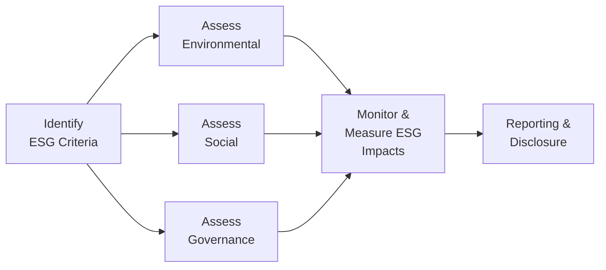

## Introduction

ESG (Environmental, Social, and Governance) considerations have become an ever-more essential part of real assets investing. And, let me tell you, the first time I heard a real estate developer brag about their building’s LEED certification, I couldn’t help thinking, “Um, do most people even know what LEED is?” But that’s the thing—these sustainability metrics are quickly becoming mainstream.

In this section, we’ll dissect how ESG principles are transforming real estate and infrastructure. We'll also see how prudent investors strive to incorporate these factors into decision-making. By the time you’re through, you’ll have a sense of why “green” building certifications aren’t just marketing fluff, and how social and governance factors can create (or destroy) value. This is no side note; it’s central to how real estate and infrastructure portfolios will be built (and judged) in the years to come.

## Foundations of ESG in Real Assets

Environment, Social, and Governance factors apply to real estate and infrastructure in ways that go beyond the purely financial. Sure, investment returns matter—as always—but now you also have to account for a building’s carbon footprint or a pipeline’s community impact. ESG is no longer a “nice to have.” It’s a core dimension of risk and return.

### Environmental Perspective

The environmental component typically covers aspects like carbon footprint, energy consumption, water usage, waste management, and air pollution. Picture a gleaming new skyscraper with cutting-edge lighting systems and solar panels that feed energy back into the grid. That’s a prime example of how thoughtful design and sustainable materials can reduce operating costs in the long run. 

• Carbon Footprint: If you’re wondering how to crunch the numbers, it often involves understanding direct emissions (e.g., burning fossil fuels for heating) plus indirect emissions from electricity consumption. Mathematically, a simplified version might look like:


\text{Carbon Footprint (ton CO2e)} = \sum ( \text{Energy Consumed} \times \text{Emissions Factor} )


(And yes, for you data nerds, you can break that sum down by housing units, square footage, or any relevant dimension.)

• Sustainable Materials: Responsibly sourced wood, low-VOC (Volatile Organic Compound) paints, and recycled steel all factor into a building’s environmental performance. 
• Resource Utilization: Buildings account for a hefty portion of global resource consumption. Improving energy efficiency might mean installing double-glazed windows or advanced HVAC systems that automatically adjust thermostats when no one’s around.

### Social Perspective

Social factors are all about the human side of real assets—labor conditions, community development, stakeholder relations, and tenant well-being. Maybe you’ve seen a development that includes public green spaces or invests in local infrastructure. That can generate goodwill, attract tenants, and help stabilize property values.

• Community Impact: Large-scale real estate developments can reshape entire neighborhoods. Are developers providing amenities, or are they displacing local residents?  
• Worker Safety: On the infrastructure side, think about worker safety during the construction phase.  
• Labor Practices: ESG-conscious investors look at fair wages, diversity, and inclusion among the workforce.  
• Stakeholder Engagement: From local residents to city councils, many projects stand or fall based on how effectively they engage with and address the concerns of those affected.

### Governance Perspective

If environment is about what you do, and social is about whom you do it for, governance is about how you decide. It includes transparent management structures, board oversight, anti-corruption measures, and accountability. When real estate fund managers or project sponsors adopt robust governance practices, they’re less likely to end up in the headlines for unsavory reasons. 

• Transparent Management: Clear lines of decision-making reduce confusion for investors, regulators, and local communities.  
• Ethical Decision-Making: If corners are being cut in environmental compliance, you can guess that’s not good news for either the planet or your returns.  
• Accountability Mechanisms: Governance structures often set the tone for responding effectively to ESG risks, ensuring they are identified and mitigated at an early stage.

## Green Building Certifications

Let’s talk about those green certifications, like LEED and BREEAM, because honestly, they’re quite the badge of honor in modern real estate. When a property obtains LEED (Leadership in Energy and Environmental Design) certification, it signals adherence to specific design and operational benchmarks set by the U.S. Green Building Council. BREEAM (Building Research Establishment Environmental Assessment Method) offers a similar framework, predominantly in Europe.

### Why Green Certifications Matter

• Higher Tenant Demand: Environmentally conscious tenants or corporate occupants might prefer a LEED Platinum office tower.  
• Potential Rental Premium: Some evidence suggests that certified buildings can command higher rents or occupancy rates.  
• Regulatory Compliance: In some areas, certifications can simplify the permitting process.  
• Reduced Operating Costs: Efficient lighting, heating, and water systems pay off over time.

### Boosting Property Values

Green certifications often enhance property values through direct cost savings (energy, water) and intangible brand benefits (reputation, marketability). An example is a property manager who invests in solar panels. Over time, the property’s net operating income might improve, boosting its overall valuation. In an environment where more investors are scanning energy efficiency or “green” metrics, these features can future-proof an asset against changing regulatory requirements.

## Regulatory Evolution

Environmental standards are tightening across the globe. I recall a small developer who used to say, “We’re going to be forced into all these compliance hoops sooner or later, might as well start now.” That’s basically the story, folks. 

• Stricter Building Codes: Many jurisdictions incorporate stricter energy efficiency requirements, forcing new or renovated buildings to meet higher performance thresholds.  
• Shifting Investor Expectations: Investors are applying more scrutiny, demanding greater transparency in how real estate managers handle issues like climate resilience and carbon risk.  
• Government Incentives: Tax breaks or subsidies for building green infrastructure are increasingly common. 

## Reporting Standards

You may be asked: “How can we measure and compare ESG performance across different real estate or infrastructure assets?” That’s where frameworks like GRESB (Global Real Estate Sustainability Benchmark) step in. 

GRESB provides a standardized approach to reporting ESG performance, from energy consumption to stakeholder engagement. Many institutional investors require GRESB assessments to gauge how well a fund or project integrates sustainability. 

• Benchmarking: GRESB measures performance relative to global peers, offering valuable insights into best practices.  
• Transparency and Accountability: Standardized reporting reduces information asymmetry, letting investors examine year-over-year improvements (or lack thereof).  
• Investor Confidence: A strong GRESB rating underscores robust ESG practices, often attracting capital from institutional investors with strict screening policies.

## ESG Integration Process

One way to visualize the ESG integration process is to look at it as a cycle—starting from identification of relevant criteria, moving through implementation, and culminating in monitoring and disclosure.

This diagram shows a simplified approach to ESG workflow. Real-world processes can be more iterative, with continuous feedback loops as you gather data and refine your strategy.

## Practical Applications and Case Studies

You might still wonder, “But does ESG really pay off?” Let’s look at a couple of quick examples:

• A commercial real estate fund invests in renovating older office buildings to significantly improve energy efficiency. Over a five-year period, it realizes substantial cost savings on utilities, leading to improved net operating income. The buildings also command higher rents because tenants appreciate the lower bills and greener image.

• An infrastructure fund finances a natgas pipeline retrofit to reduce methane leaks. This lowers the pipeline’s environmental impact (methane is a potent greenhouse gas), while local communities welcome the project due to increased safety. The reduced regulatory risk helps keep the project afloat and fosters faster approvals for future expansions.

## Best Practices and Common Pitfalls

### Best Practices

• Holistic Materiality Assessment: Consider which ESG factors are truly material to your project. Don’t just chase the latest fad.  
• Proactive Stakeholder Engagement: Talk early and often to local communities, employees, and regulators.  
• Use of Technology: Tools like IoT sensors to track building energy usage or labor conditions on-site in real-time.  
• Transparent Reporting: Whether it’s GRESB or some other framework, consistent and clear reporting builds trust with investors.

### Common Pitfalls

• Greenwashing: Slapping “eco-friendly” labels everywhere without real substance will eventually come back to bite you.  
• Short-Term Focus: ESG benefits often accrue over the longer term, so short-sighted cost-cutting can undermine them.  
• Failure to Address Social Issues: You can have a building that’s super energy-efficient, but if it displaces local residents or exposes workers to unsafe conditions, you’ll still face protests (and potential legal woes).

## Exam Relevance & Final Tips

At CFA Level III, you won’t just be asked “What is ESG?”—you might have to integrate ESG considerations into an overarching portfolio allocation or risk management scenario. Remember:

• Combine qualitative and quantitative measures. Prompt questions might ask for specifying how to measure carbon footprints or apply social considerations in performance measurement.  
• Link ESG to overall portfolio strategy. For instance, how do green building certifications affect property valuations and risk profiles over multiple time horizons?  
• Discuss potential trade-offs. Maybe a property with amazing ESG credentials also commands a premium price, or certain social considerations might extend project timelines, impacting returns.

In real estate and infrastructure, future-proofing your investments means paying close attention to ESG matters. From environmental sustainability to stakeholder engagement and governance transparency, the entire chain of value creation is increasingly tied to these factors.  

## Glossary

• ESG (Environmental, Social, Governance): Criteria measuring a company’s ethical and sustainability practices.  
• LEED: Leadership in Energy and Environmental Design certification for sustainable buildings.  
• BREEAM: Building Research Establishment Environmental Assessment Method.  
• GRESB (Global Real Estate Sustainability Benchmark): Industry-driven organization assessing ESG performance of real assets.  
• Carbon Footprint: Total greenhouse gas emissions caused directly or indirectly by an entity.  
• Sustainability: Meeting current needs without compromising future generations’ ability to do the same.  
• Stakeholder Engagement: Process of involving those who may be affected by decisions and actions.  
• Ethical Decision-Making: Choices made based on integrity, transparency, and accountability.

## References

- Global Real Estate Sustainability Benchmark (GRESB):  
  <https://gresb.com>

- United Nations Principles for Responsible Investment (UN PRI):  
  <https://www.unpri.org>

- CFA Institute Program Curriculum (Level I, 2025 Edition)

## Test Your ESG Knowledge in Real Assets



### Which of the following best describes the “Environmental” aspect of ESG for real assets?

- [ ] Guidelines for corporate board structure in a real estate fund.
- [x] Consideration of carbon emissions and resource utilization in property construction.
- [ ] Worker safekeeping measures and labor policies at building sites.
- [ ] Engagement with community members affected by infrastructure development.

> **Explanation:** The “Environmental” component focuses on energy efficiency, carbon footprint, and use of sustainable materials.

### Which Green Building certification focuses primarily on sustainability benchmarks in Europe?

- [ ] LEED
- [x] BREEAM
- [ ] GRESB
- [ ] ISO 9001

> **Explanation:** BREEAM is a widely used assessment method for buildings in Europe, while LEED is primarily recognized in the United States.

### How can LEED or BREEAM certification potentially influence a property’s financial performance?

- [ ] Guarantees a higher purchase price upon sale.
- [x] Can attract tenants seeking greener spaces, potentially leading to higher occupancy rates.
- [x] May reduce operating costs through energy efficiencies.
- [ ] Often eliminates the need for environmental regulations.

> **Explanation:** Green certifications can yield cost savings and boost demand, but they do not guarantee a specific sale price nor do they exempt owners from legal obligations.

### Which of the following is most closely associated with standardized ESG reporting in real estate?

- [x] GRESB
- [ ] FICO score
- [ ] BREEAM
- [ ] OECD

> **Explanation:** GRESB provides a benchmark for ESG performance in real estate and infrastructure portfolios, facilitating standardized assessments.

### What is a potential pitfall of “greenwashing” in real estate?

- [x] Claiming to offer sustainable amenities without meaningful impact.
- [ ] Providing low-rent housing to disadvantaged communities.
- [x] Investing only in older buildings to reduce overhead costs.
- [ ] Using publicly available environmental data to inform property decisions.

> **Explanation:** “Greenwashing” occurs when sustainability is marketed or claimed without actual substance or measurable results.

### Under Social considerations in ESG, which factor is most relevant?

- [x] The community impact of property development.
- [ ] Energy consumption in a building’s design.
- [ ] Executive compensation policies.
- [ ] Dual-class share structures.

> **Explanation:** Social factors emphasize engagement, community impact, and working conditions.

### When discussing the Governance aspect in real assets, which statement is correct?

- [x] It includes transparency and accountability in decision-making.
- [ ] It primarily addresses the use of green construction materials.
- [x] Ethical practices and board oversight are considered.
- [ ] It focuses solely on occupant safety measures.

> **Explanation:** Governance deals with corporate structure, integrity, and clarity in how decisions are made and enforced.

### What might be an environmental benefit of installing solar panels on a commercial property?

- [x] Reduced carbon footprint and improved sustainability profile.
- [ ] Decreased worker safety measures.
- [ ] Increased local traffic congestion.
- [ ] No change in property operating expenses.

> **Explanation:** Solar panels can lower a building’s energy costs and carbon impact, thus improving its environmental profile.

### Which of the following statements describes how stricter environmental regulations can affect real asset investments?

- [x] They may require renovations or upgrades for older properties to comply.
- [ ] They exclusively benefit property owners financially.
- [ ] They guarantee lower tenant turnover rates.
- [ ] They remove significant barriers to obtaining permits.

> **Explanation:** Meeting stricter regulations can necessitate costly upgrades or modifications, influencing investment decisions.

### True or False: GRESB focuses on environmental issues only, leaving social and governance aspects out of its framework.

- [ ] True
- [x] False

> **Explanation:** GRESB examines the full spectrum of ESG factors, including environmental, social, and governance performance in real assets.


