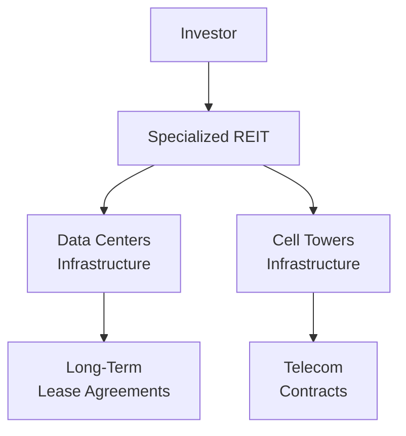

## Introduction

I remember the first time I stepped into a data center: it was loud—way louder than I expected—and the cold air rushing from countless cooling units made me shiver in the middle of summer. Data centers and cell towers might not sound like the most glamorous pieces of real estate, but they’re often the unsung heroes behind our always-on digital world. From a CFA® Level I perspective, these sectors are increasingly relevant as more investors look beyond traditional offices, retail, or industrial properties. Let’s walk through the fundamentals of these specialized property sectors, unraveling what they are, how they operate, and the factors you need to keep in mind when assessing them for investment portfolios.

## Investment Rationale

Both data centers and cell towers have emerged as integral parts of modern infrastructure. As we continue to digitize our economy—relying more on the cloud, streaming services, e-commerce, and 5G wireless networks—demand for safe, reliable, and high-capacity digital infrastructure grows in tandem. Here are a few key points:

• Long-Term Secular Trends: Rapid data consumption, 5G rollout, and a global push toward digital transformation fuel consistent demand.  
• Potential Stability: Leases in these sectors can be long-term and often include inflation adjustments, providing predictable cash flow.  
• Specialized Expertise: These assets require careful management of power, cooling, and maintenance (in data centers) or strategic siting and tower management (in cell towers).

## Data Centers

### Operating Mechanics

Data centers store, process, and disseminate data. Picture rows of servers buzzing away, housed in a secure facility with redundant power and cooling systems. These servers can belong to different clients simultaneously—known as co-location (or “colo”)—where multiple businesses rent server space under one roof. The operator manages critical factors such as:

• Power Redundancy: Backup generators and uninterruptible power supply (UPS) systems to ensure continuous operation.  
• Cooling Infrastructure: Servers generate tremendous heat. Specialized cooling systems (e.g., liquid cooling or hot aisle–cold aisle arrangements) are essential.  
• Security: Physical and cyber. Data centers are high-security zones with layers of authentication, cameras, and biometric locks.  
• Connectivity: Robust fiber networks to enable rapid data transmission.

### Key Drivers of Demand

The surge in cloud computing drives data-center demand for companies like Google, Amazon, and Microsoft—each needing enormous server capacity. Additionally, enterprise-level businesses are outsourcing more of their IT functions to specialized facilities. Meanwhile, the proliferation of 5G and the Internet of Things (IoT) spurs local “edge data centers,” smaller facilities placed close to end users to reduce latency. As data traffic escalates, expect continued need for expanded data storage capacities.

### Lease Structures

Data-center leases often feature long-duration contracts with tiered pricing based on power usage, rack space, or square footage. Key performance metrics like uptime, latency, and service-level agreements (SLAs) also guide pricing. Many providers assure “five-nines” (i.e., 99.999%) uptime, making reliability paramount. This reliability can command premium lease rates, which, in turn, help maintain stable cash flow for investors.

### Valuation and Investment Considerations

At a high level, the value of a data center property is typically linked to:

• Quality and capacity of infrastructure (power, cooling).  
• Suitability of location (disaster risk, proximity to major network connections).  
• Utility costs and availability of skilled labor.  
• Credit quality of tenants (for single-tenant or multi-tenant leases).  

Market value can be influenced by specialized REIT structures focused on data centers and technology infrastructure. For instance, certain Data Center REITs can trade at a premium to net asset value (NAV) if investors expect robust long-term growth.

## Cell Towers

### Why They Matter

Cell towers house the antennas that transmit voice and data for wireless communications. These towers run on separate or shared sites, with telecommunication companies (like Verizon, AT&T, Vodafone, and others) leasing vertical space to attach antennas. As the pandemic taught us, reliable wireless coverage is essential for remote work, streaming, and everyday connectivity—making tower infrastructure more valuable than ever.

### Key Operational Features

Cell tower sites are chosen based on coverage needs—often ensuring line-of-sight for the best signal. The towers are typically steel structures designed to accommodate multiple tenants. Each telecom carrier that rents tower space might install antennas at different heights, which influences rent levels.

Towers aren’t just passive metal poles, though. There’s usually ground space (or rooftop space) for equipment shelters and backup power systems. Contracts tend to be long term, with annual escalators linked to inflation or a fixed percentage, providing a predictable income stream to tower owners.

### Technology Impacts

The rollouts of 4G and 5G significantly drive tower demand. Some older sites may face obsolescence if telecom gears change or if coverage needs shift. However, in many cases, the arrival of new technology (e.g., 5G’s higher frequency bands) may require densification—meaning more small cells or tower additions in dense urban areas to meet speed and coverage demands.

### Common Revenue Model

Telecom operators sign multi-year lease agreements, often with extensions that can stretch for several decades in total. Tower owners typically pass through a portion of operating costs (maintenance, ground rent) to tenants. These factors combine to help tower investments generate relatively stable, inflation-hedged revenue streams. 

## Risk Factors

While these sectors are often seen as more stable than some other forms of real estate, they’re not without potential pitfalls:

• Technological Obsolescence: As telecom standards evolve (3G to 4G to 5G to potentially 6G in the future), an older tower or data center design might become less desirable.  
• Competitive Pressures: Other providers could offer more advanced sites with better connectivity or cooling, forcing older facilities to offer rental discounts.  
• Regulatory Hurdles: Zoning restrictions, environmental considerations, and data privacy legislation can increase costs or limit expansion.  
• Transition and Consolidation: Mergers among carriers (telecom operators) or corporate relocations in data centers may lead to unexpected contract terminations.  
• Geographic Risk: Natural disasters, climate concerns, or local power supply issues can disrupt operations severely.

## Partnership Structures and Specialized REITs

Many investors gain exposure to data centers and cell towers through specialized Real Estate Investment Trusts (REITs). These REITs pool investor capital to acquire and operate large portfolios of digital infrastructure. This structure offers:

• Potential Diversification: With multiple tenants and properties in different regions.  
• Professional Management: Experts in infrastructure, site selection, operations, technology upgrades, and compliance.  
• Financial Efficiency: REITs often have scale in sourcing equipment and power contracts, plus they can negotiate better lease terms.  

From the investor’s perspective, specialized REITs are traded on public exchanges, providing liquidity that direct ownership may lack.

## Best Practices and Pitfalls

Below are a few points that might help you as a CFA® candidate evaluating direct or indirect stakes in these properties:

• Understand Local Utility Capacity: For data centers, insufficient power and water for cooling can easily undermine growth projections.  
• Scrutinize Tenant Quality: For both data centers and towers, the creditworthiness of tenants—and their potential for expansion or contraction—is paramount.  
• Assess Technology Trends: Keep an eye on upcoming communication standards or leaps in server technology that might require capital-intensive upgrades.  
• Diversify Location: Central clustering in a single region could magnify geographic or regulatory risk.  
• Perform Operational Due Diligence: Evaluate the operator’s skill in maintaining consistently high uptime, managing security, and adapting to new tech requirements.  

## Visualizing the Investment Structure

The following diagram highlights how investors typically gain exposure to data centers and cell towers through REIT structures. It also shows the flow of funds from tenants back to investors.

## Conclusion and Exam Tips

As we look ahead, the reliance on digital networks and ever-growing data consumption suggests that data centers and cell towers will remain highly relevant. When considering them for a portfolio, think about tenant diversity, lease structure, impending technology changes, and location-based risks. 

In a CFA® exam context, the topic frequently appears under alternative investments and real estate. Be prepared to interpret case studies about how leases are structured, how portfolio managers handle technological upgrades, and how the stability of these assets might affect an overall portfolio's risk profile. Remember to know the definitions—co-location, uptime, telecom leasing, etc.—and tie these back to the broad real estate fundamentals.

• Common Pitfall: Overlooking short-term renewal risk in presumably “stable” markets. A major tenant could relocate or adopt new standards that render existing space obsolete.  
• Strategy for Essay Questions: Emphasize the long-term nature of these leases, but also highlight the potential for rapid changes in technology.  
• Time Management: Be succinct when explaining the unique lease structures and risk factors—these topics can show up in item sets or “constructive response” essays.  

## References

• NAREIT’s Data Center and Telecommunications REITs: https://www.reit.com  
• Commercial Real Estate Analysis & Investments by Geltner et al.  
• CFA Institute Program Curriculum (Level I, 2025 Edition)  

## Test Your Knowledge: Specialized Property Sectors (Data Centers and Cell Towers)



### Which of the following best describes one key reason for the rising demand in data centers?

- [ ] Reduced data usage trends
- [ ] Lower electricity costs globally
- [x] Rapid growth in cloud computing and 5G adoption
- [ ] Declining need for physical server hardware

> **Explanation:** Cloud computing and 5G drive massive data storage and processing requirements, fueling demand for data centers.

### What is a primary operational concern unique to data centers?

- [ ] Finding tenants with good credit
- [x] Maintaining proper cooling and power redundancy
- [ ] Overcoming strict environmental regulations for farmland
- [ ] Assessing intangible brand equity

> **Explanation:** Data centers generate high heat loads from servers; therefore, advanced cooling solutions and backup power are mandatory to maintain uptime.

### When telecom carriers sign long-term leases on cell towers, what type of contractual feature is often included?

- [x] Annual rent escalators tied to inflation or a fixed percentage
- [ ] One-month rolling contracts
- [ ] Strict usage limits on tower capacity
- [ ] Unlimited data usage for tenants

> **Explanation:** Investors in cell towers typically benefit from predictable revenues where leases contain escalators, adding inflation protection.

### Which of the following is a major risk factor for both data centers and cell towers?

- [x] Rapid technological obsolescence
- [ ] Stable adoption rates of older 2G networks
- [ ] Unlimited land supply
- [ ] Automatically renewing 50-year leases

> **Explanation:** Both assets can become obsolete if technology leaps (e.g., 5G to 6G) require different infrastructure or if tenants switch to alternative providers.

### A data center’s value is largely driven by its:

- [x] Infrastructure capacity and location proximity to fiber networks
- [ ] Employee headcount
- [x] Ability to maintain high uptime for tenants
- [ ] Reliance on a single, short-term tenant

> **Explanation:** Data centers must offer robust infrastructure, high reliability (uptime), and proximity to excellent network connections.

### Which statement is a crucial advantage of investing in specialized REITs for digital infrastructure?

- [x] They provide liquidity compared to direct ownership.
- [ ] They typically avoid any operational expertise requirements.
- [ ] They are immune to technology shifts in server equipment.
- [ ] They have no need for tenant diversification.

> **Explanation:** Specialized REITs are publicly traded, making it simpler for investors to buy and sell shares without negotiating direct-property transactions.

### Investors worry about geographic concentration risk in data centers primarily because of:

- [x] Natural disasters or local power shortages
- [ ] Access to farmland
- [x] Potential digital streaming regulations
- [ ] No risk at all if the center is near an urban hub

> **Explanation:** Data centers in a single region are vulnerable if that region faces natural disasters, water shortages for cooling, or power grid instability.

### How do “co-location” data centers structure their revenue model?

- [x] Multiple tenants share space, each paying for power, cooling, and rack space
- [ ] One tenant rents the entire facility with no cost-sharing
- [ ] Data center owners purchase telecom antennas for each tenant
- [ ] Contracts are month-by-month

> **Explanation:** Co-location involves many tenants renting separate server space, collectively paying for facility maintenance, power, and cooling.

### Cell tower sites often charge higher rents for:

- [x] Higher positions on the tower for better coverage
- [ ] Lower positions with minimal coverage
- [ ] Each minute of phone call usage
- [ ] Singularity in lease agreements

> **Explanation:** The higher antenna placements generally offer better coverage, making them more valuable, thus commanding higher rents.

### True or False: Data centers and cell towers are considered critical infrastructure due to their integral roles in telecommunications and data processing.

- [x] True
- [ ] False

> **Explanation:** Both are crucial to sustaining modern digital communications. Any significant downtime could have wide-ranging economic and security implications.


