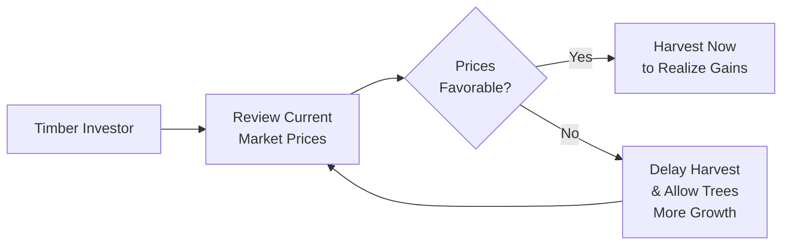
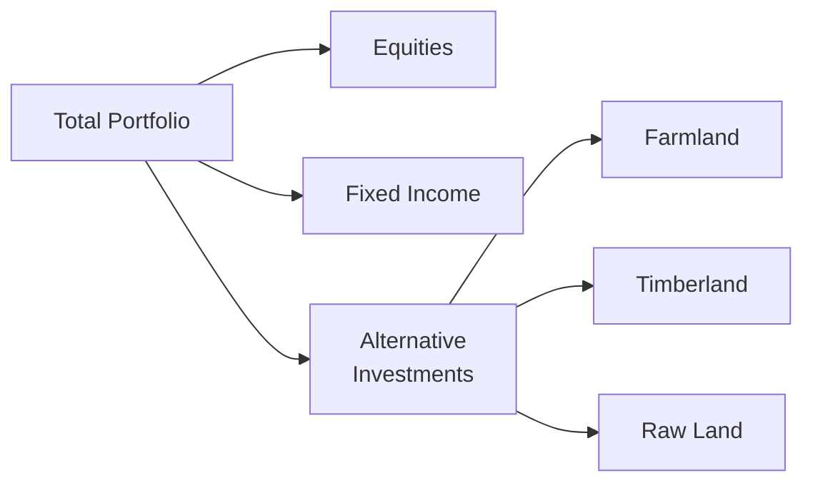

## Introduction

Timberland, farmland, and raw land represent some of the oldest forms of real assets—if you think about it, they’ve been part of humankind’s wealth accumulation strategy for centuries. But maybe you’ve looked around and thought: “Land is land. How complicated can it be?” Well, the interplay of shifting demand, regulatory quirks, environmental factors, and local infrastructure can make this space surprisingly complex. In this section, we’ll explore how these land-based investments offer both capital appreciation and recurring income, discuss the nuances of lease structures and harvest timing, and highlight the unique risks that come with investing in large swathes of earth. 

## Understanding the Three Asset Classes

### Timberland
Timberland is all about forests and tree cultivation, usually with a goal of harvesting wood for paper, construction, or other wood-based products. One big advantage: you can literally store your “inventory on the stump.” If timber prices tank, many investors can delay harvesting until prices (hopefully) improve. This flexibility, known as harvest timing, can help smooth out revenue cycles (though it does not entirely eliminate market risk). 

• Income Generation: Typically derived from the sale of timber products such as sawlogs, pulpwood, and wood chips.  
• Capital Appreciation: Land values can rise over time, and well-managed forests yield higher timber growth and grade quality.

### Farmland
Farmland covers arable land used for row crops, livestock, orchards, vineyards—you name it. You might receive recurring income from renting land to a farmer or by directly operating the farm (though direct operation involves a heavier lift in terms of day-to-day management). One personal anecdote—I once visited a corn farm in the Midwest where the landowner had leased to a local farmer for 30 years. That stable, multi-decade arrangement gave the owner both consistent rent and the comfort of working with someone who really knew the local soil and markets. 

• Income Generation: Rent from farming operators or direct profits from selling crops like wheat, corn, soybeans, and specialty produce.  
• Capital Appreciation: Farmland often appreciates in value as global food demand grows, though local factors—like water availability—can heavily influence long-term returns.

### Raw Land
Raw land is unimproved property with no ongoing productive activities. It’s basically the blankest canvas you can imagine. Investors look for future appreciation via development potential, changes in zoning, or shifts in local demand (e.g., a big new factory in town that needs more housing). Of course, there can be carrying costs—like property taxes and the general upkeep of keeping the land from becoming a dumping ground for garbage—without any offsetting income. 

• Income Generation: Often minimal or zero unless you find transitional uses (e.g., temporary parking lot or billboard leasing).  
• Capital Appreciation: Driven by speculative factors such as rezoning opportunities or broader urban sprawl.

## Key Market Dynamics

Farmland and timberland returns often exhibit low correlation to mainstream equity and bond markets, making them popular in alternative investment strategies. That said, both farmland and timberland are exposed to commodity price risk, weather cycles, and macroeconomic drivers:

• Timber prices are influenced by housing demand, paper consumption, and supply chain shifts caused by pests, disease, or even generational changes in reforestation.  
• Farmland output depends on global demand for food, livestock feed, and biofuels. Crop yields and prices can be cyclical, impacted by weather patterns and trade policies.  

Raw land, on the other hand, is more about local real estate markets and the potential for development. Changes in municipal zoning or infrastructure spending can significantly affect raw land values—positively or negatively.

## Investment Structures and Income Potential

Different paths exist for owning land-based assets. Some large institutions directly purchase and manage farmland or timberland, while others invest through pooled vehicles (like real estate investment trusts or private partnerships). 

### Farmland Lease Structures
Two common farmland lease models are:

• Cash Rent Lease: The farmer pays a fixed rent to the landowner upfront or periodically. The landowner gets predictable income but misses upside when crop prices surge.  
• Crop Share Lease: The landowner receives a percentage of the harvested crops. The landowner’s income depends heavily on weather, yield, and commodity prices, but there’s opportunity to share in the bumper harvest upside.

Finding the right lease structure is a matter of aligning incentives and risk tolerance. If you’re a landowner with little agricultural expertise, a crop share might be a bit more complex—monitoring yields, negotiating who covers input costs, and so on. Conversely, if you’re up for sharing both the risk and the reward, crop share can be appealing.

### Timber Harvest Timing
One especially interesting aspect of timberland ownership is deciding when to harvest. Trees continue to grow and increase in value over time. If the paper or lumber market takes a nosedive, an owner may choose to wait months or years (assuming their tree stands are still in a healthy growth phase). This approach might buffer returns against short-term price drops—but it’s no panacea if the market goes into a long-term slump or if pest infestation strikes.

The following diagram offers a simplified glimpse into timber harvest timing and price considerations:

In practice, harvest timing also depends on factors such as species maturity, site accessibility, and sustainability guidelines.

## Risk and Return Profile

Timberland and farmland can produce both ongoing revenue (sale of timber, crop rent) and potential land appreciation. However, these assets are far from risk-free:

• Price Volatility of Commodities: High variability in commodity prices (corn, soybeans, timber) can rapidly shift expected returns.  
• Biological & Environmental Risks: Disease, pests, drought, hurricanes, and even wildfires can ravage farmland and timberland.  
• Regulatory and Policy Risks: Changes in agricultural subsidies or export tariffs can alter profitability. Local zoning changes or environmental protections can affect raw land.  
• Liquidity Constraints: Selling a thousand-acre property isn’t as straightforward as selling shares in a public REIT. You might spend months or years finding the right buyer.

In many ways, raw land can feel the riskiest if you have no near-term path to generate income. At times, raw land is “banked” for the long term in the hope of future development (sometimes referred to as land banking). The carrying costs over that period can eat into returns.

## ESG and Sustainability Factors

CFA Institute has been promoting responsible investment practices, and farmland/timberland is a ripe area to incorporate Environmental, Social, and Governance (ESG) standards. For instance:

• Sustainable Forestry: Investors might commit to replanting schedules, limiting clear-cutting, and preserving habitats.  
• Responsible Farming: Crop rotation, reduced pesticide use, and ensuring soil health can not only support biodiversity but also improve land’s long-term productivity.  
• Conservation Easements: Some owners place legal restrictions on land use to protect ecological assets, which may offer tax benefits and align with ESG goals.  

In many cases, ESG screens can mitigate reputational risk, attract certain institutional investors, and potentially enhance the resilience of the underlying asset. A farmland property practicing environmentally conscious methods might even fetch a premium from buyers prioritizing sustainability.

## Tax Considerations

Tax treatment for these assets can be quite favorable in some jurisdictions, so it’s important to conduct thorough due diligence (and speak with a qualified tax professional). Key highlights include:

• Depletion Allowance: For timberland, owners can deduct a portion of their timber’s value as it’s harvested, helping offset taxable income.  
• Conservation Easement: Donating or selling certain usage rights (like preventing future development) can yield tax deductions under certain frameworks.  
• Agricultural Income Breaks: Some regions offer reduced property tax rates for active farmland.  

Be sure to weigh these benefits against property taxes, capital gains taxes upon sale, and any estate-planning considerations that might arise (especially for large holdings).

## Key Terms

• Depletion Allowance: A tax deduction for the gradual exhaustion of natural resources (e.g., timber, minerals).  
• Harvest Timing: Strategic scheduling of timber harvest to capture more favorable market prices.  
• Conservation Easement: A legal agreement restricting land usage to conserve certain environmental features.  
• Crop Share Lease: An arrangement where the landowner receives a proportion of the harvested crop instead of a fixed rental payment.  
• Carrying Costs: Ongoing expenses like property taxes, maintenance, and insurance tied to land ownership.  
• Monoculture vs. Continuous Cropping: Planting the same crop every year (monoculture) vs. rotating different crops to preserve soil fertility (continuous cropping).  
• Land Banking: Acquiring and holding raw land for potential future use or development.  
• Sustainability Matrix: A framework to track and measure ESG practices in farmland and timberland investments.

## Practical Example: Farmland Income Streams

Let’s consider a farmland example focusing on cash rent vs. crop share. Suppose an investor—call her Claire—owns 500 acres of prime soybean farmland. She’s trying to decide between:

• Cash Rent: A local operator offers an annual rent of $200 per acre, resulting in $100,000 in gross income for Claire. She faces minimal risk if the soybean price collapses.  
• Crop Share: She gets 25% of the crop revenue. Suppose local yield estimates are 45 bushels/acre, the soybean price is $10/bushel, and production costs are shared or negotiated. If everything goes as planned, total revenue is 500 acres × 45 bu/acre × $10/bu = $225,000. Claire’s 25% share is $56,250. But if dust storms ravage half the yield or if bean prices drop, her revenue shrinks substantially.

In reality, the difference in potential outcomes can be even more extreme. Cash rent is basically a stable bond-like stream, while the crop share arrangement can exhibit equity-level volatility.

## Bringing It All Together: Portfolio Perspectives

Land-based investments commonly appeal to those seeking diversification and an inflation hedge. Timber and farmland have historically shown relatively low correlation to equities and fixed income instruments. Even so, it’s important to evaluate:

• Portfolio Liquidity: You might not be able to sell farmland or timber properties quickly or at a fair price if you need immediate cash.  
• Manager Skill: Acquisition strategy, knowledge of local markets, and operational expertise (especially for farmland) can make or break returns.  
• ESG Commitments: Growing appetite for sustainable investments can spur higher valuations niche sub-sectors (e.g., organic farmland) or create a compliance burden if sustainable practices are mandated.

Below is a simplified diagram illustrating how farmland and timberland might fit within a broader portfolio:

In many diversified portfolios, farmland and timberland fall under the “Alternatives” category, balancing out risk and potentially providing inflation-protected cash flows.

## Exam Relevance and Best Practices

For those preparing for CFA exams—particularly if you’re thinking about how alternative assets fit into a broader portfolio—key exam themes often include:

• Risk–Return Trade-Off: Know how farmland or timberland might offset equity risk or serve as an inflation hedge.  
• Economic Drivers: Understand how housing cycles affect timber demand or how global trade treaties influence agricultural exports.  
• Lease Structures and Incentive Alignment: Example-based questions on cash vs. crop share lease might pop up in practice item sets.  
• ESG Integration: Examiners increasingly focus on how to incorporate sustainable investment considerations into portfolio management.  
• Regulatory and Tax Nuances: Familiarize yourself with how depletion allowances work or how farmland is taxed differently in certain jurisdictions.

Practice summarizing your reasoning for integrating farmland, timberland, or raw land into a multi-asset strategy. Keep an eye on the various ways these assets can be structured and the inherent complexities of implementing them in real-world portfolios.

## References and Further Reading

• The Handbook of Timberland Investing by St. Regis Paper Research  
• USDA – United States Department of Agriculture Reports and Publications: https://www.usda.gov/  
• Responsible Investment in Farmland Guidelines by CFA Institute and Institutional Investor Groups  

---

## Test Your Knowledge: Timberland, Farmland, and Raw Land



### Which of the following best describes the concept of harvest timing in timberland investments?

- [ ] Scheduling planting to align with crop seasons.
- [ ] Replanting trees immediately after each harvest.
- [x] Selecting when to cut trees based on market prices and tree maturity.
- [ ] Identifying specific farmland crop rotations.

> **Explanation:** Harvest timing involves deciding the optimal time to cut and sell timber, often influenced by lumber prices, growth rates, and species maturity.

### What is a primary difference between cash rent and crop share farmland leases?

- [ ] Cash rent is only used for perennial crops, while crop share applies to annual crops.
- [ ] Cash rent requires operating costs to be paid by the landowner.
- [ ] Crop share produces stable income regardless of yield.
- [x] Cash rent offers a fixed payment to the landowner, whereas crop share involves splitting production revenue.

> **Explanation:** Cash rent provides predictable income, while crop share arrangements distribute the risk and reward of production between the landowner and the farmer.

### Which of the following factors typically influences timberland investments the most?

- [x] Housing demand and paper product consumption.
- [ ] Utility rates for local municipalities.
- [ ] Urban rezoning initiatives.
- [ ] Livestock grazing patterns.

> **Explanation:** Timber prices often correlate with housing market demand (for lumber) and the paper industry, rather than with livestock or urban zoning concerns.

### Why might raw land investments be considered higher risk than farmland or timberland?

- [ ] They always have higher carrying costs.
- [ ] They are fully liquid and can be sold quickly.
- [x] They often generate little to no current income, relying solely on appreciation.
- [ ] They have no exposure to real estate market trends.

> **Explanation:** Raw land typically produces negligible current income, so investors rely on future development or appreciation. Holding costs can also reduce returns over the investment horizon.

### In the context of farmland investing, which of the following is most likely a key due diligence consideration?

- [x] Soil fertility and access to water sources.
- [ ] The presence of mature forestry for harvest.
- [ ] Availability of paper mills.
- [ ] Proximity to silver and gold mines.

> **Explanation:** Farmland productivity hinges on factors like soil quality and irrigation infrastructure, making these top considerations in farmland due diligence.

### What is one primary advantage of incorporating farmland or timberland into a traditional portfolio of stocks and bonds?

- [x] They may offer low correlation to equity and bond markets.
- [ ] They guarantee high returns every season.
- [ ] They do not require specialized management expertise.
- [ ] They can be converted to publicly traded shares easily.

> **Explanation:** Farmland and timberland have historically exhibited low correlation with standard asset classes, providing potential diversification benefits.

### Which of the following is a sustainability-oriented tool used to oversee farming or timber practices?

- [ ] Capital asset pricing model (CAPM) for farmland returns.
- [ ] Sharpe ratio analysis.
- [x] A sustainability matrix tracking ESG metrics.
- [ ] A liquidity ratio focusing on the land’s quick sale.

> **Explanation:** A sustainability matrix explicitly monitors environmental, social, and governance metrics, thereby guiding responsible practices.

### A conservation easement would most likely:

- [x] Restrict certain types of development to preserve ecological value.
- [ ] Guarantee the unrestricted commercial development of forestland.
- [ ] Inflate land value by removing any restrictions on land usage.
- [ ] Eliminate all property taxes.

> **Explanation:** Conservation easements are legal tools that limit particular uses of land for the sake of conservation, often resulting in tax benefits.

### What is a potential benefit of the depletion allowance for timberland owners?

- [ ] It ensures indefinite conservation easements.
- [ ] It eliminates all federal taxes on timber sales.
- [x] It provides a tax deduction based on the gradual consumption of timber resources.
- [ ] It only applies to farmland crops.

> **Explanation:** A depletion allowance allows timberland owners to deduct a portion of the timber’s value over time, reducing taxable income.

### True or False: Farmland investments have zero exposure to commodity price risk.

- [ ] False
- [x] True

> **Explanation:** This is actually a trick statement—farmland DOES have exposure to commodity price risk. Therefore, the statement is false. If farmland yields are tied to the prices of crops, changes in commodity markets can significantly impact returns.


