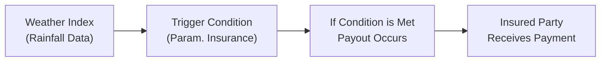

## Introduction

Have you ever planned a big outdoor event—like, say, a family reunion—and watched the local weather forecast like a hawk, hoping the rain would stay away? Well, in the world of finance, the stakes are often far higher. Energy firms, farmers, construction companies, and even tourism operators face massive financial ups and downs when weather doesn’t cooperate. That’s why weather derivatives and insurance instruments have gained such popularity. They help smooth out the financial bumps (or puddles) caused by unexpected temperature dips, droughts, floods, or unseasonal storms. 

In this section, we explore how these instruments work, who uses them, and how they’re priced. We’ll also delve into the role of technology, the regulatory landscape, and how these derivatives can fit into a diversified portfolio. By the time you’re finished reading, you’ll understand the core principles behind weather derivatives and insurance instruments—and, hopefully, feel ready to tackle the related exam questions and real-world applications with confidence.

## Weather Derivatives in a Nutshell

### Defining Weather Derivatives
Weather derivatives are financial instruments—often structured as futures, options, or swaps—that provide payouts based on specific weather-related conditions. These conditions might be average temperature, rainfall, snowfall, or even hurricane wind speeds during a defined period. They do not compensate for actual physical losses a company might suffer; rather, the payout is triggered by the weather index hitting (or missing) a certain level. 

• Temperature Derivatives: These are frequently tied to Heating Degree Days (HDD) or Cooling Degree Days (CDD). An HDD is computed when the average daily temperature is below a certain threshold—often 65°F in the US—implying more energy usage for heating. A CDD is the opposite, reflecting energy usage for cooling when the temperature is above a threshold.

• Rainfall or Snowfall Derivatives: These focus on precipitation accumulations. For example, a company might buy a rainfall option that pays off if total rainfall is below a specified amount over a given period.

### Major Users and Their Motivations
The primary users of weather derivatives are businesses directly affected by climate and seasonal variations:

• Agriculture: Farmers and agribusinesses use derivatives to hedge against insufficient rainfall that could cut into crop yields—or against excessive rain that could flood fields.  
• Energy: Utility companies hedge against mild summers (reducing cooling demand) or warm winters (reducing heating demand), both of which can lower revenues.  
• Construction: Weather risks—like excessive rainfall or severe cold—slow down outdoor projects, cause schedule delays, and inflate costs.  
• Tourism and Hospitality: Ski resorts might hedge against warm winters that reduce snowfall; beach resorts sometimes worry about rainy summers deterring visitors.  

I actually recall a friend in the hospitality business who fretted every time the long-range forecast hinted at a hurricane. As soon as a storm threatened, cancellations rolled in, slashing revenues. Weather derivatives can be a lifesaver for folks in that boat, no pun intended.

### Contract Structures
Weather derivatives commonly take the form of:

• Futures or forwards: Settle on a standardized or customized weather index at contract maturity.  
• Options: Provide an asymmetric payoff—if the weather hits your "bad" threshold, you get a payout, but if it doesn’t, you lose the premium.  
• Swaps: Involves exchanging one set of payments (based on the actual weather) for another set of payments (often a fixed amount).

These structures aim to align weather outcomes with business exposures. If adverse weather occurs, the payout from the derivative offsets financial losses. If the weather is favorable, the business thrives, but the cost of the premium or the swap rate is foregone.

## Parametric Insurance and Index-Based Solutions

### Key Features
Parametric insurance (sometimes called "index-based insurance") differs from a traditional indemnity policy. Instead, it pays out automatically when a specific index or parameter is triggered—like rainfall below a certain level—rather than requiring the policyholder to demonstrate an actual financial loss. 

• Trigger Mechanism: When the weather data from an agreed-upon source crosses a predetermined threshold (e.g., less than 50 mm of rain in a crop-growing region over four weeks), a payout occurs.  
• Speed of Settlement: Thanks to a clear set of triggers, claims can be settled quickly, which can be critical when policyholders need immediate liquidity after a weather disaster.  
• Basis Risk: The insured might still face a mismatch (basis risk) if their local weather differs from the weather station’s data. This is especially pronounced if there are microclimates or if the nearest weather station is far away.

### Who Uses Parametric Solutions?
• Smallholder Farmers: In many emerging markets, parametric insurance helps farmers secure financing. Lenders are more willing to extend credit if they know that a weather-triggered payout can service the debt during a poor harvest.  
• Governments: When a hurricane strikes, governments can receive quick payouts to support relief efforts without waiting for lengthy insurance claims.  
• Non-Governmental Organizations (NGOs): They often facilitate parametric policies for communities vulnerable to drought or storms, helping maintain food security and livelihoods.

### Illustrative Diagram

## Underwriting and Pricing Weather Risks

### Data Sources and Modeling 
The entire concept of weather derivatives and parametric insurance hinges on robust weather data. Underwriters, or the entities that create and price these contracts, rely on:

• Historical Weather Data: Often 10–30 years of historical temperature or precipitation data.  
• Burn Analysis: A method where underwriters "burn" through historical data, simulating how the contract would have performed had it been in place historically.  
• Climate Modeling: As climate change alters weather patterns, advanced modeling is needed to capture shifting probabilities of extreme events.

### Underwriting Process
1. Identify Weather Exposure: The underwriter and client define the specific parameter (temperature, rainfall, etc.) and the risk period (e.g., June–August).  
2. Choose a Trigger: Determine the threshold or index value that indicates a “loss” to the client if surpassed—or not reached.  
3. Set Payout Formula: For instance, $X payout per millimeter of rainfall below 200 mm.  
4. Price the Premium: Using historical data, modeling software, and risk assumptions, the underwriter calculates the fair premium (or fair swap rate).

But it’s never perfect. Modeling is inherently uncertain. You might get that one "crazy" season that busts all your well-laid assumptions—especially as climate change intensifies and historical patterns might not always hold.

### Challenges in Pricing
• Data Gaps: In many regions, reliable or granular weather data is missing, leading to higher uncertainty.  
• Climate Change: Traditional methods assume relatively stable climate patterns—an assumption that may be less reliable today.  
• Model Risk: Even the best models can’t capture everything. Storms can deviate from past patterns.  
• Correlation with Other Factors: Commodity prices, labor supply, or local infrastructure might magnify or mitigate the actual financial damage caused by weather events.

## Reinsurance and Catastrophe Bonds

### How Reinsurance Fits In
Reinsurance is insurance for insurers. If an insurance company faces overly large exposures (e.g., an expected high volume of claims in hurricane-prone regions), it can purchase reinsurance to shift part of that risk to other insurers or specialized reinsurance firms. This lowers the primary insurer’s capital burden and risk of insolvency after a catastrophic event.

### Catastrophe Bonds (Cat Bonds)
Catastrophe bonds are another tool to transfer massive risks—like hurricanes or earthquakes—to capital markets. Issued by insurance or reinsurance companies, these bonds promise to pay a coupon. However, if a specified catastrophic event occurs (e.g., a Category 5 hurricane making landfall in a certain region), investors lose a portion or all of their principal, which is then used to cover insurance losses.

These bonds often incorporate parametric triggers. For instance, a town’s cat bond might pay out if measured hurricane wind speeds exceed 150 mph. Investors are attracted to the typically higher yields on cat bonds, though they must accept the risk of a total loss if the event occurs.

## Portfolio Benefits

### Uncorrelated Returns
It might surprise you to learn that weather derivatives often exhibit low correlation with traditional markets (equities, bonds). Whether or not it rains is generally not tightly linked to corporate earnings or interest rate shifts. Consequently, weather derivatives can add a unique, non-traditional risk/return profile to a portfolio. 

### Risk Diversification
Portfolio managers sometimes allocate a portion of capital to weather-related strategies precisely because they have different risk drivers. For instance, a hedge fund focusing on global macro strategies might also delve into weather derivatives to hedge specific seasonal risks in its commodity positions. 

### Harvest or Operational Risk Hedge
If you’re a farmer or own farmland equities in your broader portfolio, weather derivatives can serve as a protective position. In years with suboptimal growing conditions, you might see a payoff on your derivative contract offsetting declines in crop yields.

## Regulatory Considerations

One big question is whether parametric contracts are "insurance" or "derivatives." This classification can influence licensing requirements, capital adequacy, and regulatory oversight. In some jurisdictions, parametric policies are regulated as insurance products, especially if the buyer has an insurable interest (like farmland). However, if the contract is used purely for speculative purposes—like a hedge fund just betting on unusual weather patterns—local laws may classify it as a derivative. 

Understanding the local regulatory framework is vital for compliance, tax treatment, and correct disclosure requirements. You definitely don’t want to find out you’re in violation of securities law because your parametric insurance product was inadvertently regulated as a derivative you never registered.

## The Emerging Role of Technology

### Satellite Imagery, IoT, and Data Analytics
Recent advancements in technology have improved both the accuracy and speed of weather indexing and payout triggers:

• Satellite Imagery: Tracks rainfall, storm movements, and vegetation indices in near real-time.  
• IoT Devices: Weather stations, sensors, and even drones can capture hyperlocal weather data that reduces basis risk.  
• Blockchain Solutions: Some parametric solutions now run on blockchain smart contracts, automatically disbursing payouts if data from oracles meet the trigger criteria.

All of these help reduce disputes about whether the weather events actually occurred and can expedite payouts. 

I once saw a pilot project using drones and sensors attached to local water reservoirs. As soon as water levels dipped below a threshold, the parametric policy triggered. The rightful owners got paid. It was surprisingly seamless—and a game-changer in that rural area.

## Best Practices and Common Pitfalls

• Align the Trigger with Actual Exposure: If your farm is 50 miles from the reference weather station, ensure the data is relevant. Otherwise, you’ll either pay too much or fail to get compensated when you need it most.  
• Perform Robust Scenario Analysis: Consider climate trends, not just historical averages.  
• Evaluate Credit Risk of the Counterparty: Make sure the institution that wrote the derivative or insurance policy can actually pay out.  
• Watch for Overlapping Risks: Owning farmland, plus a commodity hedge, plus a weather derivative might create offsetting exposures if not clearly assessed.

## Final Exam Tips

• Understand the Distinction Between Parametric Insurance and Traditional Insurance: You may see questions testing whether you know the difference and the concept of basis risk.  
• Master the Typical "Burn Analysis" Approach: Expect scenario-based questions that require evaluating historical payoff data.  
• Recognize Key Definitions (HDD, CDD, Indemnity vs. Parametric, etc.): The CFA exam loves to test your understanding of fundamental metrics and acronyms.  
• Be Ready for End-to-End Application: You might see an item-set question describing a farm cooperative or an energy firm worried about warm winters. Identify the correct weather derivative strategy, parametric solution, or cat bond details.  
• Time Management: In essay questions, clearly articulate the rationale for choosing weather derivatives—e.g., uncorrelated returns, hedge benefits, or regulatory considerations. 
• Tie It to the Code of Ethics: If a conflict of interest arises or if you’re dealing with unique clients (like smallholder farmers), you’ll need to recall professional conduct guidelines.

## Glossary

• Parametric Insurance: Insurance that pays a set amount based on a specific, predefined parameter (e.g., rainfall level), rather than actual loss.  
• Weather Derivative: A financial instrument used to hedge or speculate on weather-related risks such as temperature or precipitation fluctuations.  
• Catastrophe Bond (Cat Bond): A high-yield debt instrument designed to raise money for companies in the insurance industry in the event of a major catastrophe.  
• Index-Based Insurance: Triggers a payout when an index (e.g., rainfall index) hits a certain level.  
• Burn Analysis: A historical simulation approach to pricing weather derivatives using past weather data.  
• Basis Risk (Weather): The risk that the derivative or insurance payout does not match actual losses due to differences in location or measurement methodology.  
• Reinsurance: Secondary insurance purchased by insurers to limit their risk exposure.  
• Climate Modeling: Use of computational simulations to project weather patterns and climate changes over time.

## References and Further Reading

• Marks, G.N. (2022). “Weather, Climate and the Economy.” Financial Weather Press.  
• International Research Institute for Climate and Society (IRI) at Columbia University: https://iri.columbia.edu/  
• CFA Institute Level I Curriculum (2025). Alternative Investments.  
• Swiss Re’s Annual Catastrophe Report (for updated data on extreme weather events).  

-----

## Test Your Knowledge: Weather Derivatives and Insurance Instruments



### Which of the following best describes a weather derivative?

- [ ] A contract that indemnifies the holder for actual losses incurred.  
- [x] A financial instrument that pays based on fluctuations in a weather index.  
- [ ] A contract for the physical delivery of agricultural commodities.  
- [ ] A specialized reinsurance agreement with cat bond features.  

> **Explanation:** Weather derivatives are linked to a defined weather index (e.g., temperature, rainfall) rather than actual physical losses.

### Which sector is most likely to use weather derivatives to hedge against cooler-than-expected summers?

- [ ] Farmland cooperatives.  
- [x] Electric utilities that rely on air conditioning demand.  
- [ ] Manufacturers of home insulation materials.  
- [ ] High-end fashion retailers.  

> **Explanation:** Electric utilities depend on higher temperatures to boost air conditioning demand. A cooler-than-expected summer reduces energy consumption, which lowers earnings.

### Which statement about parametric insurance is correct?

- [ ] It is only offered by government agencies in emerging markets.  
- [x] It pays out based on a predefined trigger rather than proven losses.  
- [ ] It requires extensive documentation of damages before paying claims.  
- [ ] It always has zero basis risk.  

> **Explanation:** Parametric insurance triggers a payout based on a chosen parameter (e.g., rainfall below a set threshold), not the actual loss incurred.

### In a Burn Analysis, underwriters primarily:

- [x] Use historical weather data to simulate contract payouts.  
- [ ] Rely exclusively on real-time sensor technology to measure rainfall.  
- [ ] Price weather derivatives based on forward commodity curves.  
- [ ] Assess the competitor’s product pricing in real-time.  

> **Explanation:** Burn Analysis reviews historical weather patterns and applies them to today’s contract terms to estimate expected payoffs.

### What is a key advantage of catastrophe bonds (cat bonds) for insurers?

- [x] They allow insurers to transfer extreme event risk to capital market investors.  
- [ ] They guarantee zero loss payout if a catastrophic event occurs.  
- [x] They offer standard coverage for routine insurance claims.  
- [ ] They are universally regulated as traditional insurance contracts.  

> **Explanation:** By issuing cat bonds, insurers can shift the risk of large catastrophic losses to the wider capital market in exchange for paying bond coupons.

### Which of the following is an example of basis risk in a weather derivative contract?

- [x] Rainfall at the weather station is sufficient, but a farm 40 miles away remains dry.  
- [ ] The notional value of the contract is higher than the insured’s total revenue.  
- [ ] The insurer refuses to pay a claim due to a technicality in the contract.  
- [ ] The local climate remains stable over a 10-year period.  

> **Explanation:** Basis risk is the mismatch between actual losses and weather index outcomes, often due to geographic differences or data measurement issues.

### What characterizes parametric insurance vs. a standard indemnity policy?

- [x] Triggered by an index threshold without needing proof of actual loss.  
- [ ] Always requires proof of actual physical damage.  
- [x] Is illegal in most jurisdictions.  
- [ ] Offers unlimited coverage for any catastrophic event.  

> **Explanation:** Parametric policies tie payouts to index triggers (e.g., rainfall), bypassing the need to prove specific damages.

### Which technology can help reduce basis risk in weather derivatives?

- [x] IoT sensors providing hyperlocal microclimate data.  
- [ ] Blockchain-based stablecoins for transaction settlements.  
- [ ] Machine learning that only uses national averages.  
- [ ] Third-party social media data on weather complaints.  

> **Explanation:** IoT sensors gather localized data, improving accuracy and reducing the mismatch between the index and actual conditions.

### A key reason weather derivatives can be attractive for portfolio diversification is:

- [x] They often show low correlation with equity and bond markets.  
- [ ] Their payouts are always inversely correlated with bond indices.  
- [ ] They completely eliminate commodity price risk.  
- [ ] They are regulated identically to standard equity instruments.  

> **Explanation:** Weather risk is driven by meteorological factors rather than broad market forces, which can make these instruments relatively uncorrelated with traditional asset classes.

### True or False: Climate change has no significant impact on the pricing of weather derivatives.

- [ ] True  
- [x] False  

> **Explanation:** Climate change alters historical weather patterns, affecting the expected frequency and severity of events, which influences pricing models and risk assessments.


