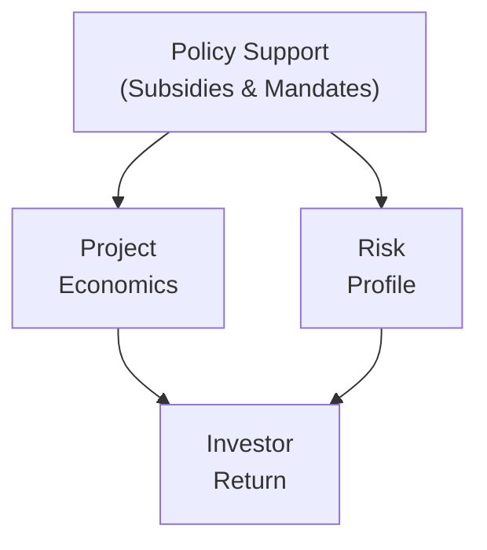

## Introduction and Context

You know how sometimes you see farm fields stretching on for miles as you drive across the countryside? Well, imagine that same farmland not only growing crops for food but also supplying feedstock for biofuel or hosting rows of shiny solar panels. That transition is part of a broader push toward alternative fuels and renewable energy sources, which is pretty exciting if you ask me. In this section, we’ll explore the evolving market demand for these frontier energy solutions, the production processes behind biofuels and other renewables, and how government incentives and infrastructure constraints come into play. We’ll also look at key investment vehicles—sometimes called MLPs, yieldcos, or crowd-funded projects—that have emerged to help finance and monetize these ventures.

From a Level I CFA perspective, our focus is on understanding basic economics, risk-return profiles, investment structures, and regulatory considerations. However, as sustainability and ESG considerations keep moving from the periphery to center stage, the knowledge you pick up here will become even more relevant in your career. Long story short, alternative fuels and renewables can’t be ignored in modern portfolios—especially when you’re aiming for diversification or compliance with impact-focused mandates.

## Evolving Market Demand for Cleaner Energy

There’s a growing global chorus calling for reduced dependence on fossil fuels and lower greenhouse gas emissions. Increasingly, both institutional and retail investors are seeking opportunities that target net-zero carbon goals. Even if you have your doubts as to the exact speed of transition, the direction of travel looks pretty clear—energy markets are diversifying, governments are stepping in to offer incentives, and technology continues to drive down costs. Yet the “when” and “how” can be tricky issues.

• Electric Vehicle (EV) Adoption Rate: As EVs rise in popularity, demand for gasoline may gradually decline, creating room for advanced biofuels that can power heavier vehicles or specialized machines.  
• Hydrogen Economy Ambitions: Some governments and corporations envision hydrogen as a low-carbon energy carrier—particularly for heavy-duty transport, industrial processes, and even power generation.  
• Biofuels and Synthetic Fuels: Liquid biofuels like ethanol and biodiesel remain popular, but emerging synthetic fuels (eFuels) could also shape the future – though they’re still relatively niche.

Overall, the demand for cleaner fuel sources is sort of like the first chapter in a multi-act play: the story is certainly unfolding, but we can already see new business models and capital investment patterns taking shape.

## Production Processes and Key Technologies

### Biofuels: Ethanol, Biodiesel, and Beyond

Biofuels are fuels derived from organic material (biomass). Common types include:

• Ethanol: Often produced from corn in the U.S. or sugarcane in Brazil. Let me tell you, I once toured a Midwest ethanol plant, and the scale was massive—imagine large vats fermenting mountains of corn into a clear alcohol that later gets blended with gasoline.  
• Biodiesel: Typically arises from vegetable oils or animal fats. I’ve even heard about using used cooking oil from restaurants.  
• Advanced Biofuels: These include cellulosic ethanol (from wood chips or agricultural residues) and algae-based fuels, aiming for higher energy density and lower environmental impact.

Below is a simplified diagram of the biofuel production chain:


The challenge is getting the feedstock at scale and refining it efficiently. For instance, cellulosic ethanol has proven trickier and more expensive to commercialize than initially hoped, primarily because cellulose is more complex to break down compared to starch from corn.

### Hydrogen and Biogas

Hydrogen is increasingly hailed as a potential game-changer, particularly if produced via low-carbon methods (e.g., electrolysis powered by renewable energy). However, the infrastructure required—think pipelines, fueling stations, specialized transport—requires significant capital and technological breakthroughs.

Biogas (often produced from landfills or livestock waste) can be upgraded to renewable natural gas and injected into existing pipelines. There’s a neat synergy here with farmland because agricultural operations can capture methane from manure lagoons, reduce greenhouse gas emissions, and simultaneously create a renewable energy product.

## Government Subsidies, Mandates, and Tax Incentives

If you’ve ever looked at the finances of a biofuel plant, you can’t escape the strong influence of policies like the Renewable Fuel Standard (RFS) in the U.S. or the Renewable Energy Directive in the EU. Subsidies, tax credits, or mandated blending requirements can shift the profitability of a project from marginal to incredibly attractive. Some illustrative examples:

• Renewable Identification Numbers (RINs) in the U.S.: These credits can be sold by producers of renewable fuels to obligated parties that must meet certain blending targets.  
• Production Tax Credits (PTCs) for wind energy or Investment Tax Credits (ITCs) for solar can also exist in parallel, lowering capital costs.  
• Carbon Pricing: A direct or indirect price on CO₂ emissions can boost demand for biofuels or other low-carbon alternatives by penalizing high-carbon fossil fuels.

Politically, these incentives can change over time. This regulatory risk is critical for any investor analyzing an alternative fuel project. A small tweak in the mandated blending requirement or a shift in government can flip the entire economics of an investment. So, watch those legislative developments closely.

## Farmland Ownership and Renewable Installations

There’s a trend I find quite fascinating—farmland owners or agricultural enterprises adding renewable energy installations such as wind turbines or solar panels to their land. This is sometimes called “agrivoltaics,” where farmland is used for both agriculture and solar power generation. The immediate benefits often include:

• Additional Lease Income: Landowners may collect rent from wind or solar developers.  
• Diversified Revenue Stream: If, say, a corn crop is underperforming, a solar lease might pick up the slack in revenue.  
• Reducing Environmental Footprint: Pairing farmland with solar or wind can help create a holistic carbon reduction strategy, especially for agribusinesses marketing themselves as sustainable or “green.”

Infrastructure wise, you need to be near suitable connections to the power grid. Being able to plug the power you generate into the local utility network is a prerequisite for profitable operation. Also, local land-use regulations must allow such installations—zoning and planning approvals can be a multi-year process in some regions.

## Infrastructure Constraints and Viability

We can talk all day about how wonderful hydrogen or advanced biofuels are, but at the end of the day, these fuels need to reach consumers at scale. Infrastructure constraints can be a major bottleneck:

• Pipelines, Storage, and Transportation: Traditional pipelines for natural gas can’t just seamlessly transport hydrogen in significant proportions due to issues with embrittlement and safety.  
• Fueling Stations: Compressed or liquefied hydrogen fueling stations are scarce. This can be a chicken-and-egg problem, with limited stations leading to limited hydrogen vehicle adoption and vice versa.  
• Grid Connectivity for Renewables: How many times have we seen wind farms in remote areas that can’t get their electricity to urban centers without major transmission lines?

Still, governments and private investors look favorably on building out this critical infrastructure. Master Limited Partnerships (MLPs) have been widely used for building pipelines or other midstream assets—though historically more for fossil fuels, some are pivoting to lower-carbon throughput.

## Sustainability and Life-Cycle Emissions

Sure, the production of alternative fuels can help reduce direct emissions from combustion, but the entire supply chain must be accounted for, which is where life-cycle analysis becomes crucial. Land-use changes, water consumption, fertilizer runoff, and feedstock cultivation can all hamper the net environmental benefits. When analyzing an alternative energy project from an ESG lens:

• Feedstock Sourcing: If farmland is cleared from natural forests, net carbon savings may turn negative.  
• Water Footprint: Crops like corn, sugarcane, or soy can be water-intensive, raising sustainability concerns, especially in drought-prone regions.  
• Direct vs. Indirect Emissions: Burning biofuel can be considered “carbon neutral,” but emissions from machinery used in planting, harvesting, and refining processes can be non-trivial.

Conceptually, an “ideal” advanced biofuel approach would use waste materials or non-arable land to minimize competition with food production and reduce net greenhouse gas (GHG) emissions.

## Competitive Landscape: Fossil Fuel Prices, EVs, and Energy Storage

Investing in the alternative fuel space isn’t a straightforward green utopia—fossil fuel price fluctuations can wreak havoc on biofuel margins, especially if oil dips so low that alternative fuels become less attractive. Moreover, with the rapid rise of electric vehicles, there’s a question mark over the long-term market share for liquid fuels of any sort. Meanwhile, battery technology and other energy storage solutions keep improving, offering new ways to store renewable energy for on-demand use.

In short, alternative fuels compete in a dynamic environment:

• Oil Price: If oil prices plummet, mainstream consumers might question the need for costlier biofuels at the pump.  
• EV Penetration: As more vehicles go electric, the internal combustion engine-based portion of the fuel market shrinks.  
• Technological Disruption: Next-generation batteries or hydrogen solutions might leapfrog existing biofuel-based strategies if they become cheaper and more practical.

## Investment Structures for Renewable Energy Projects

### Direct Project Financing and Crowdfunding

Some smaller-scale projects, like boutique biodiesel refineries or community-led solar farms, rely on direct financing structures or crowdfunding platforms. These typically have higher risk and less liquidity but may offer strong returns if the project does well. Investors in these deals must understand the local market, feedstock sourcing arrangements, and potential regulatory shifts.

### Master Limited Partnerships (MLPs)

An MLP is a partnership structure (often used in the U.S.) that is publicly traded. Many MLPs historically owned pipelines and other midstream infrastructure. While more common in conventional energy, you’ll see increasing references to MLP-like structures for renewables, especially if the sponsor sees a stable long-term revenue stream such as a 20-year power purchase agreement (PPA) for wind or solar generation.

### Yieldcos

Think of a yieldco as a publicly traded vehicle owning operating renewable energy assets. These assets typically generate predictable long-term cash flows from electricity sales. The yieldco passes on most of this cash flow to investors in the form of dividends. They can be easier to analyze from a risk perspective because the underlying projects are often mature and contracted, lowering operational uncertainties.

### Example of Analyzing a Yieldco

Consider a yieldco acquiring an operational wind farm in a region with a 15-year feed-in tariff guaranteeing a fixed price for each kilowatt-hour produced. The yieldco’s stable revenue streams can support consistent dividend payouts:

1. Assess the creditworthiness of the tariff or PPA.  
2. Evaluate operational risk of the wind farm (e.g., average wind speeds, turbine maintenance).  
3. Review corporate structure and tax implications.  

## Simple IRR Calculation for a Biofuel Project

Let’s do a (very) simplified numeric illustration. Suppose you have a biodiesel facility project requiring an initial investment of $40 million. The project is expected to generate net annual cash flows of $6 million for 10 years. Assume no salvage value. You want to see if the Internal Rate of Return (IRR) meets your hurdle rate of, let’s say, 8%.

For a quick approach, you could use a Python snippet:

```python
import numpy as np

cash_flows = [-40e6] + [6e6]*10
irr = np.irr(cash_flows)
print(f"IRR: {irr*100:.2f}%")
```

Depending on the exact computation, the IRR might hover around 7.2% (hypothetical). If that’s below your 8% hurdle, you might pass on the deal—unless there are intangible benefits like fulfilling your portfolio’s ESG or compliance mandates, or if there’s a chance of receiving additional government subsidies.

## Putting It All Together: Strategy and Integration

From a portfolio management perspective, alternative fuels and renewables can serve several purposes:

• Diversification: They can behave differently than mainstream commodity markets, mitigating portfolio volatility.  
• ESG/Impact: They help fulfill socially responsible investment mandates or meet carbon footprint reduction goals.  
• Inflation Hedge: Over the long run, some renewable assets with stable pricing arrangements may provide inflation protection.

At the same time, be aware of:

• Regulatory and Political Risks: Policy changes can dramatically alter project economics.  
• Infrastructure Bottlenecks: Access to storage, pipelines, or grid connections can hamper expansion.  
• Market Competition from EVs or Cheaper Fossil Fuels: Technology disruptions can erode the competitive advantage of certain alternative fuels.

Risk management is a big deal here. You want to carefully weigh how supportive local regulatory environments are, the reliability of feedstock supplies, the quality of offtake agreements, and the technical feasibility of your project.



As the above diagram shows, government policy can significantly affect both the economics and the risk profile of a project, which in turn determine likely returns.

## Conclusion and Exam Tips

As a CFA candidate, there are a few key takeaways:

• Understand the production processes and feedstock nuances for different biofuels.  
• Be prepared to integrate external factors—government incentives, fossil fuel price changes, and technology breakthroughs—into your valuation models.  
• Life-cycle emissions matter more than ever in ESG-focused evaluations.  
• Familiarize yourself with the main project financing structures (direct, MLPs, yieldcos) and how they distribute cash flows and risks.  
• Watch for exam questions that test comparative cost structures, regulatory regimes, or the interplay between farmland asset management and renewable energy generation.

When you’re writing exam answers, don’t forget to show how you incorporate policy risks, IRR or NPV calculations, and fundamental ESG considerations. Examiners may also expect best-practice references to the CFA Institute Code of Ethics—especially around accurately representing project feasibility and sustainability metrics.

It’s all about layering financial acumen over a quickly evolving energy landscape. The potential for alternative fuels and renewable power is huge, but so are the uncertainties. So keep your eyes peeled for the next wave of innovation, and be ready to factor the relevant risks and incentives into your analyses.

## References and Further Reading

• REN21: “Renewables 2022 Global Status Report” – https://www.ren21.net/  
• Scientific Committee on Problems of the Environment (SCOPE): “Bioenergy & Sustainability”  
• International Energy Agency (IEA) – Renewable Energy Market Updates  
• U.S. Department of Energy – Bioenergy Technologies Office  

------

## Test Your Knowledge: Alternative Fuels and Renewable Energy Sources Quiz



### Which of the following factors most directly enhances the profitability of a biofuel project?

- [ ] High fossil fuel prices and low feedstock costs, without government incentives
- [x] Government mandates and subsidies that support higher biofuel production
- [ ] A lack of infrastructure for biofuel distribution
- [ ] Lower greenhouse gas emissions

> **Explanation:** While high or low fossil fuel prices can matter, government mandates (like the Renewable Fuel Standard) and subsidies often have an outsized impact on the profitability of a plant by creating guaranteed demand or favorable pricing.

### Which result best describes a life-cycle analysis outcome for biofuels?

- [ ] Biofuels are always carbon-negative.
- [x] Some biofuels may fail to reduce net emissions if land-use changes are unfavorable.
- [ ] All biofuels have consistently lower GHG emissions than fossil fuels.
- [ ] No biofuel has a net positive effect on emissions.

> **Explanation:** Life-cycle assessments must account for land conversion, water usage, and associated agricultural emissions. Certain biofuel processes that involve deforestation can end up increasing net emissions.

### What is a Yieldco primarily designed to do?

- [ ] Produce renewable energy feedstock from farmland
- [x] Own and manage a portfolio of mature renewable energy assets, passing cash flows to investors
- [ ] Operate purely as a government regulatory body
- [ ] Serve as a tokenization platform for renewable assets

> **Explanation:** Yieldcos aim to hold stable, operating renewable assets—like wind farms or solar plants—with the goal of distributing regular cash flows as dividends to shareholders.

### An investor is considering building a hydrogen fueling station, but local infrastructure for hydrogen transport is limited. Which key risk factor is the investor most likely concerned about?

- [x] Infrastructure Bottleneck
- [ ] Excessive feedstock variability
- [ ] Overly mature technology
- [ ] Negative interest rate environment

> **Explanation:** The biggest challenge here is the lack of pipelines and transport options for hydrogen, limiting the station’s ability to receive or distribute significant volumes of hydrogen fuel.

### Which of the following statements about farmland and renewable energy installations is correct?

- [x] Landowners can lease space for solar panels or wind turbines to diversify income
- [ ] Farmland can only be used for growing feedstock for biofuels
- [ ] Zoning rules rarely affect renewable installations on farmland
- [ ] Combining farming with solar is technologically impossible

> **Explanation:** Landowners often lease space for wind or solar projects, providing a new source of steady revenue. Zoning limitations and grid access are crucial considerations, but the practice is definitely possible.

### Which factor is least likely to support the economic viability of a new ethanol plant?

- [x] Low-cost fossil fuels
- [ ] Favorable Renewable Fuel Standard (RFS)
- [ ] Proximity to adequate feedstock
- [ ] Tax credits specific to biofuel production

> **Explanation:** Low-cost fossil fuels tend to reduce demand for alternative fuels, making it harder for ethanol producers to compete unless government mandates or incentives bolster ethanol consumption.

### A Master Limited Partnership (MLP) is often used in the U.S. for:

- [x] Publicly traded ownership in energy infrastructure with pass-through tax treatment
- [ ] Crowdfunding direct farmland acquisitions
- [x] Owning pipelines or midstream assets
- [ ] Exclusively investing in foreign currency derivatives

> **Explanation:** MLPs feature partnership-style taxation but trade on public exchanges, common for energy infrastructure. This structure can also be adapted for certain renewable projects, though historically it’s used for oil and natural gas pipelines.

### What is one potential outcome if government support for alternative fuels is abruptly reduced?

- [x] Projects may struggle financially, and investment could dry up
- [ ] Biofuel projects immediately become more profitable
- [ ] Demand for alternative fuels automatically increases
- [ ] All alternative fuel assets switch to MLP structures

> **Explanation:** Government support structures like subsidies and mandates are often crucial for project viability. Removing them can lead to a swift deterioration in the financial outlook of these projects.

### Which best describes how Electric Vehicle (EV) adoption can affect biofuel demand?

- [x] EV adoption can reduce the total demand for liquid fuels, potentially lowering demand for certain biofuels.
- [ ] EVs do not affect automobile fuel demand because they require biodiesel.
- [ ] EV adoption has no impact on transportation fuel markets.
- [ ] EV adoption only impacts hydrogen-based fuels.

> **Explanation:** As more vehicles go electric, overall demand for liquid fuels (whether fossil or bio-based) can decline. The net impact on the biofuel sector varies by region and regulatory environment.

### True or False: Life-cycle emissions for biofuels are always lower than those of traditional fossil fuels.

- [x] True
- [ ] False

> **Explanation:** This statement is a bit of a trick. In general, the intention behind developing biofuels is to reduce lifecycle emissions compared to fossil fuels. However, the reality can vary. Many policy frameworks treat the direct emissions from burning biofuels as carbon-neutral (since the crops captured CO₂), but the full life-cycle analysis can show variations. For exam purposes, the recognized mainstream approach is that biofuels typically reduce life-cycle emissions, but the nuance is that results differ widely based on feedstock and production method.


