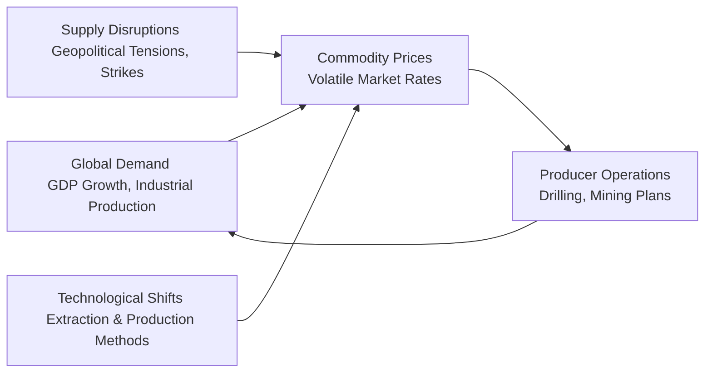
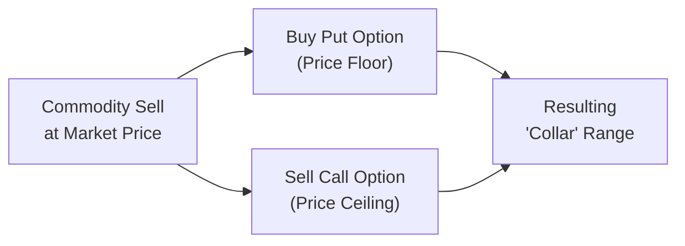

## Introduction

If you've ever watched crude oil prices swing up and down like a rollercoaster—or tracked the sudden peaks and troughs in copper or gold—you already have a glimpse of the intense volatility that extractive industries confront every day. Resource extraction companies (think oil, gas, and mining firms) operate in a climate where global macroeconomics, geopolitical disputes, and supply disruptions can make yesterday’s plan fundamentally incompatible with tomorrow’s market. And let me tell you, from personal chats with friends in the drilling industry, these twists and turns can wreak havoc on daily operations and strategic decisions.  

In this section, we’ll delve into how resource extraction firms manage the risk of drastic price fluctuations. We’ll discuss popular strategies (like forward contracts, swaps, and collars) that help these firms stabilize their revenue. We’ll also touch on the complications—sometimes big ones—such as the dangers of “overhedging” and the complexities of integrated risk management in a multinational context. While earlier discussions in Section 5.2 (Commodities and Commodity Derivatives) introduced the foundational products and supply-demand dynamics of commodity markets, in this text we’re placing special emphasis on the unique vantage of producers who physically extract resources from the ground and face perpetual uncertainty about future selling prices.

By the end of this article, you should be able to:  
• Recognize why volatility in oil, gas, and minerals can get far more extreme than in many other sectors.  
• Identify common financial hedging instruments—options, swaps, forwards—and how they're used to stabilize cash flows.  
• Understand the synergy between risk management, stable project financing (especially from lenders), and capital expenditure (capex) planning.  
• Evaluate the pitfalls of overhedging and how that can turn a prudent risk management approach into a speculative fiasco.  
• Appreciate the nuances of integrated risk management solutions, plus the credit and logistical constraints in hedging markets.  

## Volatility Drivers in Extractive Industries

Resource extraction industries thrive (or suffer) on the prices of underlying commodities—be it crude oil, natural gas, gold, copper, or lithium. Although other sectors also deal with price fluctuations, very few experience the magnitude of volatility that these commodities undergo. Let’s unpack a few of the key drivers:

• Global Macro Shocks: Natural resource outputs are heavily influenced by macroeconomic variables like GDP growth, interest rates, and even currency exchange shifts. A global slowdown can depress energy demand and metals consumption, leading to steep price declines. Conversely, supply bottlenecks or strong economic expansions often cause price spikes.

• Geopolitical Tensions: Sanctions, trade wars, or regional conflicts directly impact supply lines. For instance, in the oil sector, tension in major exporting regions can tighten global supply practically overnight, sending prices soaring.

• Technological Advancements: Innovations in extraction, such as fracking for shale oil, can unleash substantial new supplies and overhaul market expectations, creating a new wave of downward price pressure.

• Environmental and Regulatory Constraints: Changes in environmental policies or carbon taxes can affect extraction costs and shift the relative competitiveness of various energy sources.

Below is a conceptual diagram to illustrate a simplified cycle of factors that can escalate commodity price volatility:

Notice how producers are caught in the middle, needing to plan long-term capital projects in a market that can change abruptly. These realities make risk management—especially hedging—a vital part of operational strategy.

## Key Hedging Instruments and Strategies

Producers usually rely on a mix of forward contracts, swaps, and options-based strategies to reduce exposure to price volatility. As we saw in earlier discussions of commodity hedging (in Section 5.2), each technique comes with unique features, advantages, and trade-offs. Let’s summarize three major approaches:

### Forward Sales

A forward sale contract enables a producer to lock in a future price for a certain quantity of the commodity. By setting that price, the producer removes uncertainty about revenue from that volume. If actual market prices fall below the forward rate, the producer benefits from the hedge. But if prices rise above the forward rate, the producer forgoes any upside. 

• Advantages:  
  – Straightforward to set up  
  – Often customized for quantity and delivery timing  
  – Provides complete price certainty  

• Disadvantages:  
  – No upside participation beyond the forward rate  
  – Potential counterparty risk if the buyer defaults  
  – Settlement timing must align with actual production

### Swap Agreements

Swaps are agreements where two parties exchange (or “swap”) cash flows—commonly, one fixed rate (the agreed-upon commodity price) for floating (the spot market price). An oil producer, for instance, can receive a fixed price per barrel and pay the floating market price, effectively locking in an average sale price.

• Advantages:  
  – Typically more flexible than rigid forwards  
  – Excellent for ongoing hedge programs (multiyear coverage)  
  – Settlements are often net cash payments rather than physical delivery  

• Disadvantages:  
  – Full forfeiture of upside if the market spikes  
  – Requires robust credit support from both parties, especially for long-dated swaps  
  – Mark-to-market swings can trigger margin calls

### Collar Strategies

A collar strategy combines buying a put option (giving the producer a price floor) and selling a call option (imposing a price ceiling). Collars set a band within which the producer’s realized price will land, balancing premium costs and revenue certainty.

• Advantages:  
  – Provides downside protection without a big upfront premium (the call option sale offsets most or all of the put’s cost)  
  – Allows some limited upside participation, albeit capped at the call strike price  

• Disadvantages:  
  – If market prices exceed the call strike significantly, the producer misses out  
  – The structure can become complex if multiple options are stacked or continuously rolled  
  – Managing option exercise/assignment details takes sophisticated treasury oversight  

You can visualize a simplified collar structure in the diagram below. The producer’s net revenue is capped at a predetermined price ceiling and protected by a price floor:

A collar is analogous to wearing a seatbelt plus a helmet: you guard against catastrophic price drops but also limit your potential windfall if prices rally strongly.

## Risk Management Objectives and Lender Feasibility

A resource extraction firm’s approach to hedging is often shaped by more than just the CFO’s desire for stable earnings. In many cases, **Reserve-Based Lending (RBL)** agreements with banks or other financiers require hedging a portion of production to ensure that debt obligations can be met—even if commodity prices crash. By locking in a minimum cash flow via hedges, producers assure lenders of their ability to service loans and fund operational expenses.

Stable cash flows also improve project feasibility. Large capital expenditures, whether to drill new wells or expand mining capacity, rely on revenue predictability. If you’re building a billion-dollar copper mine, you want to ensure you can cover principal, interest, and other obligations—regardless of commodity spot price gyrations. 

Thus, hedging is not purely a matter of corporate preference; it can be a mandated or heavily endorsed practice by creditors, especially for new or highly leveraged projects.

## Overhedging: When Good Intentions Go Wrong

While it’s tempting to think, “If some hedging is good, then more hedging must be better,” that logic can backfire if production volumes fall short of expectations. Overhedging, or hedging more output than you actually produce, is particularly dangerous. For example, if a mining operation faced unexpected shutdowns due to technical malfunctions or labor strikes, it might not have enough physical production to settle the forward or swap commitments. Instead of “locking in” a favorable price, the firm ends up closing the short positions in the open market—potentially at very unfavorable prices.

In other words, **overhedging** can transform a prudent risk management technique into a speculative position. The firm effectively bets that it will produce a certain volume—and if that bet is lost, the hedges themselves become a source of losses.

A friend once recalled how his company’s attempt to be extra cautious turned into a near-disaster. They had locked in more output than they could realistically bring to market, only to have unplanned maintenance break down one of their sites. Not only did they miss out on higher spot prices later, but they also had to swallow significant hedge settlement losses when they failed to deliver the originally pledged quantities. That’s the classic cautionary tale.

## Integrated Risk Management Solutions

The challenges in the resource sector go well beyond commodity price risk alone. Multinational producers may face currency exposure (e.g., receiving revenue in U.S. dollars but incurring local costs in other currencies), plus interest rate risk on loans. An **Integrated Risk Management** approach involves aggregating risk exposures—not just commodity price risk, but also foreign exchange, interest rate, logistical, and operational risks—into a single framework.

Imagine an energy company that produces oil in a country with a different local currency, finances the project with U.S. dollar loans, and must pay royalties in euros (just as a hypothetical scenario). By combining hedge programs that address commodity, currency, and interest rate fluctuations, the firm can achieve a “portfolio hedge” that truly stabilizes overall net cash flows.

Additionally, integrated risk management often includes robust forecasting models (projecting well performance or mining yields) coupled with **Credit Liquidity Lines** to handle margin calls. If derivatives positions move against the firm, it needs ready access to cash or collateral to maintain the hedges. These liquidity lines help prevent a liquidity crunch from compounding the original market risk.

## Capacity Constraints in Hedging Markets

Large producers (think major oil companies or mining giants) can be so big that their hedge transactions affect the forward or derivatives markets for that commodity. If they try to lock in billions of dollars’ worth of production, the sheer volume can push up or down forward prices, depending on whether they’re predominantly selling or buying in the derivatives space. 

When a single entity’s hedging programs are that big, they often distribute these transactions across multiple counterparties to share the credit exposure and avoid crowding out a single swap dealer’s capacity. Doing so reduces the chance of paying a premium due to the market maker’s limited risk appetite. But coordinating those relationships is no small feat. A large resource firm might maintain dealing lines with numerous banks and commodity traders, each requiring careful negotiation of credit limits, collateral thresholds, and enforceable legal documentation (ISDA Master Agreements, for instance).

## Credit Risk Management in Hedging

An underappreciated aspect of hedging is the possibility that one’s counterparty might default when a position becomes profitable. With **long-dated derivatives**, the time horizon only amplifies the importance of credit relationships. If your swap partner can’t pay when spot prices collapse (and you’re due a big settlement), your hedge is worthless. That’s why producers commonly:

• Diversify hedge counterparties  
• Require daily margining to limit counterparty credit exposure  
• Include credit triggers in bilateral agreements (e.g., if the counterparty’s credit rating drops below investment grade, the producer can terminate or call for extra collateral)

Producers subject to banking covenants are also expected to watch their own credit metrics. The symmetrical nature of margin calls means that if the market moves adversely, the resource firm must post collateral. Without adequate liquidity management, a well-intentioned hedge can create a crisis if the firm has insufficient cash for margin calls.

## Treasury and Trading Divisions: The Operational Backbone

To keep hedging from becoming an “off-the-cuff” activity, many resource extraction companies invest heavily in treasury and trading infrastructure. A well-organized treasury team ensures compliance with corporate governance, monitors derivative exposure, coordinates with production forecasts, and manages relationships with external brokers and banks.

Key responsibilities for treasury and trading divisions often include:  
• Constantly updating production estimates and adjusting hedge positions accordingly  
• Coordinating the timing of new hedges, rollovers, or unwinding of old hedges  
• Ensuring alignment with corporate strategy (e.g., how much upside is the company willing to give up?)  
• Handling the legal and administrative aspects of multiple ISDA agreements  

Many large energy firms build entire floors dedicated to commodity trading, financial derivatives, and risk analytics. Medium-sized firms rely on specialized desks or external advisors. Regardless of size, the goal is the same: transform a potentially chaotic marketplace into a structured environment where management can plan around stable or at least predictable cash flows.

## Practical Example: Oil Producer with a Multinational Footprint

Picture an international oil-and-gas firm operating fields in Country A (where they’re receiving revenue in U.S. dollars) and paying taxes/royalties in Country B’s local currency. They have ongoing capital expenditures denominated in euros because that’s where their primary contractors are located, and their debt is floating rate, pegged to LIBOR (or a post-LIBOR benchmark, such as SOFR).

In an integrated risk management setup, the firm might:

• Enter a swap to convert floating interest payments to fixed, reducing interest rate volatility.  
• Implement a partial collar strategy on a portion of their oil production to ensure that, at minimum, they receive $60 per barrel (floor) while capping upside at $80 per barrel.  
• Buy currency forwards or options on the local currency to manage tax obligations, ensuring that a depreciation of the U.S. dollar doesn’t wreck their financials.  
• Secure a standby credit facility (a line of credit) to cover margin calls if the derivative positions become negative mark-to-market.  

All these actions, combined, allow management to sleep a bit better at night. Nothing in life is guaranteed, of course, but integrated solutions keep the firm’s net operating cash flow within a forecastable band—helping them handle expansions, dividends, and debt service without nasty surprises.

## Best Practices

• Align Hedging with Production Forecasts: Regularly update technical estimates of reserves and short-term extraction capacity to avoid the risk of overhedging.  
• Diversify Counterparties: Limit concentration risk by spreading trades across multiple financial institutions, each with robust credit ratings.  
• Use Realistic Price Assumptions: Stress-test scenarios that go beyond “average” or “expected” price moves, especially for black-swan events in commodity markets.  
• Monitor Collateral and Liquidity: Maintain **Credit Liquidity Lines** and track margin exposure daily to avoid forced unwinds at unfavorable times.  
• Maintain Transparent Governance: Ensure the board and executive teams are aware of the hedging policy and risk limits. Regular audits and compliance with professional standards (e.g., GIPS and the CFA Institute Code of Ethics) help prevent misconduct or hidden speculative bets.  

## Exam Tips for Level I Candidates

• Focus on Differentiating Hedges: Understand the mechanics of forward contracts, swaps, and option strategies. Know how each instrument impacts a firm’s upside and downside exposure.  
• Overhedging Implications: Be ready to explain how overhedging can turn a risk-management strategy into speculative positions. This concept is a frequent exam question scenario.  
• Integrated Risk Principles: You’re not only dealing with commodity pricing—currency, interest rate, and operational exposures often appear in exam vignettes.  
• Calculations: Practice basic payoff calculations. For example, how do you compute net revenue if the spot price ends up at $70 but a collar is in place with floor $60 and ceiling $65?  
• Credit and Counterparty Risk: Make sure you can identify key credit risk mitigants—margining, collateral, netting agreements—especially for longer-duration derivatives.  
• Application in Lender Feasibility: Recognize how lenders require producers to lock in minimum revenue streams. In exam questions about capital structure or project feasibility, hedging references often appear.  

Try to anticipate scenario-based prompts. For instance, you may get a question about a producer forced into a hedge due to RBL covenants or one analyzing the cost/benefit trade-off of a collar strategy versus a swap.

## References and Further Reading

• Fusaro, Peter C., “Energy Risk Management: Hedging Strategies and Instruments for the International Energy Markets.” This text provides a great deep dive into typical hedging products for the energy sector.  
• The International Swaps and Derivatives Association (ISDA) resources: www.isda.org — for standard agreements and best practices in credit risk mitigation.  
• Chapter 5.2 (Commodities and Commodity Derivatives) of this volume for background on futures, options, and the fundamentals of commodity trading.  

--------------------------------------------------------------------------------

## Test Your Knowledge: Volatility and Hedging in Resource Extraction



### Which factor most commonly contributes to significant price volatility in the extractive industries?

- [ ] Consistent consumer demand for finished goods
- [ ] Predictable global GDP growth
- [x] Geopolitical tensions and supply disruptions
- [ ] Stable interest rates and currency environments

> **Explanation:** Oil, gas, and minerals are highly sensitive to geopolitical events, such as regional conflicts or trade barriers, which can significantly impact production or transportation, causing large price swings.

### Which of the following describes a swap arrangement for a resource extraction company?

- [ ] A physical delivery agreement where the producer must ship its output directly to the swap counterparty
- [x] An exchange of cash flows, where the producer receives a fixed price and pays a floating market price
- [ ] A transaction only involving call options
- [ ] A margin account funded by a syndicated loan

> **Explanation:** A commodity swap typically involves the producer swapping floating price risk for a fixed price inflow. Rather than exchanging physical barrels, it’s generally a cash settlement mechanism.

### What is a primary advantage of using a collar strategy instead of a standard forward contract?

- [ ] It guarantees a fixed selling price with no upside or downside risk.
- [x] It can provide a price floor while still allowing some (limited) upward price participation.
- [ ] It only requires the sale of a call option without any additional trades.
- [ ] It eliminates the need for margin calls entirely.

> **Explanation:** The collar strategy combines buying a put option (price floor) with selling a call option (price ceiling). This ensures downside protection and some upside potential, albeit capped at the call strike.

### Why might a bank require a producer to hedge a portion of its production under a Reserve-Based Lending (RBL) agreement?

- [x] To ensure the producer can meet debt obligations even if commodity prices fall significantly
- [ ] To allow the producer to engage in speculative positions for higher returns
- [ ] To minimize the credit spread the bank charges on the loan
- [ ] To promote supply chain transparency

> **Explanation:** Lenders often demand hedging to guarantee a minimum cash flow level, ensuring debt service obligations are met under adverse price scenarios.

### Which risk is a producer exposed to when it overhedges?

- [ ] Excessive upside gains on spot market sales
- [ ] Reduced production costs
- [x] The possibility of having to buy back deficits at higher spot prices if production falls short
- [ ] No chance of operational downtime

> **Explanation:** Overhedging locks in sales for volumes the company might not actually produce. If actual production is lower than the hedged volume, the shortfall must be covered in the spot market at potentially adverse prices.

### In an integrated risk management approach, what additional risks might a resource extraction firm hedge besides commodity price risk?

- [x] Currency exposures and interest rate fluctuations
- [ ] Only credit default swaps
- [ ] Consumer product warranties
- [ ] Corporate social responsibility metrics

> **Explanation:** Integrated risk management looks at the firm’s entire risk profile, including FX risks (if revenue/costs are in different currencies) and interest rate exposure (if floating-rate debt is involved).

### Which best practice helps minimize counterparty credit risk in hedging transactions?

- [x] Using multiple counterparties and daily margining requirements
- [ ] Entering only shorter-dated forward contracts
- [ ] Avoiding all ISDA Master Agreements
- [ ] Opting for uncollateralized positions to maintain greater liquidity

> **Explanation:** Producers often diversify counterparties and implement margining with collateral to mitigate credit risk. This ensures timely settlement if one counterparty’s credit position deteriorates.

### A large multinational producer wishes to stabilize cash flows from oil production but also has floating-rate debt denominated in euros. What combined hedge structure might they employ?

- [ ] Sell oil futures only
- [ ] Purchase only currency forwards
- [x] Use a collar for oil prices, plus an interest rate swap to fix floating debt payments
- [ ] Engage in short selling of their own company stock

> **Explanation:** By using a collar to manage commodity price risk and an interest rate swap to convert floating payments to fixed, the producer combines commodity and interest rate hedges, addressing both exposures.

### Why do large producers often require multiple counterparties to fulfill their hedge needs?

- [ ] Because regulators only allow four trades per counterparty
- [x] To avoid overconcentration of credit risk and prevent moving the forward market too heavily in one direction
- [ ] To comply with OPEC mandates
- [ ] Because smaller counterparties never accept standard ISDA terms

> **Explanation:** Huge hedging volumes can exceed the capacity or risk appetite of a single counterparty. Splitting the hedge among multiple providers spreads credit risk and avoids massive distortions in the forward pricing.

### True or False: Overhedging always leads to beneficial outcomes by guaranteeing a higher locked-in selling price than the market might provide.

- [ ] True
- [x] False

> **Explanation:** Overhedging can backfire if production shortfalls force the company to close derivative positions at unfavorable prices—potentially generating large losses rather than gains.


