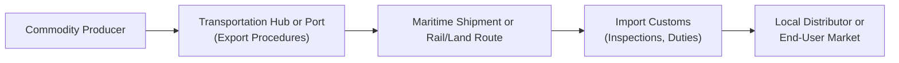

## Introduction

Let’s be honest: moving commodities from one country to another—be it oil, grains, or produce—can sometimes feel like you’re juggling flaming torches while riding a unicycle. Everything has to stay in sync. Even a slight glitch at a single port or border can set off a domino effect, ultimately delaying shipments and raising pushy questions about cost overruns, spoilage, or missed sales windows. In this section, we’re going to walk through the tangled world of cross-border logistics and transportation risks: how they creep into the supply chain, how they affect commodity pricing, and some cool ways to manage or hedge those pesky uncertainties.

## Understanding Cross-Border Supply Chain Dynamics

Cross-border transportation underpins global commodity markets. Energy resources, metals, or agricultural products don’t simply appear in your local warehouse. They traverse oceans, pass through fragile pipelines, roll along rail tracks in remote regions, and wind up crossing highways that might have questionable security. For instance, maybe you’ve seen in the news how farmland owners in one country rely on specialized fertilizer from thousands of miles away. That whole route is an enormous puzzle of shipping schedules, insurance coverage, and risk management measures.

It might help to visualize a simplified sequence of events for a typical cross-border commodity flow:

This is the basic chain of custody for many goods. At each stage, there are potential disruptions—ranging from logistical bottlenecks to pirate activity—just waiting to trip you up.

## Potential Disruptions Along the Way

You might wonder, “What could possibly go wrong here?” The short answer: quite a lot. Let’s look at common disruptions:

• Port Strikes: When dockworkers and port authorities can’t see eye to eye, you might end up watching ships wait offshore for days—sometimes weeks—while your cargo is stuck at sea.  
• Pirate Activity: While it sounds dramatic, pirate attacks in certain hot spots (e.g., parts of the Indian Ocean or Gulf of Guinea) can lead to additional insurance costs, re-routing, and general unrest for shipping lines.  
• Customs Clearance Delays: Strict documentation rules or a jam-packed port can delay even legally compliant shipments, intensifying delivery risk and raising direct costs.  
• Trade Embargoes: Government-issued trade embargoes are effectively a blockade on goods traveling to or from specific nations. If your chosen shipping route crosses embargoed territories, you might need a new route fast.  
• Logistical Bottlenecks: Equipment issues, capacity constraints, or even bad weather can limit how quickly goods move.  
• Political Instability: In countries that experience abrupt leadership changes or internal conflict, commodity movement can grind to a sudden halt.

All these hazards show up in the cost structure of the final delivered commodity price. Importers or producers typically pass them on to end users if demand is strong enough.

## The Cost Structure of Maritime Shipping

Maritime shipment often sets the tone for cross-border logistics costs, especially for large-volume commodities. Costs typically include fuel (bunker) expenses, freight rates, and vessel charter rates:

• Fuel (Bunker) Prices: Fluctuations in oil prices directly affect how expensive it is to operate ships. Bunker fuel can represent a substantial chunk of operating costs, and any surge usually means higher freight charges or “bunker surcharges.”  
• Freight Rates: These can be spot rates or longer-term contract rates. They respond to supply-and-demand conditions in global shipping. For instance, if there’s a massive harvest in South America plus a strong global demand for soybeans, freight rates might spike.  
• Vessel Charter Rates: If shipping firms don’t own their vessels, they might lease them from owners. Charter rates can vary by vessel type (e.g., dry bulk carriers or tankers) and route, impacting total transportation expense.

The combined effect of these cost drivers influences how commodity producers set export prices. One simple approach to landed cost might look like this:


P_{\text{landed}} = P_{\text{origin}} + \text{Freight Cost} + \text{Insurance} + \text{Tariffs/Duties}


where freight cost includes fuel, crew expense, charter rates, storage fees, and more. It’s not unusual for major swings in fuel prices or shipping capacity to drastically alter the profitability of an export deal.  

## Containerization and Cold Chain Logistics

Ever wonder how fresh salmon from the North Atlantic ends up in grocery stores halfway across the globe, still looking appetizing? The marvel of containerization and cold chain logistics keeps perishable goods, like fruits, vegetables, or even sensitive pharmaceuticals, in carefully regulated temperatures. Cold chain logistics is a temperature-controlled supply chain that prevents spoilage and maintains product quality.

This approach has been a game-changer for commodities with short shelf lives because it reduces waste (and potential revenue losses). Containerization also cuts down on cargo handling times, lowers labor costs, and lowers damage risk. Companies might utilize special reefer containers that carefully monitor and maintain cold conditions. Of course, reefer containers are more expensive to run and maintain, so the economics must be weighed carefully. But the upshot is that market participants can reach global customers without having to worry (too much) about produce spoiling in a sweltering cargo hold.

## Foreign Exchange Risk and Capital Controls

When working across borders, you’re inevitably dealing with different currencies. Let’s say you’re buying grains from a farm cooperative in Canada, shipping it via a seaport in Vancouver, and selling it to a food processor in Japan. You’ll probably have costs denominated in Canadian dollars (fuel, trucking, maybe partial labor), pay your shipping line in U.S. dollars, then get paid in Japanese yen. Whew, that’s a tall order.

Foreign exchange volatility can quickly erode profit margins if you’re on the wrong side of an exchange rate swing. Plus, some countries impose capital controls that might make it difficult (or expensive) to convert local currency back to your home currency. In worst-case scenarios, currency inconvertibility can freeze you out of accessing profits. Think of foreign exchange (FX) forward contracts or currency swaps as potential hedging solutions, but always with an eye on local regulatory constraints.

## Shipping Derivatives (Forward Freight Agreements)

Not only can you hedge FX risk, you can also hedge shipping cost risk. One popular tool is a Forward Freight Agreement (FFA). It lets you lock in freight rates for a specific route and timeframe, mitigating the exposure to big rate swings. FFAs are settled against recognized freight benchmarks or indices specific to major shipping routes. For some, these derivatives feel a little out there—like you’re hedging the intangible cost of a boat ride in the future. But if your business model hinges on stable shipping costs, it’s a powerful risk management tool.

In addition to FFAs, you might see freight option contracts that give you the right—but not the obligation—to lock in a freight rate. Commodity producers and shipping companies often use these hedges to smooth out earnings and ensure stable shipping margins.

## Planning for Political Instability and Regulatory Shifts

When you’re dealing with cross-border shipments, your best-laid plans can go sideways if local regulations change abruptly. Take, for example, a government that decides to impose a fresh export tax on palm oil to bolster domestic supply. If your entire shipping schedule and profit calculations hinged on a no-tax scenario, you might be forced to reroute or reduce volumes. Or, sometimes, a new administration might roll back existing agreements, triggering the dreaded trade embargo or new tariffs.

We’ve also witnessed pipeline shutdowns due to community protests or local disputes. If you’re shipping crude via pipeline, a sudden closure is the last thing you want to see. Thus, building solid contingency plans and diversifying shipping routes is crucial.

## Insurance Coverage in Cross-Border Logistics

Insurance is one of those things that you hope you’ll never need but absolutely must have. For cross-border commodity movements, three major categories stand out:

• Marine Cargo Insurance: Protects goods against loss or damage over waterways. It often covers perils like storms, collisions, or in some cases even jettison (tossing cargo overboard in an emergency).  
• Political Risk Insurance: Covers losses from events like war, expropriation of assets, or currency inconvertibility. If you operate in a region where political instability is a real possibility, you might want this.  
• Trade Credit Insurance: Shields sellers against non-payment risk if buyers default or end up in financial trouble.

Slight expansions to typical “all-risk” or “named peril” policies can cover threats like pirate attacks, but you’ll want to comb through policy language carefully. Many shipping companies also abide by “Vessel Charter Party” contracts that specify the rights and obligations of both ship owners and charterers. If you’re a charterer, you want to ensure you’re not on the hook for unanticipated repairs or rerouting costs.

## Real-World Anecdote: The Shortage of Containers

A couple of years ago, shipping containers were in short supply due to pandemic-driven disruptions. That shortage sent freight rates to unprecedented highs—sometimes triple or quadruple their previous levels. Importers of agricultural goods in emerging markets felt the squeeze: they had to pay well above normal rates to secure limited containers. In many cases, it made certain export opportunities unprofitable because paying for transport ate up all the margin. This highlights the reality: cross-border shipping risk is not just about hijackings or strikes—it can be a simple supply-demand imbalance that leads to inflated costs, delayed shipments, and big bottom-line impacts.

## Best Practices and Pitfalls

• Build Redundancies: Relying on a single highway or rail route is rarely ideal. Multiple shipping lanes and diverse transport modes can reduce concentration risk.  
• Inspect Documentation Thoroughly: A missing certificate or mislabeled bill of lading can stall cargo for days at customs.  
• Maintain Flexible Contracts: Sometimes it’s worth paying for a more flexible vessel charter or shipping contract, especially if you suspect big rate swings ahead.  
• Understand Cabotage Laws: Certain countries restrict domestic transport to local carriers. Don’t assume you can freely operate foreign-flagged ships within certain territorial waters.  
• Stay Updated on Political Developments: Policy changes, new trade agreements, or instability can require last-minute re-routing. Keep that intelligence flow going.

In practice, it’s about constant vigilance. Commodity markets can punish those who don’t plan their shipping logistics well, especially when perishable goods are involved. Spoilage can erode not only your margins but your reputation.

## Conclusion and Exam Tips

Cross-border logistics and transportation risks matter a lot when you’re analyzing natural resource investments. Whether you’re a portfolio manager evaluating shipping companies or an analyst assessing an agricultural exporter’s cost structure, you need to appreciate how disruptions in the supply chain can ripple through commodity pricing.

• Stay flexible in contract terms—look for shipping derivatives in markets with historically high freight rate volatility.  
• For test scenarios, remember to incorporate potential shipping delays or cost overruns into final commodity pricing.  
• Double-check your assumptions around insurance coverage, because coverage gaps are a common pitfall in exam questions and real-life scenarios.  
• Keep political and regulatory dynamics at the forefront of any forecasting or scenario analysis.  

On the exam, you might be asked how to hedge shipping rate risk, or how a new tariff influences the net profit for a commodity exporter. Also watch for real-life-inspired vignettes featuring port strikes or currency inconvertibility constraints—it’s all fair game.

## References and Further Reading

- “International Maritime Transport Costs” by OECD iLibrary  
- BIMCO (Baltic and International Maritime Council) documents on standard shipping contracts and clauses:  
  https://www.bimco.org/  
- CFA Institute, Reading on Risk Management and Derivatives  
- OECD and IMF Working Papers on Cross-Border Trade and Infrastructure  

-----

## Test Your Knowledge: Cross-Border Logistics and Transportation Risks



### A commodity producer is worried about potential increases in shipping rates. Which financial instrument can be used to hedge freight rate fluctuations?

- [ ] A currency forward contract
- [x] A Forward Freight Agreement (FFA)
- [ ] A commodity futures contract on the product itself
- [ ] A simple interest rate swap

> **Explanation:** An FFA is specifically designed to hedge freight rate exposure on particular shipping routes.

### Which of the following is most likely to cause delays due to documentation errors?

- [ ] A pipeline rupture
- [x] Customs clearance
- [ ] Fuel price changes
- [ ] Excessive charter rates

> **Explanation:** Customs clearance is susceptible to hold-ups if shipping documents (e.g., bills of lading, invoices) contain errors or omissions.

### An exporter of perishable fruits is evaluating different methods to maintain quality during transport. Which approach is likely most effective?

- [ ] Only shipping during cooler months
- [ ] Using small open-top containers
- [ ] Packing fruits in loose crates without ventilation
- [x] Employing cold chain logistics with reefer containers

> **Explanation:** Reefer containers in a temperature-controlled system help prevent spoilage and maintain produce quality over long distances.

### In cross-border trade, which additional risk might arise if a purchase agreement is denominated in a foreign currency?

- [ ] Crew wage risk
- [x] Foreign exchange risk
- [ ] Container availability risk
- [ ] Overinsuring the cargo

> **Explanation:** When deals are priced in foreign currency, fluctuations in exchange rates can create profit or loss that is separate from core operational margins.

### What is the likely impact of increased piracy incidents on shipping routes?

- [x] Higher insurance premiums and possible route diversions
- [ ] Lower charter rates due to reduced demand
- [ ] Immediate government subsidies for shipping firms
- [ ] Automatic embargo on those routes

> **Explanation:** Pirate activity drives up insurance costs (e.g., war risk premiums) and often forces shipping lines to reroute to safer waters, both of which can increase overall costs.

### An oil producer relies on a pipeline that crosses multiple countries. Which type of risk insurance could be vital in case a government expropriates or halts pipeline operations?

- [ ] Cargo damage insurance
- [ ] Collision liability insurance
- [x] Political risk insurance
- [ ] Charter default insurance

> **Explanation:** Political risk insurance covers losses arising from government actions like expropriation or regulatory shutdowns in foreign jurisdictions.

### In times of container shortages, how are freight rates generally affected?

- [ ] They remain unchanged due to government regulation
- [ ] They often decline, as shipping companies lower prices to attract business
- [x] They typically rise because demand for containers exceeds supply
- [ ] They are unaffected, as container availability has no bearing on pricing

> **Explanation:** Container shortages drive demand for limited capacity, increasing freight rates.

### Which strategy best helps to mitigate risks associated with a single highway or rail line getting blocked?

- [ ] Exclusively using the cheapest shipping route
- [x] Diversifying shipping routes and transportation modes
- [ ] Relying on just-in-time inventory methods
- [ ] Dropping insurance coverage to cut costs

> **Explanation:** Having multiple options (sea, rail, road) reduces the negative impact of a bottleneck or blockage in any one mode.

### When planning cargo insurance, which peril is usually not covered under standard marine cargo insurance without additional riders?

- [ ] Storms at sea
- [x] Pirate attacks
- [ ] Cargo lost from a ship collision
- [ ] Goods washed overboard in a storm

> **Explanation:** Standard marine cargo insurance typically excludes piracy, though specialized add-ons (“war risk” coverage) can address it.

### True or False: Trade embargoes are simple guidelines set by shipping companies to avoid expensive routes and are not government-enforced.

- [ ] True
- [x] False

> **Explanation:** Trade embargoes are government orders restricting or banning trade with specific nations. They are not mere suggestions by shipping lines.


