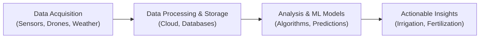

## Overview

Data analytics is changing the game for natural resource investments, especially in agriculture and timberland. Instead of just getting a feel for the soil, we’re now using satellites, drones, machine learning, and advanced metrics to squeeze every drop of potential out of our fields and forests. And you know what? It’s pretty exciting. It reminds me of a friend of mine, a timberland investor, who started using drone imagery to detect disease outbreaks early—she cut losses by 30% in a single season just by tackling the problem before it got out of hand. In the context of alternative investments, these data-driven approaches can significantly enhance yield and manage risks more effectively.

Below, we’ll explore how these technologies work and how they fit into yield enhancement strategies, including:

• The use of big data, analytics platforms, and precision tools to improve yield while reducing waste.  
• Remote sensing, including drones and satellites, for real-time monitoring of crop and forest conditions.  
• Machine learning techniques to optimize planting schedules, fertilization, and disease control.  
• Blockchain and IoT sensors to achieve traceability and ensure compliance with certifications.  
• Potential for underdeveloped markets to catch up through better access to technology and financing.  
• Pitfalls around data privacy, user training, and access to capital.

Throughout, we’ll consider how these developments are relevant to CFA® candidates and professionals looking to round out their understanding of alternative investments in the agricultural and natural resources space.

## Big Data and Precision Tools in Agriculture and Timberland

Big data is about collecting massive amounts of information from multiple sources—soil sensors, weather forecasts, satellite images, commodity prices—and then analyzing them to make better decisions. Great, so how does this help you, the investor?

Precision tools are advanced technologies (including hardware and software) enabling land managers to micromanage farmland or forest plots on a zone-by-zone basis. Instead of applying one blanket treatment (like a uniform level of fertilizer) across a 1,000-hectare property, these tools make it possible to respond precisely to each micro-area’s needs.

### Key Components of Big Data Analytics

1. Data Acquisition:  
   • Satellites, drones, ground sensors, and manual data entry capture continuous streams of data on soil composition, moisture, temperature, pest activity, and so forth.  
   • Market data, such as commodity prices or forward contracts, is integrated to plan harvest timing.  
   • External datasets (like global or local weather patterns) are layered in for better forecasting.

2. Data Processing and Storage:  
   • Cloud-based solutions store large volumes of structured (rows and columns) and unstructured (satellite images, videos) data.  
   • Robust databases allow easy retrieval and indexing.

3. Analysis & Machine Learning Models:  
   • Machine learning algorithms sift through the data, spotting trends or anomalies.  
   • Predictive analytics can highlight, for example, the expected yield in each micro-zone of farmland.  
   • This step can incorporate real-time feedback—from sensors or user inputs—to hone accuracy.

4. Actionable Insights:  
   • The system may recommend adjusting fertilizer usage in one area, altering irrigation schedules in another, or stepping up pest-control measures in a certain zone.  
   • For timberland, it might suggest optimal harvest windows based on growth rates, maturity levels, and predicted market demand.

Below is a simplified mermaid diagram showing the data pipeline:

## Remote Sensing and Real-Time Monitoring

Remote sensing refers to the process of gathering data about an area without physical contact—think cameras on drones or imaging satellites orbiting overhead. It used to be that farmers walked their fields to check for pests or drought stress. Now, drones can capture high-resolution images while satellites track vegetation indices. In a matter of hours, land managers know exactly where the crops look stressed, if there’s a risk of infestation, or whether the soil is too dry.

• Satellite Imagery:  
  – Provides broad coverage for large holdings.  
  – Updated frequently (some constellations provide near-daily images).  

• Drone Surveys:  
  – Offer highly granular data; can fly lower to detect subtle issues, such as early signs of fungal infection in a timber stand.  
  – Potentially cost-effective for medium-sized farms.

In advanced farmland REITs or private funds, these remote sensing tools cut down on “management by walking around” time while boosting precision. The real-time nature of the data also supports dynamic decision-making—like applying extra irrigation exactly when needed.

## Machine Learning for Forecasting and Optimization

Machine learning is that shiny buzzword that can sometimes be overhyped, but it definitely has legitimate applications in natural resource investing. Let’s break it down:

• Weather Pattern Analysis:  
  – Models ingest historical and real-time weather data to predict rainfall, temperature, and even the likelihood of hail or frost events.  
  – Timely insights can guide farmers to choose the best planting date or help orchard owners schedule pesticide application ahead of expected rainfall.

• Commodity Price Prediction:  
  – By analyzing supply and demand fundamentals, news sentiment, and historical patterns, machine learning models suggest optimal times to market produce or contract harvests.  
  – This helps reduce certain market risks and improve net returns.

• Yield Optimization:  
  – ML systems can pick up patterns in how harvest yields vary with soil conditions, seed variety, fertilization schedules, etc.  
  – The more data you feed them, the more they can fine-tune recommendations—like a personal farm assistant that learns from each season.

For a practical example, a farmland manager might run an ML-based simulation of different planting densities. Perhaps the model indicates a 5% yield increase is possible if they plant slightly more seeds per acre and apply a particular organic fertilizer at a certain stage. Because these decisions can be tested in a virtual environment first, managers can mitigate the cost of trial-and-error in real operations.

## Predictive Maintenance in Timberland

If you’ve ever seen entire sections of forest decimated by blight or insect infestations, you know how costly these events can be. Predictive maintenance is about anticipating problems before they blow up. For timberland investors:

• Disease and Infestation Detection:  
  – Drone-based multispectral imaging identifies stressed trees faster than the human eye alone.  
  – Early detection means targeted treatment, reducing spread and cost.

• Optimal Harvest Timing:  
  – Detailed growth models combine local weather data, species-specific growth curves, and current market prices to indicate the best window for harvesting.  
  – This might sound a bit like art, but with the new data tools, it becomes more of a science.

• Quality Control and Sorting:  
  – Infrared scanners can measure wood quality (moisture content, structural integrity) before milling.  
  – Reduces guesswork, enabling mills to pay a premium for consistently high-quality logs.

## Blockchain and IoT Sensors for Traceability

Blockchain might be a “buzzword” you associate with crypto, but in agriculture, it can be used for something as mundane (yet critical) as verifying the authenticity of an organic label. IoT devices track each step in the production process: from seed sources to harvest conditions, to storage and transportation. Each shipment is recorded on the blockchain ledger, creating a chain of custody that’s nearly tamper-proof.

Once data is on-chain, it’s accessible to end-buyers who want evidence that the coffee they’re buying is indeed single-origin or that their produce is fair-trade certified. This can open premium market slots. Consider a small example: a coffee plantation in Central America that invests in IoT sensors and blockchain traceability might attract socially responsible investors (ESG funds) or direct buyers willing to pay a higher price for a guaranteed traceable product.

## Precision Irrigation and Variable Rate Application (VRT)

One of the coolest developments in farmland is the ability to deliver water and nutrients only where and when they’re needed. Precision irrigation uses real-time soil moisture data, historical evapotranspiration rates, and weather forecasts to apply the perfect amount of water. No more guesswork, no more pointless water usage. In some water-scarce regions, this is not just a cost-saving measure—it’s an operational necessity.

VRT (Variable Rate Technology) means adjustable nozzles and spreaders that change application rates, either automatically or semi-automatically, as machinery travels across the field. You might see a combine “knowing” that one section of the field is nutrient-deficient and so automatically increasing fertilizer spread in that zone. The result: improved yields and reduced resource waste.

## Data Ownership, Privacy, and User Training

Data is invaluable, but who owns it? In many cases, the landowner or operator should explicitly negotiate data rights with service providers to ensure relevant analytics remain in-house. Privacy considerations also arise, especially in areas where personal data laws might apply. As an investor:

• Ensure contractual clarity: If data is collected by a third party, do you retain full ownership? How is it protected?  
• Regulatory compliance: In cross-border deals, data privacy regulations can get complex. For instance, the EU’s General Data Protection Regulation (GDPR) might apply if personal data is tied to specific smallholder farmers.

Another overlooked aspect is the farmer-friendly interface. Fancy data dashboards are meaningless if local farmers or on-ground teams can’t—or won’t—use them. Training and user adoption strategies often determine whether data-driven tools deliver on their promise.

## Underdeveloped Markets and Modernization Potential

Many emerging markets still practice agriculture in a traditional way without access to modern data tools—or even basic financing. Enter the concept of Agri-Fintech Solutions: platforms that, for instance, use yield mapping from prior seasons to estimate creditworthiness. This can facilitate microloans for small-scale farmers in Africa or South Asia, letting them invest in relevant seeds or minimal technology upgrades.

Additionally, bridging the gap in underdeveloped markets isn’t merely about dropping advanced tools into remote areas. You need infrastructure development (improved roads for reliable shipments, stable internet connectivity for IoT, local training centers) and supportive policy frameworks. In other words, yield enhancement strategies can only go so far without the underlying ecosystem.

## Practical Examples and Real-World Scenarios

• Case Study: Drone-Assisted Pest Control  
  – A large farmland in the Midwest found that 20% of its yield loss stemmed from undetected pest infestations. After adopting weekly drone flyovers, the farm reduced that loss to 5%, significantly boosting net income.  

• Case Study: Timberland Growth Monitoring  
  – A Brazilian timber company integrated satellite data with machine learning to predict optimal harvest times for eucalyptus plantations. They increased logs meeting premium-grade standards by 12%, unlocking higher market prices.  

These examples illustrate how data-driven approaches can be a powerful driver of yield enhancement.

## Best Practices, Pitfalls, and Risk Mitigation

• Best Practices  
  – Start small with a pilot project: Don’t deploy advanced analytics across thousands of hectares all at once.  
  – Use integrated platforms: Combining weather, sensor, and financial data in a single analytics tool fosters better synergy.  
  – Encourage local stakeholder engagement: Without buy-in from local managers or farmers, even the best technology fails.

• Common Pitfalls  
  – Over-reliance on technology: Data can guide decisions, but local knowledge remains crucial.  
  – Underestimating data management costs: Ongoing subscription fees, sensor maintenance, and data storage can chip away at returns.  
  – Privacy and compliance: Overlooking legal requirements can lead to lawsuits or reputational damage.

• Risk Mitigation Strategies  
  – Diversify: Pair data-driven farmland with other real assets (like infrastructure or REITs) to manage systemic risks.  
  – Insurance: Insure crops or equipment to offset catastrophic events (hail, floods).  
  – Backup analytics: Maintain older, more conventional processes for cross-checking.  

## Exam Relevance

For CFA Level I candidates—particularly within the Alternative Investments domain—understanding data-driven yield enhancement is crucial. It illustrates how technology and operational improvements can transform real assets. You might see questions in the exam about:

• Identifying key benefits of remote sensing for farmland or timberland.  
• Evaluating how machine learning improves yield forecasting or pricing strategies.  
• Ethical considerations around data privacy and disclosure (potentially linking to the CFA Code of Ethics and Standards of Professional Conduct).  
• The impact of capital improvements on farmland valuations and overall risk-return tradeoffs.

## Final Exam Tips

• Potential Essay Questions:  
  – Practice constructing answers around scenario-based farmland or timberland investments. Emphasize how data tools lead to cost savings or risk mitigation.  
• Time Management:  
  – When tackling item sets about yield enhancement, quickly identify the technology or approach in question (e.g., precision irrigation, ML forecasting). Link it to risk-return implications.  
• Pitfalls in Calculations:  
  – You might be given data about input costs, yield improvements, and market prices. Double-check your calculations for cost-benefit analysis (especially any net present value or internal rate of return scenarios).

## Glossary

• Precision Tools: Advanced technologies enabling a high degree of control and monitoring of farm or forest operations.  
• Remote Sensing: Collecting data about objects or areas from a distance, typically with satellites or aircraft or drones.  
• Machine Learning: A subset of artificial intelligence where algorithms improve through experience (data) without explicit programming.  
• Blockchain Traceability: Using distributed ledger technology to record each transaction in the supply chain, increasing transparency and reducing fraud.  
• IoT (Internet of Things): The network of physical objects (devices, vehicles, sensors) connected to the internet, exchanging data.  
• Variable Rate Technology (VRT): Adjusting resource application rates based on location-specific needs detected by sensors or data models.  
• Yield Mapping: Tracking the quantity of harvest per unit area, often integrated with GPS data.  
• Agri-Fintech Solutions: Digital platforms that provide financial services (loans, insurance) to farmers using data-driven risk analysis.

## References and Further Reading

• Zhang, Qin. “Precision Agriculture Technology for Crop Farming.” Boca Raton: CRC Press.  
• Publications and case studies by the International Society of Precision Agriculture (ISPA): https://ispag.org/  
• Official CFA Institute curriculum readings on Alternative Investments: Focus on farmland, timberland, and ethical guidelines concerning data usage.

----------------------

## Test Your Knowledge: Data-Driven Yield Enhancement in Natural Resources



### 1. Which of the following best describes the role of satellite imagery in agriculture?

- [ ] It replaces IoT sensors entirely to collect real-time data.  
- [ ] It is mainly used for mechanical maintenance of farming equipment.  
- [x] It provides broad, frequent coverage that can monitor large fields for stress or infestations.  
- [ ] It offers philanthropic grants to farmers in underdeveloped markets.  

> **Explanation:** Satellite imagery’s primary advantage is in monitoring large swaths of farmland or timberland, identifying areas of stress, and generating timely data about vegetation health.

### 2. A major advantage of variable rate technology (VRT) in farmland management is:

- [ ] Eliminating the need for fertilizers and pesticides altogether.  
- [x] Applying inputs only where and when they are needed to reduce waste.  
- [ ] Ensuring that all farmer data remains private and secure.  
- [ ] Bypassing local government regulations on resource usage.  

> **Explanation:** VRT adjusts the application rates of fertilizers, pesticides, or irrigation based on location-specific needs, reducing both cost and environmental impact.

### 3. Predictive maintenance for timberland is primarily used to:

- [x] Identify tree diseases or pest infestations early to mitigate losses.  
- [ ] Monitor commodity price changes for lumber products.  
- [ ] Determine farmland planting schedules for major cereal crops.  
- [ ] Develop advanced soil mapping for vineyards.  

> **Explanation:** Predictive maintenance is about detecting potential forest health issues (e.g., disease, pest outbreaks) before they become widespread problems.

### 4. Which statement best characterizes machine learning in the context of yield enhancement?

- [ ] It relies solely on human-coded rules to process data.  
- [x] It identifies patterns in datasets to optimize planting and harvesting decisions.  
- [ ] It is only used for financial derivatives and has minimal application in agriculture.  
- [ ] It cannot operate with real-time sensor inputs.  

> **Explanation:** Machine learning is highly flexible, thriving on large data sets to reveal hidden relationships and guide more efficient farming operations.

### 5. How does blockchain traceability add value to agricultural products?

- [ ] By eliminating the consumer need for organic certifications.  
- [ ] By hiding all details of the supply chain on a private server.  
- [x] By recording each transaction in a transparent ledger, verifying authenticity and quality.  
- [ ] By implementing automated drone technology.  

> **Explanation:** Blockchain traceability secures the chain of custody, making it easier for buyers to trust that a product is truly organic, fair-trade, or responsibly sourced.

### 6. Why is data ownership a key concern for farmland or timberland managers?

- [x] Because third-party service agreements may limit user access or rights to the data.  
- [ ] Because farmland managers cannot legally collect any data they want.  
- [ ] Because data is only relevant to IoT device manufacturers.  
- [ ] Because government agencies typically own all farming data.  

> **Explanation:** Data ownership can affect how managers use insights, share data with buyers, and maintain control over strategic information relevant to operations and valuation.

### 7. In underdeveloped markets, data-driven agriculture often requires:

- [ ] Strict regulations that prohibit foreign investments.  
- [x] Building infrastructure and educating local farmers on using the technologies.  
- [ ] Ceasing all high-tech solutions to ensure fair competition.  
- [ ] Central bank digital currencies to manage farmland accounts.  

> **Explanation:** The biggest challenge in emerging markets is not just introducing cutting-edge tools but also ensuring there is adequate infrastructure and training for practical and sustained adoption.

### 8. In a scenario where farmland technology suggests adjusting the planting density, the main objective is usually:

- [ ] To reduce the total harvest quantity while increasing operational costs.  
- [x] To optimize yields by fine-tuning row spacing and seed population.  
- [ ] To comply with environmental regulations that ban high planting densities.  
- [ ] To meet blockchain traceability requirements.  

> **Explanation:** Planting density adjustments can dramatically affect yields and resource utilization, and technology helps identify the sweet spot for maximum efficiency.

### 9. One of the common pitfalls of implementing advanced data tools in agriculture is:

- [ ] Low initial costs leading to ambiguous ROI.  
- [x] Relying exclusively on data-driven models without local expertise.  
- [ ] Overestimating the complexity of farmland usage.  
- [ ] Guaranteeing that all data remains 100% error-free.  

> **Explanation:** While data provides critical insights, local knowledge and experience remain crucial. Problems often arise when managers rely on analytics without considering on-the-ground subtleties.

### 10. True or False: Precision irrigation aims to apply a uniform amount of water across every acre of farmland to simplify operations.

- [ ] True  
- [x] False  

> **Explanation:** Precision irrigation tailors water application to each zone’s specific needs, rather than a uniform, one-size-fits-all approach.


