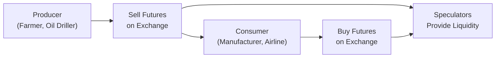

## Introduction

So, you know that feeling when you hear “commodities” and you picture piles of grain, barrels of oil, or sparkling gold bars? Maybe you’ve seen news headlines about some big freeze in Brazil pushing coffee prices through the roof, or a hurricane in the Gulf of Mexico shutting down oil production platforms. Commodities are those raw materials that keep the global economic engine running—energy, metals, agriculture, livestock, and more. They're not just essential for day-to-day consumption; they can also be an exciting (and sometimes nerve-racking) asset class for investing, hedging, and diversification.

We’re going to dive into how commodities can be accessed through physical ownership or via derivatives, and why certain factors—like supply constraints or sudden shifts in demand—drive their prices in ways that can be wildly different from stocks or bonds. We’ll also look at why commodity futures markets can sometimes be in something called “contango” or “backwardation,” and why that matters for your returns when you keep rolling futures contracts forward. And we’ll delve into some of the big reasons practitioners use commodity derivatives: from hedging fuel costs to locking in profits on a harvest to pure speculation.

Throughout this discussion, we’ll include references to widely used frameworks and standards, tie it to typical exam-type scenarios, and share a few cautionary tales from real-life blow-ups (and successes). Let’s do this.

## Commodities as Consumption Goods and Investments

Picture yourself walking into a grocery store. You see rows of produce, packaged foods, and everything that eventually gets consumed by families. Many of these goods—wheat, coffee, sugar, and so on—start their journey as commodities traded in large wholesale markets. Now, the interesting twist is that while these products meet everyday consumption needs, they are also traded in financial markets. Investors can take long or short positions in them, not because they need to eat the wheat themselves, but because they believe something about its future price.

### Physical Ownership vs. Derivative Exposure

When it comes to commodities, you can gain exposure in two big ways:

• Physical Ownership: This is literally holding the commodity in storage. You buy gold and put it in a vault somewhere, or you own a tanker of oil (which, by the way, is tricky to store). Physical ownership makes sense for investors who need the actual good (e.g., manufacturers), but it’s expensive (think storage and insurance costs) and often illiquid.

• Derivative Contracts: Most modern investors and firms use futures, forwards, options, or swaps. These instruments allow you to participate in price movements without physically handling the commodity. This approach is more cost-effective, more liquid, and typically has standardized contract features—especially if you’re looking at exchange-traded futures.

## Key Price Drivers in Commodity Markets

Commodities prices can jerk around depending on a bunch of factors:

• Supply-Demand Imbalances: Picture a drought wiping out half of a wheat harvest, sending wheat prices soaring. Or a sudden discovery of large new oil reserves that depresses prices. Supply and demand matter, big time.

• Economic Growth Cycles: During boom times, industrial commodities like oil, copper, and iron ore tend to see robust demand. In a slowdown, they often soften.

• Weather Patterns and Natural Disasters: Agriculture—and by extension, livestock—depends enormously on weather. Hurricanes, floods, and droughts can wreak havoc on supplies.

• Geopolitical Events: Sanctions, conflicts, and political instability can affect extraction, transportation, or global trade of commodities, significantly altering their prices.

• Monetary and Fiscal Policies: Commodity prices are sometimes intertwined with interest rates and currency moves. A strong dollar, for instance, can make dollar-denominated commodities more expensive for foreign buyers.

### Example: Oil Market Dynamics

Once, I got the jitters when OPEC announced unexpected production cuts. Crude futures jumped dramatically within hours. Airlines, shipping companies, and manufacturers who rely on stable fuel prices were suddenly calling their risk managers, asking, “Should we hedge now or wait?” That’s a classic scenario illustrating how a supply-side decision nudges prices in real time and spooks the markets.

## Commodity Derivatives and Their Role

Derivatives are essentially financial contracts that derive their value from an underlying commodity. The most common and liquid instruments are:

• Futures Contracts: Standardized agreements traded on an exchange to buy or sell a commodity at a specified price and date. Every day, positions are marked to market, meaning gains and losses are accounted for in the trader’s margin account.

• Forward Contracts: These are customized, over-the-counter agreements with terms set by the parties. They’re not standardized or exchange-traded, so they come with counterparty risk.

• Options: The right—but not the obligation—to buy (call option) or sell (put option) a commodity at a certain price. Farmers, for instance, sometimes buy put options on their crops to hedge against a price collapse.

• Swaps: Two parties exchange cash flows based on commodity price movements. For example, a fixed-for-floating commodity swap can let a refiner lock in a stable price for crude oil.

### Exchange-Traded vs. OTC

Exchange-traded derivatives (like futures on the Chicago Mercantile Exchange or ICE Futures U.S.) are standardized, liquid, and carry lower counterparty risk because a clearinghouse stands between buyer and seller. Over-the-counter (OTC) products (like custom forwards) provide flexibility in contract size, quality, or delivery terms, but they may have higher credit risk, lower liquidity, and less regulatory oversight.

## Important Terminology and Concepts

Here are some core terms you’ll come across in commodity markets:

- **Spot Price**: The going price for immediate delivery. Think of it as “buy it right now” pricing.  
- **Contango**: A situation where futures prices are higher than spot prices. This often reflects storage costs, insurance, and possibly interest rates.  
- **Backwardation**: The opposite of contango. Near-term futures trade at a premium to longer-dated futures, often signaling supply shortages or strong current demand.  
- **Roll Yield (Roll Return)**: When you’re holding a futures position, you periodically “roll” from the expiring contract into a new one. If the market is in backwardation, rolling forward can produce a positive roll yield. If in contango, you typically get a negative roll yield.  
- **Mark-to-Market**: The daily settlement process that ensures gains or losses are realized in futures trading accounts.  
- **Long/Short Strategy**: If you believe prices will rise, you go “long.” If you expect them to decline, you go “short” (selling futures with the goal of buying them back at a cheaper price).  
- **Basis**: The difference between the spot price and the futures price of the same commodity. Basis risk arises when the relationship between spot and futures diverges unexpectedly.

## Term Structure of Futures: Contango vs. Backwardation

A critical element for commodity investors—especially those who never take physical delivery—is how the futures curve is shaped. In a commodity like oil, you might see a curve that slopes upward, meaning future delivery months become more expensive. That’s contango. Traders often attribute this to storage costs, interest rates, insurance, and convenience yields (the intangible benefit of having inventory on hand).

In backwardation, the curve slopes downward. The near month might be trading at a higher price than months further out. Why does that happen? Sometimes it’s a strong immediate demand for the physical commodity, or short-term supply disruptions. Backwardation can be a boon for long-only commodity investors because each time they roll to a cheaper, longer-dated contract, there’s a positive roll yield. In contango, though, that roll yield can turn negative and erode returns.

Sometimes, you’ll see these shifts happen lightning-fast if there’s a sudden weather event or a major supply shock. If you’re not paying attention, you can get smacked with an unexpected roll cost.

## Hedging Applications

### Producers Locking in Earnings

Producers, such as farmers or oil drillers, use commodity futures to secure a price now for output they’ll harvest or extract in the future. If you’ve grown a thousand acres of wheat, you might sell wheat futures to lock in at least a floor price. Sure, if the market rallies post-harvest, you won’t see additional upside, but you avoid the risk of a price collapse wiping out your profit margins.

### Consumers Managing Costs

On the flip side, companies that consume commodities for their operations (e.g., airlines needing jet fuel, factories relying on aluminum) hedge by going long in futures. This ensures they can lock in their input costs. If airline management is worried about a bounce in oil prices, they’ll buy oil futures to offset the risk of a fuel price spike.

### Speculators & Investors

Speculators, including hedge funds or individual traders, don’t need the commodity physically. They’re in it for potential financial gain, taking a long or short position based on their forecast. In times of market stress, a speculator might be providing liquidity, or they might be ramping up volatility, depending on your perspective.

## Margin, Leverage, and Risk

One of the ultimate double-edged swords in commodity futures is leverage. Futures trading typically requires only a fraction of the contract’s notional value posted as margin. This magnifies gains—but also magnifies losses. Markets can move against you so fast you have to scramble to meet margin calls. Generic example:

• You go long 10 futures contracts of crude oil, each contract representing 1,000 barrels. Spot price is $80 per barrel, so the notional exposure is 10 × 1,000 × $80 = $800,000.  
• Suppose the initial margin is $50,000 total. If the price goes up to $83, you can realize a decent profit with just $50,000 down. If it tanks to $77, your losses could be big enough to wipe out your entire margin deposit.

This is why risk management, mark-to-market, and paying close attention to daily movements are essential. Over-leveraged positions are a recipe for immediate trouble.

## The Diversification and Inflation-Hedging Argument

Commodities are often touted as great diversifiers because they tend to have lower correlations with traditional assets like equities and bonds—particularly over certain market cycles. Also, some commodities, especially energy, historically track inflation trends. When prices for goods and services rise sharply, the raw materials often do, too. So having a slice of commodities in your portfolio can help offset the pinch from inflation on other holdings.

However, correlations can shift unexpectedly during financial crises—sometimes everything sells off when fear takes over. So while there can be diversification benefits, it’s not guaranteed in every environment.

## Practical Example: Rolling Commodity Futures

Let’s consider a simple scenario: You decide to invest in a basket of commodities futures, say an index that tracks front-month energy contracts. After a month, the contract nears expiration. Unless you want physical barrels of oil arriving at your door, you’ll “roll” the position into the next month’s contract. In a backwardation environment (spot/future > future/future out), you might buy that next contract at a lower price, yielding a profit from the roll itself—called roll yield. In contango, it’s reversed; you pay more for the next contract, cutting into your total return.

### Python Snippet for a Roll Yield Estimate

Below is a simplified code snippet that calculates a rough monthly roll yield for a single commodity. This hypothetical function guesses the roll yield by measuring the difference between the expiring contract’s settlement price and the new contract’s price.

```python
def calculate_roll_yield(old_price, new_price):
    """
    Approximate roll yield calculation.
    :param old_price: Price of expiring contract
    :param new_price: Price of new contract
    :return: Roll yield in percentage terms
    """
    roll_return = (old_price - new_price) / old_price
    return roll_return * 100

old_futures_price = 80.0
new_futures_price = 82.5
ry = calculate_roll_yield(old_futures_price, new_futures_price)
print(f"Estimated Roll Yield: {ry:.2f}%")
```

If this output says -3.13%, it means you took a loss on rolling your futures to a higher-priced contract. Over multiple rolls, those small percentages can add up (or subtract!) a lot from your overall performance.

## A Visual Overview: Trading Flows

Below is a simple Mermaid diagram that shows how producers and consumers might use a futures exchange for hedging:



## Best Practices, Common Pitfalls, and Strategies

• **Over-Leverage**: Make sure you have a solid risk management plan. Commodity futures can be extremely volatile, so keep an eye on margin requirements.  
• **Ignoring Storage & Roll Costs**: If you’re launching a long-only commodity futures strategy, contango can eat away at returns. Make sure you factor in the term structure.  
• **Over-Reliance on “Inflation Hedge”**: Commodities can underperform for extended periods, even when inflation is creeping upward. Don’t bank on them as a guaranteed hedge at all times.  
• **Regulatory and Ethical Considerations**: Ensure compliance with local regulations (CFTC guidelines for U.S. markets, for example). Also, mind the CFA Institute Code of Ethics and Standards of Professional Conduct when advising clients on commodity investments, especially regarding suitability and disclosure of leverage risks.

## Exam Tips and Practical Guidance

• **Formulaic Knowledge**: Be comfortable with the idea of roll yield and how to calculate gains/losses from futures positions.  
• **Scenario Responses**: In constructed-response (essay) or item-set style questions, you might see a scenario of a wheat farmer or a coffee importer, and you’ll need to recommend the appropriate futures or options strategy.  
• **Market States**: Understand contango vs. backwardation thoroughly—expect questions testing your knowledge of how these conditions affect investor returns.  
• **Risk Adjusted Performance**: Sometimes exam questions ask about Sharpe ratios or other measures for portfolios with commodity exposures. Appreciate how volatility can be higher but correlation can be beneficial.  
• **Ethical Nuances**: Handle questions about conflicts of interest, client communications, or extreme event risk responsibly. You may need to demonstrate compliance with the CFA Institute Standards.

## References

• Schofield, N. C. “Commodity Derivatives: Markets and Applications.”  
• CME Group, Education & Product Guides: https://www.cmegroup.com/  
• World Bank Commodities Price Data (The Pink Sheet): https://www.worldbank.org/en/research/commodity-markets  

## 10 Practice Questions: Test Your Knowledge on Commodities and Derivatives



### Which market condition is described by futures prices trading at levels higher than the current spot price?

- [ ] Backwardation
- [x] Contango
- [ ] Arbitrage
- [ ] Inversion

> **Explanation:** Contango is when the futures price of a commodity is higher than the spot price, often due to storage, insurance, and interest costs.

### If an airline company wants to protect itself against rising jet fuel prices, which of the following strategies would be most appropriate?

- [x] Buying futures (long position) in jet fuel
- [ ] Selling futures (short position) in jet fuel
- [ ] Selling put options on jet fuel
- [ ] Entering into a swap as the floating leg payer

> **Explanation:** A consumer of a commodity generally buys (goes long) futures contracts to hedge against upward price movements.

### A farmer anticipates harvesting wheat in three months and fears a drop in prices. Which derivative position helps lock in a selling price now?

- [ ] Long call
- [ ] Long put
- [ ] Long forward or futures
- [x] Short forward or futures

> **Explanation:** To hedge against falling prices, the farmer would short (sell) a forward or futures contract, guaranteeing a sale price.

### Which term refers to the financial gain (or loss) from transitioning out of an expiring futures contract into a new, longer-dated contract?

- [ ] Basis risk
- [ ] Convenience yield
- [x] Roll yield
- [ ] Collateral yield

> **Explanation:** Roll yield (or roll return) measures the profit or loss from rolling over an expiring futures contract into a longer-dated one.

### In a backwardated commodity market, how could a passive, long-only investor generally benefit without any price change in the underlying commodity?

- [x] Positive roll yield would boost returns
- [ ] Negative roll yield would reduce returns
- [ ] Margin calls would be triggered frequently
- [ ] Exposure to basis risk completely disappears

> **Explanation:** When futures are in backwardation, rolling to a cheaper contract can result in a gain (positive roll yield).

### What is the principal advantage of using exchange-traded futures instead of OTC forward contracts?

- [ ] Flexible contract terms
- [ ] Guaranteed physical delivery
- [ ] Less liquidity and higher credit risk
- [x] Standardization and lower counterparty risk

> **Explanation:** Exchange-traded futures are standardized and cleared through a central counterparty, reducing credit risk and improving liquidity.

### From a risk management perspective, why might a producer also use options in addition to (or instead of) futures?

- [x] Options provide downside or upside protection with limited obligation
- [ ] Options force physical delivery at contract settlement
- [x] Options can earn premium income for producers
- [ ] Options have zero transaction cost

> **Explanation:** Producers might buy a put (limited obligation for the premium) to protect from price drops, while still retaining upside if prices surge. Selling options can also generate premium income under certain strategies.

### Which of the following best describes basis in commodity markets?

- [ ] The intrinsic value of an option
- [ ] The cost of rolling futures from one month to the next
- [x] The difference between the spot price and the futures price
- [ ] The difference between call and put premiums

> **Explanation:** Basis is spot minus futures (or vice versa) for the same commodity.

### Which statement accurately characterizes commodity derivatives margin requirements?

- [x] Margin requirements are typically lower than the notional contract value, introducing leverage
- [ ] Commodity futures require posting the full notional contract value as margin
- [ ] Over-the-counter swaps do not require any margin
- [ ] Exchange-traded options never require margin

> **Explanation:** Futures traders post only a fraction of the notional contract value as margin, significantly increasing leverage potential.

### True or False: Commodities always provide a reliable hedge against inflation in every market environment.

- [x] True
- [ ] False

> **Explanation:** Commodities often provide inflation protection, but correlations and market conditions can vary widely over time, meaning it’s not a guarantee in every environment.


