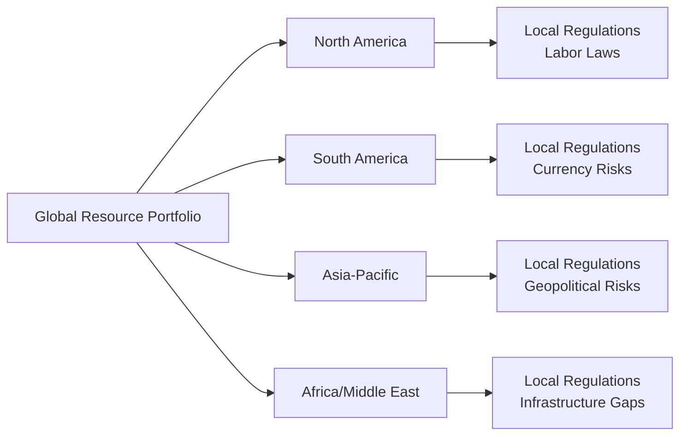

Natural resource investments—such as farmland, timberland, and commodities—often come up in conversations about portfolio diversification. People say things like, “They’re not correlated with equities,” or, “You can hedge inflation that way.” But, you know, sometimes it's tricky to see how that actually plays out in real-world portfolios. Let’s walk through these ideas, layering in a bit of practical experience, and see why natural resources can be both beneficial and a little complicated.

Broad Risk Factors in Natural Resource Investments  
------------------------------------------------

When you think of natural resources, it’s tempting to imagine broad fields of wheat swaying in the wind or huge oil rigs pumping day and night. Behind that imagery, there’s a bundle of risks that might not be as obvious. Some of these risk factors resemble those you’d find in traditional equities (e.g., operational challenges), while others are very specific to the nature of commodities, agricultural cycles, or even local regulations.

Commodity Price Volatility  
Commodity price changes can feel sudden. I’ll never forget the day I was reviewing a farmland investment that specialized in corn, and the price of corn unexpectedly tanked because of a major weather shift in another part of the world—pushing supply to new highs. The farmer’s yields were great, but global oversupply hammered prices. Commodity price volatility can result from:

• Global supply-demand imbalances  
• Unexpected changes in weather patterns (floods, droughts, or unusually warm growing seasons)  
• Political upheaval in key producing regions  
• Currency fluctuations, since most commodities are traded in major currencies like the U.S. dollar

Operational Risk  
Natural resource businesses often face operational complexities that traditional stock or bond investments do not. For instance, farmland managers must secure seasonal labor, maintain irrigation systems, and handle pest control. Miners have to continuously manage labor disputes and safety concerns. Oil drillers cope with environmental protection requirements and expensive downtime from equipment failures. Each operational hiccup can translate to big cost overruns or production halts. Even if your plan is to passively own land or timber, you’re never totally insulated from such nitty-gritty details—there are property taxes, logistical constraints, safety checks, and so on.

Political and Regulatory Risk  
I once heard a natural resources manager say, “Commodities go where the politics allow them to.” That might be an exaggeration, but there’s some truth to it. Changes in government policies—be it new environmental regulations banning certain fertilizers, or tariffs on steel and aluminum—can reshape supply and demand fundamentals overnight. Geopolitical tensions can disrupt transit routes, cause trade embargoes, or freeze entire regions’ production. Consider how a border conflict can restrict shipping lanes for oil. It’s not always about short-term disruptions: long-term regulatory shifts (like carbon emissions targets) can also impact the profitability of energy-related assets.

Weather Extremes and Climate Change  
If you’re investing in farmland, you’d probably rather not see a once-in-a-century drought or epic flooding. But it happens. Extreme weather events, from hurricanes hammering coastal sugarcane fields to multi-year droughts in agricultural hot spots, can devastate yields. Timberland, similarly, can be vulnerable to forest fires or pest outbreaks (e.g., mountain pine beetle). These events are often impossible to forecast precisely or fully prevent. Weather extremes underscore the importance of geographic diversification—our next topic.

Geographical Concentration Risk  
Natural resource investments are often, well, rooted to the ground. Farmland in Peru, for example, might flourish from perfect soil conditions for avocados, but that same farmland might be exposed to significant risk if a local water source gets diverted or if contractual water rights are renegotiated. Concentrating your exposure in just one region means that a single meteorological event, regulation, or pest infestation could wipe out a significant portion of returns. Diversifying acreage across different crops, climates, or even countries might be helpful, but it introduces new complexities: foreign exchange risk, local legal structures, and variations in property rights.

The Diversification Argument  
----------------------------

One of the big selling points of natural resource investments is that they tend to have low (and sometimes even negative) correlation with traditional assets like equities and bonds. In many historical periods, commodity prices have marched to the beat of their own drum. That means when stocks are down, commodities might be stable or even up, offering a potential cushion in a broader portfolio downturn.

Correlation, simply put, is a measure of how two assets move in relation to each other. If you have a correlation of +1.0, the moves are perfectly in sync; if the correlation is -1.0, they move in opposite directions. A correlation near zero often means independent price movements, which broadens the potential diversification benefit.

But correlations can be a bit fickle. In a generalized, stable market scenario, farmland might be uncorrelated with the S&P 500. During a full-blown financial crisis, however, correlations among most asset classes tend to spike as investors rush to sell almost everything. So, it’s wise to understand that low correlations do not always hold in extreme market conditions, although natural resources do frequently provide some risk-buffering characteristics.

Interest Rate and Inflation Sensitivity  
---------------------------------------

Natural resources can be influenced by inflation because when the price of goods and services rises, commodity prices often ride that same wave. For instance, farmland revenue might increase if grain or produce prices shoot up in an inflationary environment. As a result, some investors see farmland as a direct inflation hedge. Furthermore, real assets—like oil, timber, farmland—are inherently valuable in that they produce real, tangible goods that people need.

That said, interest rates matter too. Many resource-rich projects, like energy exploration or farmland expansions, are highly leveraged. If interest rates rise, these operations can be hurt by more expensive financing. Additionally, higher interest rates might strengthen a particular currency (e.g., the U.S. dollar), which in turn can pressure dollar-denominated commodities—often pushing prices lower as foreign buyers find them more expensive. It’s a delicate balancing act between the advantages of resources as inflation hedges and the cost of financing them in higher-rate environments.

Global Economic Growth and Demand  
---------------------------------

When global growth is booming—China building infrastructure like crazy or emerging markets surging—there tends to be robust demand for energy and raw materials. Industrial metals such as copper or iron ore typically benefit, and so do energy commodities. On the flip side, slower growth can weaken demand, and commodity prices might slump.

Agricultural goods follow slightly different patterns of demand, because people need to eat regardless of GDP growth. But higher growth can lead to changing diets (e.g., more meat consumption in developing countries), which can boost demand for feed grains. Energy usage can also rise as populations become more affluent. So, each sub-sector within natural resources can react uniquely to changes in economic output.

Liquidity Profiles of Different Natural Resource Investments  
-----------------------------------------------------------

• Publicly Traded Commodity ETFs and Futures  
  – Typically high liquidity, can be bought or sold almost instantly.  
  – Involve lower operational overhead (you’re not literally buying farmland or a gold mine).  
  – However, they often do not deliver the full “spot price” exposure because of frictions like the cost of rolling futures.  

• Direct Ownership of Farmland, Timberland, or Mines  
  – Potentially higher returns if managed well, plus intangible benefits like controlling operational decisions.  
  – But definitely lower liquidity. You can’t just sell a farm on a whim if you need immediate cash.  
  – Exposes you to full operational and local regulatory risks.  

• Private Equity or Funds Focusing on Natural Resources  
  – Provides professional management and specialized expertise.  
  – May also require lock-up periods—limiting liquidity.  
  – Fees can be high (e.g., management plus performance fees).  

Depending on your needs—like liquidity, risk tolerance, or diversification goals—you might prefer a combination of commodity ETFs for quick exposure and some longer-term physical resource assets for inflation hedging and potential alpha.

Tail Risks and Scenario Planning  
--------------------------------

Sometimes the worst-case scenario is exactly what you need to plan for. Extreme events might be rare, but they do happen more often than standard distributions might imply. This phenomenon is tail risk. A tail-risk scenario could be a sweeping geopolitical conflict that interrupts major energy supply routes, a catastrophic drought that ruins multiple crop cycles in a key agricultural region, or unprecedented tariffs on commodity exports. These outlier events can wreak havoc, but some resources might actually spike in value if they suddenly become scarcer.

Using scenario analysis, you can project how your portfolio would hold up under a hypothetical crisis. Maybe you consider a scenario where a major grain-producing nation is hit by political instability, leading to wide-scale production and export disruptions. You’d look at the potential effect on your farmland holdings (which may benefit from rising prices) versus your energy assets (which might be unaffected by that particular scenario), and so on. Scenario analysis also forces you to recheck your correlations to see if, under stress, your diversification assumptions still hold water.

Below is a simplified mermaid diagram illustrating a scenario analysis approach for natural resources within a broader portfolio:

• Scenario Input: Identify potential disruptions (weather extremes, regulatory changes).  
• Commodity Price Shocks / Regulatory Restrictions: Model the specific hits on different sectors.  
• Portfolio Impact Assessment: Estimate changes in valuations and correlations.  
• Stress Testing & Risk Tolerance: Evaluate if your portfolio can handle potential losses or if rebalancing is needed.

Managing Geographic and Regulatory Risks  
---------------------------------------

Allocating capital to farmland in multiple continents or to different resource-rich states can reduce the risk that one localized event sinks your entire strategy. However, doing so also exposes you to:

• Different legal systems  
• Varying labor laws  
• Currency swings  
• Cultural nuances (e.g., land usage rights or environmental norms)  

Due diligence becomes extra critical. You might need local partners or consultants to navigate regulations (like land ownership caps for foreigners) or to handle each region’s environmental guidelines.

Below is a high-level mermaid diagram that shows how a multi-regional resource investment strategy might expand your risk considerations:

Balancing these complexities can be worthwhile if you’re seeking diversification, but it calls for a robust oversight structure—perhaps including onsite visits, local specialized teams, or “macro overlay” expertise to interpret economic trends.

Putting It All Together: Portfolio Construction  
----------------------------------------------

In practice, you’ll often integrate natural resources into a broader portfolio. That might look like:

• A core allocation to traditional equities and bonds.  
• A slice of commodity futures or commodity-linked notes to hedge inflation and diversify.  
• A direct or private-fund investment in farmland or timberland for potential upside and further diversification.  
• Possibly an offsetting macro overlay—for instance, shorting or hedging currencies in regions where you hold real assets.

The goal is to ensure that you’re not just chasing returns. Instead, you’re assembling a range of assets that behave differently across economic conditions. Make sure to remember:

• Diversification Benefit: Gains from combining assets with imperfect correlations.  
• Tail Risk: Rare, severe events that might undermine typical correlation assumptions.  
• Liquidity Premium: Investors may demand higher returns for tying up their capital in illiquid assets.  
• Concentration Risk: Overexposure to one region, commodity, or climate.  

Final Thoughts on Risk Management  
---------------------------------

When investing in natural resources, scenario planning and stress testing become essential tools. Rather than simply trusting historical correlations, simulate outlier events and see how your portfolio might perform. Maybe you have farmland in multiple states, or a commodity ETF that leans heavily toward metals, or a specialized farmland real estate investment trust (REIT). Think carefully about each cluster of risk, and be prepared for the day that tail events occur.

It’s often helpful to consult multiple data sources, talk to local experts, and keep a keen eye on shifting regulations or climate patterns. In my view, the best approach is to blend a modest measure of humility—we can’t predict everything, after all—with a well-structured risk management framework. That’s how you make the best use of the diversification advantages that natural resources often promise.

References and Further Reading  
-----------------------------

• Modern Portfolio Theory and Investment Analysis by E. J. Elton, M. J. Gruber, S. J. Brown, and W. N. Goetzmann.  
• CFA Program Curriculum, Level I: Portfolio Management readings on correlation and diversification.  

Glossary  
--------

• Correlation: A statistical measure describing how two assets move in relation to each other.  
• Tail Risk: Risk of rare but extreme events occurring that lie in the tails of probability distributions.  
• Scenario Analysis: A forward-looking technique evaluating potential outcomes under different market or macroeconomic scenarios.  
• Geopolitical Risk: Uncertainties arising from political instability, conflicts, or government policies that affect global supply chains.  
• Liquidity Premium: Additional expected return for investing in assets that are harder to buy or sell quickly.  
• Concentration Risk: Risk of large losses resulting from heavy exposure to a single asset, sector, or region.  
• Diversification Benefit: Reduction in portfolio risk achieved by combining assets with less-than-perfect correlation.  
• Macro Overlay: A strategy that adds top-down economic views (e.g., currency moves, interest rates, commodity trends) to refine portfolio positions.

Practical Exam Tips  
-------------------

• Expect questions that mix real asset risk factors, inflation sensitivity, and portfolio optimization. Be prepared to perform short calculations related to correlation or partial correlation.  
• Tail events and scenario analysis are frequent topics: show how you would structure hypothetical worst-case events and measure their impact on your resource-heavy portfolio.  
• Be ready to discuss how changes in interest rates might influence leveraged operations in farmland, or how commodity futures could deviate from spot prices due to rolling costs and contango/backwardation.  
• Master the interplay between macroeconomic indicators (like GDP growth, currency rates) and demand for resources.  

## Test Your Knowledge: Risk and Diversification in Natural Resources



### A portfolio manager believes farmland provides inflation protection. Which key mechanism most directly drives farmland's hedge against inflation?

- [ ] Farmland generates stable rental income that is fixed for long periods.
- [x] Rising crop prices can correlate with broader inflation, boosting farm revenues.
- [ ] Farmland values rarely adjust, so they remain constant during inflation.
- [ ] Growing costs for fertilizer offset any inflation hedge.

> **Explanation:** Farmland’s inflation-hedging ability typically comes from higher commodity prices that boost farm revenues, rather than fixed cash flows.

### Which of the following best describes an example of tail risk in a natural resources portfolio?

- [ ] Crop yields moderately decreasing due to routine drought conditions.
- [x] A once-in-a-century storm that halts production across multiple regions simultaneously.
- [ ] Gradual changes in fertilizer regulations over 10 years.
- [ ] An expected market correction that slowly reduces commodity prices.

> **Explanation:** Tail risks are those rare but severe events with significant impact, such as a catastrophic storm that devastates production in several key locations.

### Which factor is often cited as a diversification benefit of holding commodities in a traditional equity-bond portfolio?

- [ ] Their performance is guaranteed not to fall during an equity selloff.
- [ ] Their performance is driven solely by interest rate movements.
- [x] Their historical return patterns have been relatively uncorrelated with equities and bonds.
- [ ] Their correlation with equities is exactly 1.0 in crisis scenarios.

> **Explanation:** Commodities often have low historical correlation with equities and bonds, providing a diversification benefit.

### A portfolio is heavily invested in farmland located in a single region prone to wildfires. What specific risk is the portfolio most exposed to?

- [ ] Liquidity risk
- [x] Concentration risk
- [ ] Regulatory risk
- [ ] Currency risk

> **Explanation:** All farmland in a single, wildfire-prone zone implies concentration risk—one event can damage all your holdings.

### In a scenario analysis for a global energy supply shock, which asset is most likely to benefit?

- [ ] Fixed-rate bonds
- [ ] Retail sector equities
- [x] Energy commodities
- [ ] Long-term telecom contracts

> **Explanation:** An energy supply shock typically increases energy commodity prices, benefiting energy-related assets.

### Which statement about interest rates and natural resource investments is most accurate?

- [ ] Low interest rates have no effect on the financing costs of resource projects.
- [ ] Resource investments never involve leverage.
- [x] Higher interest rates can hurt leveraged resource projects by increasing financing costs.
- [ ] Lower interest rates generally lower commodity prices directly.

> **Explanation:** Many resource projects rely on significant debt financing, making them more sensitive to rising rates.

### Which risk factor below is most closely related to geopolitical risk in commodity markets?

- [x] Government-imposed export bans that disrupt global supply chains
- [ ] Seasonal changes in crop yields
- [ ] Over-planting due to domestic subsidies
- [ ] Rising management fees in private funds

> **Explanation:** Export bans are a prime example of how government actions can disrupt supply chains, a key geopolitical risk.

### When a manager invests in physically owned farmland across multiple continents, which new complexity is most likely introduced?

- [x] Varying local legal frameworks and property rights
- [ ] Guaranteed harmonization of farming practices
- [ ] Zero currency exposure
- [ ] Elimination of weather risk

> **Explanation:** Investing in farmland internationally adds legal, regulatory, and currency complexities specific to each region.

### Why might a commodity futures position not fully match the spot price of the commodity?

- [ ] Futures never reflect market conditions.
- [ ] Futures are priced based solely on operational risk.
- [ ] Spot prices are irrelevant to commodity markets.
- [x] Rolling futures may incur costs or reflect contango/backwardation, causing deviations from the spot price.

> **Explanation:** Futures don't perfectly track spot prices because of rolling costs and contract structure (contango or backwardation effects).

### True or False:  
One of the main reasons natural resources can be good inflation hedges is that their prices often rise when the general level of prices increases.

- [x] True
- [ ] False

> **Explanation:** Because natural resources—like oil, grains, or metals—are integral to the production process, their prices often trend upward with general inflation.


