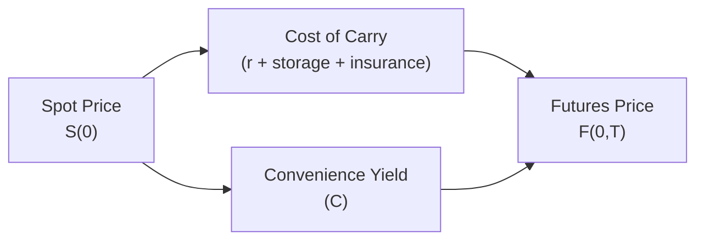

## Introduction
Have you ever strolled past those big metal grain silos or seen tanker ships lined up at a port and wondered, “Why store all that stuff in the first place?” I remember my first visit to a port storage facility years ago—it was a massive, bustling environment. The whir of machinery was deafening, and the smell of raw commodities like wheat and soybeans hung in the air. You could practically feel the global supply chain at work.

Commodity markets are about more than just “buy low, sell high.” We’re often dealing with physical goods—oil, corn, timber—that need space, insurance, maybe even a little TLC to keep them from spoiling. The relationship between a commodity’s spot price, its futures or forward prices, and the underlying costs and benefits of holding the physical commodity is precisely what we call “commodity curve dynamics.” In this section, we’ll explore how factors like storage cost, supply-demand pressures, and a concept called “convenience yield” come together to shape these curves and influence investment strategies.

## Fundamental Building Blocks: Spot, Futures, and Cost of Carry
Let’s start by breaking down the basics of commodity pricing. If you open the business news on any day, you might see the spot price of, say, crude oil. This spot price reflects the going rate for immediate (or near-immediate) delivery. In contrast, the futures or forward price indicates how much it costs to lock in a deal for delivery in the future. The difference between these two prices can tell us a lot about the underlying market structure—whether it’s favorable to store commodities or to sell them right away.

### Cost of Carry at a Glance
Generally, the relationship between the spot price (S) and futures price (F) can be described by the cost-of-carry model:


F(0,T) = S(0) \times e^{(r + u - y) \times T}


• r = risk-free interest rate  
• u = storage (and insurance) costs  
• y = convenience yield  

Here’s the quick interpretation: If interest rates and storage costs (u) are high, then the futures price tends to be higher relative to the spot. But if holding the physical commodity gives you certain perks—maybe you avoid production shutdowns or you can meet an unexpected jump in demand—then convenience yield (y) lowers the cost of carrying the commodity. In other words, the ability to keep your factory running without interruption because you have the raw materials on hand can be invaluable.

Below is a simple visualization of how these components feed into the futures price:



In the diagram, you can think of cost of carry as making that arrow from the spot price to the futures price go "up," whereas convenience yield pulls it back down.

## Seasonal Patterns and the Forward Curve
Many commodities—particularly agricultural goods—have strong seasonal trends. Crops like wheat and corn are harvested in certain months, so their availability spikes at harvest and then wanes throughout the year. With energy commodities, winter can bring extra demand for heating fuels, or summertime might push up demand for gasoline. These seasonal nuances can bend and twist the forward curve.

• In the months leading up to harvest, you might see higher futures prices relative to the spot because the available storage is already brimming, and buyers anticipate lower supply in the near term.  
• After the harvest, spot prices might fall if everyone is piling in and selling right away. In that scenario, forward prices can be relatively higher if market participants expect supply to dwindle in the coming months.

These seasonal swings can create opportunities for hedgers and speculators alike. If you’re a farmer, you might want to sell futures in advance to lock in a price. If you’re a buyer—maybe a cereal manufacturer—you might buy futures or forwards to lock in supply at a stable cost.

## Storage Economics: Why Bother Storing at All?
Storing commodities can be expensive and sometimes downright risky—things can degrade, spoil, or even get lost. Yet, storage can also be profitable. The practice of “storage arbitrage” is essentially buying the commodity at a lower current price (spot), storing it, and selling it forward at a higher price—assuming the difference covers all storage, insurance, and financing costs.

Big industrial players, like oil refiners or massive grain elevators, may choose to hold onto inventories when they suspect spot prices are temporarily depressed, anticipating stronger future demand or supply bottlenecks that could drive prices higher tomorrow. And this is more than just a guess; they have internal data, historical patterns, and real-time market intelligence that can give them confidence in their strategies.

### The Decision To Store
Imagine you manage a grain elevator operation. If the forward price for wheat in six months is significantly higher than today’s spot price—enough that it covers storage, insurance, and a reasonable profit—why not buy wheat now, stuff your elevator to capacity, and then deliver six months later into the forward contract?

But be aware: real-world supply chain constraints like limited truck availability, congested ports, or unreliable shipping schedules can throw a wrench in your plan. One year, I recall a situation where a major port strike delayed shipments so severely that local storage facilities were stuck with more grain than they could handle, leading some to sell everything in the spot market at a discount. Even the best-laid plans can be undone by logistics.

## Contango vs. Backwardation: The Shape of the Forward Curve
You might hear the words “contango” and “backwardation” a lot when talking about commodity curves. These terms tell us how forward prices compare to the spot price.

• **Contango**: The forward price is higher than the spot price. Often linked to high storage costs or low immediate demand.  
• **Backwardation**: The forward price is ultimately below the spot price. Typically, this occurs when storage is expensive (or supply constraints are tight), and there’s a strong convenience yield—meaning there’s real value in holding the physical commodity right this instant.

If the market is in contango, it can reward storing the commodity if the forward price premium offsets costs. Conversely, backwardation might reflect short-term scarcity or extremely strong immediate demand, such that the commodity is worth more today than in the future.

## Hedging and Arbitrage Opportunities
Traders and commercial entities can exploit the structure of these curves in several ways:

• **Arbitrage**: If there’s a misalignment between spot and future prices (beyond the fair cost-of-carry), market participants may buy the physical commodity for spot, store it, and simultaneously short the futures to lock in a riskless profit. However, these opportunities usually vanish quickly once discovered because competition among traders forces prices back in line.

• **Hedging**: Agricultural producers, for example, may lock in selling prices by going short in the futures or forward markets, avoiding the risk that spot prices might plummet. Manufacturers that need metal or energy inputs may lock in their costs by going long in futures. Understanding the shape of the forward curve helps them pick an optimal maturity to match their production schedules or revenue cycles.

• **Spread Trading**: In some cases, traders look at the price difference between near-month futures and longer-dated futures. If they believe the curve will shift from contango to backwardation, or vice versa, they might position themselves to profit from the change in the shape of the curve over time.

## Physical Storage Risks and Insurance Costs
So let’s talk about the gritty reality of storing a physical product. It’s not all neat accounting entries on a trading screen. You’re dealing with potential spoilage, quality degradation, theft, pests, or even hazards like fire or mold. All these real-world headaches translate into insurance premiums and day-to-day management.

Some commodities—like metals—are more durable and easier to keep in a warehouse than, say, fresh produce. In turn, convenience yield also tends to be more pronounced for commodities that are more time-sensitive or have less reliable supply. If your commodity can’t be easily substituted (like certain rare metals essential for a particular manufacturing process), your convenience yield might be quite high.

## Global Trade Flows and Logistical Constraints
Commodity markets are global, and local constraints can create big price differentials. Maybe there’s a pipeline bottleneck in North America that strands natural gas in one region, driving prices down locally even if global prices are higher. Traders and logistics providers can step in—if they have the infrastructure to move that gas to a more lucrative market. Cargo ships, rail lines, trucking routes, or even barge operations on rivers can become the deciding factor in where commodities flow.

For instance, in the oil market, if there’s a congestion at a major port, that can force local spot prices to drop because producers don’t have an easy outlet to ship the oil. Meanwhile, overseas refiners might be paying a premium for the same product if they can’t get enough supply. This friction can create regional contangos or backwardations that might not exist in a frictionless market.

## Building Effective Hedging Programs
When you’re designing a hedging program, you want to map out how the forward curve might evolve in different scenarios. Do you expect the demand for your commodity to surge or collapse in the near term? Are there seasonal factors—like hurricanes in the Gulf of Mexico that disrupt oil production—or changing ethanol mandates that affect corn prices? The shape of the forward curve can help you decide whether to hedge short-term or long-term and whether to purchase options rather than futures if there’s high uncertainty.

A quick anecdote from a colleague: He once worked at a large consumer goods company that locked in sugar prices for an entire year by buying futures at a time when the market was in contango. They paid a bit of a premium (higher futures price) versus spot. But to them, it was worth the clarity in budgeting and not having to worry about sugar prices spiking. That’s the convenience yield in action—except the convenience yield here was about having stable production costs.

## Identifying Arbitrage Across Delivery Points
Some advanced players take it a step further, analyzing commodity curves for different geographies or different delivery points. Oil, for example, might show a contango in the U.S. Gulf Coast market but be in backwardation in a European hub. If you have the means to ship it across the Atlantic, you might be able to exploit that price difference. 

This does require sophisticated knowledge of global freight rates, customs and tax regulations, and possible changes in currency exchange rates. These cross-border nuances can open significant opportunities, but they also carry significant risk if logistics fail or if the price differentials vanish unexpectedly.

## Best Practices and Common Pitfalls
• **Storage Constraints**: Don’t ignore physical limitations. You can’t store what you can’t physically accommodate.  
• **Funding Costs**: If interest rates are high, cost of carry jumps. That can flip a seemingly profitable storage trade into a loss.  
• **Quality Risk**: For perishable goods like certain agricultural products, factor in spoilage. Not all commodities are equally shelf-stable.  
• **Overlooking Convenience Yield**: Some hedgers completely miss how valuable the physical commodity might be for immediate use. This is especially risky if your production line can’t substitute away from that commodity.  
• **Assuming Normal Market Conditions**: Logistics disruptions, strikes, and geopolitical tensions can drastically change curve dynamics overnight.

## Practical Example Using Simple Python Code (Optional Illustration)
Let’s say you want to see if there’s an arbitrage opportunity based on a very rough calculation of cost of carry. You’ve got a spot price S, a risk-free rate r, daily storage cost s, and a convenience yield c. Suppose you compare it to the actual forward price in the market F.

Below is a quick snippet (purely for conceptual illustration):

```python
import math

S = 100.0  # spot price
r = 0.03   # 3% annual interest rate
s = 0.02   # daily storage cost in monetary terms
c = 0.01   # daily convenience yield
days_to_maturity = 180

daily_interest = r / 365

theoretical_forward = S * math.exp((daily_interest + s - c) * days_to_maturity)

F = 106.0

print("Theoretical Forward:", round(theoretical_forward, 2))
print("Market Forward:", F)

if theoretical_forward < F:
    print("Potential to buy spot, store, and sell forward.")
elif theoretical_forward > F:
    print("Potential short forward / carry negative inventory cost.")
else:
    print("No clear arbitrage opportunity.")
```

While the real world is obviously more complicated—insurance fees, taxes, different timescales—this tiny snippet hints at how you might approach a quick check on theoretical vs. market-based forward prices.

## Exam Tips
• Carefully distinguish cost of carry from convenience yield on exam questions. They often test your ability to interpret or restate the cost-of-carry relationship.  
• Watch out for questions that incorporate unexpected storage or logistical issues. They might test whether you can identify how shifting supply conditions impact the forward curve.  
• Stay mindful of contango vs. backwardation. Essay-style questions often revolve around explaining why a market is in one state versus the other.  
• Use short calculations (like the formula for F(0,T)) if they provide enough data for you to compare theoretical vs. actual forward prices.  
• If you see scenario-based prompts about supply shocks or changes in interest rates, think about how each term (r, storage, convenience yield) is affected.

## References and Further Reading
- Gregoriou, Greg N. (ed.). “Commodity Trading Advisors: Trend Following and Diversification for Serious Traders.”  
- “The Journal of Commodity Markets” for peer-reviewed articles on commodity market research.  
- Official CFA Institute Curriculum, particularly readings related to derivatives, alternative investments, and portfolio management.  
- Academic research on commodity forward curves and storage theory for advanced insights into real-world pricing anomalies.

## Commodity Curve Dynamics & Storage: Test Your Knowledge



### 1) Which of the following best describes “cost of carry” for a commodity?
- [ ] The difference between the highest and lowest spot prices during the day.
- [x] The net cost of holding a commodity, including storage, insurance, and financing.
- [ ] The convenience yield that accrues to holders of the physical commodity.
- [ ] The premium charged by intermediaries for facilitating delivery.

> **Explanation:** Cost of carry explicitly captures all out-of-pocket costs associated with holding the commodity until a future date, which typically includes storage fees, insurance, and financing costs.

### 2) In a market showing strong backwardation, which statement is most likely correct?
- [ ] Storage costs are very high, pushing futures prices above current spot prices.
- [ ] The spot price is below the futures price for shorter maturities.
- [ ] Arbitrage opportunities rarely exist.
- [x] The commodity may be more valuable today than in the future, often reflecting a strong convenience yield.

> **Explanation:** Backwardation means spot prices exceed futures prices, often suggesting immediate demand or scarcity that raises the commodity’s current value.

### 3) Which factor most directly lowers the theoretical forward price relative to the spot price?
- [ ] High risk-free interest rate
- [ ] High storage costs
- [x] High convenience yield
- [ ] High insurance costs

> **Explanation:** Convenience yield lowers the effective cost of holding the physical good, thus reducing the forward price relative to the spot price in the cost-of-carry formula.

### 4) Seasonal effects in commodity markets:
- [x] Can alter forward curve shapes due to harvest cycles and demand shifts.
- [ ] Are irrelevant for traders focused on short-term arbitrage.
- [ ] Always push the market into contango.
- [ ] Always push the market into backwardation.

> **Explanation:** Seasonal impacts can lead to changes in supply or demand that ripple through the forward curve, reflecting everything from harvest timing to weather-driven consumption patterns.

### 5) If the theoretical forward price is lower than the actual market forward price (and transactions costs are negligible), then:
- [x] A trader might buy the spot commodity, store it, and short the forward.
- [ ] There is no arbitrage opportunity.
- [ ] A producer should immediately go long on the forward contract.
- [ ] The trader should sell the spot in anticipation of lower forward costs.

> **Explanation:** When the market forward is higher than the theoretical forward, it can be profitable to buy the commodity at spot, incur storage costs, and lock in a higher forward selling price, capturing a near risk-free profit.

### 6) Which commodity would likely incur higher insurance and spoilage risk?
- [x] Perishable agricultural produce (e.g., fruits or vegetables).
- [ ] Gold bullion in a secure vault.
- [ ] Refined metals like aluminum or copper in standard form.
- [ ] None of the above.

> **Explanation:** Perishable goods like fruits or vegetables have a significant risk of spoilage, requiring specialized handling, cooling, and insurance.

### 7) In contango markets, one potential strategy for large commercial players is:
- [x] Buying spot, storing the commodity, and selling forward if the premium exceeds carrying costs.
- [ ] Establishing an immediate short spot position to benefit from backwardation.
- [ ] Only trading in near-month contracts to minimize risk.
- [ ] Ignoring futures markets and focusing on spot trades.

> **Explanation:** In contango, forward prices are above spot. Buying at a lower spot price, then paying for storage and selling at the higher forward price can be profitable if well managed.

### 8) An example of convenience yield is:
- [x] Keeping enough oil in storage to avoid shutdowns in case of supply disruptions.
- [ ] Buying an ultra-cheap but rarely used commodity.
- [ ] Reducing maintenance costs by storing perishable goods outdoors.
- [ ] Decreasing the cost of carry through lower financing costs.

> **Explanation:** Convenience yield arises from the benefits of physically holding the commodity, such as preventing production halts.

### 9) Global trade flow disruptions (e.g., port congestion) can:
- [x] Create regional price disparities and local contangos.
- [ ] Eliminate the necessity for storage arbitrage.
- [ ] Force all markets simultaneously into backwardation.
- [ ] Make it easier for producers to hedge.

> **Explanation:** Disruptions can cause spot surpluses and force local prices down in one region, while another region might experience scarcity and higher prices, leading to opportunities or mispricings.

### 10) True or False: When interest rates increase significantly, the cost of carry is likely to rise, all else being equal.
- [x] True
- [ ] False

> **Explanation:** Higher interest rates increase financing costs in carrying inventory, raising the overall cost of carry.


