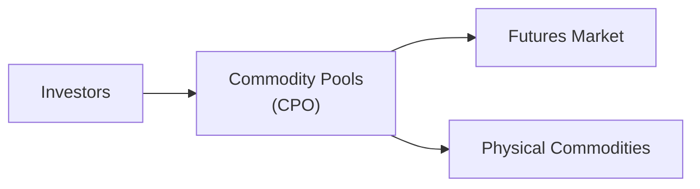

## Introduction
So, let’s talk about commodity-based investment vehicles. Perhaps you've heard folks say something like, “I'm invested in oil,” and you're like, “Wait, how do you just buy oil?” The truth is: there’s a big array of vehicles that allow exposure to commodities—think crude oil, gold, agricultural products, and more—without literally storing barrels of oil in your backyard (you wouldn't want that, trust me).

In the broad world of alternative investments, commodities provide an intriguing diversification opportunity. Commodities often respond differently to various market or macroeconomic conditions than stocks or bonds. They can help hedge against inflation, but they can also come with complexities, such as rolling futures contracts or dealing with contango and backwardation. Let’s dive in and explore these commodity-based products from a capstone perspective. I’m going to walk you through the major structures, highlight their pros and cons, and show how they might show up in your portfolio.

## Key Commodity-Based Investment Vehicles
A range of vehicles exist for investors seeking commodity exposure, each with its own structure and risk/return quirks. Some of the most common include:

• Exchange-Traded Funds (ETFs)  
• Mutual Funds with a commodity focus  
• Commodity Pools and Managed Futures  
• Structured Notes  
• Leveraged and Inverse Commodity ETFs  

And (maybe surprisingly) these can track the exact same commodity, yet deliver drastically different results. Let’s take a closer look at some of these vehicles.

## Physical-Backed Commodity ETFs
Physical-backed commodity ETFs store the actual commodity. For instance, gold ETFs such as SPDR Gold Shares (GLD) hold physical gold in vaults, and each share represents a fractional ownership in that gold. Silver ETFs work similarly. These ETFs are popular because:

• They avoid the hassle of personally storing the commodity.  
• The price is more or less tied directly to spot prices, minus management fees.  
• There’s no daily rolling forward of futures contracts.  

Big advantage? Well, tracking error tends to be minimal because you’ve essentially got real metal in a vault. Of course, you pay annual fees for storage and management, and there can be mild differences from the spot price due to legal and operational structures. But for many investors, the simplicity of physical backing is hugely appealing. 

## Futures-Based Commodity Funds
Not all commodities are practical to store physically. Let’s face it, storing energy or industrial metals can be, you know, complicated and expensive. Instead, many ETFs and mutual funds use futures contracts to gain exposure. For example, an ETF that aims to replicate the performance of the S&P GSCI or Bloomberg Commodity Index typically invests in a basket of commodity futures.

But here’s the catch: futures-based strategies require rolling over the futures contracts before they expire, which introduces something called roll yield—a fancy term for gains or losses that occur when the new contract is more or less expensive than the expiring one. Sometimes the futures curve is in contango (later-dated futures are more expensive), which can cause a “negative roll yield.” Other times, markets are in backwardation (later-dated futures are cheaper), leading to a “positive roll yield.” Understanding this principle is critical for evaluating performance differences among funds.

In KaTeX form, you might see roll yield expressed as:


\text{Roll Yield} = \frac{F_{t}(T_1) - F_{t}(T_0)}{F_{t}(T_0)},


where Fₜ(T₀) is the futures price at time t for a contract maturing at T₀, and Fₜ(T₁) is the new contract price for a contract maturing at T₁.

## Commodity Pools and Managed Futures
Commodity pools are vehicles operated by Commodity Pool Operators (CPOs). These are typically private (though sometimes publicly available), and they pool investor capital to invest in commodity futures and options. Managers, often Commodity Trading Advisors (CTAs), actively manage futures positions. They might employ systematic trend-following, mean reversion, or discretionary macro strategies.

From a regulatory perspective in the US, commodity pool operators generally must register with the CFTC (unless they’re exempt under specific provisions). Registrations facilitate oversight and compliance with position limit rules and disclosures. 

Managed futures accounts offer direct exposure to these strategies. An investor can open a separately managed account with a CTA who trades futures on their behalf. Usually, these strategies:

• Have low correlation with traditional asset classes.  
• Often rely on technical or quantitative models.  
• May produce returns that zig when equity markets zag—potentially offering diversification benefits.  

## Structured Notes
Structured notes can be a bit tricky, but basically, they’re debt securities (often issued by banks) with embedded derivatives that offer custom exposure to commodity prices, indexes, or baskets. For instance, you might see a note that promises principal protection plus a percentage of any upside in oil prices over a certain period. Another might offer 2x leveraged returns on the price change of copper, with some limit on downside risk.

You can think of these notes as “mix and match” solutions where payoff structures get designed for a specific investor need—like a partial hedge or a leveraged bet without having to manage margins. On the flip side, structured notes can be complex, illiquid, and you assume the credit risk of the issuing institution. They also carry fees that aren’t always super transparent. 

## Leveraged and Inverse Commodity ETFs
Leveraged and inverse ETFs are the daily thrill-seekers of the commodity world. They promise magnified returns—like 2× or 3× the daily upside or downside of a commodity index—by using futures, swaps, and other derivatives. But they rebalance daily, resetting their exposure. This daily rebalancing can lead to a phenomenon known as compounding risk. Over time, these products often deviate meaningfully from “just double the monthly or yearly change.” If you hold them long-term, you might be in for a surprise—especially in volatile markets. 

A quick cautionary tale: A friend of mine (let’s call him Alex) once bought a 2× inverse natural gas ETF believing it would just neatly track 2× the price movement in reverse. Well, natural gas’s daily volatility hammered that ETF up, down, and sideways, leading to bigger performance dispersion than Alex ever anticipated. He ended up exiting the position in frustration. That’s the daily leverage effect at work.

## Fee Structures, Rolling Strategies, and Performance Differences
Even if two commodity ETFs claim to track the same index—say, the Bloomberg Commodity Index—their results can differ. Why? Some might use different rolling strategies (monthly vs. quarterly rolls, or dynamic rolls to longer-dated futures). Others might have higher management fees or additional trading costs. These subtle variations can create tracking error, particularly over longer horizons.

Additionally, physically backed gold ETFs (say, GLD) might face different expenses (vault storage) compared to a gold futures-based ETF (e.g., trading spreads, roll costs). These differences are critical for a portfolio manager trying to replicate a benchmark or add a commodity tilt.

## Regulatory Considerations
It’s not all fun and games—regulatory compliance is crucial in the commodity space. In the United States:

• The Commodity Futures Trading Commission (CFTC) oversees derivatives trading and enforces position limits on certain commodity futures.  
• Commodity Pool Operators (CPOs) must register unless exempt, disclosing their strategies, fees, and potential conflicts of interest.  
• Managed futures funds also face scrutiny, often requiring CTA registration.  

Internationally, different jurisdictions have unique rules—like the UK’s Financial Conduct Authority (FCA) or the European Securities and Markets Authority (ESMA)—that may impose position limits or set guidelines for fund disclosures. Global investors often must pay attention to trading venues, cross-border flows, and even foreign exchange controls that can impact commodity exposures.

This diagram highlights how investor capital flows into a commodity pool, which can allocate across futures or physical commodities, all under the watchful eye of regulators like the CFTC.

## Tax Implications
Well, you know, taxes can get complicated in commodity investing. Different domiciles follow distinct rules. In the U.S.:

• Futures-based funds often generate “60/40” tax treatment (60% of gains taxed as long-term, 40% as short-term).  
• Partnerships like commodity pools might issue K-1s instead of 1099s, which can complicate tax filing.  
• Mark-to-market accounting can mean unrealized gains are taxed at year-end.  

Elsewhere, like in Europe or Asia, tax rules might treat commodity gains as capital gains, short-term trading profits, or even ordinary income. It’s crucial to consult with a tax advisor to ensure your commodity play doesn’t yield an unpleasant tax surprise. 

In private wealth contexts, certain structures (trusts, offshore entities, or IRAs for U.S. investors) may optimize tax outcomes, but each path has its own compliance overhead. Always keep in mind your overall portfolio objectives and weigh the net returns after taxes and fees.

## Potential Pitfalls and Common Mistakes
• Underestimating Roll Costs: If you buy a futures-based ETF without understanding contango or backwardation, you might be disappointed.  
• Overlooking Complexity: Structured notes or leveraged ETFs can have embedded risks that deviate from straightforward spot price movements.  
• Ignoring Fees: Management expenses, trading costs, and sometimes performance fees can erode returns quickly.  
• Misjudging Liquidity: Niche commodity ETFs might not trade much volume, leading to wide bid-ask spreads or unexpected slippage.  
• Holding Leveraged or Inverse ETFs Long-Term: Day-to-day rebalancing can compound away from your initial investment thesis.  

## Best Practices for Investors
• Thorough Due Diligence: Understand a fund’s approach to rolling futures, fees, and tracking.  
• Use Proper Benchmarks: Compare your commodity investment to an appropriate index.  
• Diversify: Don’t put everything in a single commodity. Diversifying across energy, metals, and agriculture can mitigate sector-specific shocks.  
• Monitor Correlations: Watch how commodities correlate with the rest of your portfolio, and note that correlation can shift over time.  
• Keep Time Horizon in Mind: If you’re trading short-term, leveraged funds might make sense. But if you plan to hold for months or years, daily rebalanced products can drastically underperform your expectations.  
• Talk to Tax Experts: If you’re dealing with large sums or complex structures, consider specialized advice on how to optimize your after-tax returns.

## Conclusion
All right, so that’s the grand tour of commodity-based investment vehicles, from physical gold ETFs to sophisticated structured notes. By carefully picking the right vehicle—one that aligns with your investment horizon, tax status, and risk appetite—you stand a better chance of harnessing the unique traits commodities bring to a portfolio.

Maybe you’re drawn to the inflation-hedging characteristic of gold, or you want to tilt your portfolio with a multi-commodity index that captures broad macro trends. Either way, keep in mind the differences in rolling strategies, the potential for tracking error, and the tax quirks. With a bit of care and analysis, you can add a dash of real assets to your portfolio without turning your garage into a commodity warehouse.

## Final Exam Tips
• Emphasize Understanding of Roll Yield: Exam questions often assess your understanding of contango/backwardation and how they affect ETF performance.  
• Know Your Regulatory Bodies: CFTC for commodity futures, SEC (in the U.S.) for ETFs and mutual funds—understanding who regulates what can pop up in scenario-based questions.  
• Distinguish Physical vs. Synthetic Exposure: The exam may ask how physically backed commodities differ from futures-based exposures in terms of return composition, storage costs, and risk.  
• Memorize Tax Nuances: 60/40 tax treatment for futures is a frequent testing point, along with K-1 complexities.  
• Don’t Forget Leveraged and Inverse Products: Make sure you can explain daily rebalancing and how it might distort returns over time.  

## References
• Burghardt, Galen, and Walls, Brian. _Managed Futures for Institutional Investors._  
• CFTC resources on commodity pool operations and compliance:  
  <https://www.cftc.gov/>  
• CFA Institute Level I and II Curriculum for foundational knowledge on derivatives and commodity markets.

--------------------------------------------------------------------------------

## Test Your Knowledge: Commodity-Based Investment Vehicles



### Which of the following best describes a physical-backed commodity ETF?

- [ ] It holds futures contracts that roll over monthly to track the spot price.
- [x] It stores the underlying commodity itself in a secure facility. 
- [ ] It uses option contracts to replicate price movements.
- [ ] It issues K-1 forms to all investors at year-end.

> **Explanation:** A physical-backed gold ETF, for example, holds bars of gold in a vault, distinct from those funds relying on futures.

### In a futures-based commodity ETF operating in a contango market, the "roll yield" is generally:

- [ ] Positive.
- [ ] Unaffected by the futures curve.
- [ ] Zero, since spot returns dominate.
- [x] Negative.

> **Explanation:** In contango, when you roll futures contracts, you typically buy new contracts at higher prices, resulting in a negative roll yield.

### Which of the following is true regarding leveraged or inverse commodity ETFs?

- [x] They rebalance daily, which can cause compounding effects over time.
- [ ] They never deviate from a simple daily multiple of the underlying price.
- [ ] They always outperform direct commodity investments in highly volatile markets.
- [ ] They are typically principal-protected instruments issued by a bank.

> **Explanation:** The daily rebalancing of leveraged or inverse ETFs often leads to performance that diverges from a simple multiple of the underlying commodity’s longer-term return.

### An investor in a commodity pool operated by a CPO might receive which of the following tax documents in the U.S.?

- [ ] 1099-DIV
- [x] K-1
- [ ] 1120
- [ ] W-2

> **Explanation:** Commodity pool partnerships typically issue K-1 forms, showing each partner’s share of income, gains, and expenses.

### One advantage of physically backed gold ETFs over gold futures-based ETFs is:

- [ ] Fewer regulatory requirements from the CFTC.
- [x] Lower tracking error relative to the gold spot price.
- [ ] Exemption from management fees.
- [ ] Liability protection from commodity price drops.

> **Explanation:** Physically backed ETFs generally track spot prices closely, minus storage and management costs, resulting in lower tracking error than rolling futures.

### A structured note tied to commodity prices generally includes:

- [x] An embedded derivative to create customized payoff profiles.
- [ ] A guaranteed annual dividend distribution.
- [ ] A central exchange listing similar to equity stocks.
- [ ] No issuer credit risk.

> **Explanation:** Structured notes embed derivative exposures and are subject to the credit risk of the issuer.

### If you hold a leveraged commodity ETF for several months, one key risk is:

- [x] Performance drift due to daily compounding effects.
- [ ] Full principal protection upon maturity.
- [x] The guaranteed doubling of any price move.
- [ ] Coupon rates that reset periodically based on LIBOR.

> **Explanation:** Leveraged commodity ETFs recalculate exposures daily, which can cause the actual performance to drift substantially over extended periods.

### Managed futures accounts:

- [x] Employ CTAs who actively manage client funds in futures markets.
- [ ] Passively track an index of commodity futures.
- [ ] Are exempt from registration with the CFTC.
- [ ] Typically require no margin maintenance.

> **Explanation:** Managed futures accounts are usually run by Commodity Trading Advisors (CTAs), offering active management across a variety of futures contracts.

### Which fee practice commonly differentiates commodity ETFs from standard equities ETFs?

- [x] Rolling or swap expenses on top of standard management fees.
- [ ] Elimination of brokerage commissions for purchases.
- [ ] Uniform daily redemption rules for all investors.
- [ ] No overhead for operational costs like storage.

> **Explanation:** Commodity ETFs frequently incur additional costs due to rolling futures or arranging swap exposures, layering on top of standard administrative or management fees.

### In commodity-based investments, "60/40 tax treatment" refers to:

- [x] 60% of gains are taxed at long-term rates, and 40% at short-term rates, under U.S. rules for certain futures contracts.
- [ ] Splitting capital gains evenly among 60 shareholders and 40 shareholders.
- [ ] A requirement that 60% of earnings come from physical storing and 40% from derivatives trading.
- [ ] A special discount for structured note investors.

> **Explanation:** Under U.S. tax regulations, certain commodity futures receive 60/40 treatment, meaning 60% of gains are long-term and 40% are short-term for tax purposes.


