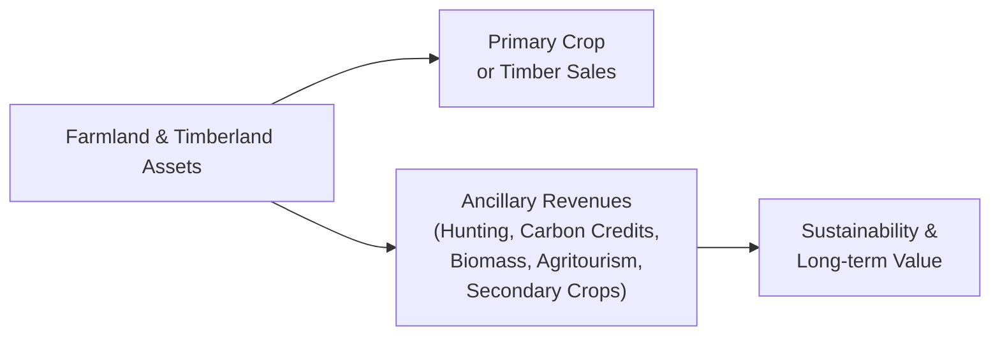

## Introduction

So, you've got a farmland or timberland investment. You're probably already laser-focused on the main event: crops or timber. But here's something that might surprise you: there are all sorts of extra ways to pull in income—often called ancillary revenue streams. These can be anything from hunting leases or carbon credits to agritourism or niche markets. In my experience, it’s these additional sources that can be the real “cherry on top,” stabilizing cash flows and supporting long-term appreciation. But of course, it takes planning, strategy, and sometimes a bit of creativity to make them work.

Below, we’ll walk through the full buffet of such ancillary revenue opportunities—how they might benefit your portfolio, what pitfalls to watch out for, and how to keep them aligned with sustainability and best practices. Let’s dive in.

## Diversified Revenue Streams and the Core Investment

When you invest in farmland or timberland, it’s not just about planting trees or tilling soil. You’re effectively buying an ecosystem. And that ecosystem can yield more than the obvious. A forest, for instance, might allow you to sell carbon credits if you manage it sustainably or add a recreational lease for hunting or fishing. On the farmland side, maybe you build an on-site store for direct sales or open your gates to visitors for farm-related events. These complementary revenue streams can help offset fluctuations in your primary market—like, if you have a down year in corn production, your agritourism side hustle might still generate profits.

Here’s a simple schematic illustrating the interplay of primary and ancillary revenue streams in farmland and timberland:

## Hunting and Recreational Leases

One of the tried-and-true ways to derive extra income from rural land is through hunting or recreational leases. These leases grant individuals—or clubs—access to your land for specific activities, such as deer hunting, fishing, birdwatching, or camping. It can be a stable source of annual income, particularly in regions where hunting seasons are well-regulated and demand is high.

• Income Potential: Depending on location and wildlife populations, annual lease payments for hunting rights can be quite lucrative, sometimes matching or even surpassing the returns from primary agricultural production.  
• Liability and Insurance: “Yes, come hunt on my land!” might open a can of worms if someone gets injured. Make sure you get the right insurance coverage and set legal disclaimers in place.  
• Management and Wildlife Preservation: Good wildlife management is essential. You can’t just let folks run wild or you might deplete the resource and degrade your land’s long-term value.  

In my opinion, hunting leases can be a perfect fit if you're prepared for a bit of extra administrative oversight. They can also help engage local communities—some landowners partner with local organizations to host youth hunts or school outings, adding yet another layer of social goodwill.

## Carbon Credits and Offsetting Emissions

With increasing corporate and governmental focus on carbon neutrality, land that can sequester carbon is in high demand. Timberland generally gets much of the spotlight here, but farmland can also sequester carbon under certain regenerative agricultural practices (e.g., no-till or reduced-till farming, cover cropping).

### How Carbon Credits Work

A carbon credit is a tradable certificate or permit representing the right to emit one ton of carbon dioxide (CO₂) or an equivalent greenhouse gas. When your managed forest or regenerative farmland sequesters carbon, you can document and certify those reductions. Ultimately, these credits are sold to organizations or companies looking to offset their emissions.

Key Considerations:  
• Certification and Verification: You typically need third-party verification to confirm your land’s carbon uptake. This can involve cost and administrative complexity.  
• Market Volatility: Carbon credit prices can fluctuate significantly, as they hinge on regulatory developments and corporate sustainability targets.  
• Long-Term Commitment: Many offset programs require you to maintain forestry or agricultural practices for a specified period. Exiting early might cause penalties or require repayment of credits.

## Biomass Energy: Wood Waste and Crop Residues

In farmland, as well as timberland, there’s often leftover material—wood waste from thinning or logging, crop residues (like cornstalks or straw), or other organic byproducts. Converting these materials into biomass energy (pellets, briquettes, ethanol, biodiesel, etc.) can yield additional revenue and support renewable energy initiatives.

### Forms of Biomass Conversion

• Wood Pellets: Excess wood chips or low-value timber can be turned into pellets, used in power generation or home heating.  
• Biofuels: Crop residues like sugarcane bagasse or corn stover can be processed into ethanol or biodiesel.  
• Biogas: Through anaerobic digestion, organic matter can produce biogas used to generate electricity or for heating.

It sounds straightforward, but keep in mind that doing it right can require significant capital investment, specialized expertise, and consistent feedstock supply. If you own thousands of acres, sure, it might pencil out. But for smaller landholdings, it might be more practical to partner with a local cooperative or processing facility.

## Agritourism for Community Engagement

If you speak to owners of farmland who have ventured into agritourism, you’ll often hear them say it’s both a fun and profitable endeavor. Agritourism, simply put, is bringing visitors onto your land for educational or recreational purposes—anything from “U-pick” orchards to wedding venues, corn mazes, and harvest festivals.

### Potential Benefits

• Diversified Income: Ticket sales, event hosting fees, produce sales, and gift shops can all add up.  
• Community Integration: Agritourism fosters local business relationships (like with caterers or event planners) and can improve the land’s reputation.  
• Marketing Channel: Showcasing your land can increase direct-to-consumer agricultural sales.  

But, as you can imagine, there are challenges. Agritourism can require significant upfront spending on infrastructure (e.g., parking, signage, restroom facilities) and compliance with local zoning and safety regulations. Plus, if you’re used to living in the peace and quiet of your farmland, the hustle and bustle of visitors might take some getting used to.  

## Secondary Crops and Niche Market Agriculture

Another route is to explore niche market agriculture—like, maybe you carve out a section of your farmland to grow medicinal herbs, specialty mushrooms, or heirloom produce. These can fetch premium prices. Similarly, in timberland, you might cultivate non-timber forest products such as ginseng, decorative pinecones, or even mushrooms like morels or chanterelles.  

Yes, it can be trickier than typical row crops, and you’ll need to find the right buyers. However, when demand is strong, the returns can be quite attractive. Some landowners partner with specialized distributors or direct-to-consumer online platforms to maximize margins.

## Operational Complexities and Management

Managing multiple revenue streams from farmland and timberland can be a balancing act. Picture trying to oversee row crops, a small biomass project, intermittent hunting leases, and an agritourism venture—oh, and maybe you’re also working on verifying carbon credits. That’s basically a diversified small business. Each revenue stream may have unique pricing dynamics, regulatory constraints, and risk exposures.

### Possible Solutions

• Specialized Management Firms: Consider hiring a professional farmland or timberland management company that has deep expertise in both primary and ancillary revenue channels.  
• Partnerships and Joint Ventures: If there’s a local ecotourism operator or carbon credit specialist, you might partner up for a profit share.  
• Technology to the Rescue: Drones, remote sensors, and big data analytics can help monitor crop health, wildlife patterns, or forest conditions and reduce on-the-ground labor costs.

## Aligning Ancillary Earnings with Sustainability

If there's one overarching theme in farmland and timberland nowadays, it’s sustainability. You’ve likely heard about sustainable yields and regenerative agriculture. Fact is, your ancillary revenue streams should be in harmony with these goals. Overhunting could harm wildlife populations; poorly executed agritourism might disrupt local ecosystems; short-sighted logging could reduce future carbon credit potential.

A well-integrated sustainable approach is often rewarded by investors and regulators. In many cases, demonstrating environmentally responsible stewardship can even boost your access to preferential financing (e.g., green bonds or sustainability-linked loans).

## Risk Management and Liability Considerations

Ancillary activities can complicate risk management. You may need different types of insurance coverage—for example, an enhanced liability policy for agritourism or hunting access. Plus, each revenue stream is exposed to unique market and operational risks:

• Hunting lease collapses if local wildlife populations fall.  
• Carbon credit markets fluctuate with policy changes.  
• Biomass revenues drop if oil prices are too low.  
• Agritourism can be impacted by weather or travel restrictions.

Mitigating these risks through diversified streams is often helpful—but you still need a clear plan, robust insurance coverage, and maybe some legal disclaimers or indemnification clauses in your lease agreements.

## Valuation and Performance Measurement

From a CFA perspective, one of the coolest parts about ancillary revenues is how they influence valuation. When you forecast future cash flows in a discounted cash flow (DCF) approach, these extra streams can add incremental value. You might see them reflected in a farmland or timberland’s higher capitalization rate (cap rate) because there’s a stable or growing set of diversified revenue sources.

However, keep in mind that appraisers and underwriters often want a track record. They might discount projected ancillary revenues if they believe they are speculative or uncertain. Careful documentation—like written lease agreements, receipts from agritourism, or carbon credit certifications—helps show these revenues are real and sustainable.

## Example Case Studies

1. Timberland Carbon Credits in the Pacific Northwest:  
   A landowner discovered that selectively harvesting timber, while preserving large sections for carbon sequestration, yielded stable returns from carbon credits. Over a 10-year period, carbon credit income reached about 20% of total revenue—significant enough to hedge against unpredictable stumpage prices.

2. Farmland Agritourism in Tuscany:  
   A family vineyard added weekend tasting tours and a small B&B. After three years, agritourism revenue made up nearly 30% of total profits. They also established a brand for direct-to-consumer wine sales, expanding their profit margin well beyond the wholesale market.

## Exam Relevance

At the CFA Level III (and also relevant at Level I for foundational knowledge) you might face questions on real asset portfolio allocation, diversification benefits, and the factors influencing farmland and timberland valuations. Ancillary revenue streams can appear in scenario-based questions testing your understanding of how these affect cash flow forecasts, risk assessments, and portfolio diversification. You may also be asked to calculate how carbon credit income might alter required returns or how hunting leases could change the volatility profile of an investment in farmland.

In constructed-response (essay) questions, you might be given a case where an investor is weighing farmland with or without additional revenue streams. You’d be asked to describe the impact on valuation or risk exposures. Or you might be asked about ethical considerations and best practices when implementing agritourism or recreational leases.

## Key Takeaways and Best Practices

• Ancillary revenues—from hunting leases to carbon offsets—can stabilize or boost overall returns.  
• Each stream has unique operational and regulatory challenges: be sure you have the right expertise and legal safeguards.  
• Aligning with sustainability is important both ethically and from a value-creation perspective.  
• Thorough documentation and, ideally, a track record of ancillary revenues can enhance property valuation.  
• Diversify responsibly; don’t overextend management’s capacity to handle complex or conflicting ventures.

## References and Further Reading

• The Carbon Farming Solution by Eric Toensmeier  
• State forestry extension offices (varies by region) for guidelines on secondary forest products and recreational lease regulations  
• CFA Institute’s continuing education resources on real asset investing  
• USDA (United States Department of Agriculture) publications on agritourism and niche crops  
• “Agritourism and Nature Tourism in California” by the University of California

---

## Test Your Knowledge: Ancillary Revenues in Farmland and Timberland



### Which of the following describes a recreational lease in the context of farmland and timberland?

- [ ] It is a lease for machinery used on the farm.
- [x] It is an agreement granting legal access to land for hunting, fishing, or other recreational activities.
- [ ] It is an exclusive right to harvest timber from public forests.
- [ ] It is a lease strictly intended for carbon sequestration.

> **Explanation:** A recreational lease involves granting outsiders permission to use the land for activities like hunting or fishing in exchange for payment.  

### Which of the following is a potential benefit of carbon credit programs for timberland or farmland owners?

- [ ] Guaranteed increase in local wildlife populations.
- [ ] Elimination of all insurance needs tied to land access.
- [x] Stable auxiliary income derived from verified carbon sequestration.
- [ ] Mandatory overharvesting of trees to generate more credits.

> **Explanation:** When landowners either preserve or expand forested areas and manage them sustainably, they can earn revenue by selling carbon credits to firms aiming to offset emissions.  

### Why might agritourism require significant upfront investment?

- [ ] Because it automatically includes the cost of carbon offset purchases.
- [ ] Because farmland owners are taxed at higher rates under agritourism.
- [x] Because facilities, legal compliance, and visitor logistics must be established.
- [ ] Because regulators often prohibit any form of public attraction on farmland.

> **Explanation:** Turning a farm or timberland into a place that welcomes visitors often necessitates infrastructure like parking, restrooms, signage, plus meeting local zoning and liability requirements.  

### A landowner exploring biomass energy production from wood waste would likely need to:

- [x] Secure a reliable feedstock supply and possibly invest in specialized equipment.
- [ ] Completely ban visitors to protect the biomass supply.
- [ ] Convert the entire land to an agritourism site.
- [ ] Eliminate any sustainable yield practices to maximize wood extraction.

> **Explanation:** Biomass energy typically involves consistent production processes requiring specialized equipment (e.g., pelletizing machinery) and a stable supply of wood or agricultural residue.  

### Which is the best example of a secondary crop in forestry?

- [x] Medicinal plants or specialty mushrooms grown under a forest canopy.
- [ ] Mass-produced industrial corn or soy fields.
- [x] Wild ginseng cultivated in suitable woodland conditions.
- [ ] Selling only the main timber harvest each year with no diversification.

> **Explanation:** Secondary or niche crops often include specialty plants (ginseng, mushrooms, herbs) that thrive in a forest environment and can fetch premium prices.  

### Which of the following is a key risk factor specifically associated with hunting leases?

- [ ] Inability to generate any revenue from farmland and timberland due to government controls.
- [ ] Guaranteed destruction of wildlife habitat without any possibility of supervision.
- [x] Liability and insurance exposures if accidents happen on the property.
- [ ] Complete elimination of all wildlife from the area.

> **Explanation:** Hunting leases can generate extra income, but accidents or injuries on the land can expose the owner to liability issues, making proper insurance and legal protections paramount.  

### Which statement about carbon credit prices is accurate?

- [x] They can fluctuate significantly due to changing regulations and corporate demand.
- [ ] They are fixed by global treaties at a stable constant price.
- [x] They never require third-party verification.
- [ ] They only apply to farmland, not timberland.

> **Explanation:** Carbon markets are dynamic; prices depend on regulation, corporate demand, and broader economic conditions. Verification is typically required to authenticate credits.  

### What is one potential downside of agritourism?

- [x] The need for substantial investment in visitor facilities and infrastructure.
- [ ] The total ban on sustainable yield forestry practices.
- [ ] Lack of direct access to consumers.
- [ ] Reduced brand awareness in local communities.

> **Explanation:** Agritourism can be profitable, but the cost to build and maintain adequate visitor infrastructure—even for simple tours—can be substantial.  

### How do ancillary revenues affect farmland or timberland valuations?

- [x] They can increase valuation through additional, albeit potentially uncertain, cash flows.
- [ ] They have no impact on property valuation.
- [ ] They always reduce the property’s value due to higher operating costs.
- [ ] They typically result in lower appraisal estimates unless farmland usage is suspended.

> **Explanation:** When ancillary revenues are credible and sustainable, appraisers often factor them into a higher appraised value or lower cap rate, recognizing the diversified income stream.  

### Managers considering hunting leases, agritourism, or biomass energy must align these with sustainability goals. True or False?

- [x] True
- [ ] False

> **Explanation:** While these activities can improve profits, mismanagement can degrade the land or contradict sustainability objectives. It’s important to ensure each revenue stream is implemented responsibly.  


