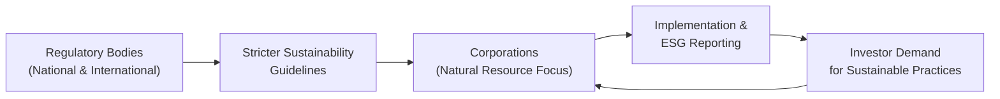
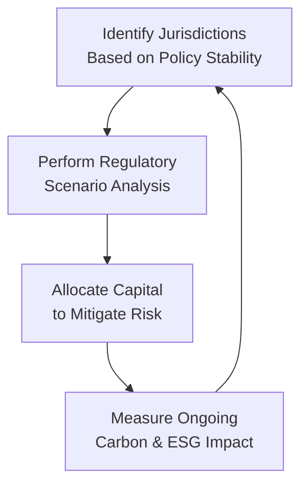

## Introduction

Imagine you’re chatting with a close friend over coffee, by a sunny window, about how resource extraction—like farming, timber, or mining—fits into the global push for climate stability. The conversation might meander from the Paris Agreement’s climate goals to local zoning laws that affect farmland usage. And if you’re like me, you might even recall that time you visited a sustainable forestry project and were struck by the complexity of ensuring trees keep growing while investors expect returns. It can feel overwhelming at first, but trust me, once you see the big picture, it’s both fascinating and impactful. 

This section explores the global regulatory structures that govern natural resources, along with the sustainability targets that shape how we harvest, trade, and invest in them. We’ll take a look at major international treaties, reporting frameworks, and real-world examples. You’ll see how all these rules and guidelines can make or break a natural resource project’s bottom line—and, ultimately, the environment we rely on.

## Global Treaties and Frameworks

Sustainability in natural resources is influenced by a patchwork of global agreements. Some of the most notable ones include:

• Paris Agreement  
• CITES (Convention on International Trade in Endangered Species)  
• UN Global Compact  

Let’s walk through each of these major agreements to get a sense of how they influence the supply and demand of natural resources worldwide.

### The Paris Agreement

The Paris Agreement, finalized in 2015, aims to keep global temperature rise well below 2°C above pre-industrial levels. This target has serious implications for commodity-intensive industries like oil, gas, and minerals. Countries set national contributions (often called Nationally Determined Contributions, or NDCs), which can reduce consumption of certain fuels or encourage transitions to cleaner energy sources.

• Why it Matters: The shift to lower emissions often requires major changes in how industries function—think carbon pricing, or restrictions on coal-fired power. For natural resource investors, it means factoring in the long-term viability of energy-related projects.

### CITES (Convention on International Trade in Endangered Species)

CITES focuses on protecting endangered fauna and flora from over-exploitation. This matters for industries such as fisheries, timber, and exotic animal products.

• Why it Matters: An investment in exotic timberland could face strict export restrictions if those timber species are protected by CITES. Unexpected compliance costs or even bans can arise quickly, impacting valuations.

### UN Global Compact

This is a voluntary initiative encouraging businesses to adopt sustainable practices. It sets out principles relating to human rights, labor, the environment, and anti-corruption.

• Why it Matters: Signing up to (and actually adhering to) the UN Global Compact can boost a company’s reputation among investors who are keen on Environmental, Social, and Governance (ESG) factors. Non-compliance can invite reputational risk, which is sometimes more damaging in the long run than direct financial penalties.

## National Regulatory Approaches

While global treaties set broad targets, the day-to-day regulation of natural resources often unfolds at the national or local level. Governments do a variety of things to balance domestic economic priorities with sustainability goals:

• Imposing quotas on how much resource can be extracted (e.g., fishing quotas).  
• Levying tariffs on certain commodities (e.g., agricultural exports).  
• Offering subsidies for renewable energy or sustainable farming practices.  

Let’s consider a practical example: Suppose you have farmland in a country that suddenly restricts exports of a key crop to manage domestic supply. The immediate effect is oversupply at home, driving prices down. This might sound bleak for an investor, but the same country might also have tax breaks or subsidies for growing alternative sustainable crops. So your farmland strategy has to pivot, balancing the changing policies to remain profitable.

### Environmental Protection Acts

Many developed countries (and quite a few developing ones) have Environmental Protection Acts that set out guidelines for pollution, land use, water rights, and more. Sometimes it’s straightforward, like limiting how many hectares of forest can be felled each season. Other times, the regulations can be so complex that natural resource managers hire entire teams of compliance officers to navigate them.

### Water Rights and Land Use

For farmland, timberland, and other resource-focused operations, water rights can be as significant as the land ownership itself. Some jurisdictions treat water as a public good, severely restricting private usage. Others allow private ownership of water resources but require expensive licenses to drill wells. This is a deal-breaker if you’re irrigating large tracts of farmland. So, always double-check local water rights frameworks before inking a big farmland acquisition.

## Corporate Reporting Standards: TCFD and Beyond

Corporations and asset managers face growing pressure to disclose climate-related risks. The Task Force on Climate-related Financial Disclosures (TCFD) urges companies to provide consistent, reliable, and transparent reporting of how climate change could affect them. 

• Target Key Areas: Governance, strategy, risk management, metrics, and targets.  
• Practical Example: If you run a timberland investment fund, TCFD might require you to model how a prolonged drought or pest infestation caused by climate shifts would impact your yields and profitability.

This kind of disclosure is often not just a “nice to have” for ESG-savvy investors—it may be mandatory for certain exchange listings or as part of a regulatory compliance package. So, from a capital-raising perspective, robust climate disclosures can be a major advantage.

## Synergy Between Regulation and Sustainability

We often see a virtuous cycle: regulators set stricter environmental standards, investors demand more sustainable practices, and corporations comply to attract capital. Over time, responsible resource management becomes both a legal requirement and a competitive advantage. 

Have you ever witnessed how quickly a reputation can shift? I remember a mining conglomerate that faced a lawsuit for groundwater contamination. Although they technically followed national rules, public sentiment turned the event into a big fiasco for them, forcing the board to pivot and adopt overhauled sustainability measures. After that, some big institutional investors returned, but only after the company pledged to meet a higher sustainability benchmark aligned with TCFD.

Below is a simplified diagram illustrating the interplay among regulations, investor demand, and corporate behavior:

The flow shows how stricter sustainability guidelines encourage corporations to implement and report ESG strategies. These efforts then feed into growing investor demand, continuing the loop that fosters even stronger guidelines over time.

## Cross-Border Norms: Carbon Border Adjustments and ETS

Another cross-border phenomenon is the concept of carbon border adjustment. This imposes tariffs on imports based on their carbon footprint. The rationale is to prevent “carbon leakage,” where companies move production to jurisdictions with looser standards to avoid higher emissions costs.

Additionally, many regions are experimenting with Emission Trading Schemes (ETS). Essentially, these frameworks set a cap on emissions, and companies buy or sell allowances to stay under that cap. If you’re in oil & gas or steel manufacturing, you might pay more if you exceed your emission limits. On the flip side, you can profit if you discover low-carbon technologies and sell your extra allowances on the open market.

It’s important to keep these cross-border norms in mind when analyzing commodities. A country with a strict ETS might produce fewer carbon-intensive goods, driving up global prices but potentially losing market share to countries without such a system—unless, of course, carbon border adjustments are in place.

## Regulatory Burdens for Launching Natural Resource Funds

When launching a natural resource-focused fund—say, a farmland or timberland fund—there’s more than just local licensing to worry about. Foreign ownership limits can cap the percentage of land or resources outsiders can own. Some countries impose high withholding taxes on repatriated profits. Others require a local partner who holds a certain percentage of the enterprise.

These complexities can influence:

• Fund structure: Onshore vs. offshore, or a blend.  
• Investor suitability: Certain jurisdictions only allow accredited or institutional investors for these “risky” or “illiquid” assets.  
• Compliance costs: Ongoing legal and consulting fees to ensure compliance with evolving rules.

## Practical Examples and Case Studies

### Farmland Investment in Country X

Suppose you set up a farmland investment in Country X to produce high-quality grains. Midway through your project, the government decides to limit the volume of grains that can be exported, in response to a food security scare. Suddenly, your business model—predicated on exporting premium grains at a high international price—faces a price slump in the domestic market. 

Ways to cope might include:  
• Pivoting to alternative crops that have fewer export restrictions.  
• Seeking government incentives for adopting climate-resilient seeds.  
• Diversifying the farm’s revenue by adding agri-tourism or solar panels (where possible).

### Timberland Fund in an Environmentally Sensitive Region

A timberland fund invests in a region known for dense biodiversity. Because of local environmental regulations—to protect certain bird species, for instance—there are seasonal logging restrictions. This reduces the harvest window to specific months. The fund’s operating costs rise due to less flexible scheduling, but the brand recognition of “sustainably harvested” timber can justify a premium price among eco-conscious buyers. 

In the end, the market might compensate you for these higher compliance costs if you market your product well and ensure the operation meets recognized eco-certifications.

## Best Practices and Potential Pitfalls

When dealing with the global regulatory landscape:

• Stay Current: Regulations evolve. Keep an ear to the ground.  
• Engage Local Experts: Don’t assume foreign regulations mirror your home country’s.  
• Transparency in Reporting: Adopting TCFD or equivalent frameworks can build trust with investors.  
• Avoid Greenwashing: Don’t exaggerate your sustainability claims—once discovered, it can be a reputational disaster.  
• Diversify Regulatory Risk: Operating in multiple jurisdictions reduces the chance a single country’s policy change disrupts your entire operation.  
• Plan for Carbon Pricing Shifts: Even if your region doesn’t have carbon border adjustments now, it just might in a few years.

## Linking Regulation to Portfolio Strategy

Regulatory factors can be a critical piece in portfolio construction and risk management. For instance, if you’re building a diversified natural resource portfolio, you might favor jurisdictions with predictable regulations over those with inconsistent policies—even if the latter promise higher nominal returns. Stability saves you from nasty surprises, and markets often reward consistent performance over sporadic high returns.

Some advanced portfolio managers even run scenario analyses. For example, “If the carbon border adjustment kicks in, how does that reshape returns for an aluminum smelter in Country A?” Tools like Monte Carlo simulations help quantify the range of outcomes, considering different pathways for regulations.

This cycle ensures continuous reevaluation of policy conditions, capital allocation, and sustainability performance.

## Conclusion and Takeaways

Frankly, while grappling with global regulatory frameworks can be daunting, the payoff is clearer accountability, reduced risk exposure, and alignment with the rising tide of ethical investing. I’ve seen how investors who understand these dynamics—and truly internalize them, not just treat them as a box-ticking exercise—tend to build more resilient portfolios. 

Regulations will keep evolving, especially as climate considerations move into the mainstream. The better we adapt, the more effectively we can manage risk, find opportunities, and encourage resource conservation. After all, the natural resource landscape isn’t just about profits—it’s about ensuring that forests (and farmland, and fisheries) remain viable for future generations.

## References and Further Reading

• United Nations Sustainable Development Goals (SDGs):  
  https://sdgs.un.org/  

• “Sustainability Accounting and Accountability” by Mathew, Owen, and Gray.

• Official guidelines of the TCFD:  
  https://www.fsb-tcfd.org/  

• Paris Agreement (2015).

• UN Global Compact:  
  https://www.unglobalcompact.org/  

• CITES (Convention on International Trade in Endangered Species):  
  https://cites.org/  

--------------------------------------------------------------------------------

## Test Your Knowledge: Global Regulatory Landscape and Sustainability



### Which global accord aims to limit global temperature increase to well below 2°C above pre-industrial levels?

- [x] The Paris Agreement
- [ ] The Kyoto Protocol
- [ ] The Montreal Protocol
- [ ] The Basel Convention

> **Explanation:** The Paris Agreement (2015) specifically aims to limit warming to well below 2°C above pre-industrial levels by encouraging nations to cut emissions.

### Which statement best describes CITES?

- [x] It regulates the international trade in endangered species.
- [ ] It establishes a global carbon tax for major polluters.
- [ ] It is a framework for corporate climate-risk disclosure.
- [ ] It sets uniform tariffs on agricultural exports.

> **Explanation:** CITES is an agreement ensuring that the trade in endangered wild animals and plants does not threaten their survival.

### A key feature of TCFD is:

- [x] Requiring consistent disclosure of climate-related financial risks.
- [ ] Setting mandatory carbon prices for multinational firms.
- [ ] Monitoring exchange rates for resource-rich nations.
- [ ] Prohibiting foreign ownership in agricultural land.

> **Explanation:** The TCFD outlines best practices for disclosing the financial impacts of climate risks, promoting uniformity and transparency in reporting.

### Which of the following is typically used to prevent “carbon leakage”?

- [ ] Free allocation of emission allowances.
- [x] Carbon border adjustments.
- [ ] Subsidies for conventional fossil fuels.
- [ ] Complete ban on coal-based exports.

> **Explanation:** Carbon border adjustments impose tariffs based on carbon footprints, preventing companies from relocating to jurisdictions with weaker emission rules just to avoid carbon costs.

### What is the primary rationale behind water rights regulations in farmland investments?

- [x] Ensuring sustainable water usage and access for local communities.
- [x] Preventing over-extraction that leads to high social costs.
- [ ] Restricting farmland to local ownership only.
- [ ] Minimizing pesticide usage on farmland.

> **Explanation:** Water rights rules protect sustainability and equitable access. Over-extraction can deplete shared resources, causing negative social and environmental outcomes.

### Which regulatory factor could most directly halt an investor’s export-driven farmland strategy?

- [x] Imposition of export quotas by local authorities.
- [ ] Foreign ownership restrictions.
- [ ] Corporate tax increases.
- [ ] TCFD disclosure requirements.

> **Explanation:** Export quotas directly reduce or halt exports, forcing the investor to sell domestically at potentially lower prices.

### A timberland fund invests in a region with a short logging season due to biodiversity rules. This might:

- [x] Increase operating costs from seasonal restrictions.
- [ ] Eliminate all investor demand.
- [x] Potentially allow the timber to command a premium for sustainability.
- [ ] Automatically violate TCFD guidelines.

> **Explanation:** Seasonal logging constraints can raise costs, but the “sustainably harvested” label can fetch a market premium, potentially offsetting some of those higher costs.

### Which of the following is LEAST likely to be part of the UN Global Compact?

- [x] Imposing mandatory net-zero targets for signatories.
- [ ] Encouraging socially responsible corporate practices.
- [ ] Upholding anti-corruption principles.
- [ ] Promoting environmental sustainability.

> **Explanation:** The UN Global Compact is primarily a voluntary set of principles for sustainability and corporate responsibility, not a framework for imposing mandatory net-zero targets.

### Emission Trading Schemes (ETS):

- [x] Allow companies to buy or sell emission allowances under a set cap.
- [ ] Automatically replace all traditional energy sources with renewables.
- [ ] Are enforced only in developing economies.
- [ ] Ban carbon-intensive projects in all signatory nations.

> **Explanation:** ETS is a market-based mechanism that sets an overall cap on emissions, with tradable allowances letting firms manage their own compliance.

### True or False: Adopting TCFD guidelines often strengthens investors’ trust by clarifying how a company manages climate-related risks.

- [x] True
- [ ] False

> **Explanation:** Transparent climate-risk disclosure under TCFD can improve stakeholder confidence, offering clear insights into a company’s resilience against climate-related challenges.


