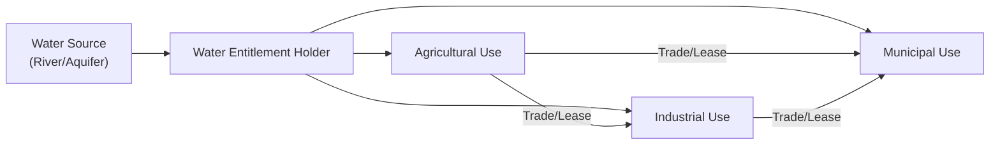

## The Global Importance of Water

Water is one of those things we often take for granted—turn the tap, and it’s just there. But in the realm of alternative investments, water has gained increasing prominence as a strategic resource that directly impacts farmland values, industrial processes, and even human consumption patterns. I remember speaking with a farmland investor who joked, “You can grow anything if you have good water—or basically nothing if you don’t.” It was a stark reminder that water availability can make or break entire agricultural operations.

From an investment standpoint, water is essential for producing the food that fuels global communities, the energy that keeps industries humming (think hydropower), and core industrial processes such as cooling systems in manufacturing plants. Because water has become more scarce in certain regions—due to factors like population growth, climate change, and pollution—its strategic significance has soared. Therefore, anyone evaluating farmland or resource-based investments would do well to appreciate the nuances of water availability, pricing, and regulatory structures.

## Understanding Water Rights

Water rights are not as straightforward as owning a share of stock; they’re shaped by centuries of legal tradition, local regulatory frameworks, and physical geography. Two traditional doctrines you might see in a global context are riparian rights and prior appropriation rights.

• Riparian Rights: Under this doctrine, landowners whose property adjoins a river, lake, or stream enjoy the right to make “reasonable use” of that water. These so-called riparian rights (sometimes you’ll see the term in legal documents) assume that everyone with riverfront property is entitled to the natural flow, provided they don’t substantially diminish its availability for downstream neighbors.

• Prior Appropriation: This system is common in parts of the western United States. In a nutshell, it’s “first in time, first in right.” Users who can demonstrate that they were the first to stake a claim to a certain volume of water, say for irrigation or industrial use, get priority in times of shortage. Everyone else has to line up behind the senior right holders. In regions prone to drought, that line can get very long.

We also can’t overlook groundwater regulation—how water beneath the earth’s surface is monitored and extracted. Some jurisdictions allow landowners to pump groundwater with few restrictions, while others enforce strict permitting systems to keep aquifers from being overdrawn. Aquifer depletion is a scary prospect, especially if long-term pumping exceeds natural recharge rates.

## Water as an Investment Opportunity

It might feel strange to view water mostly as a financial proposition, but consider farmland values. In many agricultural regions (California’s Central Valley is a well-known case), farmland that has secure water rights tends to trade at a premium. The logic is simple: reliable water supports higher crop yields, which in turn boosts farm profitability. Or if there’s a water entitlement system in place, investors can sometimes lease or trade unused entitlements, creating an additional revenue stream.

Water rights can also be bundled with investments in farmland REITs or private equity funds focusing on agriculture. In these portfolios, water availability acts as both a risk factor and a potential source of alpha (outperformance). You’ll see managers who specialize in farmland investing pay careful attention to irrigation technology, local governance of water, and sustainability credentials.

Besides farmland, there are more direct investments—purchasing actual water entitlements, or owning shares in water-focused companies (technology, desalination, pumps, or pipe manufacturing). However, these investments often come with considerable regulatory and ethical complexities because water is viewed by many as a public good, not merely a private asset.

## Market Mechanisms: Trading Water Entitlements

In an effort to achieve better resource allocation, certain regions allow trading of water entitlements. The basic idea is that water goes to where it’s valued the most. For instance, an industrial user might be willing to pay a higher fee for a certain volume of water than a lower-value agricultural user. By enabling open-market transactions, the system rewards water conservation—farmers who adopt more efficient irrigation can sell any leftover allocation.

Below is a simplified mermaid diagram illustrating the flow of water rights and trading among different stakeholders:

In some markets, the traded assets are known as water entitlements (the legal right to extract a certain volume of water). Prices can fluctuate seasonally (imagine prices shooting up during droughts or at times of peak planting). Traded markets for water are still evolving, and liquidity may be limited in certain jurisdictions, but they can be incredibly valuable for smoothing out supply and demand imbalances.

## Impact of Climate Change on Water Availability

Climate change is like the ultimate disruptor for global water cycles. Warmer temperatures can lead to increased evaporation and shifts in precipitation patterns, with some areas receiving excess rainfall while others suffer prolonged droughts. Changes to snowpack and glacial melts can also alter the timing of water flows, affecting both agriculture and hydropower generation. A region that once relied on a stable mountain snowpack for a summer water supply might suddenly face shortage threats.

In this environment, farmland yields and energy production (particularly hydropower) are highly sensitive to water availability. Commodity prices for crops reliant on irrigation (e.g., almonds, rice, or even wheat in semi-arid zones) may exhibit higher volatility if water constraints become a bottleneck. Additionally, industrial facilities may need to invest in alternative cooling technologies if reservoir levels grow unreliable for water-intensive processes.

## Sustainability and Conservation Initiatives

Given these challenges, sustainability efforts for water conservation have taken center stage. Investors are increasingly recognizing that adopting best practices in water usage can enhance long-term returns and reduce risk. Here are some prominent sustainability strategies:

• Drip Irrigation: Instead of flooding entire fields, drip systems deliver water directly to the plant roots, reducing waste and evaporation. It can dramatically improve irrigation efficiency—essentially, you get more crop per drop.

• Rainwater Harvesting: Collecting rainwater in large cisterns or ponds can help offset dry spells, giving farmers or industrial facilities a buffer before tapping into aquifers or municipal supplies.

• Desalination: In coastal regions, desalination offers a potential new source of freshwater when groundwater or surface water is insufficient. However, it’s energy-intensive, so the cost can be high. Advances in technology have made it more feasible, but it still requires thoughtful environmental impact assessments.

• Wastewater Treatment and Reuse: This involves recycling wastewater to provide a non-potable supply for irrigation, industrial processes, or cooling. Treated gray water or recycled water is a cheaper and more sustainable option than drawing from freshwater sources in many cases.

These efforts add up to something known as water stewardship—companies and investors strive to be good custodians of local water resources, respecting the needs of local communities and natural ecosystems. Not only is this good for brand reputation, but major institutional LPs (e.g., pension funds) often require robust sustainability policies as a condition of capital allocation.

## The Water-Energy-Food Nexus

Water, energy, and food are like three siblings in the same family: you can’t really talk about one without involving the other two. If you want to increase food production, you often need more water and energy (for irrigation, fertilizers, and food processing). Generating more energy from hydropower might take away water from agriculture downstream. Or perhaps you turn to biofuels, which ironically can be more water-intensive than you think.

In regions facing water stress—a mismatch in supply and demand—managing this nexus becomes even more complex. Governments might prioritize commercial agriculture for export crops, while local communities struggle to secure a consistent water supply for daily life. Conflicts can arise if water is diverted away from small-scale farmers or ecological flows, such as habitat for endangered species.

Looking ahead, some estimates suggest global water demand could outstrip supply by a significant margin if current trends continue. That’s why integrated water resource management (IWRM) is seen by many experts as the key to balancing these competing uses.

## Risk Assessment and Due Diligence

From a CFA Level I perspective, analyzing water rights can be a critical part of investment due diligence—particularly for farmland, natural resource projects, or infrastructure deals. Some of the questions you might consider:

• Reliability of Water Rights: Are they secure and clearly documented, or subject to legal disputes? Prior appropriation rights, for instance, might rank lower if they are junior in priority.

• Regulatory Environment: Are there upcoming policy changes? Sometimes the government can reclassify water uses or restrict pumping in severely overdrawn aquifers. That might impact a project’s feasibility.

• Cost of Access: Even if water is available, is it too expensive to transport or pump? Desalination can be a game-changer in coastal areas, but it comes at a cost.

• Stakeholder Conflicts: Local communities, environmental groups, or indigenous peoples might contest large-scale water extractions if it threatens ecosystems or interferes with traditional water use.

• Insurance and Hedging: Is there coverage for drought-related losses? Some regions have parametric insurance options triggered by rainfall deficits or reservoir levels.

Investors who fail to account for these water-related risks might discover their future profits evaporate, no pun intended.

## Integrating Water Resource Management

Integrated water resource management (IWRM) takes a holistic view by considering ecological, social, and economic factors when allocating and regulating water usage. Instead of leaving each player to fend for themselves, IWRM encourages governments, businesses, farmers, and communities to coordinate for the long-term health of the watershed.

An IWRM approach might set limits on total water extractions, mandate certain conservation measures, or invest in infrastructure (like dams, reservoirs, or artificial recharge basins) that store water during wet seasons. It also places an emphasis on transparency—making water usage data publicly available so that participants can plan more effectively.

When an investor aligns with these principles, it’s easier to build a positive relationship with local stakeholders. This can reduce friction, accelerate permitting, and create a positive impact on the ecosystem. Moreover, many institutional clients want their capital to flow into projects that demonstrate strong environmental and social governance (ESG) criteria.

## Concluding Thoughts

Water is literally the foundation of life and livelihood—almost every economic activity depends on it. For farmland and other natural resource investments, reliable water access can be the linchpin of profitability. It’s not just about having a river nearby; it’s also about legal certainty, sustainable usage, and adaptive management in the face of climate change.

I like to think of water as a shared asset that demands practical solutions and long-term thinking. Perhaps the next time you sip a glass of water, you’ll reflect on how many stakeholders it passed through—farmers, municipal water treatment, and the broader environment. For alternative investors, that glass represents not just a fundamental resource, but also an area rich with risk, opportunity, and responsibility. Balancing economic returns with social and environmental obligations is the key to ensuring water remains viable for future generations.

## Exam Relevance and Practical Tips

• In a CFA exam context, you might see scenario-based questions about farmland investments hinged on water availability. Understanding riparian vs. prior appropriation rights is crucial for analyzing where the water risk lies.

• Case studies could focus on how climate-induced droughts impact both farmland yields and commodity prices, requiring you to evaluate hedging strategies or incorporate parametric insurance.

• You might face item-set or constructed-response questions dealing with advanced sustainability metrics like irrigation efficiency or the capital expenditures needed for desalination systems.

• Don’t overlook stakeholder management in a potential question. The exam may test your knowledge of how to handle competing priorities—ecological conservation, civic water supplies, or farmers’ income.

• Common pitfalls include underestimating the cost of water transport or ignoring the possibility that local regulations can change drastically in water-stressed regions.

• Time management in essay questions: provide concise, well-structured answers. Always connect water rights or conservation measures back to the potential economic implications for the investment.

## References

• Fishman, Charles. “The Big Thirst: The Secret Life and Turbulent Future of Water.”  
• Global Water Partnership: https://www.gwp.org/  

Below are a few other references you might find useful for deeper reading:  
• “Water Resource Economics” by Ronald Griffin.  
• United Nations Food and Agriculture Organization (FAO) resources on agriculture and water.  
• World Bank reports on water scarcity and global development.  

---

## Check Your Knowledge: Water Rights and Sustainability Quiz



### Which of the following statements best describes the essence of riparian rights?

- [x] Landowners adjoining a watercourse have the right to make reasonable use of that water.
- [ ] The first individual to claim water rights by law gets priority in drought conditions.
- [ ] All groundwater resources belong to the federal government.
- [ ] Landowners owning property far from a water source can still take equal shares.

> **Explanation:** Riparian rights grant water-use entitlements to those whose land directly borders a body of water, with the condition of “reasonable use” and non-interference with other riparian landowners.

### With prior appropriation, what principle primarily governs water access in times of shortage?

- [ ] The largest municipal user takes precedence.
- [x] Seniors in the priority line gain access before junior rights holders.
- [ ] All rights holders must share equally, irrespective of historical use.
- [ ] Federal priority overrides any prior appropriation system.

> **Explanation:** Under prior appropriation, access follows a “first in time, first in right” principle, meaning the earliest documented user has priority in water allocation over later entrants.

### Which sustainability strategy aims to channel water directly to plant roots to minimize evaporation?

- [x] Drip irrigation
- [ ] Natural flooding
- [ ] Intensive sprinkler systems
- [ ] Rain-fed agriculture

> **Explanation:** Drip irrigation conserves water by delivering it precisely to where crops need it. This significantly reduces waste compared to traditional flooding or broad-sprinkler methods.

### Investment considerations for water rights in farmland often include:

- [x] Clearly documented legal entitlements to water.
- [ ] Zero reliance on local rainfall or irrigation infrastructure.
- [ ] Minimal concern about aquifer depletion.
- [ ] Complete independence from regulatory changes.

> **Explanation:** When considering farmland investments, investors typically review the reliability and documentation of water rights, along with potential regulatory shifts and physical risks related to water availability.

### In a water trading system, which entity is most likely to pay higher prices for water entitlements?

- [ ] Low-value crop farmers
- [x] High-value industrial users
- [ ] Municipal communities
- [ ] Environmental agencies

> **Explanation:** Industrial users often have higher profit margins or urgent operational needs, making them more willing (and able) to pay premium prices if it ensures a stable and consistent water supply.

### Desalination is best described as:

- [x] A process of removing salt and minerals from seawater to produce freshwater.
- [ ] A method of channeling groundwater to coastal regions.
- [ ] A recycling system for agricultural runoff.
- [ ] A technique of drilling deeper wells beyond 1,000 feet.

> **Explanation:** Desalination transforms saltwater into potable or irrigation-quality water. Although it’s resource-intensive, it can offer a robust solution where freshwater is scarce.

### A region that is experiencing “water stress” can be said to:

- [x] Have demand for water that significantly exceeds available supply.
- [ ] Only rely on rain-fed agriculture.
- [x] Face potential conflicts among stakeholders due to tight water resources.
- [ ] Have no need for advanced irrigation because of abundant aquifers.

> **Explanation:** Water stress describes a situation in which available resources fall short of meeting the total demand, often prompting competition and higher risk of conflict.

### Which of the following represents a key advantage of integrated water resource management (IWRM)?

- [x] It coordinates multiple sectors and stakeholders to manage water sustainably.
- [ ] It limits water rights to only the most profitable farms.
- [ ] It eliminates all forms of private water trading and leasing.
- [ ] It directs all water ownership directly to the government.

> **Explanation:** IWRM considers ecological, social, and economic dimensions, bringing together diverse parties to ensure balanced, sustainable use of water resources.

### How can investors mitigate water-related risks in farmland portfolios?

- [x] Secure reliable water rights and adopt efficient irrigation systems.
- [ ] Completely ignore local community concerns and regulatory shifts.
- [ ] Invest only in regions with zero drought history.
- [ ] Focus on single-crop strategies with high water usage.

> **Explanation:** Strategies might include obtaining strong water-rights documentation, improving irrigation technology, and engaging constructively with local regulations and communities.

### True or False: Climate change can affect the timing of water flows, influencing both agricultural and hydropower production.

- [x] True
- [ ] False

> **Explanation:** A shift in precipitation patterns, snowpack melt rates, and overall climate trends can radically alter when and how much water is available for irrigation or power generation.


