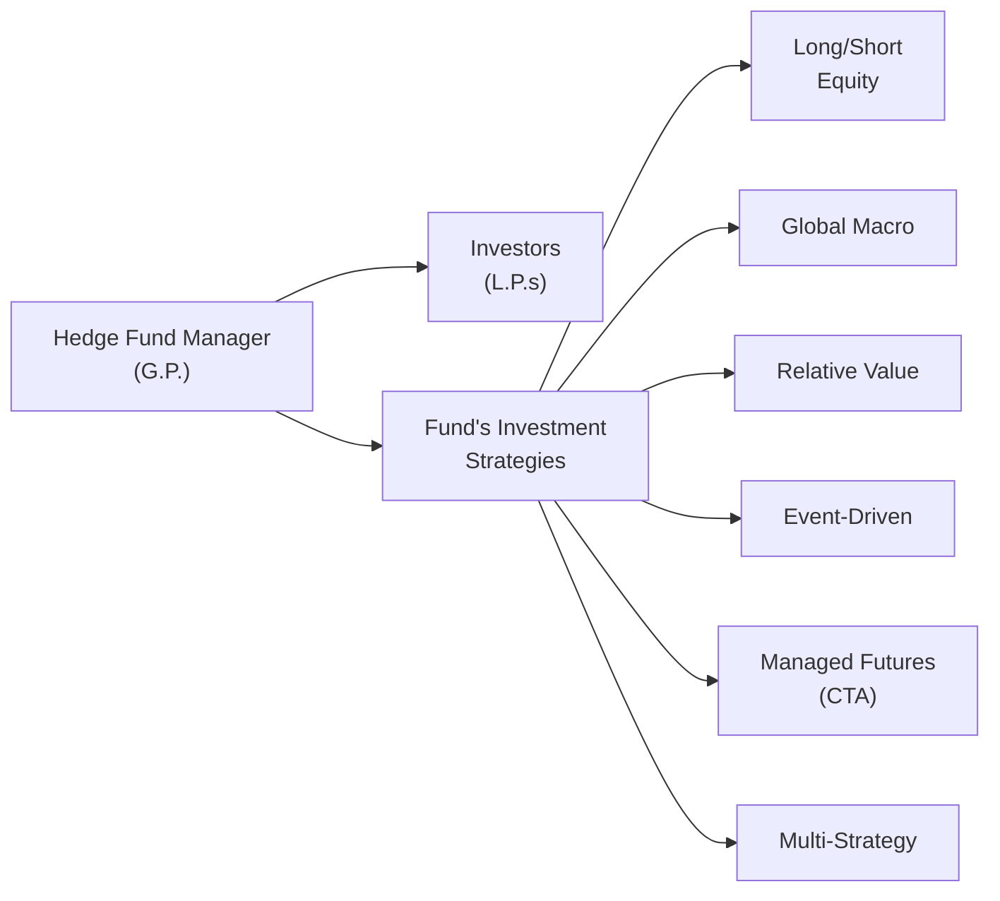

## Introduction

If you’ve ever chatted with someone who claims, “My friend invests in a hedge fund and it’s like magic: the returns go up whether stocks go up or down,” you might’ve been both intrigued and a little skeptical. Don’t worry—you’re not alone! Hedge funds can appear mysterious, but at their core, they’re just specialized investment vehicles aiming to generate “absolute returns” by employing unique strategies and sometimes aggressive techniques. 

Hedge funds are often praised for their potential to offer portfolio diversification, capital preservation, and alpha generation (i.e., that elusive return above a relevant benchmark or risk-free rate). Unlike traditional mutual funds, hedge funds have more freedom to use leverage, short selling, and derivatives. And while that flexibility can be powerful, it also adds complexity and risk. Let’s explore the major styles out there and see how they aim to deliver uncorrelated performance.

## Key Characteristics of Hedge Fund Strategies

• Flexibility: Hedge funds can invest in multiple asset classes—stocks, bonds, commodities, currencies, and even more exotic instruments—unlike many traditional funds that are restricted by mandate.  
• Leverage & Short Selling: These tools allow hedge funds to amplify returns and also profit from declining assets—but they can magnify losses, too.  
• Highly Active Management: Hedge fund managers often adjust positions frequently based on market views, macroeconomic data, or even real-time analytics.  
• Manager Skill is King: Unlike index funds tracking a benchmark, hedge funds rely on the manager’s ability to identify and exploit market inefficiencies (alpha).  
• Less Liquidity, Tighter Regulation: Hedge funds often impose lock-up periods, have less frequent redemption options, and face a more flexible but still vigilant regulatory environment—particularly post-2008.  

## Major Hedge Fund Strategies

Below is a broader look at common hedge fund approaches. Each one tries to stand out with a distinct method of generating returns, managing risk, and capitalizing on market opportunities.

### Long/Short Equity
When people think “hedge fund,” they often picture a fund that goes both long and short in equity markets. A typical Long/Short Equity fund tries to identify undervalued stocks (buy them) and overvalued stocks (short them).  

• Example: You might buy Company A because you think its product line is underappreciated and short Company B because you expect weaker earnings.  
• Risk Management: Net exposure (long minus short) may vary significantly. Managers can tilt the portfolio to be net long when they’re bullish on the market, net short if they expect declines, or market-neutral if they aim to cancel out broad market moves.  
• Time Horizon: Frequently shorter-term than a buy-and-hold mutual fund, but it can be flexible.  
• Potential Pitfalls: Overconcentration or excessive leverage can lead to large swings in returns.  

### Global Macro
Global Macro managers go big on macroeconomic themes: it could be interest rate shifts, currency misalignments, or commodity market supply-demand imbalances. They often trade a variety of instruments—futures, options, forwards, and swaps—across global markets.  

• Typical Approaches: A manager might short a country’s currency if they foresee political instability or buy government bonds if they believe an upcoming rate cut will drive prices up.  
• Risk & Liquidity: Some positions can be large and leveraged, especially in liquid markets like sovereign debt or currency. If the macro view is wrong, losses can be severe.  
• Time Horizon: Ranges from swift trades (days) to months or even years, depending on the macroeconomic cycle.  

I remember my early days analyzing a Global Macro fund, and—trust me—it was fascinating to watch them glean insights from everything under the sun, from central bank announcements to shipping data from Asia. The managers were quick on their feet, but it was not for the faint of heart.

### Relative Value Arbitrage
This style looks for mispricings between related or structurally similar instruments. Think about convertible bond arbitrage (trading convertible bonds vs. their underlying equity), equity pairs trading, or fixed-income spreads.  

• Example: A manager might buy a convertible bond, short the issuing company’s stock to hedge some equity risk, and attempt to profit if the bond is priced attractively relative to the stock.  
• Key Skills: Managers need to deeply understand pricing models and be adept at quick trades. They’ll often use complex quantitative models.  
• Time Horizon: Usually short- to medium-term, capturing pricing discrepancies over days to months.  
• Potential Pitfalls: Liquidity dry-ups can force managers to unwind positions under pressure, and model risk looms large if market conditions deviate from assumptions.  

### Event-Driven
Event-driven strategies attempt to profit from distinct corporate events: mergers, acquisitions, spin-offs, restructurings, bankruptcies. The idea is that these corporate actions lead to temporary mispricings of securities that savvy investors can exploit.  

• Merger Arbitrage: Buying the target company’s stock and sometimes shorting the acquirer if the manager expects the deal to close, or vice versa.  
• Distressed or Restructuring Play: Investing in the debt or equity of companies nearing or emerging from bankruptcy in hopes of substantial recovery.  
• Time Horizon: Linked to deal timelines—could be months, sometimes over a year.  
• Key Considerations: Regulatory approval processes, legal complexities, deal financing structures, and market sentiment can all create or erode profit opportunities.  

### Managed Futures (CTA)
These are Commodity Trading Advisors, yet they often go well beyond commodities. CTAs can trade futures and options on equity indexes, bonds, currencies, as well as agricultural or energy products. Many are systematic (trend-following or mean-reversion models), though some are discretionary.  

• Trend-Following: Buying assets that have shown upward momentum or shorting ones trending downward.  
• Mean-Reversion: Betting that prices will return to some average level after extreme moves.  
• Risk Management: Typically rely on robust position sizing and stop-loss rules given the high leverage often used in futures.  
• Time Horizon: Systematic CTAs may hold positions from a few days to several months, rebalancing frequently as models update signals.  

### Multi-Strategy
Multi-Strategy funds combine several (or all) of the above approaches under one umbrella. For instance, one portfolio team might run a Long/Short Equity strategy, while another runs Global Macro or Event-Driven. The manager (or Chief Investment Officer) allocates capital dynamically based on perceived market opportunities.  

• Potential Benefits: Diversification within the fund; if one strategy underperforms, another might offset losses.  
• Manager Allocation: The “top-down” allocation to different sub-strategies is crucial. If done well, it can smooth out returns and reduce risk.  
• Challenges: Higher complexity, integration issues, and the possibility that no strategy is especially favored in certain market conditions.  

## Risk and Return Profiles

Hedge funds promise absolute returns, but reality is that each strategy carries distinct risks:

• **Market Risk**: Even a “market-neutral” strategy can face unexpected volatility.  
• **Credit Risk**: More relevant in distressed investing or convertible arbitrage.  
• **Liquidity Risk**: Some asset classes are more liquid than others. Forced liquidation can cause big losses if positions are large and the exit door is small.  
• **Leverage Risk**: Borrowing can magnify gains and losses.  
• **Operational Risk**: Hedge funds vary in their internal controls, valuation methods, and the quality of their back-office operations.  

Expected returns also vary. Long/Short Equity might track equity market performance with a hedge overlay, while a Global Macro strategy could yield huge gains from a macro move—followed by potential big losses if miscalculated. For many investors, these varying outcomes can provide diversification relative to a conventional 60/40 stock-bond portfolio—an appealing proposition if they can stomach the complexity.

## Manager Skill, Style Drift, and Strategy Fit

### Manager Skill & Alpha Generation
A fundamental premise of hedge funds is that certain managers can generate alpha by exploiting market inefficiencies or anomalies. Manager skill is often measured by comparing actual returns against a risk-adjusted benchmark, though it’s never a perfect science.  

• Selection Is Crucial: Even within the same strategy category, the performance range can be vast. Two Long/Short Equity managers may produce wildly different results due to different stock-picking approaches or risk controls.  
• Operational Due Diligence: Checking the manager’s background, track record, compliance, and operational setup is equally important to analyzing performance.  

### Style Drift
Ever heard of a fund that started as a “healthcare-focused Long/Short Equity” shop but ended up dabbling heavily in tech-based corporate bonds? That’s style drift—the manager departs from the stated strategy. Sometimes it works out if the new implementation is skillful, but more often it surprises investors who allocated capital under a certain expectation.  

• Danger for Investors: Risk exposures may no longer match original objectives.  
• Reason to Monitor: A drift might signal the manager’s struggling to find opportunities in their stated domain.  

### Finding the Right Strategy Fit
Investors typically select hedge fund strategies that match their own risk tolerance, liquidity needs, and portfolio objectives:

• If you want equity-like returns but with some downside protection, a Long/Short Equity or Market-Neutral approach might be appealing.  
• If you believe in big macro shifts (e.g., major currency realignments, commodity supercycles), then a Global Macro strategy might be your playground.  
• If corporate events or arbitrage opportunities fascinate you, Event-Driven or Relative Value might be the way to go.  

## Regulatory and Ethical Considerations

Hedge funds vary widely in their domiciles and structures, from offshore partnerships in low-tax jurisdictions to onshore vehicles in highly regulated markets. While less regulated than mutual funds, hedge funds have come under increasing scrutiny:

• Reporting Requirements: In many jurisdictions, large hedge funds must file periodic disclosures, e.g., in the U.S. via Form PF.  
• Leverage Limits: Regulators often watch overall systemic risk from leveraged hedge fund positions.  
• Fiduciary Duty & Conflicts of Interest: Hedge fund managers must comply with ethical standards, avoiding front-running or misappropriating investor capital.  

Following the CFA Institute Code and Standards is widely recommended. For example, transparency and fair dealing with clients remain paramount—especially in strategies with complex derivatives or less oversight.

## Best Practices and Pitfalls

• **Proper Risk Monitoring**: Use advanced metrics (Value-at-Risk, stress tests) to understand potential drawdowns.  
• **Operational Due Diligence**: Evaluate a fund’s back-office, compliance, prime brokerage relationships, and disaster recovery plans.  
• **Fee Structures**: Understand and question the “2 and 20” model (2% management fee, 20% performance fee). Make sure you know how high-water marks and performance hurdles work.  
• **Fund Liquidity Terms**: Lock-up periods, notice requirements, and redemption gates can make capital inaccessible—so plan accordingly.  
• **Style Drift**: Ensure consistent monitoring of the manager’s investment exposures to confirm the fund remains aligned with its stated strategy.  

In my experience, ignoring these best practices can be like driving too fast in the dark. Everything might seem fine—until an unexpected blowup occurs.

## Final Exam Tips

• Show that you understand each major hedge fund strategy: what it invests in, how it makes money, and the risks involved.  
• Be ready to analyze how a hedge fund strategy might fit into a broader portfolio—especially how it could enhance diversification or alter the risk profile.  
• Pay attention to typical risk measures for hedge funds, including leverage, liquidity, and counterparty risk.  
• Practice problem-solving around “style drift” scenarios. The CFA exam loves to test your ability to spot mismatch between a manager’s stated style and actual exposures.  
• In essay-type questions, add detail on manager skill and alpha vs. beta. Examiners like to see your reasoning on whether a manager truly derives skill-based alpha or simply benefits from market beta.

## Glossary

• **Alpha**: The excess returns of a strategy or manager above a benchmark or risk-free rate.  
• **Short Selling**: Borrowing a security to sell it, hoping to buy it back later at a lower price.  
• **Leverage**: Using borrowed capital to amplify potential returns—and losses.  
• **Style Drift**: A investor’s deviation from the originally stated investment strategy.  
• **Global Macro**: Hedge fund strategy focusing on macroeconomic conditions across countries and asset classes.  
• **Relative Value Arbitrage**: Strategy seeking profit from pricing anomalies between related securities.  
• **CTA**: Commodity Trading Advisor, trading futures or options on commodities and financials.  
• **Directional Strategy**: Taking net-long or net-short exposures with a market directional bias.

## References

• Richard C. Wilson, “The Hedge Fund Book”  
• François-Serge L’habitant, “Hedge Funds: Quantitative Insights”  
• Institutional Investor’s Hedge Fund Section: https://www.institutionalinvestor.com/  
• CFA Institute Resources on Alternative Investments

## Test Your Knowledge: Hedge Fund Strategies and Styles Quiz



### Which primary characteristic distinguishes hedge funds from traditional mutual funds?

- [ ] They can only invest in equities.  
- [x] They have the flexibility to use short selling, derivatives, and leverage.  
- [ ] They do not charge any management fees.  
- [ ] They cannot invest offshore.  

> **Explanation:** Unlike traditional mutual funds, hedge funds typically employ short selling, derivatives, and leverage to pursue absolute returns, often leading to different risk/return profiles.

### Long/Short Equity hedge funds typically:

- [ ] Invest only in government bonds.  
- [ ] Maintain exactly 50% net-long exposure at all times.  
- [x] Combine long positions in undervalued securities with short positions in overvalued ones.  
- [ ] Trade exclusively in commodities.  

> **Explanation:** A Long/Short Equity fund buys stocks it expects to rise in value and shorts those it deems overvalued. The net exposure can vary.

### Which strategy focuses on exploiting macroeconomic trends across countries and multiple asset classes?

- [ ] Relative Value Arbitrage  
- [ ] Event-Driven  
- [x] Global Macro  
- [ ] Managed Futures  

> **Explanation:** Global Macro strategies target macroeconomic shifts across various regions and assets.

### In a Relative Value Arbitrage approach, the manager is most likely to:

- [ ] Ignore price discrepancies and trade purely on momentum.  
- [ ] Focus solely on tech stocks with high growth potential.  
- [x] Seek mispricing between two related or structurally similar instruments.  
- [ ] Invest exclusively in distressed corporate debt.  

> **Explanation:** Relative Value Arbitrage involves identifying pricing inefficiencies between closely linked securities (e.g., convertible bond vs. the underlying equity).

### Event-Driven hedge funds often invest in target companies during mergers because:

- [x] They expect to profit if the merger closes at a premium.  
- [ ] They want to accumulate large deficits on the target’s balance sheet.  
- [ ] They have no view on the company’s fundamentals.  
- [ ] They are required to ensure deals do not close.  

> **Explanation:** Merger Arbitrage involves capitalizing on price movements around M&A deals. Investors often buy the target’s shares (if the deal looks likely to close).

### A key characteristic of Managed Futures (CTA) funds is that:

- [x] They actively trade futures and sometimes options across multiple asset classes.  
- [ ] They cannot invest in currency futures.  
- [ ] They must hold at least 80% in cash.  
- [ ] They focus exclusively on illiquid private equity.  

> **Explanation:** Managed Futures strategies often use futures (on commodities, equity indexes, bonds, currencies) and can be either systematic or discretionary.

### Multi-Strategy hedge funds differ from single-strategy funds by:

- [x] Combining several hedge fund styles under one manager or umbrella.  
- [ ] Restricting themselves to equities only.  
- [ ] Using no leverage at all.  
- [ ] Requiring daily redemption options.  

> **Explanation:** Multi-Strategy funds allocate to various strategies (e.g., Long/Short, Event-Driven, Global Macro) to diversify sources of return.

### Style drift occurs when:

- [ ] A fund remains strictly within its stated strategy.  
- [ ] There is no change in the fund’s risk profile.  
- [x] A fund devotes significant capital to areas outside its original investment mandate.  
- [ ] The manager consistently delivers above-benchmark returns.  

> **Explanation:** Style drift involves the fund moving away from its original strategy—often unbeknownst to investors—exposing them to risks they did not sign up for.

### The main objective of many hedge funds is to:

- [ ] Guarantee zero risk in any market.  
- [x] Achieve absolute returns that are uncorrelated with broad market trends.  
- [ ] Outperform only technology sector indexes.  
- [ ] Satisfy daily liquidity requests.  

> **Explanation:** Hedge funds typically seek absolute returns with minimal correlation to traditional stock/bond markets, though success may vary widely.

### True or False: Because hedge funds are less regulated than traditional mutual funds, they face no restrictions on leverage or reporting.

- [x] True  
- [ ] False  

> **Explanation:** While hedge funds are indeed less regulated overall than retail mutual funds, they still face certain reporting, leverage, and disclosure rules—especially as global regulators have tightened oversight since the financial crisis. However, compared to mutual funds, hedge funds enjoy greater latitude in employing leverage and short selling.


