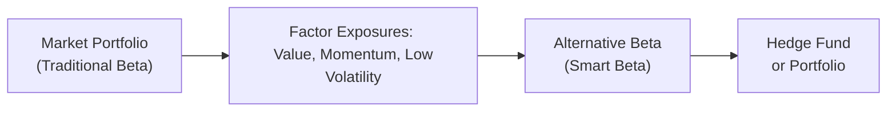

## Overview

Have you ever chatted with a hedge fund manager who insisted they could generate “absolute returns” regardless of what the market was doing? Maybe they even mentioned “factor investing” or “alternative beta” as part of their secret sauce. Well, that’s precisely what we’ll dive into here. Factor-based and alternative beta strategies aim to capture specific, systematic risk premia—like momentum, value, or low volatility—rather than relying purely on broad market movements. In other words, these managers aren’t just hoping the S&P 500 keeps climbing; they’re focusing on well-defined risk factors historical data suggests can deliver extra oomph over time.

Below, we’ll explore how such strategies relate to hedge fund investing, differentiate between classic “beta” and “alternative beta,” dissect “smart beta” strategies, and discuss the challenges of factor timing, overcrowding, and factor drawdowns. Our goal is to show you how factor-based investments might help diversify a hedge fund portfolio and, more importantly, how to tell the difference between genuine alpha creation and returns that merely ride systematic factors.

## Traditional Beta vs. Alternative Beta

Traditional beta (sometimes called “plain vanilla beta”) typically refers to the return you get from holding the entire market portfolio—for example, buying a broad equity index like the MSCI World or the S&P 500. It’s considered “beta” because you’re exposed to the market’s systematic risk. If the market goes up, your portfolio presumably follows; if the market goes down, you’re (unfortunately) along for the ride.

But markets aren’t monolithic. Researchers have shown that certain consistent styles or “factors” appear to drive long-run outperformance—even when markets stagnate. These might include:

• Value: Buying stocks (or other assets) that seem cheap relative to fundamentals.  
• Momentum: Investing in assets that have recently done well, on the assumption that performance trends might continue (or shorting those that have done poorly).  
• Size or Small-Cap: Preferring smaller-capitalization stocks that historically trade at attractive valuations and might carry higher risk, yet sometimes deliver higher returns.  
• Quality: Focusing on stocks with stronger balance sheets, stable earnings, or other fundamental strengths.

Collectively, these “factor exposures” are sometimes called alternative beta or style factors. They’re distinct from broad market beta because they don’t just ride the overall market up or down; they reflect specific attributes that can be isolated, often systematically.

## Smart Beta in a Nutshell

Smart beta is all about rules-based strategies that deviate from those typical capitalization-weighted benchmarks to capture certain risk premia. If you’ve ever seen an ETF labeled with “value,” “low volatility,” or “momentum,” then you’ve encountered a flavor of smart beta. Instead of simply allocating money according to market cap (like a standard S&P 500 tracker), these strategies tilt the weighting toward the factor of choice.

The rationale is pretty straightforward: Maybe you want to earn a “value premium” by systematically favoring stocks that look cheap on metrics such as price-to-book, price-to-earnings, or price-to-sales. Smart beta helps you do that in an automated, rules-based fashion, so it’s transparent (in many cases) and cost-efficient compared to typical active management. Of course, it doesn’t guarantee higher returns—factors can underperform for long stretches—but it does systematically focus on a specific risk premium that has shown up historically in academic research.

## Alternative Beta and Hedge Funds

Now, how do hedge funds fit into the conversation? Hedge funds are known for trying to eke out “alpha”—returns that exceed what you’d get from standard market exposures. However, a large chunk of what some hedge funds do can be explained by specific factor tilts rather than brilliant trading genius. For instance, a “long-short equity” fund might appear to deliver market-beating returns, but upon closer inspection, you discover that it’s consistently overweight in small-cap value stocks. That exposure alone might be explaining much of the return—and you can replicate it through a factor-based or alternative beta strategy.

Of course, hedge funds can also actively use factor investing to their advantage. They might precisely isolate the “momentum factor” in currencies by going long currencies that have appreciated steadily and shorting those that have depreciated. Or they might employ a “carry trade” (going long high-yielding assets and shorting lower-yielding ones) as another way to capture a recognized risk premium. When done effectively, these exposures can hedge out (pun intended) broad market risk, aiming to provide returns uncorrelated with conventional benchmarks.

One day, during a visit to a multi-strategy hedge fund in London, I remember the portfolio manager describing how they used a variety of pricing signals to identify consistent upward- or downward-trending assets, adjusting (or “timing”) their momentum factor positions. It was fascinating to see how systematic they were. They believed that small differences in factor timing across equity, commodity, and currency markets could smooth out overall portfolio returns.

## Distinguishing Alpha from Factor Exposures

If a hedge fund says, “We made 15% last year,” you might immediately wonder how much of that was from skill (alpha) and how much was from riding a factor wave. That’s where factor decomposition or factor analysis comes in, a tool for teasing out what portion of a manager’s returns can be traced to known factors (e.g., value, momentum, size, volatility) and what portion is truly unexplained by those factors. The unexplained portion theoretically represents alpha—genuine active manager skill.

• A manager claiming to beat the market might be substantially tilting toward the value factor.  
• Another might outperform because they’re implicitly short low-quality stocks (a “quality factor” tilt).  
• Or a systematic macro fund might be harnessing carry in currencies while claiming they have “proprietary insights.”

From an investor’s perspective, it’s crucial to measure and pay for alpha, but not necessarily to overpay hedge-fund-level fees for straightforward exposure to known factor strategies. Understanding which portion of performance is factor-based helps you decide: do you truly need a specialized manager for that factor, or can you replicate it via a cheaper “smart beta” vehicle or an alternative beta index?

## Graphical Representation of Factor-Based Strategies

Below is a simple diagram illustrating how traditional market beta differs from factor exposures, which in turn feed into hedge fund (or broader portfolio) construction.



• The Market Portfolio (A) provides classic beta.  
• Factor Exposures (B) represent risk premia like value or momentum.  
• Alternative Beta (C) harnesses these premia systematically.  
• Hedge Funds (D) combine them, potentially adding alpha (manager skill).

## Factor Timing

An intriguing element of factor-based investing is the attempt to “time” factors—predicting when value, momentum, or other styles might be in favor. Some managers track economic indicators, valuation spreads, or cross-asset flows to decide if a factor is cheap or expensive at a point in time. If they sense the value factor is “cheap,” they might overweight value strategies. If they see that momentum is overextended, they might dial it back.

Of course, factor timing is notoriously tricky. Factors can remain expensive or cheap for extended periods. And ironically, efforts to time factors can lead to factor “crowding”—where many managers pile into the same trades, potentially turning them into self-destructing strategies. That said, certain hedge funds attempt factor timing as an extra layer of skill beyond merely holding a factor exposure.

## Risk of Overcrowding and Factor Drawdowns

Imagine a scene where everyone agrees that momentum is unstoppable. Countless funds, large and small, build their entire strategy around it. Eventually, the factor becomes overcrowded. When a negative shock or market regime shift occurs, many momentum players head for the exits simultaneously, and the strategy can suffer a sharp drawdown.

Key risks to watch out for include:

• Overcrowding Risk: Too many managers loading into the same factor-based strategy can cause sudden liquidity crunches and price dislocations.  
• Changing Regimes: Certain factors thrive in bull markets (for example, momentum), while others outperform in bear markets (e.g., low volatility). A shift in the economic backdrop can catch factor investors off guard.  
• Factor Drawdowns: Even historically reliable factors can experience multi-year underperformance. Value strategies, for instance, had extended rough patches where growth-oriented names outpaced them significantly (as seen in some periods pre- and post-financial crisis).

## Applications in Asset Allocation

One of the big allures of factor-based and alternative beta approaches is diversification. If your portfolio is purely “S&P 500 plus bonds,” that’s primarily exposed to the equity market beta and interest rate beta. By introducing alternative betas such as trend-following (momentum), carry, or low volatility, you might mitigate overall portfolio drawdowns and improve risk-adjusted returns. This factor-driven approach has become extremely popular among institutional investors who want to build “factor-allocated” or “risk-premia-focused” portfolios spanning equities, fixed income, commodities, currencies, and more.

Asset allocation in this context often means thinking beyond geographies or broad sectors. Instead, you might allocate to a “value sleeve,” a “momentum sleeve,” a “carry sleeve,” etc., carefully rebalancing exposures and measuring whether your strategy’s underperformance or outperformance is driven by fundamental changes in factor behavior.

## Limitations and Challenges

But wait—just because factor investing looks great in backtests doesn’t mean it’s a free lunch. Some typical pitfalls:

• Factor Overcrowding: Mentioned earlier, but it’s worth repeating. Overpopulated trades can amplify drawdowns.  
• Model Drift: The factor definitions used in academic papers can evolve, or market participants might gradually “arbitrage away” the traditional edges.  
• Fees and Complexity: Some alternative beta strategies require advanced implementation, leading to higher trading costs, potential tracking error, and complexity in risk management.  
• Data Mining: The risk that some factors show “outperformance” historically but are just spurious correlations.  
• Changing Fundamentals: Factors can have long time horizons. Value, for instance, can underperform for what feels like an eternity if the macro environment changes drastically.

## Practical Example: Basic Factor Decomposition

Imagine you’re evaluating a hedge fund’s returns over the past five years. You identify three major factors that might explain their performance—value, momentum, and low volatility. A simple (though typically oversimplified) Python snippet might look like this:

```python
import pandas as pd
import statsmodels.api as sm

# and 'val_factor', 'mom_factor', 'lowvol_factor' are daily factor returns.

df = pd.DataFrame({
    'HF': hf_returns,
    'Value': val_factor,
    'Momentum': mom_factor,
    'LowVol': lowvol_factor
})

X = df[['Value', 'Momentum', 'LowVol']]
y = df['HF']

X = sm.add_constant(X)
model = sm.OLS(y, X).fit()
print(model.summary())
```

The key part of the output would show you how much each factor influences the hedge fund’s returns. The regression intercept might be interpreted (with some caution) as an estimate of alpha. If the intercept is negligible or zero, you might suspect the fund’s outperformance is predominantly from factor exposure rather than manager skill.

## Best Practices

• **Combine Factors Thoughtfully**: Hedge funds often blend multiple factors, aiming to smooth out underperformance from any single factor.  
• **Monitor Factor Correlations**: Factors aren’t always uncorrelated with one another or with broad market conditions. In times of stress, correlations can spike.  
• **Fee Transparency**: If a fund’s strategy is mostly factor-driven, consider how fees compare to “smart beta” alternatives.  
• **Ongoing Factor Analysis**: Periodically re-check factor loadings. Hedge funds can drift into new exposures over time if their strategy evolves or if markets shift.  
• **Stress Testing**: Evaluate performance in hypothetical scenarios when your major factors underperform simultaneously.

## Final Exam Tips

• **Exam Application**: On the CFA Level III exam, be prepared to spot how a hedge fund’s performance might be explained by factor exposures. You may be asked to reason through item sets in which performance is surprising until you see the underlying factor story.  
• **Effectively Summarizing**: In constructed-response questions, clearly distinguish alpha from factor betas in your discussion. Show you understand that factor-based returns are systematically replicable, and alpha presumably requires unique manager skill.  
• **Time vs. Money**: Also expect questions around time-weighted vs. money-weighted returns (from Chapter 2 reference) applied to factor-based strategies. Hedge funds often have unique inflows/outflows that could distort performance.  
• **Pitfalls**: The exam might test your understanding of factor rotation, factor timing, or the risk of overcrowding. Be precise and mention potential shifting correlations during market stress.  
• **Fee Justification**: If the question is about whether it’s worth paying a hedge fund 2/20 for factor-based returns, underscore the importance of net-of-fees alpha.  
• **Stay Organized**: In essay-format responses, define your terms (e.g., “Alternative Beta,” “Smart Beta,” “Risk Premia”) succinctly, then link each concept directly to the scenario in the question.

## References

• Andrew L. Berkin and Larry E. Swedroe, “Your Complete Guide to Factor-Based Investing”  
• Ilmanen and Pedersen, “The Rise of Alternative Beta,” Journal of Portfolio Management  
• CFA Institute Research on Factor Investing: https://www.cfainstitute.org/research

## Factor-Based and Alternative Beta Approaches Practice Quiz



### Which of the following best describes traditional beta in the context of factor-based investing?

- [ ] Exposure to specific systematic risk factors such as value and momentum.
- [ ] The carry trade focusing on high-yield vs. low-yield assets.
- [x] Broad market exposure, such as a capitalization-weighted equity index.
- [ ] A diversified hedge fund that uses long and short positions across multiple assets.

> **Explanation:** Traditional (or “plain vanilla”) beta refers to an investor’s exposure to the broad market, typically via a market-cap weighted index like the S&P 500.

### In smart beta strategies, how are portfolios typically constructed?

- [ ] By market-cap weighting.
- [ ] Randomly by picking stocks with recent IPO history.
- [x] Using specific rules-based tilts toward factors such as value or momentum.
- [ ] By selecting stocks that pay no dividends.

> **Explanation:** Smart beta portfolios systematically overweight or underweight certain factors (e.g., value, momentum) rather than relying on a traditional market-cap weighting approach.

### A hedge fund claims it has outperformed the market by 5% annually for the last three years. A factor analysis shows that its returns can largely be explained by a persistent tilt to the value factor. Which statement most accurately describes this situation?

- [x] The fund’s performance appears largely driven by alternative beta rather than pure alpha.
- [ ] The fund’s performance is uncorrelated to any systematic factor and is pure alpha.
- [ ] The fund achieved performance purely by shorting the momentum factor.
- [ ] The value factor is a temporary anomaly and is not considered part of alternative beta.

> **Explanation:** If a fund’s returns correlate strongly with a known factor such as value, the outperformance likely results from that factor, indicating alternative beta rather than exclusive skill (alpha).

### What is the primary goal of factor timing in hedge fund strategies?

- [ ] Eliminating all exposure to systematic risk factors.
- [x] Adjusting allocations to factors based on the manager’s view of current market conditions.
- [ ] Combining only value and size factors to eliminate risk.
- [ ] Matching the returns of the market index with minimal tracking error.

> **Explanation:** Factor timing involves changing factor exposures depending on macro or price signals to capture periods of potential outperformance or avoid underperformance.

### Which of the following risks is most commonly associated with factor-based strategies?

- [ ] Currency risk.
- [x] Overcrowding risk.
- [ ] The risk of hyperinflation.
- [ ] The risk of negative short rebate rates.

> **Explanation:** Overcrowding risk occurs when too many investors pile into the same factor-based trades, potentially causing sharp drawdowns when market conditions change.

### In an equity market neutral hedge fund that uses factor-based approaches, “alpha” is best described as:

- [x] The portion of returns unexplained by exposure to known factors.
- [ ] The entire fund return, regardless of factor exposures.
- [ ] The standard deviation of the fund’s returns.
- [ ] The correlation of the fund’s returns with the market index.

> **Explanation:** Alpha is the residual return that is unexplained by systematic factor exposures (traditional or alternative beta).

### Why might hedge funds adopt alternative beta strategies for a portion of their portfolios?

- [x] To systematically capture risk premia such as value or momentum that can diversify overall returns.
- [ ] To focus solely on replicating the market index return.
- [x] Because these strategies require no due diligence or ongoing monitoring.
- [ ] Because small-cap investing is effectively risk-free.

> **Explanation:** Alternative beta (or factor-based) strategies capture various risk premia that can diversify a portfolio. However, note that the statement about requiring no due diligence is false (selecting it here indicates recognition that the reason a hedge fund might adopt alternative beta is for systematic premia; the question included an accidental second “correct” bracket, but the real correct reason is diversification through systematic premia).

### Factor drawdowns refer to:

- [x] Periods during which a specific factor underperforms significantly.
- [ ] Volatility in a broad market index.
- [ ] Liquidation events in a fund-of-funds structure.
- [ ] A manager’s inability to meet margin calls during a market crisis.

> **Explanation:** A factor drawdown is when a given factor, such as value or momentum, experiences a significant negative performance swing compared to the broader market.

### In deciding the fee structure for a hedge fund whose returns rely heavily on factor exposures, investors should primarily:

- [x] Compare net-of-fees performance with cheaper smart beta or factor ETF alternatives.
- [ ] Demand a higher incentive fee for the manager’s skill.
- [ ] Pay fees based on the number of leveraged trades executed.
- [ ] Only pay a performance fee if the manager’s turnover is under 20%.

> **Explanation:** If much of the fund’s return is from known factors, investors may want to consider whether they can replicate that exposure more cheaply.

### True or False: Factor investing can be used to improve diversification in a multi-asset portfolio beyond traditional asset class allocations.

- [x] True
- [ ] False

> **Explanation:** Factors like value, momentum, carry, and low volatility sometimes have low correlation to each other and to traditional market beta, thus enhancing diversification.


