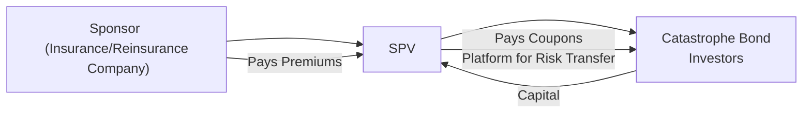

## Introduction

Ever chat with a friend about how to insure a home against hurricanes or earthquakes, and wonder who ultimately shoulders the cost if an unforeseen disaster strikes? In the world of institutional investing, a portion of that burden can be shifted to capital markets through something called event-linked instruments (ELIs), particularly catastrophe bonds (CAT bonds), and other insurance-linked securities (ILS). These innovative structures let insurers transfer risk for, say, a once-in-a-century hurricane, to deep-pocketed investors searching for higher yields uncorrelated to equity and bond markets. And as part of a hedge fund strategy, these instruments can be a game-changer for diversification and yield enhancement.

In this segment, we explore the fundamental mechanics behind event-linked or insurance-linked instruments, the intricacies of reinsurance securitizations, and how hedge funds often tap these products for uncorrelated returns. We’ll discuss triggers (indemnity, parametric, and industry loss), highlight essential due diligence steps (like understanding sponsor quality or climate risk models), and note common pitfalls. For hedge funds seeking to broaden their horizons, event-linked instruments can offer that “Aha!” moment of fresh risk-return opportunities, especially in an environment where traditional exposures feel oversaturated or highly correlated. Let’s dive in.

## Defining Event-Linked Instruments

Event-linked instruments (ELIs) are a subset of insurance-linked securities that allow insurance or reinsurance companies—also called sponsors—to transfer specific risks (e.g., natural catastrophes) to capital market investors. The classic example is the catastrophe bond (CAT bond), which is effectively a high-yield bond with a built-in risk of principal reduction or complete loss if a predefined catastrophic event occurs. Think of it like a specialized insurance policy that the sponsor has purchased, except it’s structured as a bond that investors buy. 

From an investor’s perspective, the allure of a CAT bond is the potential for attractive coupon payments that are relatively uncorrelated with broader capital market fluctuations. After all, whether an earthquake hits Tokyo or a hurricane lands in Florida doesn’t necessarily have a direct link to how global equity markets are performing. However, if a triggering event does occur, investors can lose part or all of their principal. 

## Key Triggers for CAT Bonds

One detail that often surprises new entrants to the ILS space is that payouts to the sponsor are governed by carefully defined triggers. These triggers dictate when and how an investor’s principal might be used to cover losses:

• Indemnity Trigger  
  This trigger is tied to the actual losses incurred by the sponsor. If the sponsor’s total insured losses from a specific event surpass a certain threshold, the bond will be triggered. Because it directly reflects the sponsor’s real losses, indemnity-based structures reduce basis risk for the sponsor. However, from an investor’s perspective, it can introduce moral hazard concerns or questions around how the sponsor calculates losses.

• Parametric Trigger  
  A parametric trigger is based on objectively measured event parameters—like the wind speed of a hurricane at landfall or the magnitude of an earthquake. The sponsor is paid if these objective criteria reach or exceed a certain threshold. This approach is transparent and reduces moral hazard, but it introduces basis risk: perhaps the measured event was severe, but the actual insured losses were smaller or located elsewhere. Or the opposite occurs: the catastrophe was unbelievably bad, but didn’t perfectly match the parametric measure.

• Industry Loss Trigger  
  This trigger depends on the total losses faced by the entire insurance industry as reported by an independent third party (e.g., a modeling agency). If total industry losses exceed a specified figure, the CAT bond triggers. Industry loss triggers spread moral hazard risk even further but may still leave the sponsor with some basis risk—actual losses might differ in proportion to the overall industry’s losses.

## Reinsurance Securitizations and Their Role in Hedge Funds

So how does this environment connect with hedge funds? Reinsurance securitization is the process of packaging insurance risk into marketable securities, typically in the form of bonds or notes. By bringing these securities to the capital markets, sponsors effectively “lay off” their risk to a broader pool of investors. Hedge funds often play a part in these deals because the returns from catastrophe risk aren’t highly correlated with factors like equity market performance or interest rate movements. 

When I first learned about these “cat risk deals,” it seemed like a brilliant strategy for mitigating overall portfolio volatility—who wouldn’t want uncorrelated yield? Hedge funds get to collect potentially attractive coupons, and sponsors reduce the chance of an outsized financial hit in case of a natural disaster. 

Below is a simple diagram to illustrate how the funds, the sponsor, and the special purpose vehicle (SPV) might be connected:

In this diagram:
• The SPV is created specifically to issue the CAT bond, hold the capital raised in a trust, and pay out to the sponsor if the trigger event occurs.  
• Investors like hedge funds provide capital upfront in exchange for coupons that are typically linked to LIBOR, SOFR, or other short-term benchmarks plus a spread.  
• If no catastrophe occurs, the sponsor’s premium and principal eventually return to investors. If an event triggers, the SPV pays indemnities (or parametric-based payouts) to the sponsor, reducing or wiping out the bond principal.

## Risk and Return Characteristics

Event-linked instruments offer a variety of payoffs and complexities:

• High Yields vs. Potential Principal Loss  
  Because there might be a total loss of principal if the trigger event is epic, CAT bonds and similar instruments typically pay above-market coupons. It’s not unusual to see yields significantly higher than similarly rated corporate bonds, although the rating itself can hinge on the probability of the catastrophic event.  

• Uncorrelated Returns  
  The beauty here is that a big hurricane usually doesn’t care if the S&P 500 is up or down. While there may be knock-on effects to the local economy, the direct risk profile of a CAT bond is far more event-driven than macro-driven.

• Liquidity Constraints  
  Despite the rising popularity of these instruments, secondary market liquidity can be limited. Investors who want to exit a position before maturity might find fewer buyers, especially if there’s an approaching hurricane season with ominous forecasts.

• Sensitivity to Climate Change  
  Many folks worry that climate change could increase both the frequency and severity of natural disasters. If that’s the case, it could skew the expected probability of a triggering event over time. Hedge funds need to remain on top of the evolving science around climate risk to accurately price these instruments.

## Structural Considerations

CAT bonds and other forms of ILS are structured through a special purpose vehicle (SPV) designed to be bankruptcy-remote from the sponsor. The SPV typically holds the bond proceeds in highly rated collateral—like U.S. Treasury money market funds—until an event triggers. If no event occurs by maturity, the capital (plus coupon) flows back to investors.

This structure is what you might hear folks call “transforming insurance risk into capital market risk.” Instead of a reinsurance company taking on all the risk, the capital markets step in. Hedge funds often see this transformation as an appealing way to diversify, especially in multi-strategy or risk-parity contexts.

## Due Diligence on Event-Linked Instruments

A robust and thorough due diligence process is vital before investing in event-linked instruments. Some key areas to focus on:

• Catastrophe Modeling  
  Investors rely heavily on third-party modeling agencies (e.g., RMS, AIR Worldwide) to estimate the probability of a given event and the expected losses. This is not a matter of guesswork—these agencies gather massive amounts of geospatial data, run simulations of hypothetical storms, and project potential damage. Hedge funds must be comfortable with the assumptions and limitations of these models, because if the model is off, your entire risk-reward calculation might be off too.

• Sponsor Quality  
  Another consideration is the sponsor’s creditworthiness, experience in underwriting, and financial stability. Even if the bond is indemnity-triggered, sponsor oversight matters because how losses are tallied and reported can vary.

• Structural Features  
  Details like whether the trigger is parametric, indemnity, or industry loss significantly alter risk. Also, check whether there’s a “reset” feature in multi-year bonds to adjust triggers or coupon spreads if conditions change.

• Pricing and Market Environment  
  Like everything else in capital markets, CAT bonds can be more or less expensive depending on supply and demand. Wide spreads might make them more appealing, but is that justified by an overpriced risk?

• Basis Risk  
  Particularly in parametric triggers, the sponsor might experience actual losses that deviate from what’s implied by the measured event. Hedge funds need to understand that if the sponsor’s losses are not covered by the parametric payout, the sponsor might still face significant credit pressure or other disruptions.

## Diversification Benefits for Hedge Funds

A major reason hedge funds incorporate event-linked instruments is the potential for uncorrelated returns. Think of a multi-strategy hedge fund that has exposure to equities, fixed income, foreign exchange, and real assets. Adding an allocation to CAT bonds or other ILS can reduce the overall correlation of the fund’s returns. In theory, this leads to better risk-adjusted performance over time.

In practice, it’s wise not to go overboard. If your entire portfolio is made of 100% insurance risk, you’ll lose the benefit of being diversified if the mother-of-all catastrophes hits. And you still face model, basis, and climate-related risks. However, a modest allocation—maybe 5–10%—can significantly help with diversification.

## Example: Florida Hurricane Cat Bond

Let’s do a quick hypothetical. Suppose Sunshine Insurance Co. in Florida sponsors a three-year CAT bond that pays LIBOR plus 8% if no triggering hurricane hits Florida with wind speeds above 120 mph. The bond is sized at $200 million, which is fully collateralized and sits in an SPV. A hedge fund invests $20 million into the bond for yield diversification.

• If no major hurricane passes the 120-mph threshold, the hedge fund collects coupons for three years and receives its $20 million principal back at maturity.  
• If a Category 4 or 5 hurricane sweeps through Florida, surpassing the threshold, the bond triggers. The SPV liquidates a portion (or all) of the principal to compensate Sunshine Insurance Co. The hedge fund sees a partial or total loss of its $20 million.  

That’s a very real-risk scenario. If you’re a meteorological enthusiast (like some hedge fund managers I know), you might actually track NOAA (National Oceanic and Atmospheric Administration) updates during hurricane season with more intensity than equity earnings calls.

## Potential Pitfalls and Considerations

While event-linked instruments are often touted for attractive yields and correlation benefits, they carry unique pitfalls:

• Basis Risk  
  Especially with parametric triggers, there can be a mismatch between the actual loss and the parametric measure. This can cause disputes or unexpected outcomes for both sponsor and investor.

• Climate Change Uncertainty  
  Projections of future event frequency, location, and severity become an increasingly complex puzzle as our climate evolves. If the actual climate risk outpaces the assumptions built into the models, your “worst-case scenario” might prove too optimistic.

• Liquidity and Market Sentiment  
  CAT bonds are not as liquid as corporate bonds or stocks. Also, if major climate events or a global recession spooks investors, secondary markets may freeze up—making it hard to exit these positions when you want to.

• Regulatory Framework  
  Insurance-linked securities occupy an intersection of capital markets and insurance regulation. Ensuring compliance across jurisdictions (especially for multi-jurisdictional sponsors) can be complex. Hedge funds need to keep track of their exposures in different regulatory environments.

## Regulatory Environment and Rating Agency Views

Insurance-linked securities are subject to oversight from both insurance regulators and securities regulators. In the United States, for instance, many ILS sponsors must follow state-level insurance regulations, plus SEC rules on issuing securities (if sold publicly). Similar guidelines apply internationally—Solvency II in the European Union imposes capital requirements for insurers who invest in or issue these instruments.

Rating agencies (e.g., Standard & Poor’s, Moody’s) assign ratings to CAT bonds based primarily on the probability of event occurrence and the creditworthiness of the collateral in the SPV. In some cases, they’ll offer no rating if the product is privately placed—still, investors often demand a rating or at least a robust modeling report to evaluate expected losses. A rating can help give prospective investors a sense of the modeled losses, attachment probabilities, and total risk to principal.

## Best Practices for Hedge Funds

• Know Your Models 
  It’s essential to understand the limitations of modeling. Are these 1-in-250-year event probabilities or 1-in-50-year? Modeling agencies are not infallible.

• Balance with Traditional Assets 
  Keep a moderate slice of the overall portfolio in these instruments—diversification is the goal, not single-risk concentration.

• Stress Test for Combinations of Events 
  It’s not too crazy to imagine a scenario in which the stock market loses 20% and a major hurricane hits in the same year. Even if the correlation is theoretically low, extraneous factors can converge at times, so run scenario analyses.

• Monitor Regulatory Updates 
  The insurance industry is heavily regulated, and changes in capital requirements may affect issuance volumes or trigger types.

• Evaluate Sponsor Risk 
  Although the sponsor’s credit risk is, in theory, less critical since the SPV is bankruptcy-remote, sponsor underwriting quality is crucial for indemnity triggers.

## Conclusion

Event-linked instruments and reinsurance securitizations can be powerful tools for hedge funds seeking uncorrelated investments with potentially attractive yields. But it’s not all sunshine and beaches. Careful modeling, thorough due diligence on triggers, sponsor quality, and regulatory compliance often make the difference between successful portfolio diversification and unexpected capital impairment. The evolving climate environment is sure to reshape how these instruments are structured in the future—perhaps parametric triggers will become more sophisticated, or modeling agencies will develop new ways to gauge risk more accurately.

All in all, investing in CAT bonds or other insurance-linked securities can bring meaningful portfolio benefits when managed prudently. You’re taking on “peak” event risk in exchange for (hopefully) robust yields and reduced correlation. Just keep your hurricane-tracking app handy and be prepared to deal with the complexities of triggers, climate projections, and somewhat limited liquidity. It’s definitely not your average bond.

## References and Further Reading

• Lane, Morton (ed.). “Insurance-Linked Securities.” This book covers the mechanics, pricing, and risk management of various ILS structures.  
• Artemis.bm: A leading platform offering market data, news, and analytics on catastrophe bonds and ILS. https://www.artemis.bm/  
• Reinsurance Association of America: “ILS and Alternative Capital.” Provides insights into how alternative capital is reshaping the reinsurance sector.  
• RMS (Risk Management Solutions): Offers event modeling and analytics products widely used for analyzing catastrophic risks.  
• AIR Worldwide: Catastrophe modeling company specializing in the quantification of risk from natural disasters, terrorism, and other catastrophes.

---

## Test Your Knowledge: Event-Linked Instruments and Reinsurance Securitizations



### Which best describes the main purpose of a CAT bond structure?

- [ ] To protect the investor from equity market downturns using derivative overlays.
- [ ] To provide insurers with standard regulatory capital for day-to-day claims.
- [x] To transfer specific catastrophe risks from an insurer to capital market investors.
- [ ] To create basis risk within an insurance company’s portfolio.

> **Explanation:** CAT bonds serve as a mechanism to move specific catastrophic event risks from an insurer (sponsor) to investors in exchange for higher coupon payments. This helps the insurer reduce its exposure to large natural disasters.

### Which trigger type uses a measurable factor such as hurricane wind speed or earthquake magnitude rather than actual sponsor losses?

- [ ] Indemnity trigger
- [x] Parametric trigger
- [ ] Industry loss trigger
- [ ] Hybrid trigger

> **Explanation:** A parametric trigger is based on event parameters (e.g., wind speed, earthquake magnitude) rather than real insured loss data.

### What is a key risk for a sponsor when using a parametric trigger?

- [ ] Moral hazard risk
- [x] Basis risk
- [ ] Credit risk
- [ ] Reputational risk

> **Explanation:** With a parametric trigger, there can be a mismatch (basis risk) between the parametric measure of an event and the actual losses suffered by the sponsor.

### Why might a hedge fund be attracted to event-linked instruments like CAT bonds?

- [ ] They are highly correlated with equity markets, improving upside capture.
- [ ] They provide an easy way to speculate on local real estate price changes.
- [ ] They have guaranteed returns unaffected by catastrophic events.
- [x] They offer uncorrelated returns relative to mainstream asset classes.

> **Explanation:** CAT bonds’ performance is typically tied to the occurrence of specified catastrophic events and not to equity or bond market performance, providing diversification benefits.

### Which of the following best describes the role of a special purpose vehicle (SPV) in a CAT bond transaction?

- [x] It issues the bond, holds collateral, and pays the sponsor if a trigger event occurs.
- [ ] It rates the bond and ensures it trades on a listed exchange.
- [ ] It underwrites the insurance policies for individual property owners.
- [ ] It invests in index futures to hedge catastrophic risk.

> **Explanation:** In CAT bond structures, the SPV is a dedicated entity that collects investor capital, invests it in collateral, and administers payouts upon trigger events.

### Which of the following is a common advantage of indemnity-based triggers?

- [ ] Greater independence from actual sponsor claims.
- [ ] Complete avoidance of moral hazard considerations.
- [x] Reduced basis risk.
- [ ] Lower dependence on sponsor’s underwriting methods.

> **Explanation:** Indemnity triggers focus on the actual losses of the sponsor, thus reducing basis risk for that sponsor.

### Which scenario describes a typical outcome if the catastrophic event does not occur before a CAT bond matures?

- [x] Investors receive their principal back plus regular coupon payments.
- [ ] The SPV seizes investor principal for future catastrophe reserves.
- [ ] Investors receive only a partial return of principal with no coupon.
- [ ] The sponsor pays a penalty for unused coverage.

> **Explanation:** If no triggering event occurs, the CAT bond principal is returned to investors at maturity along with coupons earned during the life of the bond.

### What is one reason rating agencies are involved with CAT bonds?

- [ ] To confirm that the bond invests solely in equity securities.
- [x] To assess the probability of events and evaluate credit strength of the collateral.
- [ ] To mandate precise parametric triggers for all bonds.
- [ ] To ensure that sponsors reinsure 100% of their risk.

> **Explanation:** Rating agencies evaluate the catastrophic event probabilities and the collateral structure backing the bond, then assign a rating accordingly.

### Which best describes the effect of climate change on event-linked instruments?

- [ ] It dramatically reduces coupon rates on CAT bonds.
- [ ] It guarantees the elimination of basis risk.
- [x] It increases uncertainty about event severity and frequency.
- [ ] It renders catastrophe modeling agencies obsolete.

> **Explanation:** Climate change can make natural disasters more frequent or severe, introducing uncertainty into the underwriting and modeling processes.

### True or False: Basis risk is eliminated when using industry loss triggers.

- [ ] True
- [x] False

> **Explanation:** Though industry loss triggers base payouts on total industry losses, the sponsor’s actual losses may differ from those industry-wide numbers, introducing some basis risk.


