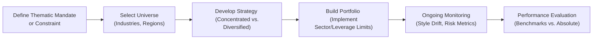

## Introduction
Sometimes, hedge funds aren’t just about “making money any way you can.” In reality, many face constraints—some self-imposed, others required by clients or regulators—that shape their strategies in surprising ways. You might see everything from strict caps on leverage, to region-specific mandates (like focusing exclusively on Asia-Pacific), or even intense screening processes like excluding certain industries for environmental or social reasons. Alongside these constraints, you’ll also find thematic hedge funds, those that pivot entirely around a single unifying concept, such as climate transition or advanced diagnostics in healthcare. This combination of constraints and thematic focus can make the hedge fund space even more interesting and, well, a bit more complicated.

Truth be told, I remember chatting with a friend—an analyst at a hedge fund dedicated to decarbonization technologies—and thinking, “Wow, so you’re basically ignoring huge chunks of the market on purpose?” But their strategy was laser-focused; they had a big belief in the future of renewable energy. That’s precisely what we mean by a thematic mandate. Let’s walk through how these constraints and themes play out in practice, the opportunities and pitfalls they present, and how performance is measured in these niche-laden corners of the hedge fund universe.

## Understanding Constraints in Hedge Funds
Constraints in hedge funds aren’t just random obstacles. They can serve a purpose, providing clarity for investors and ensuring alignment with specific mission statements. Constraints may include:

• Limits on Leverage: Some funds are not allowed to exceed a designated leverage ratio (like 2:1), helping mitigate risk or ensuring alignment with a more conservative investor base.  
• Sector Constraints: Remember that certain investors—and regulators—will not be comfortable with exposure to sin stocks, fossil fuels, or even entire regions perceived as too volatile. A Sector Constraint is a limit on the percentage of a portfolio allocated to a specific industry.  
• Regional Mandates: Some funds restrict their activities to certain geographies, say only investing within North America, Europe, or emerging markets; or they might be shaped by regulatory walls that limit cross-border capital flows.  

When you impose constraints, you effectively shrink your investable universe. That can make your life more complicated because you’re forced to pass up what might be enticing opportunities. On the flip side, constraints can help shape your brand, sharpen your expertise, and, in many cases, meet strict client guidelines. After all, some large institutional investors have specific policies (e.g., no tobacco or gambling stocks in a pension fund) that must be respected.

### Why Constraints Emerge
• Client Requirements: Institutional investors may insist on excluding certain industries.  
• Regulatory Rules: Funds domiciled in certain jurisdictions might face caps on leverage.  
• Mission-Driven Objectives: Some funds adopt Environmental, Social, and Governance (ESG) or faith-based filters to align with investor values.  

### Style Drift Risk
Be aware of Style Drift Risk, the phenomenon where a fund deviates from its stated theme or constraint. If a fund is marketed as “ESG-Focused,” for instance, but ends up sneaking in pollution-heavy industries—to chase higher returns—it’s straying from its core mandate. Style drift not only risks investor backlash but can raise compliance red flags.

## Thematic Mandates: A Closer Look
A Thematic Mandate describes a specified area of focus for a fund, such as a sustainability theme or a technology trend. These funds seek to capitalize on Macro Trends—broad economic or societal shifts that drive investment narratives. If you think about a technology-themed fund, it might revolve around AI, blockchain, or biotech breakthroughs. An ESG-Focused Fund, on the other hand, invests under environmental, social, and governance criteria to promote responsible corporate behavior.

A successful thematic approach can allow managers to become recognized experts—what we sometimes call Domain Expertise—one of the most critical aspects of running a thematic hedge fund. If your theme is climate transition, you’d better have folks on your team who understand solar energy infrastructure, carbon capture, and the entire regulatory framework around renewables. With such expertise, you can (hopefully) pick the winners in an emerging field.

### Concentrated Portfolios
One hallmark of a thematic hedge fund is often the presence of a Concentrated Portfolio: fewer, carefully selected holdings aiming for higher conviction returns but also higher volatility. A climate-tech manager might limit their portfolio to fewer than 30 names, focusing on highly specialized startups or mid-cap growth stocks with new energy solutions. 

The payoff? Potentially impressive alpha if the chosen theme truly takes off. But the risk? A meltdown if the theme loses steam or if a few big bets turn sour. Recall the dot-com bubble: tech-themed funds soared…until they didn’t.

### ESG: A Popular Thematic Example
ESG-Focused Funds have grown in popularity. For example, you might see a Paris Agreement-friendly hedge fund that invests in global companies that are reducing carbon footprints or championing diversity. The challenge here is that not everyone agrees on what counts as “ESG.” Some dwell on carbon offsets, others on social justice, others on governance structures. This can lead to confusion or even “greenwashing,” where companies overstate their ESG credentials to attract capital.

## Challenges in Implementing Thematic Strategies
So you’ve got a theme. You’ve got domain experts. That’s all you need to rake in returns, right? Not so fast. Thematic funds face unique challenges:

• Capacity Constraint: This refers to the limit to the amount of capital a strategy can effectively deploy without harming returns. In deeply specialized areas like rare earth materials, the space might be too small for large inflows. There’s only so much you can invest before saturating the sector.  
• Liquidity Issues: Sometimes, these specialized companies are smaller and less liquid. That’s wonderful if you can get in at a good price, but a nightmare if you need to exit quickly when markets turn.  
• Correlation to Macro Trends: The whole point of a thematic mandate is to be leveraged to a big-picture trend. But if global macro conditions shift (like a sudden spike in interest rates that slams growth stocks), even the best micro-level stock picks can get hammered.  

I once saw a healthcare-focused thematic fund that specialized in gene editing technology. When regulatory concerns arose about CRISPR, the entire sector reeled, leaving the fund with limited ways to hedge. That’s the rub: concentration means more extreme volatility.

## Balancing Mandate Restrictions and Manager Conviction
Fund managers like to follow their instincts. But what if their convictions conflict with a mandated constraint? Suppose a Europe-focused manager sees a slam-dunk opportunity in emerging Asia but is restricted to investing only in European Securities. That can create frustration for the manager. Conversely, you might find a manager mandated to hold no more than 10% in any single sector, yet the best ideas might all reside in one hot industry. This tension can generate friction—do they compromise on those constraints, or do they stay the course?

### Potential Conflicts and Workarounds
• Side Pockets: If the fund’s legal documents allow, managers might place off-mandate but compelling investments into a side pocket accessible only to certain investors.  
• Hedging Tools: Funds might short or use derivatives to reduce exposure to unintended macro risks, staying “pure” to their thematic or regional constraints.  
• Transparent Communication: Clear reporting to investors is critical to show how constraints are being followed.  

## Measuring Success and Managing Risk
Constraint and thematic funds often judge success differently from an all-purpose long/short equity fund. Some aim for relative performance versus a specialized benchmark (such as a renewable energy index), while others emphasize absolute return—just deliver positive returns in all cycles. In the latter case, constraints or themes can be both a blessing and a curse. When your theme is in favor, outperformance can be dramatic; when it falls out of favor, it can feel grim.

### Benchmarks vs. Absolute Returns
• Benchmark-Oriented: A climate fund might measure itself against an ESG-themed index or an alternative energy index like the WilderHill Clean Energy Index.  
• Absolute Return: Some thematic funds ignore sector benchmarks altogether and state the goal “to produce positive returns in both bullish and bearish markets.”  

### Common Risk Measures
• VaR (Value at Risk): Helps quantify potential loss over a given time period.  
• Drawdown Analysis: Identifies peak-to-trough losses, critical for concentrated strategies.  
• Sharpe Ratio: Reflects excess return per unit of risk.  
• Factor Exposure: Some thematic funds rely on factor models (e.g., growth, momentum) to measure how well they fit or deviate from market factors.

## Diagram: Typical Flow for a Constraint or Thematic Hedge Fund

The above flow highlights how a hedge fund might move from conceptualizing a thematic or constraint-based approach, to actual portfolio construction and monitoring.

## Investor Considerations
Investors eyeing these types of funds should weigh a few important questions:

• Is the theme truly robust or just a fad?  
• Does the manager have genuine domain expertise?  
• How does the fund handle style drift and compliance with the stated constraints?  
• Are there capacity constraints that might limit growth or push up valuations?  
• What about liquidity? A thematic fund might be forced to hold relatively illiquid positions.  

Your typical institutional investor also looks at track record—especially how the fund performed in various market environments. Because constraints can amplify the volatility and correlation to specific macro conditions, you want to see evidence that the manager can ride the waves (or eke out returns) even in tough times.

## Key Best Practices
1. Transparent Mandate Definition: Spell out precisely what the theme or constraints are, from day one, so investors know what to expect.  
2. Regular Reporting on Mandate Adherence: Provide data that shows you’re respecting the constraints on sector or leverage exposure.  
3. Domain Expertise: Staff up with people who truly understand the space. If you’re a climate fund, an in-house environmental engineer or climate scientist can add tremendous insight.  
4. Robust Hedging and Risk Tools: The more concentrated your bets, the more you need to consider tail risk hedging.  
5. Avoid Overcrowding: If a theme becomes too popular (like green energy in certain bull markets), valuations can become inflated, resulting in underperformance later.  

## A Brief Personal Story
A few summers ago, I volunteered at a sustainable investing conference. I was wowed by how each manager pitched their “silver bullet” approach to ESG: some wanted to solve plastic pollution, others to fix the global water crisis, and so on. Every pitch was heartfelt. But I remember thinking, “Are these managers going to end up stepping on each other’s toes by chasing the same handful of water-tech companies?” That’s a real risk with thematic funds. Popular themes can become saturated, leading to capacity constraints that hamper returns.

## Glossary Recap
• Thematic Mandate: A specified area of focus for a fund, such as a technology or sustainability theme.  
• Sector Constraint: A limit on the percentage of a portfolio allocated to a specific industry.  
• ESG-Focused Fund: A fund that considers environmental, social, and governance factors in investment decisions.  
• Capacity Constraint: The limit to the amount of capital a strategy can effectively deploy without harming returns.  
• Style Drift Risk: When a fund deviates from its stated theme or constraint to chase returns.  
• Concentrated Portfolio: Fewer, carefully selected holdings aiming for higher conviction returns but also higher volatility.  
• Domain Expertise: Specialized knowledge in a particular sector, essential for thematic strategies.  
• Macro Trends: Broad economic or societal shifts that drive investment themes.

## Additional References
• “Sustainable Investing: Revolutions in Theory and Practice” by Herman Bril et al.  
• “Thematic Investing” – Credit Suisse Research Institute  
• Preqin ESG and Thematic Hedge Fund reports  

If you’re hungry for more insight into these strategies or want deeper dives into performance metrics, technology-driven climate solutions, or the shifting regulatory landscape, these resources are top-notch starting points.

## Conclusion
Constraint and thematic hedge fund mandates aren’t just marketing lines. They represent carefully selected or imposed paths that can both unlock alpha and restrict flexibility. As an investor or an aspiring hedge fund analyst, understanding how these constraints interact with managerial freedom, domain expertise, risk management, and macro trends is critical. Yes, narrower focuses can yield powerful returns when the theme lines up with global shifts. But constraints can also create pitfalls if the tide turns or if the fund stretches itself outside its comfort zone, risking style drift or overconcentration.

In the end, the success of these funds often boils down to whether the chosen theme or constraint truly reflects a sustainable, long-lasting opportunity. Are we talking about a passing craze or a structural shift that will persist for years? Mastering the interplay of constraints and themes can help you spot tomorrow’s big winners—or avoid a nasty surprise.

## Test Your Knowledge: Constraint and Thematic Hedge Funds



### Which of the following best describes a thematic mandate?

- [ ] A contract requiring hedge funds to hold only government bonds.
- [x] A focused investment strategy targeting a specific trend, theme, or sector.
- [ ] A leverage requirement ensuring funds do not exceed 6:1 leverage.
- [ ] A limit on investable companies determined purely by market capitalization.

> **Explanation:** A thematic mandate revolves around a defined trend or sector (e.g., ESG, healthcare). It doesn't revolve around government bonds or specific leverage requirements.

### Which term refers to the potential for a hedge fund to stray from its stated approach by investing outside its declared theme?

- [ ] Capacity constraint
- [ ] Concentrated portfolio
- [x] Style drift risk
- [ ] Sector constraint

> **Explanation:** Style drift risk is precisely the danger that a fund deviates from its stated strategy or theme.

### What is a key characteristic of a concentrated portfolio?

- [ ] It invests in hundreds of small positions across diverse industries.
- [x] It holds fewer, carefully selected positions, potentially increasing volatility.
- [ ] It never adjusts positions once the portfolio is constructed.
- [ ] It must hold equal weighting across all positions.

> **Explanation:** A concentrated portfolio implies fewer positions, each with potentially higher conviction, yet this can lead to higher portfolio volatility.

### Which factor is commonly considered a critical element in implementing a thematic hedge fund strategy?

- [x] Domain expertise
- [ ] Wide geographical focus
- [ ] Eliminating all forms of derivatives
- [ ] Minimized tracking error relative to the S&P 500

> **Explanation:** Domain expertise is crucial for thematic funds, especially if they focus on niche areas like biotech, fintech, or climate solutions.

### Why do capacity constraints matter for thematic hedge funds?

- [x] Because too much capital can inflate valuations and reduce potential returns in niche areas.
- [ ] Because investor interest usually remains the same regardless of the fund’s size.
- [ ] Because regulatory bodies force constraints on every type of hedge fund.
- [ ] Because capacity constraints are always written in the fund’s marketing materials.

> **Explanation:** In specialized or niche sectors, a surge of capital can drive up asset prices, making it difficult to invest efficiently once a certain inflow threshold is reached.

### What is a common measure of volatility in constraint or thematic hedge funds?

- [x] Drawdown analysis
- [ ] Skewness
- [ ] Dividend yield
- [ ] Derivative coverage ratio

> **Explanation:** Concentrated positions and constraints often lead to higher volatility; measuring drawdowns is a practical way to see how the fund endures adverse movements.

### Which best summarizes a sector constraint?

- [x] A limit on how much of the fund may be allocated to a particular industry.
- [ ] Banning the use of short-selling in certain segments.
- [ ] Requiring the fund to double its position if a sector underperforms.
- [ ] Only allowing investment in one particular sector.

> **Explanation:** A sector constraint sets a maximum (or sometimes minimum) percentage rule for sector allocation, rather than forcing exclusivity.

### Which of the following is a challenge that arises from implementing a niche thematic strategy?

- [x] Liquidity issues tied to specialized small-cap stocks.
- [ ] Access to broader market indexes.
- [ ] Absence of macro-level correlations.
- [ ] Unlimited capacity for new capital.

> **Explanation:** The more niche (and possibly illiquid) the underlying assets, the more liquidity risk can impact the fund, especially during market stress.

### When a fund states it pursues absolute returns, it means:

- [x] It aims to generate positive returns irrespective of market direction.
- [ ] It compares its performance to a specific sector index.
- [ ] It invests only in commodities and bonds.
- [ ] It refrains from short-selling.

> **Explanation:** An absolute return mandate indicates that the manager seeks positive returns in all market conditions, rather than beating a particular benchmark.

### True or False: Having a thematic mandate always guarantees positive performance in bull and bear markets.

- [x] True
- [ ] False

> **Explanation:** Trick question. The correct statement should be that a thematic mandate does not guarantee positive returns in all scenarios. Thematically constrained funds can underperform when their chosen theme falls out of favor. However, some funds do aim for absolute returns—but success is not guaranteed.


