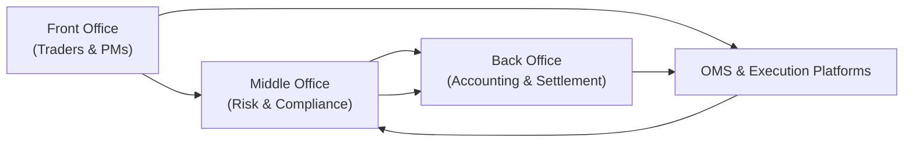

## Introduction

So, you know how you sometimes see those images of sprawling trading floors with flickering screens? Hedge funds are increasingly moving beyond that classic image to an environment where trades happen with minimal human intervention—driven by robust technology and advanced analytics. Technology Infrastructure and Quantitative Tools have become foundational for modern hedge funds aiming to stay competitive, manage risk effectively, and (hopefully) generate alpha.

Below, we’ll dive right into the nuts and bolts of hedge fund technology, the interplay between data quality and analytics, and the practical side of building out an integrated environment to support front, middle, and back-office functions. I'll also share a quick personal story or two along the way—because, hey, I once saw a firm blow up because their risk engine got stuck in a vicious server loop. Yup, not great.

## Building the Foundation: Technology Infrastructure in Hedge Funds

### The Significance of Robust Systems

Hedge funds typically rely on a layered technology stack to support every step in the investment process. Strong technology architecture ensures:

• Reliable and speedy trade execution.  
• Real-time pricing and risk measurement.  
• Seamless data flow among front, middle, and back offices.  
• Secure handling of sensitive data like investor information and proprietary models.  

This is where your OMS (Order Management System) comes in. An OMS is software that helps hedge funds create, organize, and track market orders—while also carrying out compliance checks, pre-trade risk assessments, and post-trade matching. If an OMS goes down or lags, even for a few milliseconds, it can cause slippage, mispricings, and compliance headaches.

### Front, Middle, and Back-Office Integration

A typical hedge fund operation has multiple offices:

• Front Office includes portfolio managers, traders, and research teams.  
• Middle Office handles risk management, compliance, and day-to-day operational controls.  
• Back Office manages trade settlement, accounting, auditing, and record-keeping.  

Seamless communication between these offices is paramount. That means your risk analytics engine in the middle office should automatically get real-time data from the front office’s trading platform, which in turn is pushing updates to the back office. If any part of this system lags—hello data latency—gaps form that can cause anything from minor reconciliation nightmares to major compliance breaches.

Below is a visual representation of how these segments typically integrate:



Notice how each component loops back in a continuous feedback process. That cyclical flow is essential for real-time updates, accurate P&L measurement, and robust risk oversight.

## Quantitative Tools for Advanced Analysis

### The New Age of Modeling and Analytics

So let’s talk quant. Hedge funds have traditionally pioneered the use of advanced quantitative techniques, from high-frequency trading algorithms to machine learning-based factor models. These rely on software platforms such as MATLAB, Python, R, and specialized libraries for modeling, backtesting, and data visualization.  

• Python stands out for its rich ecosystem—libraries like NumPy, pandas, scikit-learn, and statsmodels are frequently employed for data wrangling and machine learning tasks.  
• MATLAB remains popular for advanced numerical modeling, especially for portfolio optimization or PDE-based derivative pricing.  
• R is well-known for its robust statistical packages.  

Many hedge funds also adopt cloud computing for elasticity—scaling computational resources on-demand to handle bursts in data processing or large-scale simulations.

### Leveraging Big Data and Alternative Data

We’re seeing an explosion in alternative data—everything from satellite imagery that counts how many cars are parked in a retailer’s lot to social media sentiment analysis that picks up the market’s mood. But it’s not just data quantity; it’s the velocity and variety of that data. Big Data Analytics is the process of sifting through these datasets (which can be unstructured, have high volume, or real-time generation) to draw out alpha signals.

A good chunk of that alpha is uncovered through structured machine learning (ML):

• **Supervised ML** to predict asset price movements based on labeled datasets (e.g., historical prices).  
• **Unsupervised ML** to cluster potential anomalies in the market or group stocks by hidden factors.  
• **Reinforcement learning** to develop trading strategies that learn from iterative feedback.  

But let’s be honest: simply throwing big data at an ML algorithm doesn’t guarantee success. You need a robust workflow that includes data cleaning, feature engineering, cross-validation, and performance metrics oriented toward risk-adjusted returns.

### Example: Simple Python Backtesting

Below is a very simplified snippet showing how one might backtest a moving average crossover strategy in Python. This obviously isn’t production-level code, but it gives you a flavor.

```python
import pandas as pd
import numpy as np

prices = pd.read_csv('historical_prices.csv', parse_dates=True, index_col='Date')

prices['SMA_short'] = prices['Close'].rolling(window=20).mean()
prices['SMA_long'] = prices['Close'].rolling(window=50).mean()

prices['Signal'] = 0
prices.loc[prices['SMA_short'] > prices['SMA_long'], 'Signal'] = 1
prices.loc[prices['SMA_short'] < prices['SMA_long'], 'Signal'] = -1

prices['Strategy_Return'] = prices['Signal'].shift(1) * prices['Close'].pct_change()

cumulative_return = (1 + prices['Strategy_Return']).cumprod() - 1
sharpe_ratio = (prices['Strategy_Return'].mean() / prices['Strategy_Return'].std()) * np.sqrt(252)

print("Cumulative Return:", cumulative_return[-1])
print("Annualized Sharpe Ratio:", sharpe_ratio)
```

Whether this returns anything meaningful depends on the quality of your data, your parameter tuning, and other fine details like transaction costs. But it highlights how quickly you can spin up a rough (emphasis on rough) strategy test.

## Data Quality, Latency, and Systematic Signals

### Data Latency

In systematic trading, every millisecond counts. Data latency is the time delay between when data is generated (e.g., a market price tick) and when your system can actually use it. Latency arises from factors like network speed, data vendor processing times, and internal system architecture.

High-frequency trading (HFT) shops often place servers in colocation centers near exchanges to minimize the number of network hops. For other hedge funds that trade on daily or weekly horizons, microsecond-level latency may not be as critical, but extremely delayed or stale data can still erode alpha.

### Cleaning and Normalizing Data

A decade ago, I helped a small hedge fund that was pulling multiple data feeds from different vendors with slightly different time stamps and definitions for “close price.” We ended up with discrepancies in the final consolidated price of the same security. Such issues can lead to spurious signals. Good data governance ensures:

• Consistent field definitions across vendors.  
• Eternal vigilance for outliers or missing data.  
• Reconciliation processes that align feeds if one source is missing or delayed.  

### Backtesting and Forward Testing

Backtesting is testing a model or strategy on historical data. But as every quant eventually learns, it’s also easy to overfit your strategy to past data and inadvertently chase ephemeral patterns. This is why forward testing (or live paper trading) is often the real stress test of your model. It’s about verifying:

• How your strategy performs in live conditions with real liquidity constraints.  
• The accuracy of your risk metrics during unexpected events or “black swan” scenarios.  
• Latency and execution costs, which can dramatically reduce backtested returns.

## Role of Big Data and Machine Learning in Generating Insights

### Identifying Predictive Signals

With so many data streams (traditional and alternative), machine learning approaches can detect patterns that might be invisible to purely fundamental or classical statistical methods. For instance:

• Counting foot traffic around certain brick-and-mortar stores from geolocation data to forecast earnings.  
• Monitoring social media sentiment for quick shifts in public opinion that can trigger price changes.  
• Using image recognition on satellite data to gauge resource consumption or regional economic vitality.

These signals can be integrated into broader factor models or superimposed on a fundamental approach. A portfolio manager might weigh the signals from big data alongside standard discounted cash flow analysis to refine position sizing.

### Implementation Challenges

But more data also implies more noise. And the complexities of unstructured datasets (think images or free text) mean you need specialized data scientists, significant computing resources, and well-honed strategies to figure out “which data” is relevant.

Furthermore, a strong data engineering pipeline is essential to transform raw data into features suitable for algorithms. This might include:

• Data tagging and labeling.  
• Outlier removal or feature normalization.  
• Real-time streaming capabilities to feed the ML models with minimal delay.

## Cybersecurity Considerations

Hedge funds store a treasure trove of sensitive data—proprietary algorithms, client details, transaction histories. Attacks—ranging from denial-of-service attempts to direct hacks—can compromise millions (or billions) of dollars.  

• Firewalls and encryption strategies protect data in transit and at rest.  
• Regular penetration tests identify vulnerabilities.  
• Insider threats can be mitigated through strict access controls and user-activity monitoring.  

Frankly, it’s no fun discovering your prized quant model got stolen because you used a single-layer password to guard your servers. Cybersecurity is both a regulatory priority (since regulators do not want systemic risks triggered by a hack) and a fiduciary necessity in protecting investor capital.

## Best Practices for Integrating Systems

1. **Use an Order Management System (OMS) that syncs with Execution Management Systems (EMS).**  
   -- This reduces the risk of double-ordering or missed trades.

2. **Adopt a single source of truth for pricing data.**  
   -- Establish consistent policies across different vendors, clarifying tiebreak rules for discrepancies.

3. **Leverage robust risk management software.**  
   -- Tools that can incorporate both market risk (Vol, VaR) and liquidity risk in real time.

4. **Automate whenever possible.**  
   -- Reconciliation, compliance checks, and position-level risk limits can be enforced electronically, slashing operational errors.

5. **Regularly review and test disaster recovery plans.**  
   -- We all hope we never see a data center meltdown, but if it happens, you better have backups in place.

6. **Pilot new big data or machine learning initiatives with a well-defined scope.**  
   -- That means limited capital allocation or sandbox environments before full-scale deployment.

## Glossary Highlights

• **Order Management System (OMS):** The software backbone for placing, tracking, and verifying orders in real time.  
• **Backtesting:** The art (and occasional hazard) of applying a strategy to historical data to see how it would have fared.  
• **Machine Learning (ML):** Algorithms that learn from data to make predictions or uncover patterns, often adapting as more data is consumed.  
• **Alternative Data:** Non-traditional datasets (like satellite images or social media sentiment) used to gain novel market insights.  
• **Data Latency:** The delay between when data is created and when it’s actually usable for trading or risk analysis.  
• **Big Data Analytics:** Processes that handle large-scale or complex data sets, often to identify subtle relationships or trends.  
• **Cybersecurity:** The discipline of safeguarding systems and data from malicious attacks or unauthorized access.  
• **Cloud Computing:** On-demand computing resources (servers, storage, etc.) maintained by external providers, allowing funds to scale technology as needed.

## Practical Example: Integrating a Quant Workflow

Imagine we’re running a systematic equity fund. Here’s a simplified workflow:

1. Data ingestion: We pull structured data (e.g., price volumes) and alternative data (e.g., satellite images, credit card receipts) through an Extract-Transform-Load (ETL) pipeline.  
2. Pre-processing: We clean the data and tag each entry with a standardized time stamp.  
3. Feature engineering: Convert raw data into features (moving averages, sentiment scores, store traffic).  
4. Model training: Use an ML algorithm (like gradient boosting) in Python to predict returns or classify “buy” vs. “sell” signals.  
5. Backtesting & forward testing: Evaluate performance on historical data, then test in a live but small production environment.  
6. Execution: Plug signals into the OMS. The system automatically generates trade tickets which route to the broker or exchange.  
7. Continuous monitoring: We track real-time P&L, risk metrics, and any anomalies in the data pipeline.  

This approach helps unify the technology infrastructure with the quant analytics. The big takeaway is that success depends on each link in the chain functioning properly. A glitch in data ingestion could lead to stale or incomplete features. A bug in the ML code could generate spurious signals, leading to disastrous trades.

## Conclusion and Final Thoughts

In the evolving landscape of hedge funds, technology infrastructure and quantitative tools aren’t just a “nice to have.” They form the very bedrock upon which competitive advantage and risk resilience are built. By combining robust systems with advanced analytics, funds can explore new alpha sources, better manage drawdowns, and adapt swiftly to market volatility.

But remember, I’ve seen first-hand how even the shiniest algos can topple if patched onto shaky or outdated infrastructure. A well-honed technology environment allows managers to sleep better at night—knowing that, at least on the operational side, everything’s humming along (as well as any system can).

---

For deeper insights:

• “Machine Learning for Asset Managers” by Marcos López de Prado  
• “Big Data and AI Strategies” by Bernard Marr  
• CFA Institute’s guide on “Big Data and Machine Learning in Investments”

These resources provide a deeper dive into the nitty-gritty of building effective quant frameworks, from data preprocessing to specialized machine learning approaches.

---

## Test Your Knowledge: Hedge Fund Technology and Quant Tools



### Which system primarily helps traders and portfolio managers organize, execute, and track market orders?

- [ ] Risk Management System (RMS)
- [ ] Enterprise Resource Planning (ERP)
- [x] Order Management System (OMS)
- [ ] Portfolio Analytics Module (PAM)

> **Explanation:** An Order Management System (OMS) is critical in hedge fund operations, enabling consistent and compliant trade placement and tracking.

### Which of the following best explains “backtesting”?

- [ ] Conducting due diligence on alternative data vendors.
- [x] Evaluating a trading strategy using historical market data.
- [ ] Testing a strategy in real-time with live capital.
- [ ] Simulating trades in an artificial intelligence lab.

> **Explanation:** Backtesting entails applying a trading model to past market data to see how it would have performed historically.

### In machine learning, what is the primary goal of feature engineering?

- [ ] To simplify the user interface for portfolio managers.
- [x] To transform raw data into properly formatted variables for ML models.
- [ ] To identify unauthorized user activity in trading systems.
- [ ] To reduce system latency in high-frequency trading.

> **Explanation:** Feature engineering shapes raw data into meaningful inputs that improve a model’s predictive capability.

### Which of the following best describes “alternative data”?

- [ ] Data exclusively from government economic reports.
- [ ] Data from official regulatory filings like 10-Ks.
- [x] Non-traditional data sources such as satellite images, social media sentiment, or web traffic metrics.
- [ ] Longitudinal data from standard market feeds.

> **Explanation:** Alternative data refers to unique data streams beyond conventional market and fundamental data, often used to uncover new trading insights.

### Which tool or language is widely used for numerical modeling and simulations in hedge funds?

- [ ] CSS
- [ ] HTML
- [ ] Java
- [x] Python (among others like MATLAB and R)

> **Explanation:** Python, alongside MATLAB and R, is a common choice for complex quantitative modeling due to its extensive libraries and community support.

### Which of the following is a key motivator for using cloud computing in hedge funds?

- [x] The ability to scale computational resources on demand.
- [ ] Constant requirement of in-house server installations.
- [ ] Reduced data security features.
- [ ] An all-manual trade reconciliation process.

> **Explanation:** Cloud computing provides funds with flexible and scalable resources, enabling them to handle large data processing tasks and speed up analytics.

### When integrating front, middle, and back-office systems, the main objective is to:

- [x] Create a seamless flow of information for real-time risk management and accurate settlement.
- [ ] Ensure dependency on one vendor for all data feeds.
- [ ] Remove compliance checks to speed up trading.
- [ ] Populate marketing materials with portfolio returns only once a year.

> **Explanation:** Proper integration allows real-time risk oversight, robust trade settlement, and minimal operational disruptions.

### A major cybersecurity concern for hedge funds is:

- [x] Unauthorized access to proprietary algorithms and client data.
- [ ] Accurate MACD crossover signals.
- [ ] High-fidelity color printing for annual reports.
- [ ] Excess use of internal promotional emails.

> **Explanation:** Hedge funds hold valuable intellectual property and investor information, making them prime targets for cyberattacks, so security frameworks are crucial.

### Which step helps prevent overfitting in a trading strategy?

- [ ] Using data from the last 3 days only for calibrating signals.
- [x] Splitting historical data into training and validation sets, plus forward testing in live market conditions.
- [ ] Ignoring transaction costs in performance calculations.
- [ ] Using identical parameter sets for all asset classes.

> **Explanation:** Dividing data into training and validation sets (and employing forward testing) helps confirm that discovered patterns are robust rather than accidental.

### True or False: High-frequency trading shops often seek colocation with exchange servers to reduce data latency.

- [x] True
- [ ] False

> **Explanation:** Many HFT firms place their servers in proximity to major exchanges to minimize the physical distance and thereby reduce network latency.



---

**References:**
1. Marcos López de Prado, “Machine Learning for Asset Managers”  
2. Bernard Marr, “Big Data and AI Strategies”  
3. CFA Institute, “Big Data and Machine Learning in Investments”  
